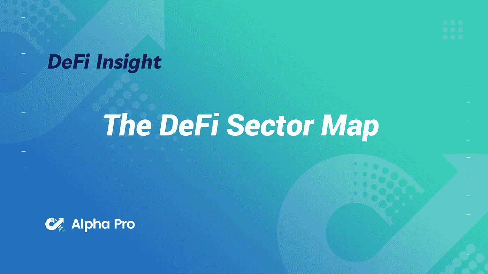
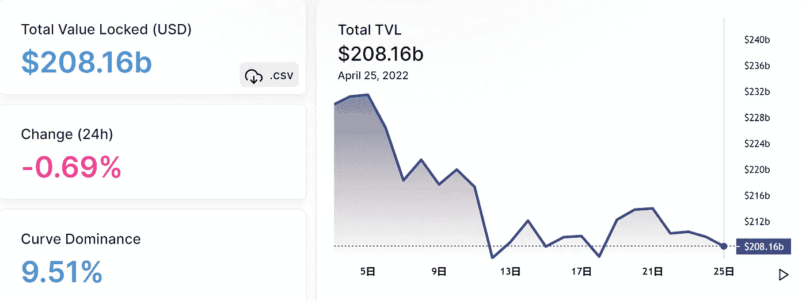
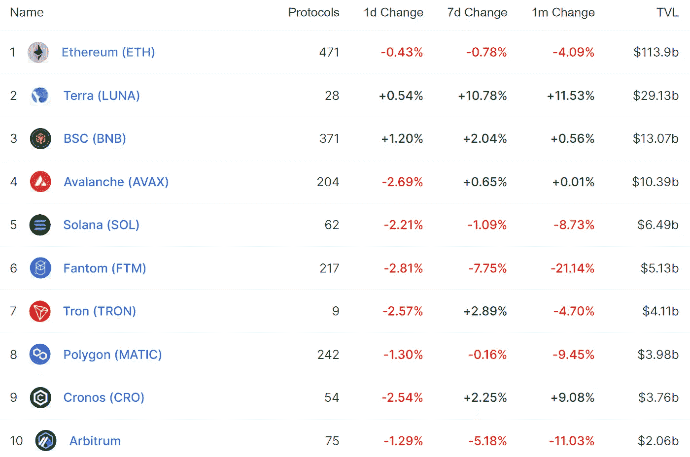
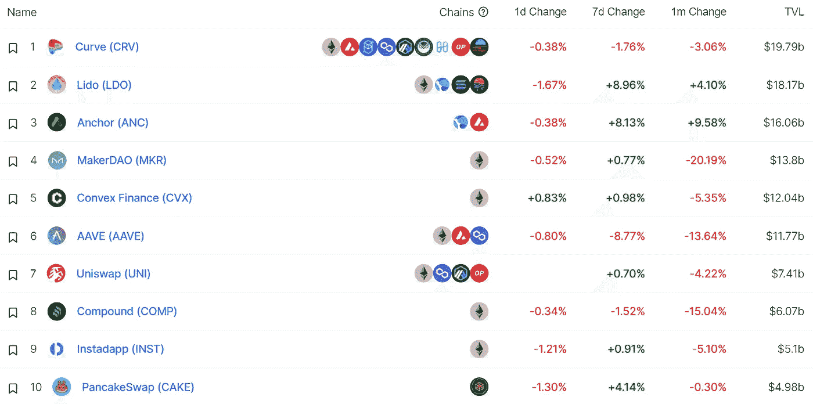
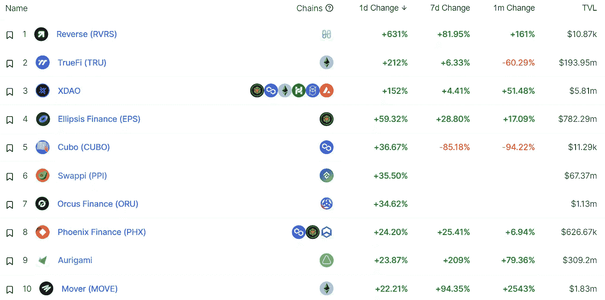
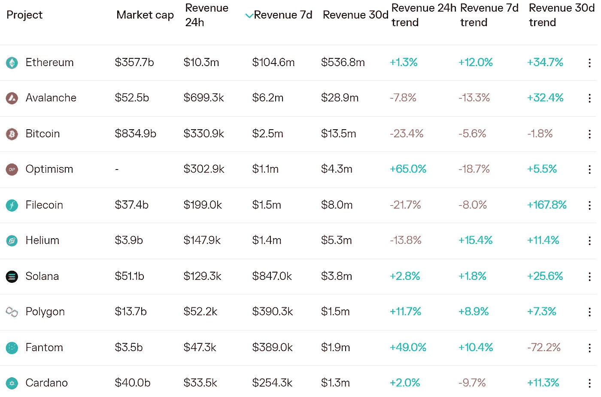
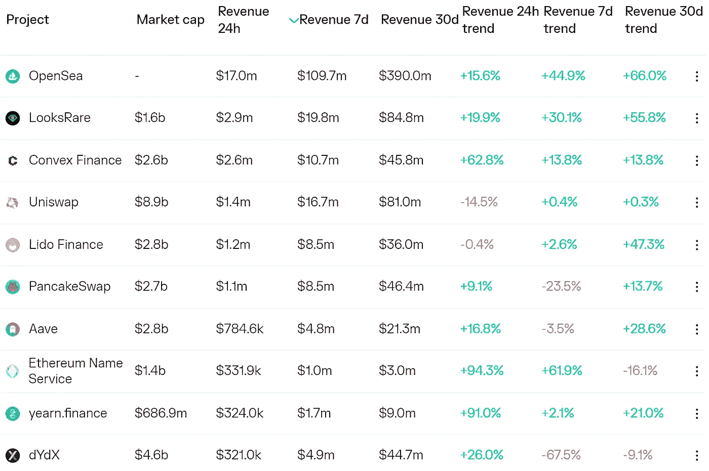
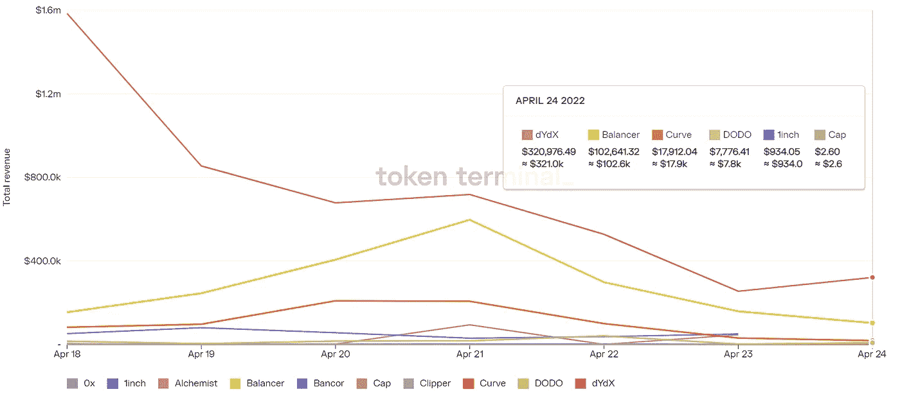
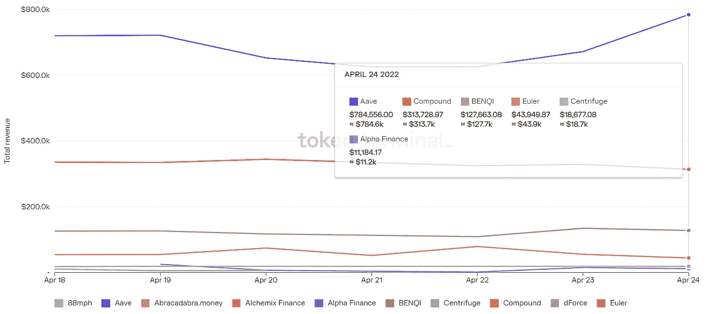

# DeFi Insight | DeFi 扇区地图

> 原文：<https://medium.com/coinmonks/defi-insight-the-defi-sector-map-616e0b0b8a92?source=collection_archive---------21----------------------->

2022 年 4 月 25 日

*今日 DeFi 数据&由 DeFi Insight 为您带来的新闻。*

> *"*dex 是收入最高的 DeFi 部门，占 DeFi 总收入的近一半。
> 尽管 TVL 比 dex 高出近 25%,但借贷协议赚取了近四分之一的收入，因此每单位 TVL 的回报明显更低。与货币市场相比，永久交易所正成为用户首选的杠杆机制。年初至今，永久交易所的交易量增加了 20%，而借贷量减少了近 50%。
> 由于其资本结构，衍生协议的每单位库存(TVL)收益是其他 DeFi 行业的 4-9 倍。*[**【messari . io**](https://messari.io/article/the-defi-sector-map)*

# *最新消息*

## *TVL*

*以太坊 L2 网络公司的 TVL 跌至 64.2 亿美元*

## *贷款*

***借贷协议枫叶金融[对索拉纳发起](https://twitter.com/maplefinance/status/1517908114959486976?s=20&t=tuFZfkvjhCvAMp_PmnjsQA)***

## ***指标***

*****[KyberSwap](https://news.bitcoin.com/kyberswap-launches-on-bittorrent-chain-with-1-5m-in-liquidity-mining-and-incentive-rewards/)在 BitTorrent Chain 上推出 150 万美元的流动性挖掘和激励奖励*****

## *****稳定币*****

*******Q1 交易量达 2233.9 亿美元，同比增长 [7 倍](https://beincrypto.com/terra-luna-trading-volume-spikes-by-195-billion-in-quarterly-high/)*******

## *******副链*******

*********Litentry 正式[赢得](https://twitter.com/litentry/status/1518316943455010820)第十五届@Polkadot parachain 拍卖会*********

## *******钱包*******

*********、** BitKeep 已经[支持](https://twitter.com/BitKeepOS/status/1518114081303007232) Boba 网络*******

## *****空投*****

*******本德道治令牌本德 IF0 3000ETH [售罄](https://twitter.com/BendDAO/status/1518246032429428737?s=20&t=tWVSLBtmbI8WYFO5ckqS9Q)。对 NFT 社区的空投仍在进行*******

*******宇宙创始人的新项目 Gno.land 将在[向$ATOM 股东空投](https://twitter.com/jaekwon/status/1518075556738174979?s=20&t=cqSA9x8Dc4XxpzGH8K_C9w) $GNOT*******

## *******政策与法规*******

*********法国总统马克龙希望欧洲成为元宇宙和网络 3 的核心玩家*********

*******gray 表示，如果 ETF 申请被拒绝，可能会对 SEC 提起诉讼*******

## *******道*******

*********Juno 网络社区发起了一项[提案](https://wallet.keplr.app/#/juno/governance?detailId=20)，将提案 16 中涉及巨鲸的 Juno 发送到社区地址*********

## *******NFT*******

*******STEPN 说 GMT 对于所有高质量的鞋铸件都是必要的*******

*********基于索拉纳的游戏 [Everseed](https://www.playtoearn.online/2022/04/23/introducing-everseed-an-upcoming-roguelike-mmo-on-the-solana-blockchain/) 将于 4 月 26 日开放《阿凡达》NFT 制作厅*********

*******上周，通过 OpenSea 和 looks 交易的 15 亿美元的 NFTs*******

*******Animoca Brands 计划收购更多工作室来制作未来的 NFT*******

*********足球巨星[小贝](https://twitter.com/KondoudisLaw/status/1518341741723725832)提交与元宇宙和 NFT 相关的商标申请*********

## *******基金*******

*********、**humeta verse fields obi Technology forms[投资部门](https://www.prnewswire.com/news-releases/huobi-tech-establishes-huobi-tech-capital-to-capture-opportunities-in-web3-0--defi-and-metaverse-301531479.html)专注于 Web3、DeFi 和元宇宙*******

# *****数据和分析*****

## *****锁定的总价值(TVL)*****

*****目前全网 DeFi 总锁定量为 2081.6 亿美元，24 小时下降 0.69%。*****

**********

## *****TVL 评出的十大连锁酒店*****

**********

## *****|最新 TVL 十大项目*****

**********

## *****|过去 24 小时内 TVL 增长的前 10 个项目*****

**********

## *****协议收入*****

## *****|累计总收入最高的项目(24H)_ 区块链(L1)*****

**********

## *****|累计总收入最高的项目(24H) _Dapps(L2)*****

**********

## *****|前 10 大交易所的每日收入*****

**********

## *****|十大贷款协议的每日收入*****

**********

# *****深潜*****

*******■泰拉&主播—** [**固体庞氏**](https://tokeninsight.com/en/blogs/11593)*****

***** [## 土地和锚-固体庞氏骗局

### 很多人可能不知道“庞氏骗局”中的庞氏(Ponzi)一词起源于何处。起初，庞氏骗局是指…

tokeninsight.com](https://tokeninsight.com/en/blogs/11593)***** 

# *****报告*****

*******雪崩，BNB 链和多边形保持** [**稳定增长**](https://cryptopotato.com/avalanche-bnb-chain-and-polygon-growth-stable-despite-q1-2022-market-hiccups-report/)**_ 隐薯*******

> *******根据南森的说法，雪崩的表现是最出色的之一。区块链在上一季度经历了惊人的增长，其交易量稳步增长。Crabada 和 Trader Joe 是 Avalanche network 整体业绩的主要贡献者，实现了近 8400 万笔交易。与此同时，DeFi 王国，雪崩的第一个子网，促进了超过 5 亿美元的桥接流量。Avalanche 的活跃地址统计数据也显示了兴趣的增加，每天 79，200 个，每周 278，000 个，每月 583，000 个活跃地址。*******

*********关于:*********

*****DeFi Insight 是顶级 DeFi 和加密新闻和更新的来源。*****

*******https://twitter.com/AlphaPro_io 推特:*******

*********❤RSS:**[**https://medium.com/feed/@alphapro.project**](https://medium.com/feed/@alphapro.project)*******

*****提供的信息应被视为发展新闻，而不是投资建议。*****

> ******加入 Coinmonks* [*电报频道*](https://t.me/coincodecap) *和* [*Youtube 频道*](https://www.youtube.com/c/coinmonks/videos) *了解加密交易和投资******

# *****另外，阅读*****

*   *****[Bookmap 评论](https://coincodecap.com/bookmap-review-2021-best-trading-software) | [美国 5 大最佳加密交易所](https://coincodecap.com/crypto-exchange-usa)*****
*   *****最佳加密[硬件钱包](/coinmonks/hardware-wallets-dfa1211730c6) | [Bitbns 评论](/coinmonks/bitbns-review-38256a07e161)*****
*   *****[新加坡十大最佳密码交易所](https://coincodecap.com/crypto-exchange-in-singapore) | [收购 AXS](https://coincodecap.com/buy-axs-token)*****
*   *****[红狗赌场评论](https://coincodecap.com/red-dog-casino-review) | [Swyftx 评论](https://coincodecap.com/swyftx-review) | [CoinGate 评论](https://coincodecap.com/coingate-review)*****
*   *****[投资印度的最佳加密软件](https://coincodecap.com/best-crypto-to-invest-in-india-in-2021)|[WazirX P2P](https://coincodecap.com/wazirx-p2p)|[Hi Dollar Review](https://coincodecap.com/hi-dollar-review)*****