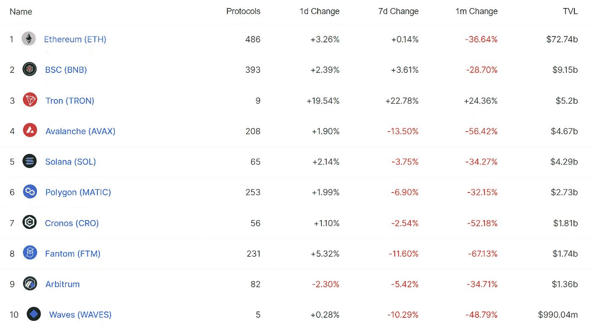

# 加密交易的未来是期货

> 原文：<https://medium.com/coinmonks/defi-insight-the-future-of-crypto-trading-is-futures-e4c1fd38660e?source=collection_archive---------17----------------------->

2022 年 5 月 23 日

*今日 DeFi 数据&由 DeFi Insight 为您带来的新闻。*

> *加密货币和传统资产类别之间的界限正变得越来越模糊，因为老牌华尔街玩家将数字资产交易作为其主要业务的一部分，而以比特币为基础的公司正在进军主流市场。*
> 
> *机构投资者进入 1.3 万亿美元的数字资产市场，意味着大银行和专业交易员的影响力已经增强。因此，股票和债券等主流资产的价格与加密之间的关系变得更加紧密。*“@*[*来源*](https://www.ft.com/content/b4fa13c7-7b4b-469b-8401-638c85e79289)*

# *最新消息*

## *打桩*

***[液态锁定协议 Stader](https://twitter.com/staderlabs/status/1528446407534751744) 在 5 月 26 日拍摄快照，并将＄SD 迁移到以太坊***

## ***稳定币***

*****/**自加密崩溃开始以来，Tether 支付了100 亿美元的提款***

## ***第二层***

***第二层的采用可能会刺激下一个加密转折点***

## ***支付***

*****、**、[巴黎世家采取加密](https://wwd.com/fashion-news/fashion-scoops/balenciaga-takes-crypto-the-richs-charities-1235186249/)，富人的慈善机构***

## ***|令牌***

*****、** MSP 恢复和令牌学选择多边形来[令牌化医疗索赔](https://blog.polygon.technology/msp-recovery-and-tokenology-choose-polygon-to-tokenize-medical-claim/)***

## ***提议***

*****[逆向迁移](/@Retrogrademoney/retromigration-a102e2b25e36)*****

*******Terra 关于[重新启用 IBC](https://twitter.com/terra_money/status/1528590265140887552) 的提案通过但未能执行*******

## *******空投*******

*********月鸟是[空投](https://twitter.com/moonbirds/status/1528357592367505411)月鸟对它们的 NFT 持有者来说是古怪的*********

## *******|警报*******

*********/**有针对性的网络钓鱼诈骗网络来自[被黑的用户账户](https://cointelegraph.com/news/targeted-phishing-scam-nets-428k-in-crypto-and-nfts-from-hacked-beeple-account)的 438，000 美元的加密和 NFTs*******

## *****采矿*****

*****俄罗斯最古老的监狱**[秘密矿场](https://news.bitcoin.com/crypto-mining-farm-uncovered-in-russias-oldest-prison/)被发现*******

## *******政策与法规*******

*******提交给俄罗斯议会的关于非关税壁垒的法律草案*******

*********、**为了保持相关性，[加密规则](https://forkast.news/crypto-regulations-need-to-decentralize-crypto-rising/)需要发展，分散化:加密上升*******

## *****基金*****

*****元宇宙 app [BUD](https://techcrunch.com/2022/05/22/metaverse-social-bud-funding-37-million/) 再融资 3700 万美元，计划推出 NFTs*****

*******[据报道，2022 年非洲加密初创公司的风险投资](https://cointelegraph.com/news/venture-funding-for-african-crypto-startups-grew-11x-in-2022-report?utm_source=blockworks-research)增长了 11 倍*******

*********[密码谷](https://www.coindesk.com/business/2022/05/23/crypto-valley-venture-capital-launches-african-blockchain-early-stage-fund/)风险投资启动非洲区块链早期基金*********

## *******观点*******

*******预测 2021 年比特币崩盘的分析师揭示了现实的价格路径[BTC 历史新高](https://dailyhodl.com/2022/05/23/analyst-who-called-2021-bitcoin-crash-unveils-realistic-price-path-to-new-btc-all-time-high/)*******

*******DOGE 创始人称 95%的密码都是骗局——埃隆·马斯克回应道*******

*******高盛称加密崩溃不会严重损害美国经济*******

# *******数据和分析*******

## *******锁定的总价值(TVL)*******

*******目前全网 DeFi 总锁定量为 1136.6 亿美元，24 小时增长 3.6%。*******

**************

## *******TVL 评出的十大连锁酒店*******

**************

## *******|最新 TVL 十大项目*******

**************

## *******|过去 24 小时内 TVL 增长的前 10 个项目*******

**************

## *******协议收入*******

## *******|累计总收入最高的项目(24H)_ 区块链(L1)*******

**************

## *******|累计总收入最高的项目(24H) _Dapps (L2)*******

**************

## *******|前 10 大交易所的每日收入*******

**************

## *******|十大贷款协议的每日收入*******

**************

# *******深潜*******

*************:web 3 是‘吓唬系统’*************

***** [## 法瑞尔·威廉姆斯:Web3 正在“惊吓系统”——解密

### 简而言之，流行音乐人兼制作人法瑞尔·威廉姆斯在周六的 VeeCon NFT 会议上发言。他描述了…

decrypt.co](https://decrypt.co/101125/pharrell-williams-web3-is-scaring-the-system) 

**Crypto 再次崩溃。现在** [**什么**](https://qz.com/emails/quartz-forecast/2168119/%E2%9C%A6-crypto-crashed-again-now-what/) **？**

 [## ✦密码又崩溃了。现在怎么办？

### 嗨，石英会员们，对于在 crypto 有钱的人来说，这是艰难的两周。损失已经超过 4000 亿美元。的…

qz.com](https://qz.com/emails/quartz-forecast/2168119/%E2%9C%A6-crypto-crashed-again-now-what/) 

**狐狸先生遇上** [**奥凯熊**](https://www.realvision.com/issues/mr-fox-meets-okay-bears)

 [## 狐狸先生遇见好熊|真实的视觉

### 欢迎来到《福克斯先生的 NFTs 》,这是一份每周时事通讯，作者是南加州大学马歇尔分校的大学生乔治·齐奥里斯，他是……

www.realvision.com](https://www.realvision.com/issues/mr-fox-meets-okay-bears) 

**德菲信徒** [**永不言败**](https://fortune.com/2022/05/22/defi-believers-never-say-die-even-after-they-see-terras-demise/) **，甚至在他们看到特拉的灭亡之后**

 [## DeFi 的信徒永不言败，即使他们看到了 Terra 的灭亡

### Arca 的投资组合经理哈桑·巴西里(Hassan Bassiri)说，“未来五到七年将会有一个算法稳定期。”

fortune.com](https://fortune.com/2022/05/22/defi-believers-never-say-die-even-after-they-see-terras-demise/) 

# 报告

**雪崩:使**[**NFTs**](https://research.thetie.io/trader-joe-joepegs/)**雪崩** _thetie

> 在子网发布之前，Avalanche 主要是一个 DeFi 生态系统。与它的两个主要同行- Solana 和 Ethereum 相比，NFT 协议仍然没有得到充分利用。在过去的一年里，事实证明，NFT 对于当地社区的发展和零售连锁市场的稳健性都非常重要。
> 
> 在过去的三个月里，连锁店的重点明显转移了。通过子网，Avalanche 能够创建子经济，有效地容纳事务密集型协议。值得注意的是，像 Crabada 和 defi futions 这样的“玩赚”元宇宙项目从托管在不能容纳其玩家群的主网上转移到了子网上。随着越来越多的元宇宙项目登陆 AVAX，将会越来越需要一个 AVAX-native home 来帮助促进不断增长的创作者经济。

**token insight**[**NFT 行业报告**](https://tokeninsight.com/en/report/2937) **2022 年 1 月—5 月** _tokeninsight

**[**输入**](https://messari.io/article/enter-the-flowverse) **流程**_ 消息**

****[**解读元宇宙**](https://www.theblockresearch.com/deciphering-the-metaverse-the-maturation-of-financial-instruments-148067) **:金融工具的成熟** _theblockresearch****

******关于:******

****DeFi Insight 是顶级 DeFi 和加密新闻和更新的来源。****

******https://twitter.com/AlphaPro_io 推特:******

********❤RSS:**[**https://medium.com/feed/@alphapro.project**](https://medium.com/feed/@alphapro.project)******

****提供的信息应被视为发展新闻，而不是投资建议。****

> ****加入 Coinmonks [电报频道](https://t.me/coincodecap)和 [Youtube 频道](https://www.youtube.com/c/coinmonks/videos)了解加密交易和投资****

# ****另外，阅读****

*   ****[3 商业评论](/coinmonks/3commas-review-an-excellent-crypto-trading-bot-2020-1313a58bec92) | [Pionex 评论](https://coincodecap.com/pionex-review-exchange-with-crypto-trading-bot) | [Coinrule 评论](/coinmonks/coinrule-review-2021-a-beginner-friendly-crypto-trading-bot-daf0504848ba)****
*   ****[莱杰 vs Ngrave](/coinmonks/ledger-vs-ngrave-zero-7e40f0c1d694) | [莱杰 nano s vs x](/coinmonks/ledger-nano-s-vs-x-battery-hardware-price-storage-59a6663fe3b0) | [币安评论](/coinmonks/binance-review-ee10d3bf3b6e)****
*   ****[Bybit Exchange 评论](/coinmonks/bybit-exchange-review-dbd570019b71) | [Bityard 评论](https://coincodecap.com/bityard-reivew) | [Jet-Bot 评论](https://coincodecap.com/jet-bot-review)****
*   ****[3 commas vs crypto hopper](/coinmonks/3commas-vs-pionex-vs-cryptohopper-best-crypto-bot-6a98d2baa203)|[赚取加密利息](/coinmonks/earn-crypto-interest-b10b810fdda3)****
*   ****最好的比特币[硬件钱包](/coinmonks/hardware-wallets-dfa1211730c6) | [BitBox02 回顾](/coinmonks/bitbox02-review-your-swiss-bitcoin-hardware-wallet-c36c88fff29)****
*   ****[BlockFi vs 摄氏](/coinmonks/blockfi-vs-celsius-vs-hodlnaut-8a1cc8c26630) | [Hodlnaut 点评](/coinmonks/hodlnaut-review-best-way-to-hodl-is-to-earn-interest-on-your-bitcoin-6658a8c19edf) | [KuCoin 点评](https://coincodecap.com/kucoin-review)*********