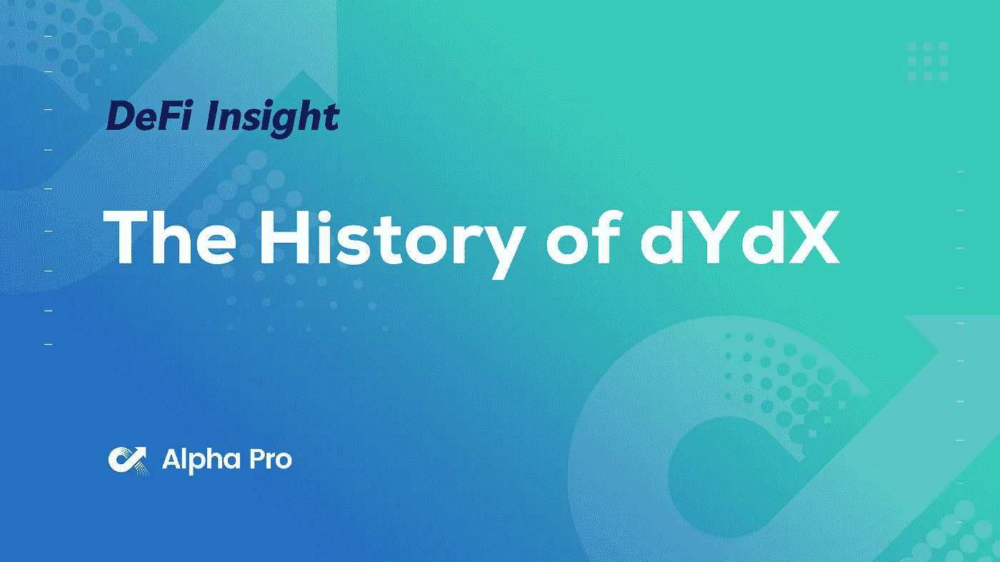
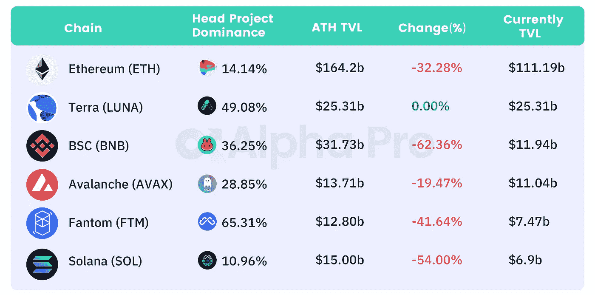
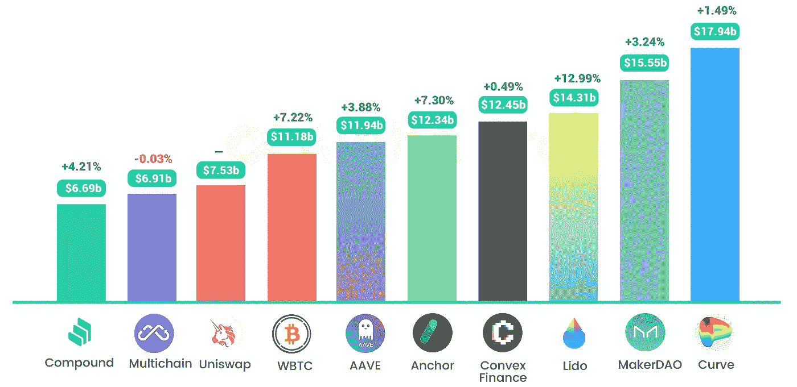
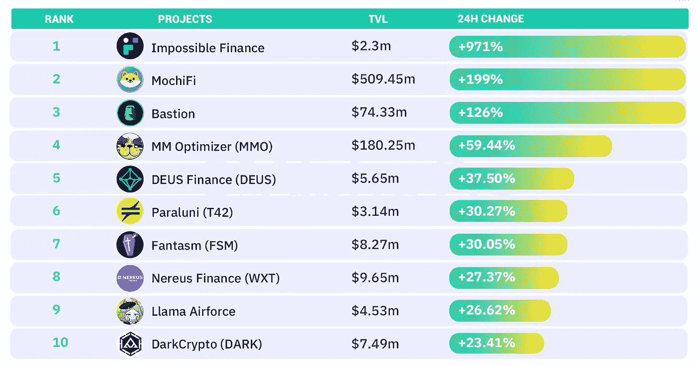
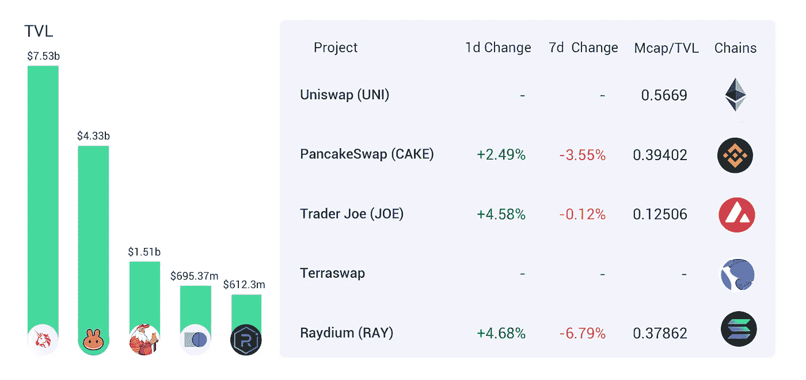
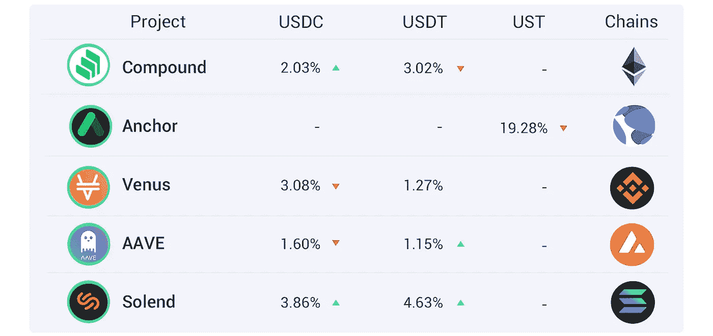
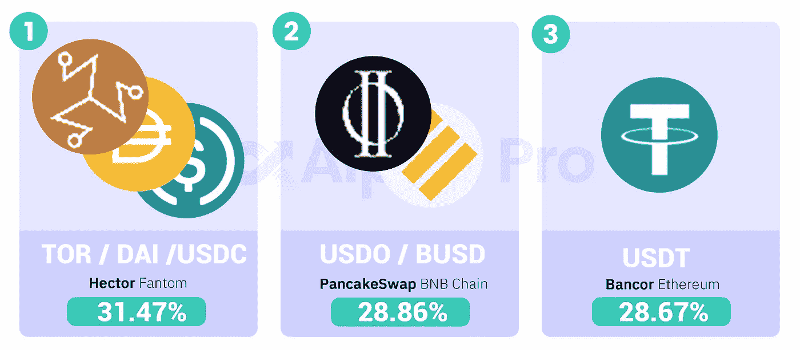

# DeFi Insight | dYdX 的历史；宇宙 EVM 网络 Evmos 区块链可能重置重启

> 原文：<https://medium.com/coinmonks/defi-insight-the-history-of-dydx-cosmos-evm-network-evmos-blockchain-may-reset-to-restart-b413f632f7d6?source=collection_archive---------42----------------------->

## 2022 年 3 月 9 日

*今日 DeFi 数据&由 DeFi Insight 为您带来的新闻。*

**宏观趋势:**瑞士瑞信银行战略家称我们正在见证[一个新的世界货币秩序的诞生](https://www.coindesk.com/policy/2022/03/08/credit-suisse-strategist-says-were-witnessing-birth-of-a-new-world-monetary-order/)

**TVL 动向:**目前全网 [DeFi](https://defillama.com/) 总锁定量为 2030.4 亿美元，24 小时增长 5.48%

**Stablecoin:** 支付构建商 Kado 完成首次融资，以扩大对[stable coin](https://blockworks.co/payment-builder-kado-closes-first-capital-raise-to-expand-access-to-stablecoins/)的访问

# 最新消息

## 定义

报道:白宫将发布关于加密的行政命令

Crypto.com 告知“被排除”国家的贷款客户在 3 月 15 日前还款

BNB 连锁启示[黑客马拉松](https://www.bnbchain.world/en/blog/bnb-chain-revelation-hackathon/)

南森:区块链大部分地区的活跃地址数量有所增加，尤其是[阿尔比图姆、波利贡、&罗尼](https://twitter.com/nansen_ai/status/1500833666162855937)

*[雪崩基金会](https://www.theblockcrypto.com/post/136691/avalanche-subnet-incentive-program)推出 2.9 亿美元的激励计划，刺激子网的增长

## 协议

宇宙 EVM 网络 Evmos 区块链可能[复位重启](https://twitter.com/EvmosOrg/status/1501461413008609282)

跨链桥虫洞宣布进入 [Fantom](https://wormholecrypto.medium.com/boo-fantom-is-here-beda94e2a18b)

乐观情绪出现在 Olympus Pro 上，OlympusDAO 推出的债券市场

分散存储协议 [Bundlr 网络](https://twitter.com/BundlrNetwork/status/1501216489382232076?s=20&t=JINEcDSDeQl-XEGpWBr0cA)实现 Arweave 和 Arbitrum 的集成

*[Cega 从潘迪拉蜻蜓筹集了 430 万美元](https://cegafi.medium.com/cega-raises-4-3m-10c421181dfe)用于构建首个加密货币的奇异结构产品

## 打桩

液态打桩协议[p 打桩](https://twitter.com/pStakeFinance/status/1501105888429748232)已经通过 IBC 进入宇宙生态系统

## 指南

如何度过你在 [DeFi](https://defieducation.substack.com/p/how-to-navigate-your-first-21-days?s=r) 的前 21 天

# 数据和分析

## TVL 和 ATH 排名前六的连锁酒店对比

## 最新 TVL 十大项目

## 过去 24 小时 TVL 变化的前 10 个项目

## 德克斯 TVL 排名

指数中涨幅最大的是[瑞迪](https://defillama.com/protocol/raydium) *，*上涨 4.68 **%**

## APY DeFi 贷款公司

*USDC:最高贷款人:索伦德，利率为 3.86% APY*

*USDT:最高贷款人:索伦德，利率为 4.63% APY*

## 稳定的 APY

# 深潜

**[**dYdX**](https://antonio-dydx.medium.com/the-history-of-dydx-so-far-68bf46789f86)**

** [## dYdX 的历史(至今)

### 下面是 dYdX 到目前为止的简史！我认为这应该是对 dYdX 感兴趣的人或工作在…

antonio-dydx.medium.com](https://antonio-dydx.medium.com/the-history-of-dydx-so-far-68bf46789f86) 

**[**永恒的**](https://blog.timelessfi.com/posts/timeless-amm/) **AMM****

** [## 永恒的 AMM

### 1.介绍本文将描述为交易永恒的 AMM 的起源和细节

blog.timelessfi.com](https://blog.timelessfi.com/posts/timeless-amm/)** 

# **报告**

****二月** [**区块链资金重述**](https://www.theblockresearch.com/february-blockchain-funding-recap-136773)**

> **2 月份是区块链/加密领域风险投资第二高的月份，在 202 笔融资交易中获得了近 41 亿美元。**
> 
> **连续六个月以来，NFTs/游戏垂直市场一直是最受欢迎的交易类型，在此之前的两个月，它与 DeFi 并列最受欢迎。**
> 
> **Web3 vertical 经历了至少 14 个月以来最大的融资月，以美元计算，其融资额较上月增长了一倍以上。**

****TI 评分报告:** [**NOA 戏**](https://tokeninsight.com/en/report/2915)**

> **TokenInsight 给 NOA 戏的评分是 B**
> 
> **NOA 播放提供元宇宙服务，创造内容和销售产品使用真人 3D 技术。它自 2021 年以来一直在开发中，并于同年发布了 NOA 游戏测试版。**
> 
> **该团队开发了体积 3D 扫描，使用户能够制作真人 3D，并通过应用 NFT 技术创建内容和项目。通过利用视频和现场视频技术的现场购物 DApp，用户可以交易 NFT，并扩大内容的可访问性和分散性。**
> 
> **NOA 戏的本土令牌是总供应量 10 亿的 NOA。该令牌可用于 NFT 销售，平台的商业活动，以及液体开采。**

**一场回合:**

**DeFi Insight 是顶级 DeFi 和加密新闻和更新的来源。**

**提供的信息应被视为发展新闻，而不是投资建议。****