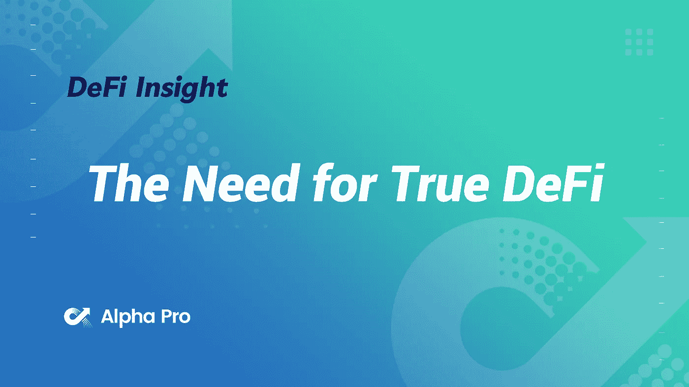
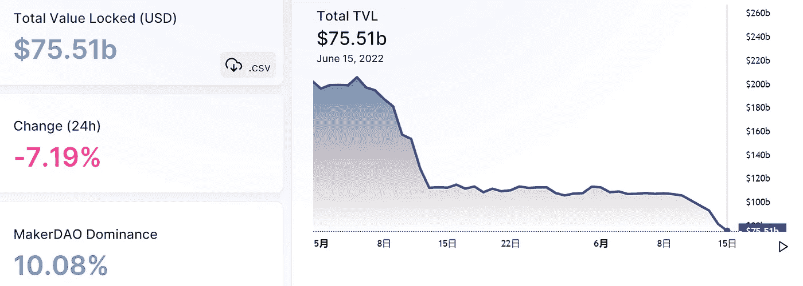
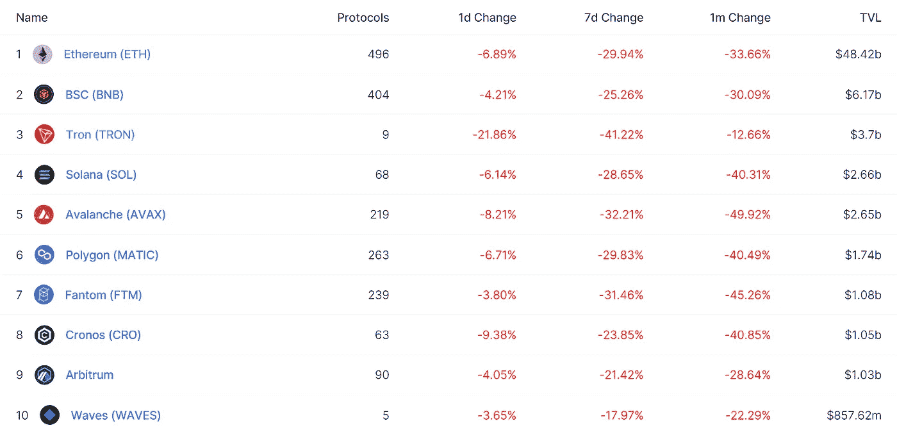
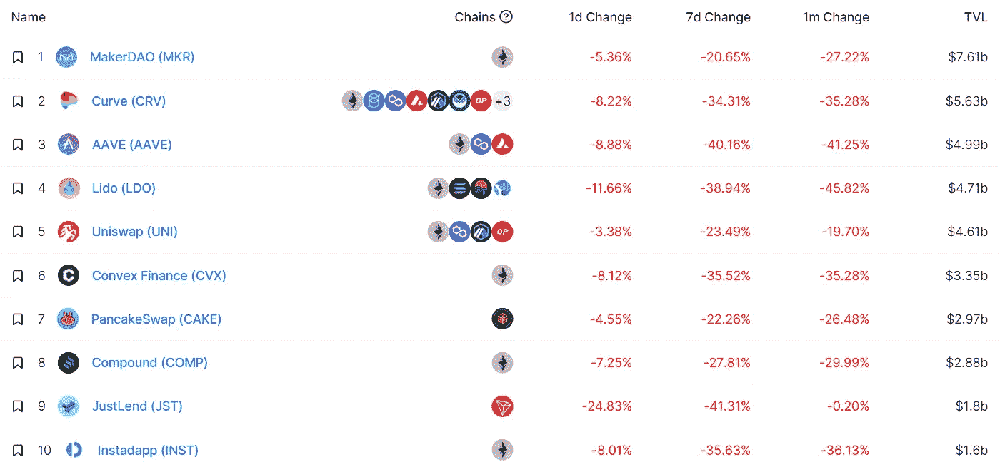
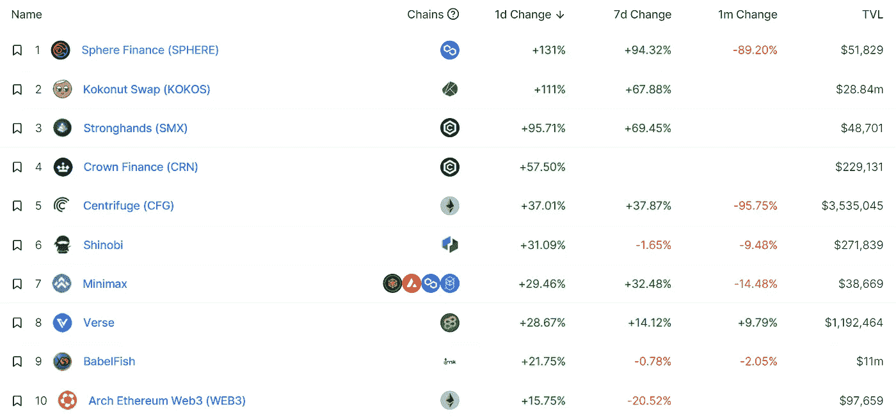
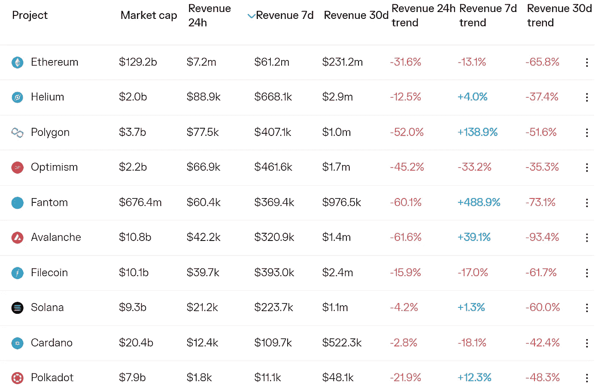
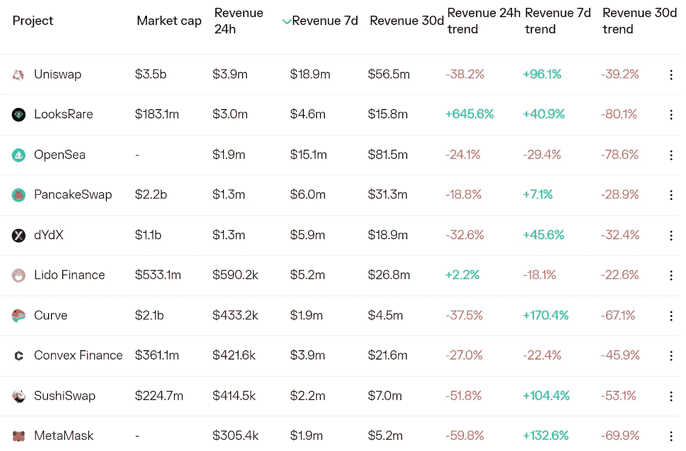
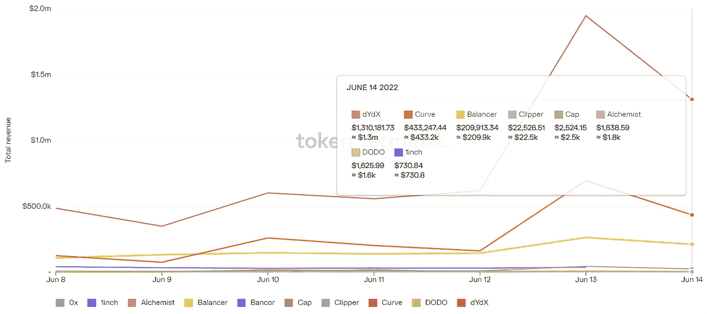
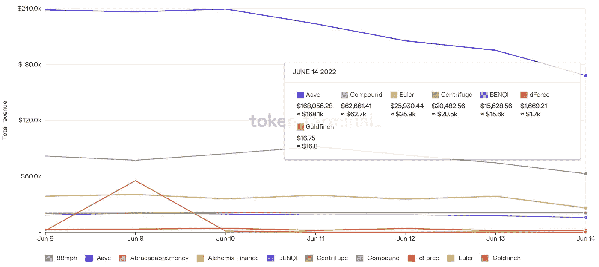

# DeFi Insight |对真正 DeFi 的需求

> 原文：<https://medium.com/coinmonks/defi-insight-the-need-for-true-defi-56a58feeaf40?source=collection_archive---------27----------------------->

2022 年 6 月 15 日

*今日 DeFi 数据&由 DeFi Insight 为您带来的新闻*

> 我成为 DeFi 的创始人是为了创建一个更加透明、自主和安全的金融系统。
> 
> 目睹 UST、Celsius、3AC 以及更多(但愿不是)不透明、基于信任的金融机构的崩溃，再次证明了我们比以往任何时候都更需要“去中心化的金融”。*@*[来源](https://twitter.com/rleshner/status/1536928363276812289)

# 最新消息

## 贷款

账户冻结后，加密贷款人雇佣重组律师

## 外汇

币安与 Splyt 合作，在其平台上为用户提供打车服务

**[比特币基地](https://techcrunch.com/2022/06/14/coinbase-taps-former-niti-aayog-and-prosus-exec-for-india-expansion/)挖走前 Niti Aayog 和 Prosus exec，进行印度扩张**

**美国最大的密码交易所比特币基地将裁员 18%**

## **稳定币**

**系绳公司谴责有关其商业票据持有的虚假传言**

## **政策与法规**

**巴西的一项提案将使加密支付合法化并保护私人密钥**

**衣阿华州对虚报抵押的布洛克进行罚款**

**新任韩国监管负责人承诺对加密投资者更加“公平”**

**加拿大央行官员:在加密变得“大很多”之前，它需要监管**

## **NFT**

****[无聊猿](https://decrypt.co/102905/bored-ape-ethereum-nfts-drop-below-100k-first-time-almost-year)以太坊 NFT 近一年来首次跌破 10 万美元****

****启动海港为社区节省了数百万美元的费用****

******如何避免 [NFT 骗局](https://coingeek.com/how-to-avoid-nft-scams-joshua-henslee-talks-to-nomad-media-clubs-amine-oubrahim/):乔舒亚·亨斯利与游牧媒体俱乐部的 Amine Oubrahim 对话******

## ******基金******

******三支箭关于金融压力的谣言四起******

********[Tellie](https://www.prnewswire.com/news-releases/tellie-web3-starter-kit-for-creators-raises-10m-series-a-to-onboard-web2-creators-to-web3-301568110.html)，Web3 创造者入门套件，筹集 1000 万美元 A 轮资金，让 Web2 创造者加入 Web3********

******NFTPort 从 Taavet+斯登冲锋枪等公司筹集 2600 万美元******

## ******观点******

********【我没有参与其中】:[比尔·盖茨](https://fortune.com/2022/06/15/bill-gates-crypto-nft-greater-fool-asset-bored-ape/)认为加密和非功能性加密技术是“更愚蠢的”投资********

********SEC 主席 [Gary Gensler](https://cryptopotato.com/sec-chair-gary-gensler-claims-lummis-gillibrand-crypto-bill-undermines-tradfi/) 声称 Lummis-Gillibrand 加密法案破坏了 TradFi********

********锁定 2018 年熊市底部的加密交易员[表示](https://dailyhodl.com/2022/06/15/crypto-trader-who-nailed-2018-bear-market-bottom-says-bitcoin-and-ethereum-very-close-to-pivotal-moment/)比特币和以太坊非常接近关键时刻********

******古驰的所有者 T2·开云说加密“不再是小众的”，想要成为 Web3 的“先锋”******

# ******数据和分析******

## ******锁定的总价值(TVL)******

******目前全网 DeFi 总锁定量为 755.1 亿美元，24 小时下降 7.19%。******

************

## ******TVL 评出的十大连锁酒店******

************

## ******|最新 TVL 十大项目******

************

## ******|过去 24 小时内 TVL 增长的前 10 个项目******

************

## ******协议收入******

## ******|累计总收入最高的项目(24H)_ 区块链(L1)******

************

## ******|累计总收入最高的项目(24H) _Dapps (L2)******

************

## ******|前 10 大交易所的每日收入******

************

## ******|十大贷款协议的每日收入******

************

# ******深潜******

********[**5 个步骤**](https://newsletter.banklesshq.com/p/hire-job-career-crypto?utm_source=%2Finbox&utm_medium=reader2&s=r) **开始你的密码生涯**********

**** [## 开始你的加密生涯的 5 个步骤

### 使用 MetaMask，您现在可以在浏览器扩展和移动应用程序中跨 6 个不同的平台一步购买您的加密

newsletter.banklesshq.com](https://newsletter.banklesshq.com/p/hire-job-career-crypto?utm_source=%2Finbox&utm_medium=reader2&s=r) 

**区块链智能如何防止洗钱？**

 [## 区块链智能如何防止洗钱？

### Guneet Kaur 是一名注册信用和证券分析师。她是金融科技硕士毕业生(以优异成绩)。

www.cryptoknowmics.com](https://www.cryptoknowmics.com/news/how-does-blockchain-intelligence-prevent-money-laundering?utm_source=rss&utm_medium=rss&utm_campaign=how-does-blockchain-intelligence-prevent-money-laundering) 

**[**零知识证明**](https://www.zdnet.com/finance/blockchain/zero-knowledge-proofs-will-play-a-major-role-in-the-future-of-web3-defi-and-metaverse-survey/) **将在 Web3、DeFi 和元宇宙的未来发挥重大作用:调查****

** [## 零知识证明将在 Web3、DeFi 和元宇宙的未来中发挥重要作用:调查

### 在其“2022 年零知识状态报告”调查中，米娜基金会评估了密码交易员的情绪，并…

www.zdnet.com](https://www.zdnet.com/finance/blockchain/zero-knowledge-proofs-will-play-a-major-role-in-the-future-of-web3-defi-and-metaverse-survey/) 

**加密公司告诉员工打包，但币安正在招聘——这里是** [**为什么**](https://bitcoinist.com/crypto-companies-firing-except-binance/)

 [## 加密公司告诉员工收拾行李，但币安正在招聘-这是为什么

### 由于一些加密交易所在压力下崩溃，并让员工打包，币安的首席执行官表示，该公司正在…

bitcoinist.com](https://bitcoinist.com/crypto-companies-firing-except-binance/) 

**/**[**如果比特币跌破 2 万美元会发生什么？**](https://decrypt.co/102952/what-happens-if-bitcoin-falls-below-20000)

 [## 如果比特币跌破 2 万美元会怎么样？-解密

### 随着悲观情绪充斥金融市场，专家们正在权衡是否会跌破 20，000 美元…

decrypt.co](https://decrypt.co/102952/what-happens-if-bitcoin-falls-below-20000) 

# 报告

**[**合成**](https://messari.io/article/synthetix-ecosystem-overview) **生态系统概述**_ 梅萨里**

> **要获得 crypto 中的资产，您必须找到该资产的流动性。假设我们不想使用 Twitter 投票来询问“谁有 X 我可以买？”我们通常会求助于交易所。但是，如果您想要的资产没有链上供应，或者链上根本不存在该资产，该怎么办呢？为了满足这一需求，Synthetix 铸造并交易合成资产，为几乎所有资产提供流动性解决方案。**

****绘制出** [**凯鹏华盈**](https://www.theblockresearch.com/mapping-out-kleiner-perkins-crypto-portfolio-151969)**‘加密组合** _theblockresearch**

****不止 JPEGs:什么是** [**克隆 X**](https://www.nansen.ai/research/more-than-jpegs-what-is-clone-x) **？**_ 南森**

****[**新 Dapps 报道**](https://dappradar.com/blog/new-dapps-report-we-are-all-going-to-die-embraces-uncertainty) **:我们都要死了——拥抱不确定性** _dappradar****

******关于:******

****DeFi Insight 是顶级 DeFi 和加密新闻和更新的来源。****

******https://twitter.com/AlphaPro_io 推特:******

********❤RSS:**[**https://medium.com/feed/@alphapro.project**](https://medium.com/feed/@alphapro.project)******

****提供的信息应被视为发展新闻，而不是投资建议。****

> ****加入 Coinmonks [电报频道](https://t.me/coincodecap)和 [Youtube 频道](https://www.youtube.com/c/coinmonks/videos)了解加密交易和投资****

# ****另外，阅读****

*   ****[最佳以太坊钱包](https://coincodecap.com/best-ethereum-wallets) | [电报上的加密货币机器人](https://coincodecap.com/telegram-crypto-bots)****
*   ****[交易杠杆代币的最佳交易所](https://coincodecap.com/leveraged-token-exchanges) | [购买弗洛基](https://coincodecap.com/buy-floki-inu-token)****
*   ****[3 commas vs Pionex vs Cryptohopper](https://coincodecap.com/3commas-vs-pionex-vs-cryptohopper)|[Bingbon Review](https://coincodecap.com/bingbon-review)****
*   ****[加密复制交易平台](/coinmonks/top-10-crypto-copy-trading-platforms-for-beginners-d0c37c7d698c) | [如何在 WazirX 上购买比特币](/coinmonks/buy-bitcoin-on-wazirx-2d12b7989af1)****
*   ****[货币评论](https://coincodecap.com/coinloan-review)|[Crypto.com 评论](/coinmonks/crypto-com-review-f143dca1f74c)****
*   ****[如何在加拿大购买加密货币？](https://coincodecap.com/how-to-buy-cryptocurrency-in-canada)**********