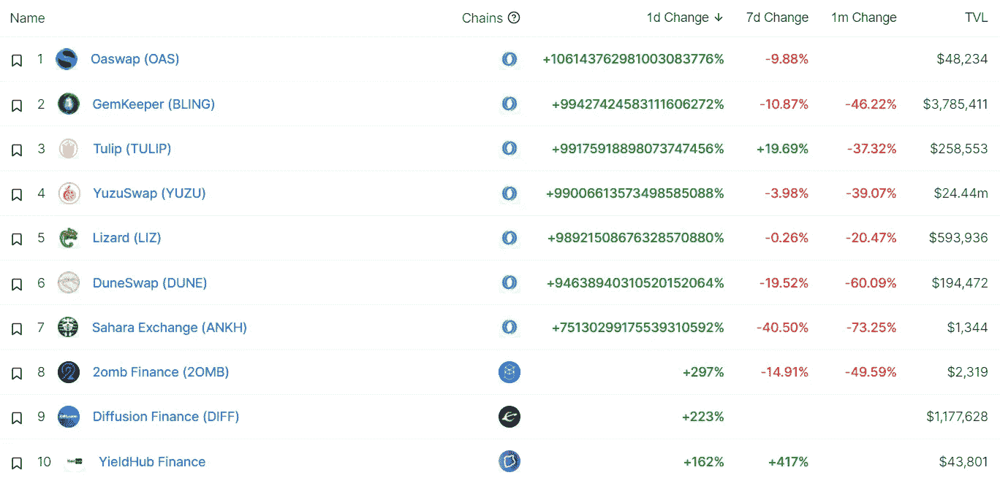

# DeFi Insight |所有权经济 2022

> 原文：<https://medium.com/coinmonks/defi-insight-the-ownership-economy-2022-51b0af301b21?source=collection_archive---------30----------------------->

2022 年 4 月 29 日

*今日 DeFi 数据&由 DeFi Insight 为您带来的新闻。*

> *万维网发展三十年，少数几家公司控制了大部分用户注意力和广告收入，封闭的生态系统阻碍了独立开发者的创新。最大的互联网平台的经济利益与其最有价值的贡献者——用户——不太一致。*
> 
> *硅谷初创公司长期以来一直接受所有权，通过期权奖励来调整员工之间的激励。尽管如此，绝大多数互联网用户只拥有他们所贡献的 0%的服务。创作者不拥有他们的内容，开发者无法控制他们的代码，消费者无法影响他们使用的平台的政策或决策。这种曾经毋庸置疑的场景，现在看起来越来越过时了。*
> 
> *随着产品和服务将用户转化为所有者，所有权经济(通常被称为 web3)开始改变这种情况。*
> 
> *始于比特币和以太坊的东西——这两种东西都奖励那些用自己的本地令牌保护网络安全的参与者——正在所有类别的软件中流行起来，从 DeFi 中的开发者基础设施和新金融市场到消费品、市场和社交。**[***来源***](https://variant.fund/writing/the-ownership-economy-2022)***

# **最新消息**

## **|选项**

****期权协议 [Lyra](https://twitter.com/lyrafinance/status/1519916115279093760?s=20&t=1xx-Y6kTUHFy75WWc43x6g) 基于乐观主义为其有限合伙人提供流动性激励****

******丝带理财 V3 将[推出](https://ribbonfinance.medium.com/ribbon-v3-8a3cd8757ecc)******

## ******副链******

********[大解锁](https://moonbeam.network/blog/the-big-unlock/):110 万 KSM 代币将于 5 月份在草间弥生 DeFi 使用********

## ********空投********

**********[GAL Token](https://blog.galaxy.eco/gal-token-will-be-live-on-may-5th-2022-6579971294f2)将于 2022 年 5 月 5 日上线**********

## ********|工具********

**********介绍[比特币基地情报](https://blog.coinbase.com/introducing-coinbase-intelligence-crypto-compliance-at-scale-f58daa949082):大规模加密合规**********

## ********政策与法规********

********美国立法者重新提出[法案](https://www.coindesk.com/policy/2022/04/28/us-lawmakers-reintroduce-bill-to-give-cftc-crypto-spot-market-oversight/?utm_medium=referral&utm_source=rss&utm_campaign=headlines)给予 CFTC 加密现货市场监管权********

## ********鲸鱼********

**********SBF[向 FTX 交易平台转让](https://etherscan.io/address/0xc5ed2333f8a2C351fCA35E5EBAdb2A82F5d254C3)61000 ETH，价值 1.75 亿美元**********

**********[三支箭](https://etherscan.io/address/0xb630abaadbbd4cb7616eb4bc948b526fba832395#tokentxns)资本向 FTX 交易平台转账 1 亿 USDC**********

## ********NFT********

**********NFT 项目“[奥凯熊](https://opensea.io/collection/okay-bears?tab=activity)”楼面价突破 100 索尔，创历史新高**********

**********[ape coin](https://twitter.com/apecoin/status/1519758701325918209)机构群体发起对提案 AIP-21、22 和 AIP-7 的投票**********

**********[多边形](https://cryptoslam.io/)连锁 NFT 销售额突破 5 亿美元**********

********耐克的新款 NFT 运动鞋售价超过 10 万美元********

********宇迦实验室的新项目取消荷兰式拍卖，其他项目以 305 便士的价格出售********

********比特币基地 NFT 市场第一周的交易量不到 900 笔********

**********【奇人异事】收藏版 [NFTs](https://www.whats-on-netflix.com/news/stranger-things-nfts-to-launch-ahead-of-season-4/) 将在第四季之前推出**********

## ********基金********

**********约翰·传奇的《我们的快乐公司》[为 NFT 音乐平台募集](https://decrypt.co/98879/john-legend-our-happy-company-raises-7-5-million-nft-music-platform)750 万美元**********

**********[修订](https://techcrunch.com/2022/04/28/revise-raises-3-5-million-to-build-rails-for-programming-nfts/)筹集 350 万美元建造用于编程 NFT 的 rails**********

**********[yield street](https://www.businesswire.com/news/home/20220428005423/en/Yieldstreet-Expands-Crypto-Platform-with-Osprey-Funds-to-Allow-Investors-an-Easier-and-Balanced-Approach-to-Invest-in-the-Crypto-Economy)用鱼鹰基金扩展加密平台，让投资者以更简单、平衡的方式投资于加密经济**********

**********[三箭资本](https://www.coindesk.com/business/2022/04/28/three-arrows-capital-to-move-headquarters-to-dubai-raise-external-capital/)将总部迁至迪拜，筹集外部资本**********

**********[SX](https://blog.polygon.technology/sx-network-secures-9-5-million-in-funding-led-by-polygon-hack-vc/)网络获得由 Polygon & Hack VC 领投的 950 万美元资金**********

********Venly 为区块链不可知的游戏和电子商务服务筹集了 2300 万美元********

**********[曼加塔金融](https://blog.mangata.finance/news/2022-04-28-mangata-finance-raises-4-2-million-usd/)筹集 420 万美元建立其安全、无气体交叉链指数**********

********OurSong 筹集了 750 万美元的种子基金，帮助艺术家们通过 NFTs 建立一个社区********

********DeFi 和 Web3 装备银色[增加](https://www.finextra.com/pressarticle/92441/defi-and-web3-outfit-argent-raises-40m)4000 万美元********

# ********数据和分析********

## ********锁定的总价值(TVL)********

********目前全网 DeFi 总锁定量为 2066.3 亿美元，24 小时下降 0.83%。********

****************

## ********TVL 评出的十大连锁酒店********

****************

## ********|最新 TVL 十大项目********

****************

## ********|过去 24 小时内 TVL 增长的前 10 个项目********

****************

## ********协议收入********

## ********|累计总收入最高的项目(24H)_ 区块链(L1)********

****************

## ********|累计总收入最高的项目(24H) _Dapps(L2)********

****************

## ********|前 10 大交易所的每日收入********

****************

## ********|十大贷款协议的每日收入********

****************

# ********深潜********

**********[**稳定时期**](https://twitter.com/Rawson_Haverty/status/1508586552917565445) 不稳定时期**********

********为什么@PrimitiveFi 是"** [**Uniswap 矩**](https://twitter.com/richardchen39/status/1519719311547387904) **"为导数********

# ******报告******

********行为** [**报告**](https://dappradar.com/blog/behavior-report-macroeconomic-events-accelerate-crypto-adoption-and-regulations) **—宏观经济事件加速加密采用和法规** _dappradar******

> ******今年前四个月发生的全球事件为区块链科技呈现了一个独特的场景。俄罗斯对乌克兰的战争造成的全球市场混乱将各种金属和能源商品的价格推高到接近或达到历史最高水平，包括黄金、钯、石油和天然气。地缘政治格局给市场带来了恐惧，导致金融市场的抛售压力，包括加密货币，推动价格下跌。今年前四个月发生的全球事件为区块链科技呈现了一个独特的场景。俄罗斯对乌克兰的战争造成的全球市场混乱将各种金属和能源商品的价格推高到接近或达到历史最高水平，包括黄金、钯、石油和天然气。地缘政治格局给市场带来了恐惧，导致金融市场的抛售压力，包括加密货币，推动价格下跌。******

********[**映射出**](https://www.theblockresearch.com/mapping-out-flow-blockchain-ecosystem-144136) **流量区块链生态系统** _theblockresearch********

********[**逐层**](https://www.theblockresearch.com/layer-by-layer-issue-29-avalanche-terra-and-polkadot-144018) **第 29 期:雪崩、Terra、Polkadot** _theblockresearch********

********[**状态分散游戏**](https://messari.io/article/state-of-decentral-games-q1-2022)**Q1 2022**_ 梅萨里********

********[**闪电网**](https://messari.io/article/what-s-happening-on-the-lightning-network) **上发生了什么？**_ 梅萨里********

********关于:********

******DeFi Insight 是顶级 DeFi 和加密新闻和更新的来源。******

********https://twitter.com/AlphaPro_io 推特:********

**********❤RSS:**[**https://medium.com/feed/@alphapro.project**](https://medium.com/feed/@alphapro.project)********

******提供的信息应被视为发展新闻，而不是投资建议。******

> ******加入 Coinmonks [电报频道](https://t.me/coincodecap)和 [Youtube 频道](https://www.youtube.com/c/coinmonks/videos)了解加密交易和投资******

# ******另外，阅读******

*   ******[最佳加密分析或链上数据](https://coincodecap.com/blockchain-analytics) | [Bexplus 评论](https://coincodecap.com/bexplus-review)******
*   ******[NFT 十大市场造币集锦](https://coincodecap.com/nft-marketplaces)******
*   ******[AscendEx Staking](https://coincodecap.com/ascendex-staking)|[Bot Ocean Review](https://coincodecap.com/bot-ocean-review)|[最佳比特币钱包](https://coincodecap.com/bitcoin-wallets-india)******
*   ******[Bitget 评论](https://coincodecap.com/bitget-review) | [双子星 vs BlockFi](https://coincodecap.com/gemini-vs-blockfi) | [OKEx 期货交易](https://coincodecap.com/okex-futures-trading)******
*   ******[美国最佳加密交易机器人](https://coincodecap.com/crypto-trading-bots-in-the-us) | [经常性评论](https://coincodecap.com/changelly-review)******
*   ******[在印度利用加密套利赚取被动收入](https://coincodecap.com/crypto-arbitrage-in-india)******