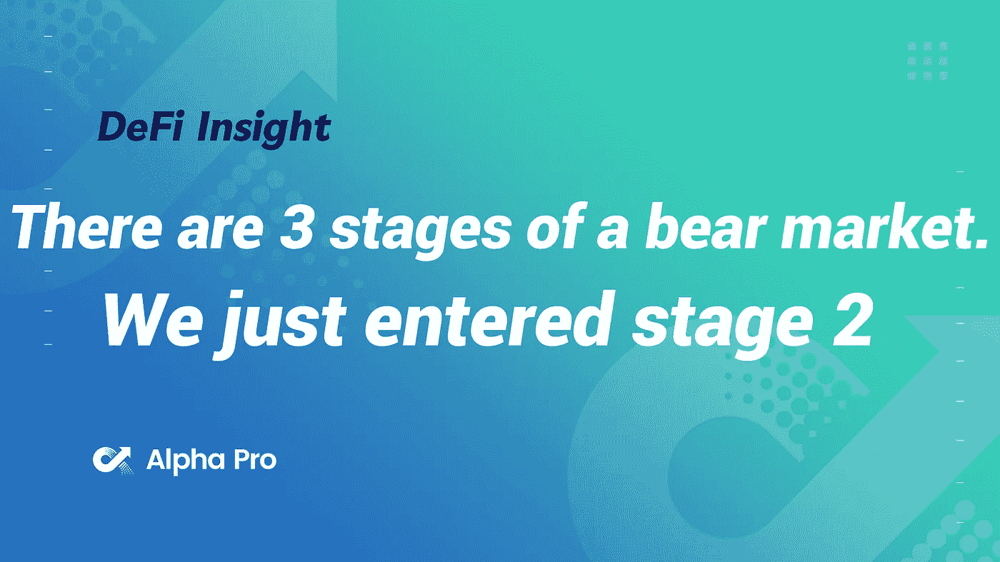
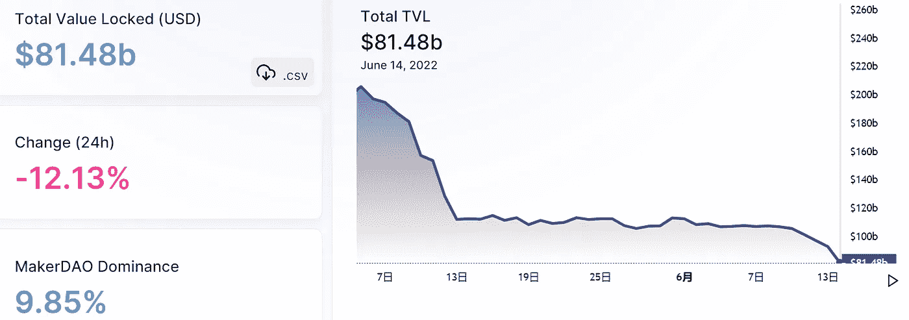
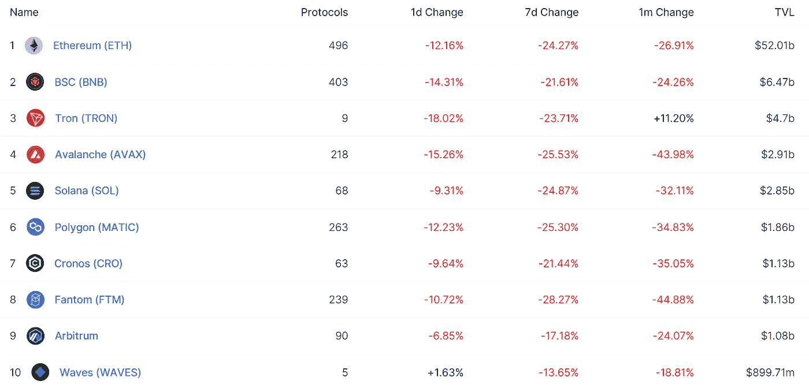
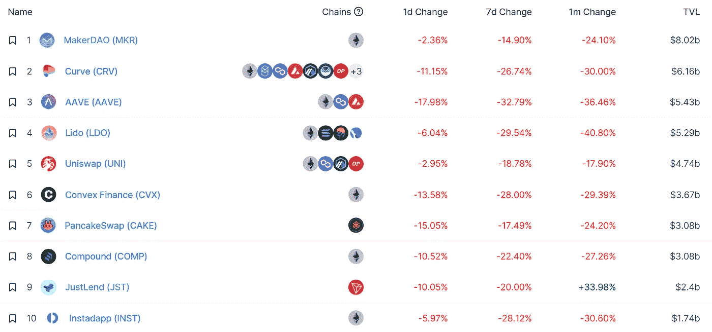
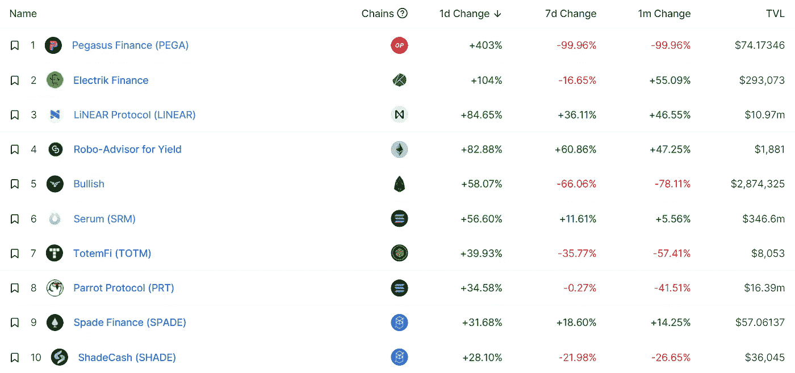
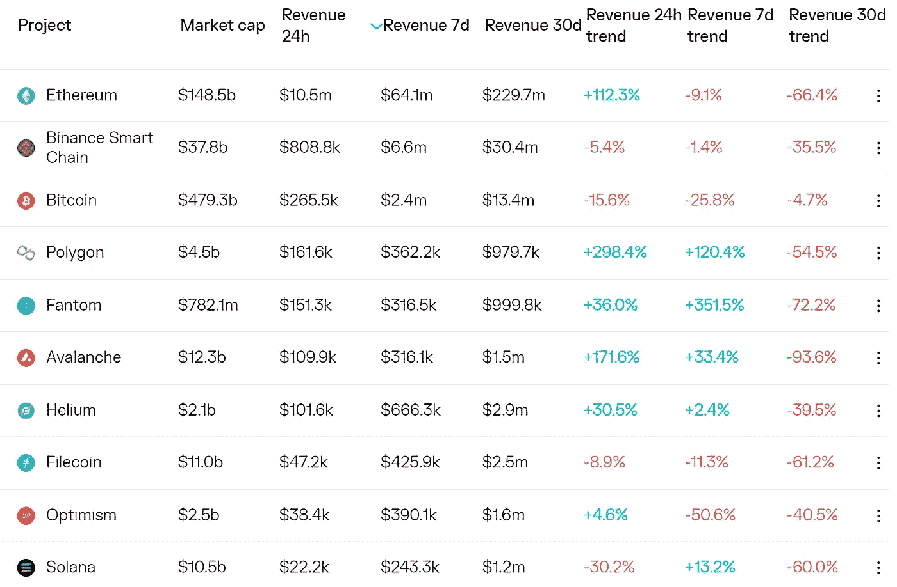
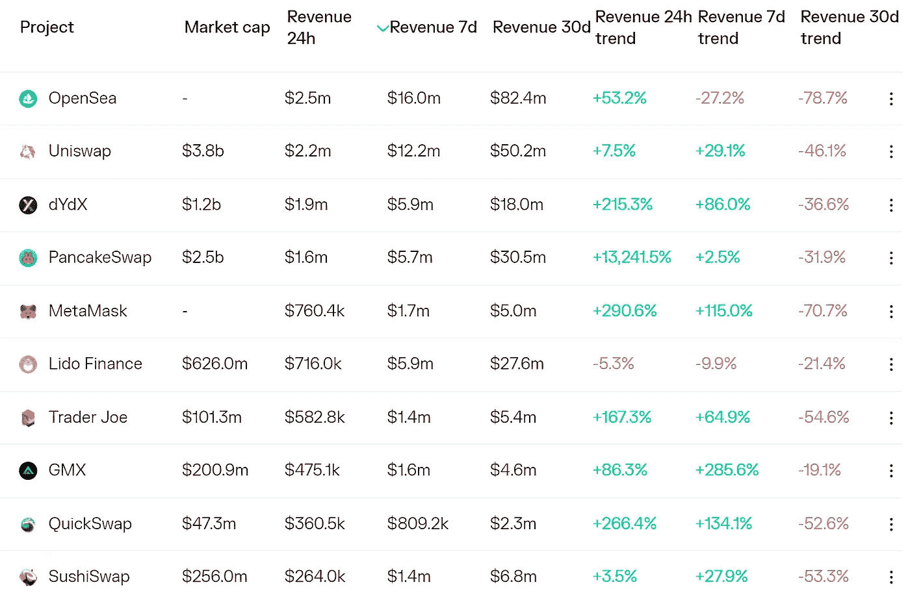
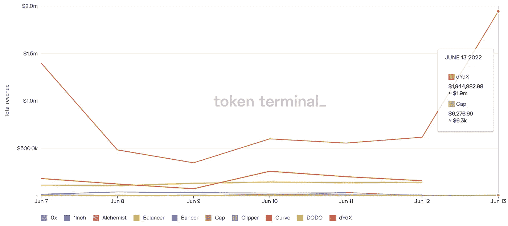
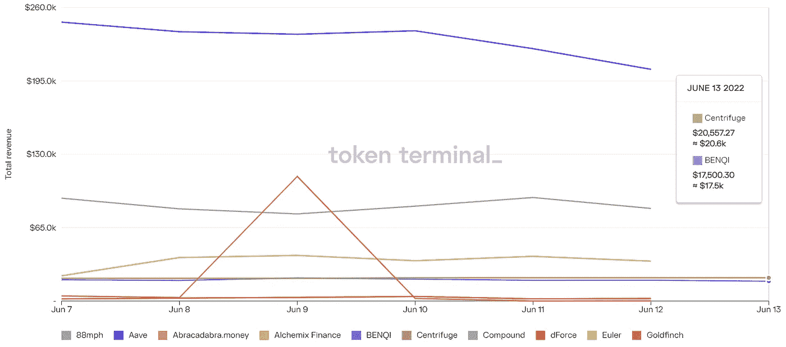

# 熊市有 3 个阶段。我们刚刚进入第二阶段

> 原文：<https://medium.com/coinmonks/defi-insight-there-are-3-stages-of-a-bear-market-we-just-entered-stage-2-a6777d392719?source=collection_archive---------19----------------------->

2022 年 6 月 14 日

*今日 DeFi 数据&由 DeFi Insight 为您带来的新闻*

> 第一阶段:放松牛市带来的兴奋(和贪婪)仍然存在。迷你记叙文一次出现几个星期。资产还是有楼层的。估值被下调，但公司不会做出艰难的决定(淘汰产品、裁员)。事情似乎没问题。@ [来源](https://twitter.com/JasonYanowitz/status/1536365738906202112)

# 最新消息

## 外汇

**[币安](https://www.cryptoknowmics.com/news/binance-resumes-btc-withdrawals-after-pause?utm_source=rss&utm_medium=rss&utm_campaign=binance-resumes-btc-withdrawals-after-pause)暂停后恢复 BTC 撤资**

**南韩密码交易所宣布 H2 2022 年联合咨询机构**

## **稳定币**

**创稳定的盯住美元的货币政策摇摆不定**

**随着创的 USDD 稳定币失去与美元的挂钩，人们担心另一场特拉-UST 内爆即将爆发**

## **EVM**

**卡达诺在其测试网上推出了 EVM Sidechain**

## **|令牌**

****[stream coin](https://coinpedia.org/news/streamcoin-starts-user-registration-for-strmnft-marketplace/)开始为 STRMNFT 市场注册用户****

## ****|警报****

****据报道，非法加密使用量占总使用量的百分比已经下降****

## ****政策与法规****

****随着市场崩溃，美国证券交易委员会调查加密交易****

****巴西法官接受秘密“培训”，部长警告监管存在“漏洞”****

****纽约市市长埃里克·亚当斯公开反对禁止电力开采立法****

******/**[韩国](https://blockworks.co/south-korea-weighs-new-measures-for-blockchain-platforms/)权衡区块链平台新举措****

## ****NFT****

****在市场和地板价格暴跌的情况下，NFT 的交易量激增****

## ****基金****

****科技咨询公司。工作室在种子期前筹集了 1000 万美元****

******加密 API 提供商[桩](https://sifted.eu/articles/crypto-api-provider-pile-pre-seed/)提高€2.8 米，使金融科技公司进军加密******

******红杉领投加密支付初创公司 Nume 的种子前融资轮******

## ******观点******

******deVere 集团首席执行官预计比特币“将在今年年底飞起来”******

******普华永道:大多数接受调查的加密基金经理预测，到今年年底，比特币可能达到 10 万美元******

# ******数据和分析******

## ******锁定的总价值(TVL)******

******目前全网 DeFi 总锁定量为 814.8 亿美元，24 小时下降 12.13%。******

************

## ******TVL 评出的十大连锁酒店******

************

## ******|最新 TVL 十大项目******

************

## ******|过去 24 小时内 TVL 增长的前 10 个项目******

************

## ******协议收入******

## ******|累计总收入最高的项目(24H)_ 区块链(L1)******

************

## ******|累计总收入最高的项目(24H) _Dapps (L2)******

************

## ******|前 10 大交易所的每日收入******

************

## ******|十大贷款协议的每日收入******

************

# ******深潜******

********[**证据**](https://bitcoinmagazine.com/technical/proof-of-work-is-objective-proof-of-stake-is-not) **是客观的，证据不是**********

**** [## 工作证据是客观的，利害关系证据不是

### Alan Szepieniec 拥有鲁汶大学的后量子密码学博士学位。他的研究重点是密码学…

bitcoinmagazine.com](https://bitcoinmagazine.com/technical/proof-of-work-is-objective-proof-of-stake-is-not) 

**加密市场现在已经损失了 2 万亿美元的价值。以下是来自 crypto 的黑色星期一**的 [**5 个令人震惊的事实**](https://fortune.com/2022/06/13/cryptocurrencies-black-monday-5-shocking-facts/)

** [## 来自 crypto 黑色星期一的 5 个令人震惊的事实

### 从 stablecoins 不稳定的一天到比特币多头的巨大损失，这是加密货币市场的一次疯狂之旅…

fortune.com](https://fortune.com/2022/06/13/cryptocurrencies-black-monday-5-shocking-facts/) 

**[**生存下来的 4 个最佳方法**](https://nulltx.com/4-best-ways-to-survive-a-bear-season/) **一个熊市****

** [## 度过熊市的 4 个最佳方法

### 就加密货币市场交易而言，我们正在见证不可避免的事情。不管我们多么想要一个…

nulltx.com](https://nulltx.com/4-best-ways-to-survive-a-bear-season/) 

**以太坊在 Uniswap 上一夜之间跌破 950 美元——下面是** [**为什么**](https://www.newsbtc.com/news/ethereum/ethereum-drops-below-950/)

 [## 以太坊在 Uniswap 上一夜之间跌破 950 美元——原因如下

### 以太坊关键要点:-以太网价格已暴跌至 1300 美元以下-抛售压力加剧，这引发了…

www.newsbtc.com](https://www.newsbtc.com/news/ethereum/ethereum-drops-below-950/) 

**[**包装加密令牌**](https://blockworks.co/wrapped-crypto-tokens-and-why-theyre-critical-to-markets/) **以及它们为何对市场至关重要****

** [## 包装加密令牌及其对市场至关重要的原因——block works

### 包装加密令牌是智能合约，代表独立区块链上原始资产的锁定抵押品…

blockworks.co](https://blockworks.co/wrapped-crypto-tokens-and-why-theyre-critical-to-markets/)** 

# **报告**

****熊的** [**最黑暗的阶段**](https://insights.glassnode.com/the-week-onchain-week-24-2022/)**_ glass node****

> ****随着比特币价格跌至 20 美元左右，大量宏观指标表明，市场正进入本轮熊市周期的最深阶段。基本面已经恶化，甚至长期持有者现在也意识到了重大损失。****

******[**总账**](https://www.theblockresearch.com/ledger-company-intelligence-149781) **公司情报** _theblockresearch******

******[**数字资产**](https://coinshares.com/research/digital-asset-fund-flows) **资金流动周报** _coinshares******

******[**言之有理**](https://messari.io/article/making-sense-of-the-steth-discount) **言之有理** _messari******

******关于:******

****DeFi Insight 是顶级 DeFi 和加密新闻和更新的来源。****

******https://twitter.com/AlphaPro_io 推特:******

********❤RSS:**[**https://medium.com/feed/@alphapro.project**](https://medium.com/feed/@alphapro.project)******

****提供的信息应被视为发展新闻，而不是投资建议。****

> ****加入 Coinmonks [电报频道](https://t.me/coincodecap)和 [Youtube 频道](https://www.youtube.com/c/coinmonks/videos)了解加密交易和投资****

# ****另外，阅读****

*   ****[隐料斗替代品](/coinmonks/cryptohopper-alternatives-d67287b16d27) | [HitBTC 审查](/coinmonks/hitbtc-review-c5143c5d53c2)****
*   ****[CBET 评论](https://coincodecap.com/cbet-casino-review) | [库科恩 vs 比特币基地](https://coincodecap.com/kucoin-vs-coinbase)****
*   ****[Fold App 审核](https://coincodecap.com/fold-app-review) | [Kucoin 交易机器人](/coinmonks/kucoin-trading-bot-automate-your-trades-8cf0ca2138e0) | [Probit 审核](https://coincodecap.com/probit-review)****
*   ****[如何匿名购买比特币](https://coincodecap.com/buy-bitcoin-anonymously) | [比特币现金钱包](https://coincodecap.com/bitcoin-cash-wallets)****
*   ****[币安 vs FTX](https://coincodecap.com/binance-vs-ftx) | [最佳(SOL)索拉纳钱包](https://coincodecap.com/solana-wallets)****
*   ****[比诺莫评论](https://coincodecap.com/binomo-review) | [斯多葛派 vs 3Commas vs TradeSanta](https://coincodecap.com/stoic-vs-3commas-vs-tradesanta)************