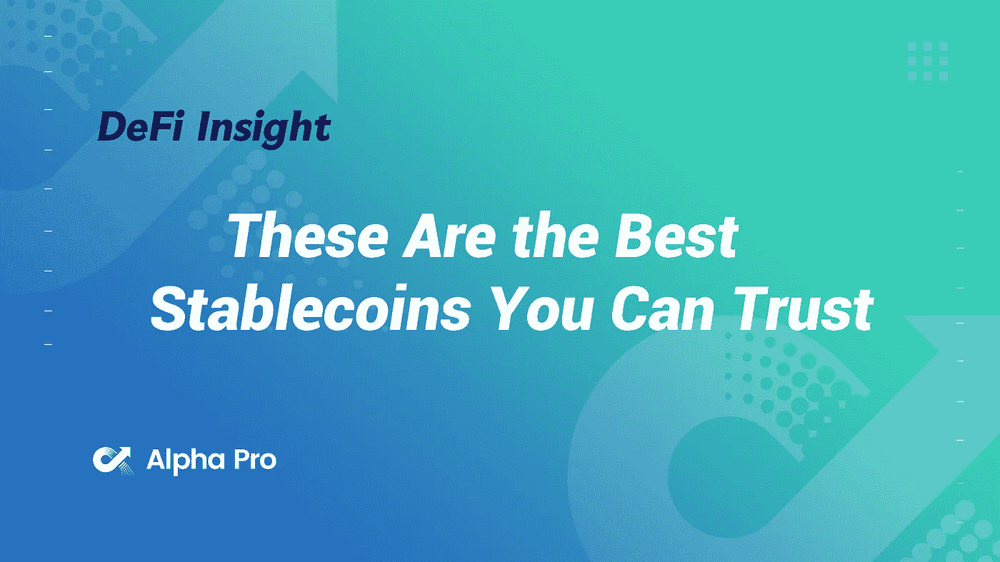
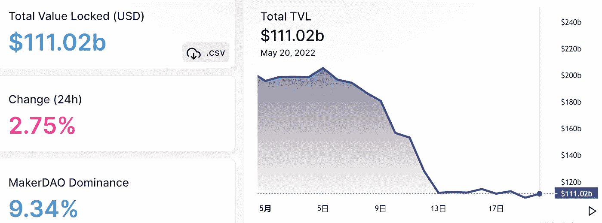
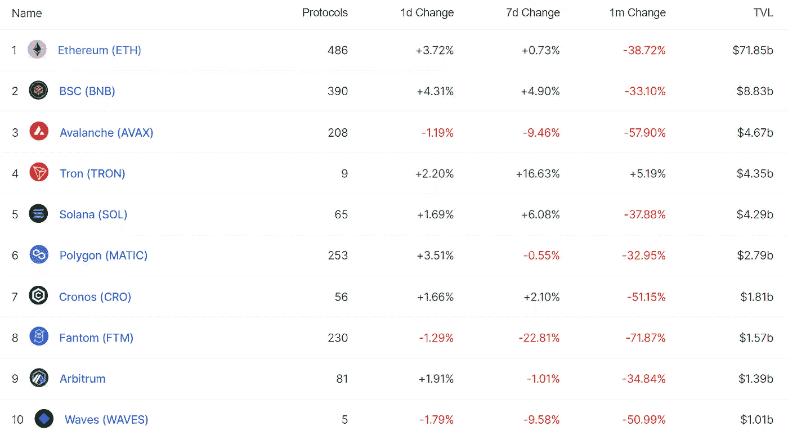
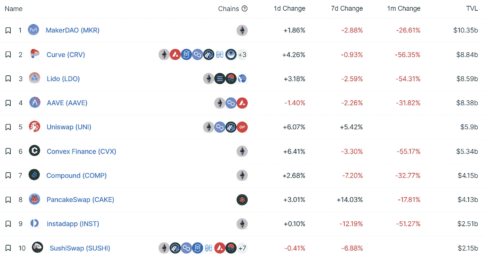
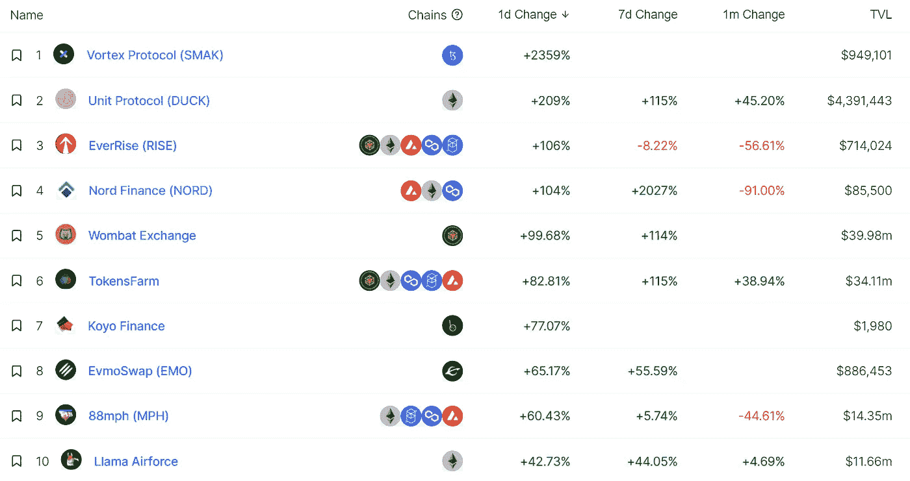
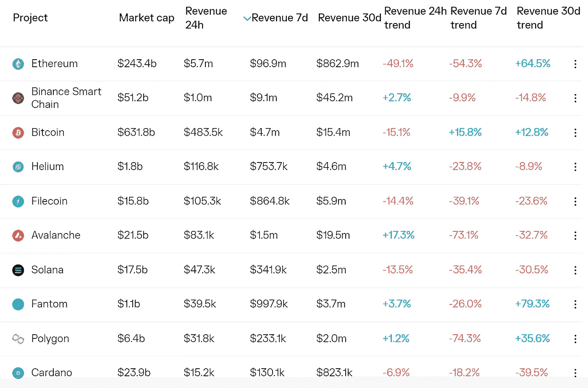
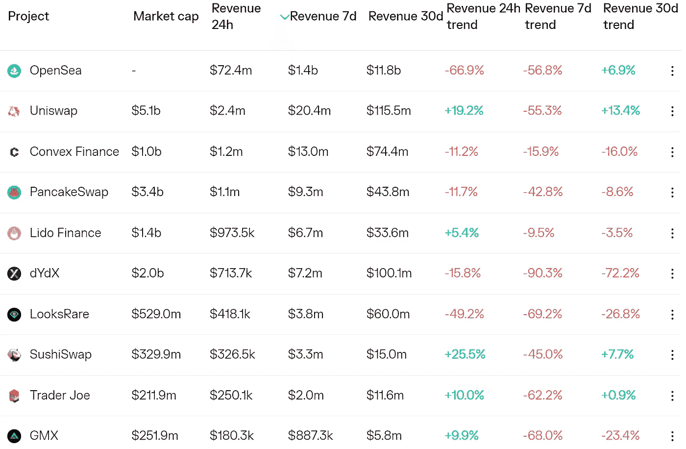
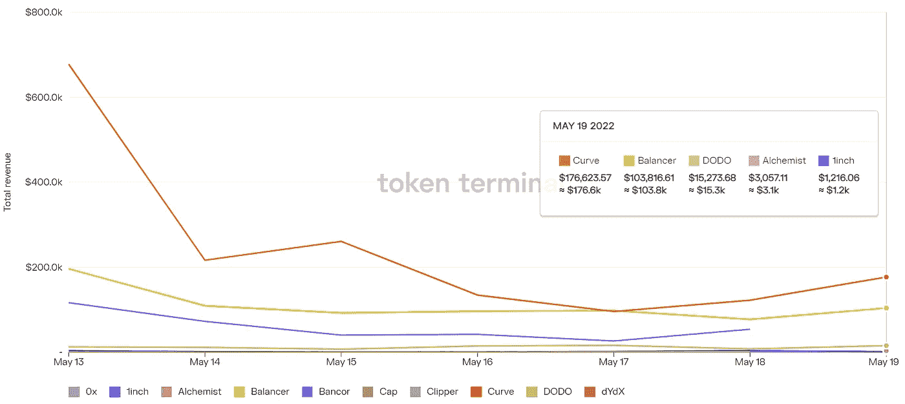
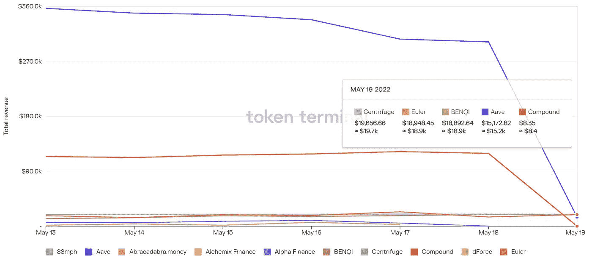

# DeFi Insight |这些是您可以信赖的最佳稳定产品

> 原文：<https://medium.com/coinmonks/defi-insight-these-are-the-best-stablecoins-you-can-trust-d7cd5f412716?source=collection_archive---------19----------------------->

2022 年 5 月 20 日

*今日 DeFi 数据&由 DeFi Insight 为您带来的新闻。*

> *"* 尽管加密技术不景气，但仍然有稳定的加密技术提供安全保障，并享有值得信赖的声誉。尽管如此，stablecoins 的声誉受到了严重影响，可以说，Terra USD 的垮台推动了分散融资在几年前的大规模采用。*“@*[*来源*](https://dappradar.com/blog/these-are-the-best-stablecoins-you-can-trust)

# 最新消息

## 稳定币

**LFG 披露没有动用$AVAX 储备的计划，称[雪崩](https://twitter.com/avalancheavax/status/1527367369701502978)**

****,**[币安](https://www.benzinga.com/markets/cryptocurrency/22/05/27317194/binance-supports-terra-struck-crypto-projects-migrating-away-from-ecosystem)希望抓住从生态系统中迁移出来的“根深蒂固”的秘密项目**

****Terra 修改 [Terra 2.0](https://twitter.com/terra_money/status/1527486972268367872?s=20&t=rEDMIlGRiixM15OedFbjMg) 提案****

## ****第二层****

******介绍[乐观主义](https://dev.optimism.io/introducing-optimism-bedrock/)基岩******

## ******测试网******

********“一个巨大的里程碑”:[以太坊的测试网络](https://www.msn.com/en-us/news/technology/a-huge-milestone-ethereum-s-test-network-will-undergo-the-merge-next-month-ahead-of-the-actual-upgrade-on-the-main-network/ar-AAXtWY3?ocid=BingNewsSearch)将在下个月主网络实际升级之前进行“合并”********

## ******空投******

********[本吉香蕉](https://twitter.com/BenjiBananas/status/1527302055181680641?s=20&t=r93T_9bs1LgmwxxNFeCrIA)向其会员证持有者空投 1800 万美元的灵长类动物********

## ******政策与法规******

******英国监管机构审查 Terra 事件******

********国会[出台了](https://www.forbes.com/sites/jasonbrett/2022/05/19/congress-has-introduced-50-digital-asset-bills-impacting-regulation-blockchain-and-cbdc-policy/?utm_source=blockworks-research&sh=52dbe1c34e3f) 50 项影响监管、区块链和 CBDC 政策的数字资产法案********

********塞浦路斯草案[密码规则](https://news.bitcoin.com/cyprus-drafts-crypto-rules-may-introduce-them-before-eu-regulations/)，可能在欧盟法规出台之前出台********

## ******NFT******

******欺诈技术公司 Tovera 首次亮相 [NFT 验证工具](https://www.pymnts.com/news/security-and-risk/2022/fraud-tech-firm-tovera-debuts-nft-verification-tool/)******

********[通用韩国](http://koreabizwire.com/gm-korea-issues-chevrolet-tahoe-suv-nfts/219108)发布雪佛兰 Tahoe SUV NFTs********

******索尼音乐公司的 RCA 唱片公司进军大中华区******

******作为新冠肺炎预防措施的一部分，T21 允许接种疫苗的青少年创造自己的身体健康******

## ******基金******

********窑完成500 万美元融资轮，壮大区块链跑马圈地平台********

## ******观点******

******Terra 的[跆拳道](https://decrypt.co/100876/terra-do-kwon-criminal-law)会坐牢吗？******

******尽管加密市场抛售，Microstrategy 首席执行官预计比特币将“突破百万大关”******

********交易员预测，加密市场将模仿 [2018 年熊市](https://dailyhodl.com/2022/05/20/trader-predicts-crypto-market-will-mimic-2018-bear-season-heres-how-high-bitcoin-could-go-before-nuking-lower/)——以下是比特币在走低前可能达到的高点********

********[马辛斯基](https://cointelegraph.com/news/mashinsky-says-sharks-of-wall-street-circling-around-celsius-and-other-projects)说“华尔街的鲨鱼”在摄氏和其他项目上打转********

********[雪崩创始人](https://u.today/avalanche-founder-says-terra-is-as-bad-as-mt-gox)说 Terra 和 Mt. Gox 一样坏********

# ******数据和分析******

## ******锁定的总价值(TVL)******

******目前全网 DeFi 总锁定量为 1110.2 亿美元，24 小时增长 2.75%。******

************

## ******TVL 评出的十大连锁酒店******

************

## ******|最新 TVL 十大项目******

************

## ******|过去 24 小时内 TVL 增长的前 10 个项目******

************

## ******协议收入******

## ******|累计总收入最高的项目(24H)_ 区块链(L1)******

************

## ******|累计总收入最高的项目(24H) _Dapps (L2)******

************

## ******|前 10 大交易所的每日收入******

************

## ******|十大贷款协议的每日收入******

************

# ******深潜******

********MICROSTRATEGY 的** [**比特币**](https://bitcoinmagazine.com/markets/microstrategy-holdings-and-grayscale-bitcoin-trust) **持有量和灰度比特币信托折价********

**** [## MicroStrategy 的比特币持有量和灰度比特币信托折扣

### 以下节选自比特币杂志 Pro 的最近一期，比特币杂志的高级市场时事通讯…

bitcoinmagazine.com](https://bitcoinmagazine.com/markets/microstrategy-holdings-and-grayscale-bitcoin-trust) 

**最佳** [**收益率**](https://newsletter.banklesshq.com/p/best-yields-in-the-crypto-bear-market?utm_source=%2Finbox&utm_medium=reader2&s=r) **在隐秘的熊市中**

 [## 秘密熊市中的最佳收益率

### 当你加入亲爱的无银行国家的时候，获得 1000 美元的工作和银行，自从地球崩溃已经一个星期了——这是…

newsletter.banklesshq.com](https://newsletter.banklesshq.com/p/best-yields-in-the-crypto-bear-market?utm_source=%2Finbox&utm_medium=reader2&s=r) 

**[**爆炸装置**](https://venturebeat.com/2022/05/19/explosive-defi-where-we-are-and-where-were-heading/) **:我们在哪里，我们要去哪里****

** [## 爆炸定义:我们在哪里，我们要去哪里

### 我们很高兴能在 7 月 19 日和 7 月 20 日至 28 日期间将 Transform 2022 带回来。加入人工智能和数据领导者的行列…

venturebeat.com](https://venturebeat.com/2022/05/19/explosive-defi-where-we-are-and-where-were-heading/) 

**[**这些指标**](https://cryptoslate.com/these-indicators-show-how-the-equities-sell-off-is-influencing-crypto-prices-to-fall-down/) **显示了股票抛售是如何影响加密价格下跌的****

** [## 这些指标显示了股票抛售是如何影响加密价格下跌的

### 加密货币在 5 月 10 日经历了一次大规模的市场崩盘，大部分硬币在一天内损失了 10%以上。这个…

cryptoslate.com](https://cryptoslate.com/these-indicators-show-how-the-equities-sell-off-is-influencing-crypto-prices-to-fall-down/)** 

# **报告**

****《月度账本》—卖家反击【2022 年 4 月】** _delphidigital**

> **月度图表是我们通过 crypto 关注的有趣图表和趋势的集合。**
> 
> **加密市场概述
> “比特币正面临一个关键的转折点。在去年令人印象深刻的上涨之后，比特币正在失去势头；它的价格跌破关键支撑是这种情况的早期迹象**
> 
> **我们写这些话的时候，4 月份即将结束，比特币在 5 月份的 FOMC 会议后努力保持其最初的繁荣。下面的图表伴随着当时的这些评论…**

****[**2022 年 5 月学者报告**](https://crypto.com/research/efficiency-and-security-for-committee-based-consensus-protocols/) **:基于委员会的共识协议的效率和安全性探讨** _crypto****

******分析师注:新产品信号** [**比特币基地**](https://messari.io/article/analyst-notes-new-products-signal-coinbase-s-strategic-shift) **的战略转移**_ 梅萨里****

******[**逐层第 31 期**](https://www.theblockresearch.com/layer-by-layer-issue-31-cosmos-avalanche-and-solana-147883) **:宇宙、雪崩、索拉纳** _theblockresearch******

******关于:******

****DeFi Insight 是顶级 DeFi 和加密新闻和更新的来源。****

******https://twitter.com/AlphaPro_io 推特:******

********❤RSS:**[**https://medium.com/feed/@alphapro.project**](https://medium.com/feed/@alphapro.project)******

****提供的信息应被视为发展新闻，而不是投资建议。****

> ****加入 Coinmonks [电报频道](https://t.me/coincodecap)和 [Youtube 频道](https://www.youtube.com/c/coinmonks/videos)了解加密交易和投资****

# ****另外，阅读****

*   ****[如何在 FTX 交易所交易期货](https://coincodecap.com/ftx-futures-trading) | [OKEx vs 币安](https://coincodecap.com/okex-vs-binance)****
*   ****[OKEx vs KuCoin](https://coincodecap.com/okex-kucoin) | [摄氏替代品](https://coincodecap.com/celsius-alternatives) | [如何购买 VeChain](https://coincodecap.com/buy-vechain)****
*   ****[ProfitFarmers 回顾](https://coincodecap.com/profitfarmers-review) | [如何使用 Cornix Trading Bot](https://coincodecap.com/cornix-trading-bot)****
*   ****[如何匿名购买比特币](https://coincodecap.com/buy-bitcoin-anonymously) | [比特币现金钱包](https://coincodecap.com/bitcoin-cash-wallets)****
*   ****[瓦济里克斯 NFT 评论](https://coincodecap.com/wazirx-nft-review) | [比茨盖普 vs 皮奥克斯](https://coincodecap.com/bitsgap-vs-pionex) | [坦吉姆评论](https://coincodecap.com/tangem-wallet-review)****
*   ****[如何使用 Solidity 在以太坊上创建 DApp？](https://coincodecap.com/create-a-dapp-on-ethereum-using-solidity)**********