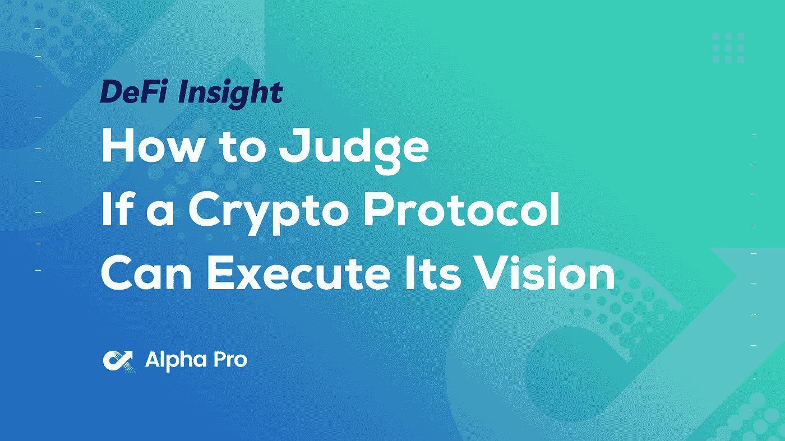
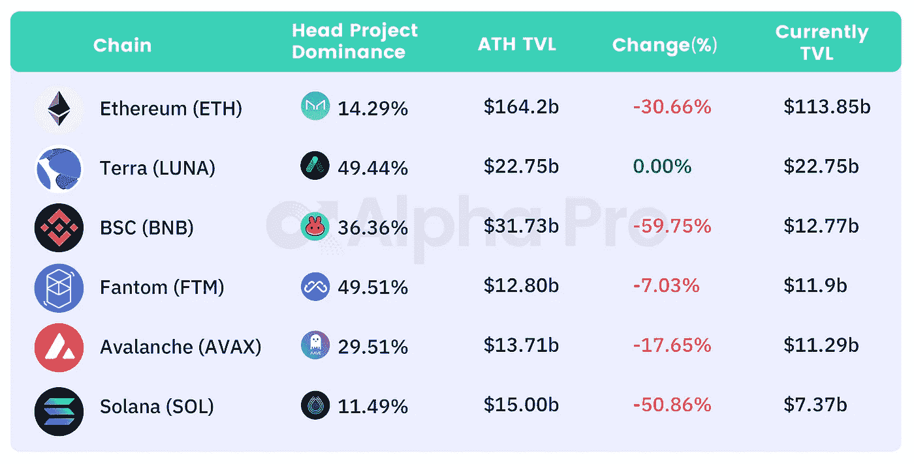
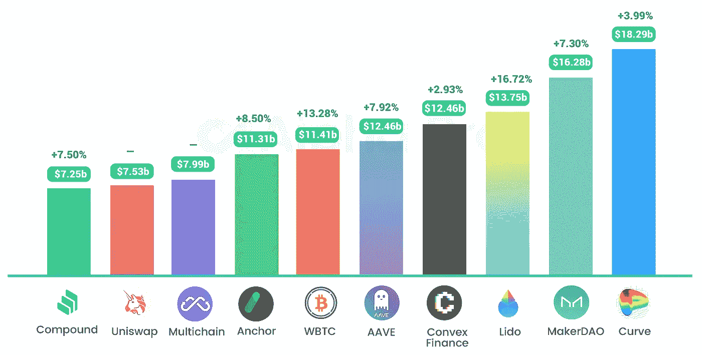
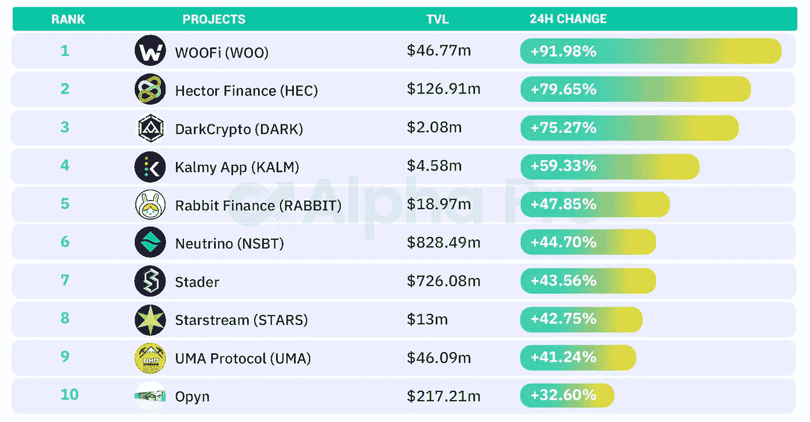

# DeFi Insight | UST 总供应量达 130 亿；多曼尼道推出雪崩蓝筹股指数

> 原文：<https://medium.com/coinmonks/defi-insight-total-supply-of-ust-reached-13-billion-domani-dao-launches-avalanche-blue-chip-665a2b6a4f?source=collection_archive---------37----------------------->

## 2022 年 3 月 1 日

*今日 DeFi 数据&由 DeFi Insight 为您带来的新闻。*

**宏观趋势:** SEC 执法总监:[加密货币](https://www.aliens.com/livenews/latest/sec-enforcement-director-cryptocurrency-violators-cant-get-special-exemptions)违规者无法获得特别豁免

**TVL 动向:**目前全网 [DeFi](https://defillama.com/chain/Solana) 总锁定量为 208 亿美元，24 小时增长 6.88%

**稳定:**[UST](https://terra.smartstake.io/)总供应量达到 130 亿，20 天内上涨近 15%

# 最新消息

## 定义

Terra 的市值上升至第七位，达到 333.2 亿美元

在过去的 7 天里，除了 Arbitrum(+12.7%)[之外，所有链上活动](https://twitter.com/nansen_ai/status/1498276507613282307)都有所放缓

灰度投资控股[362.5 亿美元](https://tokenview.com/en/Grayscale)

## 协议

顶点协议发布 testnet dApp

*[Ribbon Finance](https://twitter.com/ribbonfinance/status/1498301281181609987)宣布启动 veRBN 治理机制

自动机正在集成 [zkSync](https://twitter.com/zksync/status/1498246957617328128?s=20&t=DnJ9h42bfd1Q_fkP7qnm1Q) 以提供中间件

## 借出

在 [Aave 协议](https://twitter.com/StaniKulechov/status/1498241665546530818)中标注 ETH 存款

## 互换

FTX 将于 3 月 1 日 22:00 发射宇宙(ATOM)和地球(LUNA)卫星

奥林巴斯国债:面向流动性风险市场的零息债券

## 打桩

*[Soluna](/solunadao/solust-staking-is-live-65375c849710)宣布 solUST staking 开始，参与者将获得主播网络奖励

## 索引

多曼尼道推出[雪崩](https://twitter.com/DomaniProtocol/status/1498546318461276163?s=20&t=jxc-0H8mvlv4cdeh3VMcVw)蓝筹股指数

## 令牌组学

*@ alpha _ pls:为什么$PTP 拥有[最好的定义学](https://twitter.com/alpha_pls/status/1498272271282155521?s=21)

# 数据和分析

## TVL 和 ATH 排名前六的连锁酒店对比

## 最新 TVL 十大项目

## 过去 24 小时 TVL 变化的前 10 个项目

# 深潜

准时制(JIT) —一种新颖的 [AMM 协议](https://twitter.com/chainflip/status/1498331234132537344?s=21)设计，用于分散式交叉链交换

如何判断一个加密协议是否能执行它的设想

 [## 如何判断一个加密协议是否能执行它的设想

### “想法不会让你变得富有。思想的正确执行的确如此。”费利克斯·丹尼斯你的投资策略有一个弱点…

www.thedefiedge.com](https://www.thedefiedge.com/execution/) 

一个 **值得信赖的资源，为一切事物定义**

> 一场回合:
> 
> 分散金融(DeFi)指的是从传统的中央金融系统向区块链促成的点对点金融系统的转变。
> 
> DeFi Insight 是顶级 DeFi 和加密新闻和更新的来源。
> 
> 提供的信息应被视为发展新闻，而不是投资建议。

> 加入 Coinmonks [电报频道](https://t.me/coincodecap)和 [Youtube 频道](https://www.youtube.com/c/coinmonks/videos)了解加密交易和投资

# 另外，阅读

*   [硬币评论](https://coincodecap.com/coinloan-review)|【Crypto.com 评论】T21
*   [如何在加拿大购买加密货币？](https://coincodecap.com/how-to-buy-cryptocurrency-in-canada)
*   [无聊猿游艇俱乐部(BAYC)评论](https://coincodecap.com/bored-ape-yacht-club-bayc-review)
*   [5 款最佳加密交易终端](https://coincodecap.com/crypto-trading-terminals) | [最佳 DeFi 应用](https://coincodecap.com/best-defi-apps)
*   [最佳网上赌场](https://coincodecap.com/best-online-casinos) | [币安评论](/coinmonks/binance-review-ee10d3bf3b6e) | [BitMEX 评论](https://coincodecap.com/bitmex-review)
*   [麻雀交换评论](https://coincodecap.com/sparrow-exchange-review) | [纳什交换评论](https://coincodecap.com/nash-exchange-review)