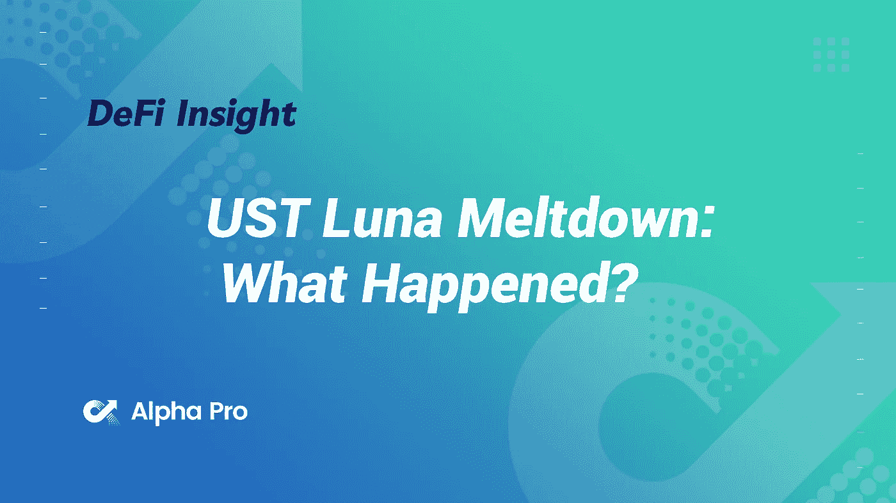
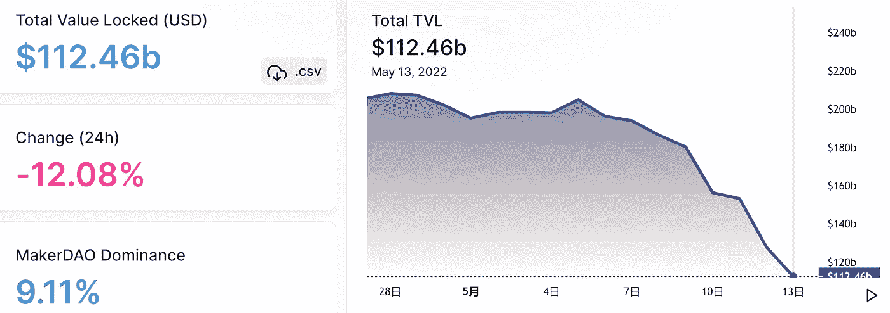
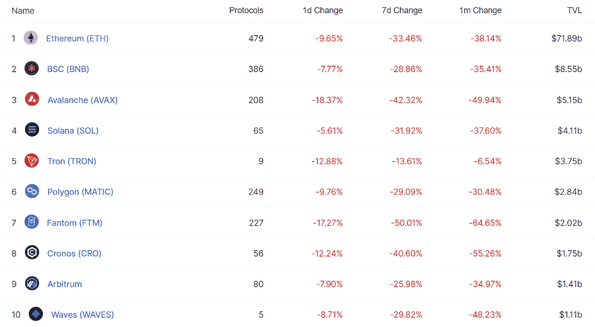
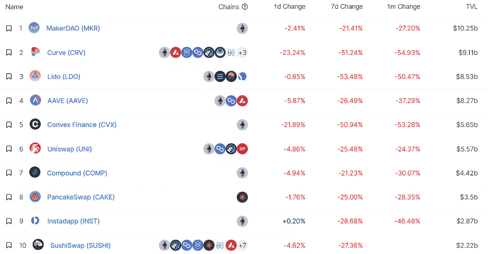
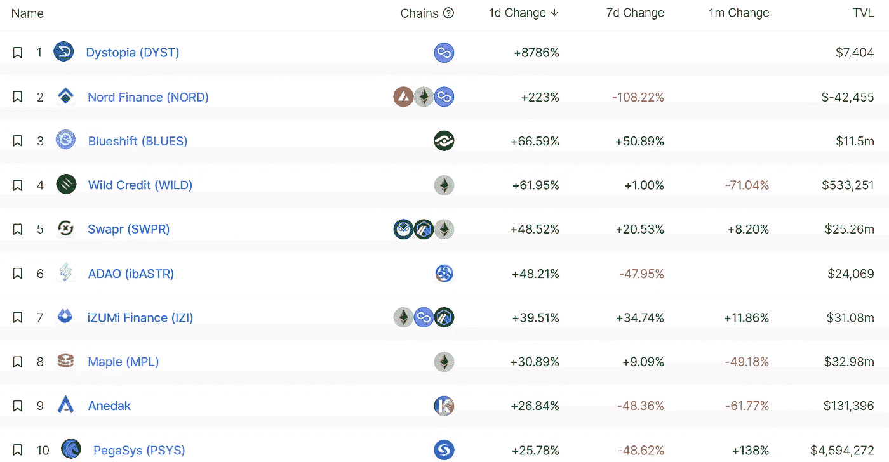
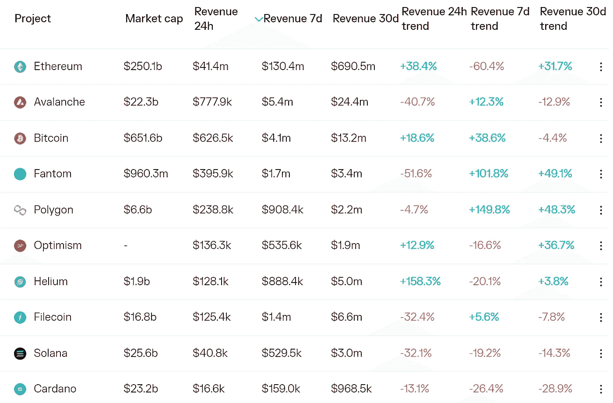
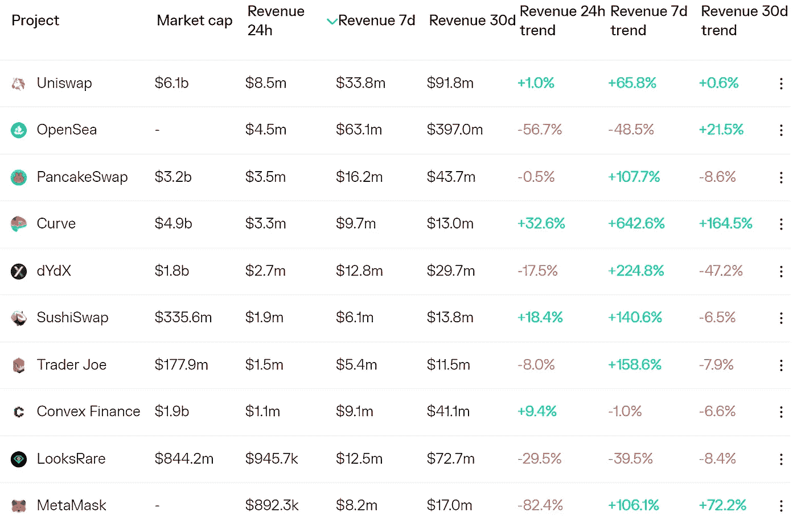
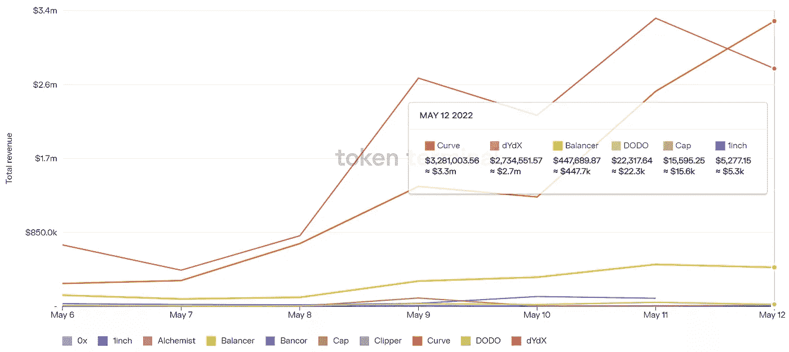
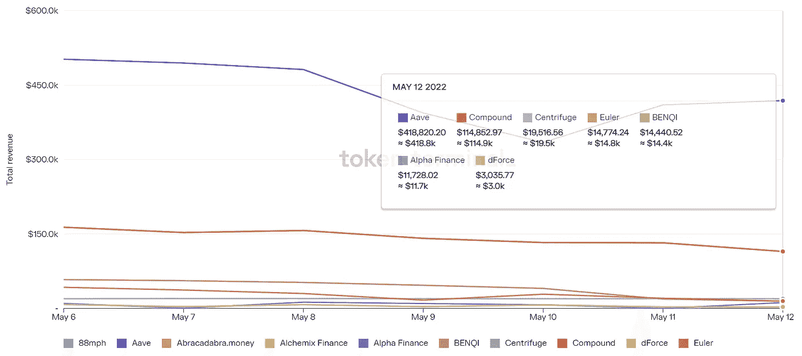

# UST 露娜崩溃:发生了什么？

> 原文：<https://medium.com/coinmonks/defi-insight-ust-luna-meltdown-what-happened-672a3ffb0df8?source=collection_archive---------39----------------------->

2022 年 5 月 13 日

*今日 DeFi 数据&由 DeFi Insight 为您带来的新闻。*

> *"* 我们正处于 crypto 历史上最大的崩溃之中。
> 
> UST 是第三大稳定币(非中央实体发行的最大稳定币)，在撰写本文时，其汇率为 0.35 美元。
> 
> 其铸币税标志 LUNA 的价值已经暴跌，从历史高点下跌 99.9%，价值超过 410 亿美元，这是历史上最大的单一资产财富毁灭事件之一。*@[来源](https://newsletter.banklesshq.com/p/ust-luna-meltdown-what-happened?utm_source=%2Finbox&utm_medium=reader2&s=r)*

# *最新消息*

## *外汇*

***/**巴西 XP 推出[数字资产交易平台](https://www.reuters.com/article/idUSL2N2X40XK)*

***丽都金融将部署[新的 stETH/wETH 资产池](https://twitter.com/LidoFinance/status/1524826418571534336)，奖励 100 万美元 LDO***

## ***稳定币***

***财政部长珍妮特·耶伦今天在 UST 崩溃之际讨论稳定货币***

*****[甘姆抱着](https://finance.yahoo.com/news/gam-holding-could-terras-white-220000404.html?guce_referrer=aHR0cHM6Ly93d3cuZ29vZ2xlLmNvbS5oay8&guce_referrer_sig=AQAAAH6hD9-6n7Zqm_GuE0t6xiKJ_FDUkraX5uwhEQNfWIVK1-w8wJ4Z9yn6R_rl5IHTJxejnFxOF_ZiHLMxpJv2VSA0jEuJ8lzwXKZS3Ft_rS)可能是特拉的白衣骑士*****

*****Terra 社区提议重新启动 Terra 并发行新的$LUNA*****

*****对冲基金 Arca 称其有偿付能力，尽管有破产传闻*****

*******币安暂时[暂停](https://www.binance.com/en/support/announcement/961f8f97cfa647afb572db4d2c4bce0c?ref=AZTKZ9XS&utm_source=BinanceTwitter&utm_medium=GlobalSocial&utm_campaign=GlobalSocial)在泰拉网上的存取款*******

## *******导数*******

*******野村证券开始向亚洲客户提供比特币衍生品*******

## *******|令牌*******

*********[hash flow](https://blog.hashflow.com/hashflow-tokenomics-update-may-2022-fbf17b888cf0)token omics 更新—2022 年 5 月*********

## *******钱包*******

*********蓝色工作室，势不可挡的域名推出[家庭加密钱包](https://www.coindesk.com/business/2022/05/12/blue-studios-unstoppable-domains-roll-out-family-crypto-wallets/)*********

*******购买或转让密码最简单的方式——比特币基地支付——现已对 web3 开发者开放*******

## *******空投*******

*******涂鸦者现在可以要求免费的涂鸦者*******

## *******资产管理*******

*********[富兰克林邓普顿](https://blockworks.co/franklin-templeton-exec-crypto-asset-class-has-thematic-tailwinds/)高管:加密资产类别有“主题顺风”*********

## *******政策与法规*******

*******高级官员说，全球密码监管机构即将成立*******

*******SEC 主席重申加密资产是证券的观点*******

## *******NFT*******

*********、**从食物链到[区块链](https://itsfingerlickingood.kfc.com.my/nft/)*******

*******Crypto.com 关于 [NFTs](https://www.altcoinbuzz.io/nft/crypto-com-research-report-on-nfts/) 的研究报告*******

## *******基金*******

*********泰佐斯·区块链的基金会启动[100 万美元基金](https://www.theartnewspaper.com/2022/05/12/tezos-foundation-launches-pound1m-nft-collection-fund-focused-on-black-and-asian-artists)来收集非洲和亚洲艺术家的非艺术作品*********

*******第六人风险投资公司正在为第二个加密基金筹集[1 . 45 亿美元](https://www.theblockcrypto.com/post/146332/6th-man-ventures-is-raising-145-million-for-a-second-crypto-fund)*******

*********token . io 募集4000 万美元在欧洲拓展基于开放银行的账户对账户支付*********

*******南森宣布 APY.vision 的种子轮*******

*******Soluna 从 Spring Lane Capital 筹集了 3500 万美元用于建立加密和机器学习的绿色数据中心*******

# *******数据和分析*******

## *******锁定的总价值(TVL)*******

*******目前全网 DeFi 总锁定量为 1124.6 亿美元，24 小时下降 12.08%。*******

**************

## *******TVL 评出的十大连锁酒店*******

**************

## *******|最新 TVL 十大项目*******

**************

## *******|过去 24 小时内 TVL 增长的前 10 个项目*******

**************

## *******协议收入*******

## *******|累计总收入最高的项目(24H)_ 区块链(L1)*******

**************

## *******|累计总收入最高的项目(24H) _Dapps (L2)*******

**************

## *******|前 10 大交易所的每日收入*******

**************

## *******|十大贷款协议的每日收入*******

**************

# *******深潜*******

*********[**卢娜**](https://cryptohayes.medium.com/luna-brothers-inc-712ec5abe199)T22【兄弟公司】*********

***** [## 卢纳兄弟公司。

### (下面表达的任何观点都是作者的个人观点，不应构成制定……

cryptohayes.medium.com](https://cryptohayes.medium.com/luna-brothers-inc-712ec5abe199) 

**致所有** [**蜻蜓**](/dragonfly-research/to-all-dragonfly-founders-and-friends-1a65e68093d4) **创始人和朋友**

 [## 致所有蜻蜓的创始人和朋友们

### 这是我们今天早上发给投资组合公司创始人和合伙人的一封信。我们认为它可能有用…

medium.com](/dragonfly-research/to-all-dragonfly-founders-and-friends-1a65e68093d4) 

**[**财富**](https://30000feet.substack.com/p/issue-65-wealth-distribution?s=r) **分配****

** [## 问题 65:财富分配

### 每周四，福塔基金会团队都会在 Zoom 上聚会，共度虚拟快乐时光。我仍然没有遇到一些…

30000feet.substack.com](https://30000feet.substack.com/p/issue-65-wealth-distribution?s=r)** 

# **报告**

****、盗窃、洗钱和** [**NFT 市场操纵**](https://blog.chainalysis.com/reports/chainalysis-web3-report-preview-safety-compliance-defi/) **强调安全和合规在网络中的重要性 3**_ chain analysis**

> **任何能给整个世界带来好处的新技术也有可能被坏人滥用来谋取私利。与该技术相关的行业运营商需要努力消除这种滥用——有时在公共部门的帮助下——以便新用户可以放心采用该技术，行业继续发展。如果他们成功做到这一点，随着时间的推移，我们希望看到新技术的非法使用在总使用中所占的份额越来越小。这种积极的进展正是我们在加密货币方面看到的。**

****Crypto**[**Hell**](https://members.delphidigital.io/reports/crypto-hell-week)**Week**_ Delphi digital**

****[**层**](https://www.theblockresearch.com/layer-by-layer-issue-30-terra-146660) **逐层发布 30: Terra** _theblockresearch****

******[**每周**](https://tokenterminal.substack.com/p/weekly-fundamentals-9c8?utm_source=%2Finbox&utm_medium=reader2&s=r) **基本面** _tokenterminal******

******DappRadar x**[**BGA Games**](https://dappradar.com/blog/dappradar-x-bga-games-report-4-blockchain-games-continue-to-ascend-despite-collapsing-markets)**报告#4 —尽管市场崩溃，区块链游戏仍在继续上升** _dappradar****

******关于:******

****DeFi Insight 是顶级 DeFi 和加密新闻和更新的来源。****

******https://twitter.com/AlphaPro_io**❤****

********❤RSS:**[**https://medium.com/feed/@alphapro.project**](https://medium.com/feed/@alphapro.project)******

****提供的信息应被视为发展新闻，而不是投资建议。****

> ****加入 Coinmonks [电报频道](https://t.me/coincodecap)和 [Youtube 频道](https://www.youtube.com/c/coinmonks/videos)了解加密交易和投资****

# ****另外，阅读****

*   ****[如何在 FTX 交易所交易期货](https://coincodecap.com/ftx-futures-trading) | [OKEx vs 币安](https://coincodecap.com/okex-vs-binance)****
*   ****[CoinLoan 评论](https://coincodecap.com/coinloan-review) | [YouHodler 评论](/coinmonks/youhodler-4-easy-ways-to-make-money-98969b9689f2) | [BlockFi 评论](https://coincodecap.com/blockfi-review)****
*   ****[XT.COM 评论](https://coincodecap.com/profittradingapp-for-binance)币安评论 |****
*   ****[SmithBot 评论](https://coincodecap.com/smithbot-review) | [4 款最佳免费开源交易机器人](https://coincodecap.com/free-open-source-trading-bots)****
*   ****[比特币基地僵尸程序](/coinmonks/coinbase-bots-ac6359e897f3) | [AscendEX 审查](/coinmonks/ascendex-review-53e829cf75fa) | [OKEx 交易僵尸程序](/coinmonks/okex-trading-bots-234920f61e60)****
*   ****[如何在印度购买比特币？](/coinmonks/buy-bitcoin-in-india-feb50ddfef94) | [瓦济克斯评论](/coinmonks/wazirx-review-5c811b074f5b)*********