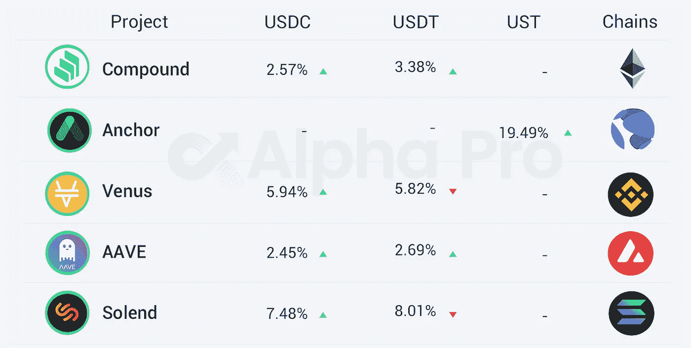

# DeFi Insight |V 神发文支持比特币最大化主义

> 原文：<https://medium.com/coinmonks/defi-insight-v-god-issued-a-document-supporting-bitcoin-maximalism-bfd1130a4f08?source=collection_archive---------26----------------------->

## 2022 年 4 月 2 日

*今日 DeFi 数据&由 DeFi Insight 为您带来的新闻。*

> 维塔利克·布特林(Vitalik Buterin)发表文章《为比特币最大化辩护》，支持比特币最大化。他说，我们生活在一个危险的世界，保护自由是一件严肃的事情；在其核心，区块链是一种安全技术，从根本上保护人们，并帮助他们在这样一个不友好的世界生存。比特币有两个关键要素可以出色地完成这项任务:一个坚实且可防御的技术栈(1 MB 块大小，2100 万，以及简单的 Satoshi PoW 共识机制)；可靠和安全的文化(不妥协，坚定的最大化文化)。[**来源**](https://vitalik.ca/general/2022/04/01/maximalist.html)

# 最新消息

## 定义

BitMEX 创始人亚瑟·海斯:到今年，ETH 价格将超过 1 万美元

@tedcruz 提出立法禁止美联储直接向个人发行中央银行数字货币(CBDC)

印度尼西亚将从 5 月起对加密资产征收增值税和所得税

财政部称，制裁促使俄罗斯[创建自己的加密市场](https://news.bitcoin.com/sanctions-motivate-russia-to-create-own-crypto-market-infrastructure-finance-ministry-says/)基础设施

币安聘请资深[微软高管担任首席技术官](https://decrypt.co/96595/binance-microsoft-wad)

## 贷款

**、** DeFi 借贷协议 [Alchemix](https://twitter.com/AlchemixFi/status/1509882647996215306) 增加 wstETH 和 rETH 作为 alETH 的抵押品

## 桥梁

**密码桥[虫洞](https://www.theblockcrypto.com/post/140100/crypto-bridge-wormhole-seeks-2-5-billion-price-tag-in-private-token-sale)寻求 25 亿美元的私人代币销售价格**

****[layer zero Labs](/layerzero-official/layerzero-security-update-april-2022-4c27a22380b4)与 Immunefi 合作推出安全漏洞赏金计划，奖金高达 1500 万美元****

## ****打桩****

******[浪人:](https://twitter.com/Ronin_Network/status/1509623818263965696)6 亿美元漏洞中的验证器已被替换，新的验证器将被添加******

********DeFi 协议 [StaFi](/stafi/2022-q2-roadmap-building-stafi-open-infrastructure-1b98fa8a3a19) 发布 Q2 路线图，将构建开放基础设施********

********[Rocket Pool](https://twitter.com/superphiz/status/1510078023940329475)，以太坊 2.0 流动性赌注协议，有 1000 个验证节点********

## ******保险******

********雪崩生态保险协议 [Degis](https://twitter.com/ProjectDegis/status/1509803659198087168) 推出 Mainnet********

## ******稳定币******

********[Terra 社区](https://agora.terra.money/t/ust-goes-interchain-the-4pool-and-redacted-cartel/5648)新提案提出 4pool 曲线池，扩大 UST 在以太坊和 EVM 的使用********

## ******TVL******

********[丝带金融](https://twitter.com/ribbonfinance/status/1509934992075464726) TVL 突破 3 亿美元，创历史新高********

## ******|令牌******

******随着价格暴跌 4.4%，Ripple 从托管账户中解冻了超过 10 亿 XRP，价值 8 亿美元******

## ******|警报******

********[幻影](https://twitter.com/PhantasmaChain/status/1510168534453731337?s=20&t=Gnnyfl4fD_KrnqQ_bInT0w)被黑，团队将部署新的代币契约********

## ******NFT******

******STEPN 从 NFT 市场交易和 Q1 2022 年奥运会特许权使用费中获得了 198，635.62 索尔(26，815，807.35 美元)的利润******

********NFT 音乐平台 [Pianity](https://twitter.com/pianitynft/status/1509922122805747720?s=20&t=rdCNoN4978ljfzKDTIeZUA) 将于 4 月 5 日开放二级市场********

********NFT 借贷平台 [AFKDAO](https://twitter.com/AFK_DAO/status/1509944932152545283?s=20&t=lxUGA3KdqlDqaVdZY22HpQ) 完成种子轮融资********

********[矮胖企鹅](https://opensea.io/collection/pudgypenguins?tab=activity)地板价涨到 2.14ETH，球队可能被卢卡·内茨收购********

********Twitch 联合创始人的游戏 NFT 市场[募集 3500 万美元](https://www.coindesk.com/business/2022/04/01/twitch-co-founders-gaming-nft-marketplace-raises-35m/)********

******索拉纳链上的 NFT 交易总额超过 15 亿美元******

********[OpenSea](https://www.theblockcrypto.com/linked/140115/opensea-rolls-out-credit-card-payments-for-nfts?utm_source=twitter&utm_medium=social)推出非金融交易的信用卡支付********

## ******基金******

******货币化的迷因:丹麦银行筹集了 420 万美元******

******芝加哥商业交易所正在考虑推出类似 SOL 和 ADA 这样的期货合约******

******高盛将于 2022 年向 Q2 的高净值客户推出加密服务******

********SEC 拒绝[方舟 21 股票](https://www.coindesk.com/business/2022/04/01/sec-rejects-spot-bitcoin-etf-application-from-ark-21shares/)的现货比特币 ETF 申请********

# ******数据和分析******

## ******TVL 增长排名前 10 的连锁店******

************

## ******最新 TVL 十大项目******

************

## ******过去 24 小时 TVL 变化的前 10 个项目******

************

## ******德克斯 TVL 排名******

******指数中涨幅最大的是[astro port](https://defillama.com/protocol/astroport)T34 上涨 11.40 **%********

********

## ****APY DeFi 贷款公司****

*****USDC:最高贷款利率:* [*索伦德*](https://solend.fi/dashboard)*7.48% APY*****

*****USDT:最高贷款利率:* [*索伦德*](https://solend.fi/dashboard)*8.01% APY*****

********

# ****深潜****

******[**德菲之险**](/intotheblock/a-primer-on-defis-risks-f3fdd1f55341)******

**** [## DeFi 风险入门

### 针对加密风险的实用指南，基于黑客攻击、恶意攻击和经济事件造成的 50 多亿美元损失

medium.com](/intotheblock/a-primer-on-defis-risks-f3fdd1f55341) 

**[**分析 L1s**](https://jumpcrypto.com/a-framework-for-analyzing-l1s/) 的框架**

** [## 一个分析 L1s 的框架

### 在上一篇文章[https://jump crypto . com/peeking-under-the-hood/]中，我们介绍了……

jumpcrypto.com](https://jumpcrypto.com/a-framework-for-analyzing-l1s/) 

**房子钱——你为什么要冒太多的风险******在密码****

** [## 房子的钱-为什么你在密码方面冒太大的风险

### 朋友们好，我叫杰克·瑞恩斯。今天，我正在为 Route2FI 的时事通讯写一篇客座博文！我也写博客…

www.getrevue.co](https://www.getrevue.co/profile/route2fi/issues/house-money-why-you-take-too-much-risk-in-crypto-1104946) 

**[**跨链**](https://twitter.com/pseudotheos/status/1509530981581000705) **是技术上的死路****

****[**stark net**](https://twitter.com/OmarOnChain/status/1509520050499330050)**深潜******

******三月德尔福** [**调研集锦**](https://twitter.com/Delphi_Digital/status/1509992759024881664)****

******12**[**DeFi Edge**](https://twitter.com/thedefiedge/status/1509932102799687684)**螺纹三月******** 

# ****报告****

******《数字进军:加密交易所交易量、未平仓合约和矿商收入一览 _** theblockresearch****

> ****调整后的总环比增长 0.9%，至 5940 亿美元。三月份总共烧毁了 118627 个以太币，相当于 3.46 亿美元。
> 集中交易所现货交易量增长 8%，达到 7445 亿美元。
> 比特币期货交易量增长 7.4%，至 1.29 万亿美元。****

******【Bancor v3:展望未来 _** [thetie](https://research.thetie.io/bancor-v3/)****

******·复制做市商:无甲骨文 DeFi__** [thetie](https://research.thetie.io/rmm/)****

****一场 **回合:******

****DeFi Insight 是顶级 DeFi 和加密新闻和更新的来源。****

******https://twitter.com/AlphaPro_io 推特:******

********❤RSS:**[**https://medium.com/feed/@alphapro.project**](https://medium.com/feed/@alphapro.project)******

****提供的信息应被视为发展新闻，而不是投资建议。****

> ****加入 Coinmonks [电报频道](https://t.me/coincodecap)和 [Youtube 频道](https://www.youtube.com/c/coinmonks/videos)了解加密交易和投资****

# ****另外，阅读****

*   ****[3 商业评论](/coinmonks/3commas-review-an-excellent-crypto-trading-bot-2020-1313a58bec92) | [Pionex 评论](https://coincodecap.com/pionex-review-exchange-with-crypto-trading-bot) | [Coinrule 评论](/coinmonks/coinrule-review-2021-a-beginner-friendly-crypto-trading-bot-daf0504848ba)****
*   ****[莱杰 vs n rave](/coinmonks/ledger-vs-ngrave-zero-7e40f0c1d694)|[莱杰 nano s vs x](/coinmonks/ledger-nano-s-vs-x-battery-hardware-price-storage-59a6663fe3b0) | [币安评论](/coinmonks/binance-review-ee10d3bf3b6e)****
*   ****[Bybit Exchange 评论](/coinmonks/bybit-exchange-review-dbd570019b71) | [Bityard 评论](https://coincodecap.com/bityard-reivew) | [Jet-Bot 评论](https://coincodecap.com/jet-bot-review)****
*   ****[3 commas vs crypto hopper](/coinmonks/3commas-vs-pionex-vs-cryptohopper-best-crypto-bot-6a98d2baa203)|[赚取加密利息](/coinmonks/earn-crypto-interest-b10b810fdda3)****
*   ****最好的比特币[硬件钱包](/coinmonks/hardware-wallets-dfa1211730c6) | [BitBox02 回顾](/coinmonks/bitbox02-review-your-swiss-bitcoin-hardware-wallet-c36c88fff29)**********