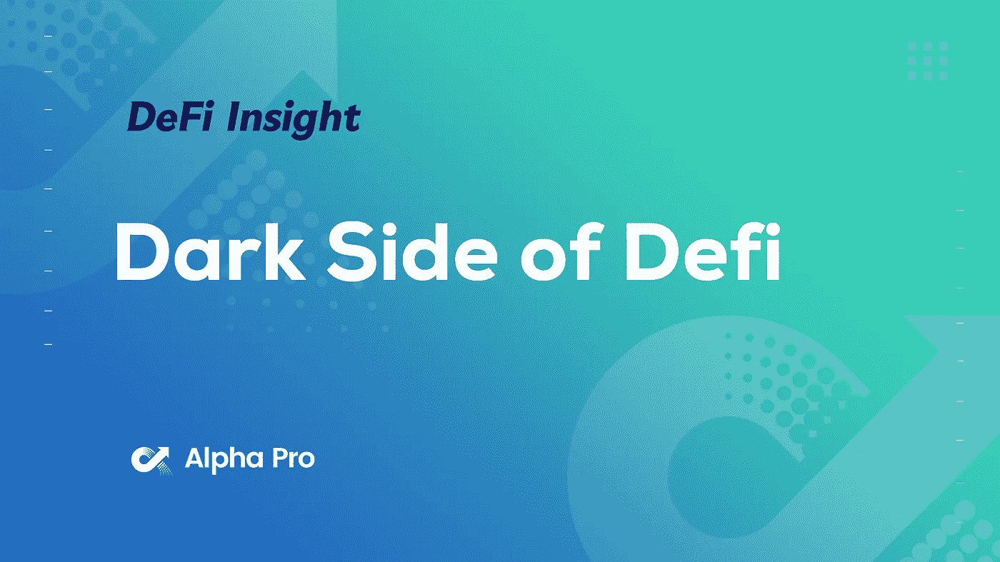
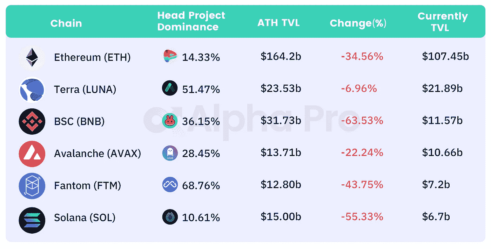
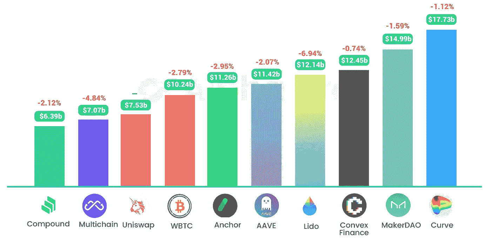
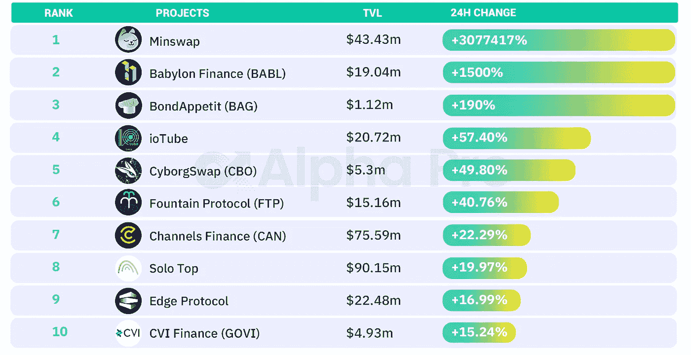
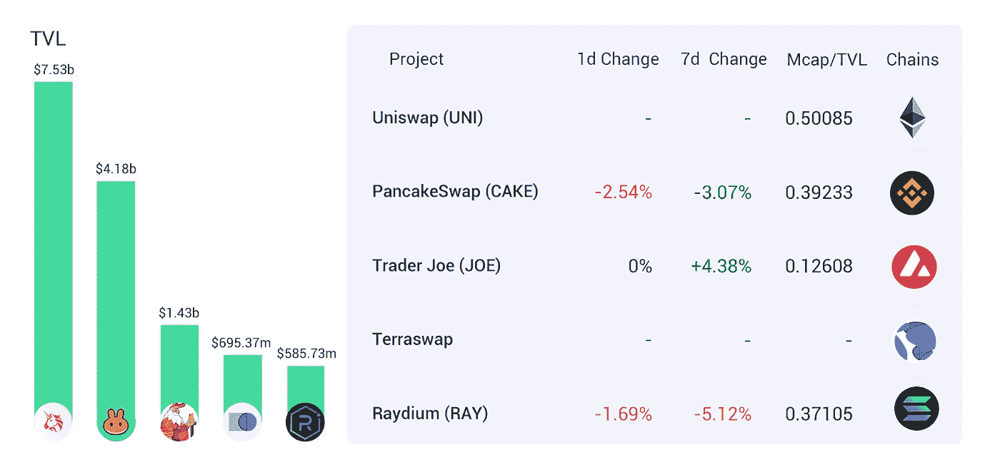
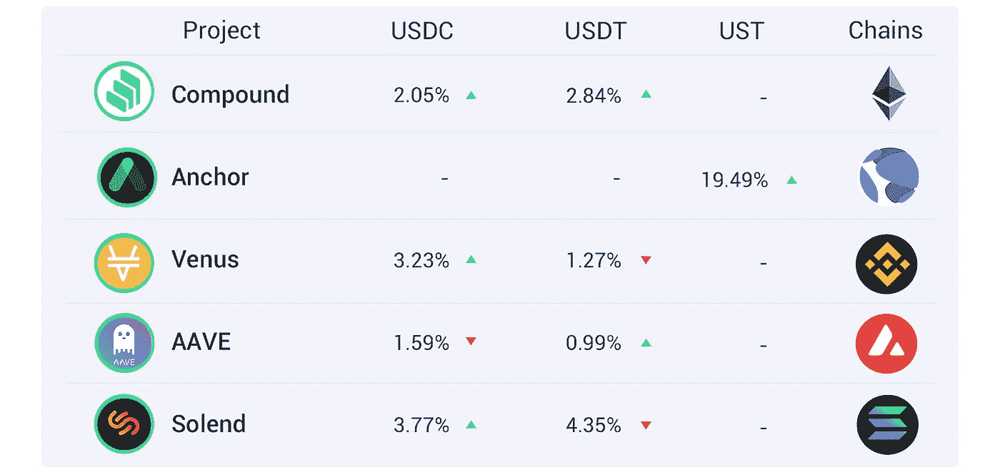
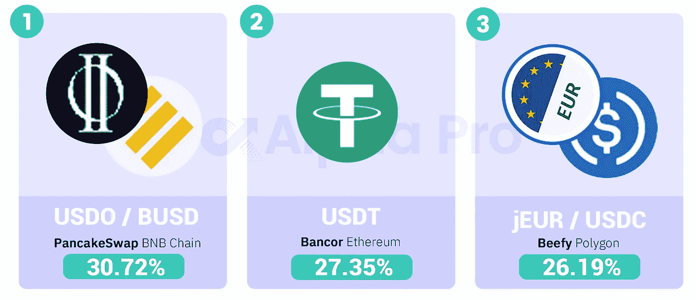

# DeFi Insight |拱顶 V2:DeFi 的阴暗面；受 AC 退出的影响，Fantom 目前的 TVL 为 71.8 亿美元

> 原文：<https://medium.com/coinmonks/defi-insight-vaults-v2-dark-side-of-defi-affected-by-the-withdrawal-of-ac-the-current-tvl-on-8edc30f2a9de?source=collection_archive---------47----------------------->

## 2022 年 3 月 7 日

*今日 DeFi 数据&由 DeFi Insight 为您带来的新闻。*

**宏观趋势:**比特币基地加强遵守[全球制裁](https://blog.coinbase.com/using-crypto-tech-to-promote-sanctions-compliance-8a17b1dabd68)

**TVL 动向:**目前全网 [DeFi](https://defillama.com/) 总锁定量为 192.69 亿美元，24 小时内下降 3.10%

稳定:FTX 现在支持土著 UST

# 最新消息

## 定义

沃顿金融教授:美联储需要采取行动捍卫美元

## 协议

*[Fantom 基金会](https://twitter.com/michaelfkong/status/1500654223712833543) : AC 不是核心开发者，Fantom 的发展不会受到影响

受 AC 退出的影响， [Fantom](https://defillama.com/chain/Fantom) 目前的 TVL 为 71.8 亿美元

Evmos 宣布网络升级失败，网站面临 48 小时停机

在 Arbitrum 上发布 KyberSwap

*[绕组](https://forcedao.medium.com/winding-down-and-redistribution-8ed28220101b)放下并重新分配

## 稳定币

雪崩链上 [USDC 的发行超过阿尔格兰德，超过 3.67 亿美元](https://usdc.cool/)

## 互换

*[Ribbon Finance](https://twitter.com/ribbonfinance/status/1500734049660272640)推出新的流动性挖掘，每周将释放 25 万 RBN

## 贷款

火星协议 mainnet 即将启动

## 打桩

*[OXY 打桩程序](https://oxygenprotocol.medium.com/oxy-staking-programme-coming-22-04-2022-f443f1450353)。即将于 2022 年 4 月 22 日推出

## 空投

克洛诺斯金融将向 Evmos 社区和 JUNO、OSMO、ATOM stakers 发放 CRN 空投物资

# 数据和分析

## TVL 和 ATH 排名前六的连锁酒店对比

## 最新 TVL 十大项目

## 过去 24 小时 TVL 变化的前 10 个项目

## 德克斯 TVL 排名

*DEX 跌幅最大的是* [PancakeSwap](https://defillama.com/protocol/pancakeswap) *，损失 2.54%*

## APY DeFi 贷款公司

*USDC:最高贷款人:索伦德，利率为 3.77% APY*

*USDT:最高贷款人:索伦德，利率为 4.35% APY*

## 稳定的 APY

# 深潜

渴望:屈服的背后，渴望白金专辑的故事[《拱顶 V2:迪菲的阴暗面》](https://twitter.com/storming0x/status/1500519425514029056)

*[Vesta Finance](https://richmorecapital.substack.com/p/vesta-finance-capital-efficiency?s=w)—Arbitrum 上的资本效率

完整的 [GMX](https://rileygmi.substack.com/p/gmx?utm_source=twitter&s=r) 研究报告

彭博情报:加密展望
[比特币&债券与原油](https://assets.bbhub.io/professional/sites/10/1666154_BloombergCryptoOutlookMarch2022.pdf)

一个

> 一场回合:
> 
> DeFi Insight 是顶级 DeFi 和加密新闻和更新的来源。
> 
> 提供的信息应被视为发展新闻，而不是投资建议。