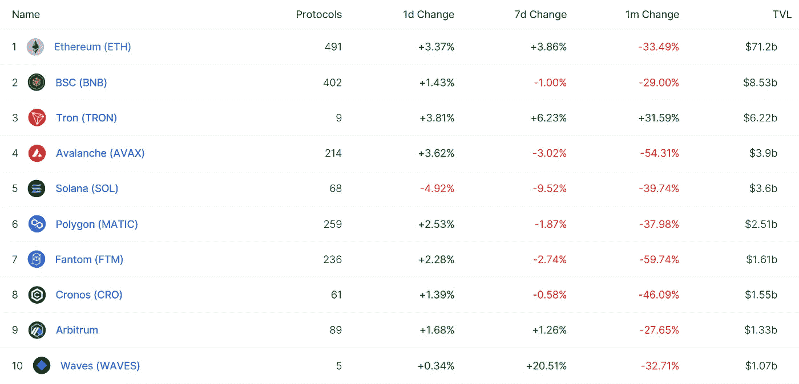

# 维塔利克·布特林反对禁止战俘

> 原文：<https://medium.com/coinmonks/defi-insight-vitalik-buterin-opposes-banning-pow-62fc829ab08d?source=collection_archive---------34----------------------->

2022 年 6 月 6 日

*今日 DeFi 数据&由 DeFi Insight 为您带来的新闻*

> *最终我同意这一点(也就是我反对取缔 PoW)。政府挑选哪些特定的应用是可以使用电力的，这是一个坏主意。更好的办法是实施碳定价，用部分收入来补偿低收入用户。*“@*[*来源*](https://twitter.com/VitalikButerin/status/1533104260916752384)*

# *最新消息*

## *外汇*

*比特币基地通过撤销工作邀请来暗算有希望的人*

***熊市没有阻止[币安](https://www.cryptoglobe.com/latest/2022/06/bear-market-not-stopping-binance-from-investing-500m-into-web3-startups/?utm_source=blockworks-research)向“网络 3”初创公司投资 5 亿美元***

## ***支付***

***迪拜的零售巨头马吉德·阿尔·富塔伊姆与币安合作，在 29 家购物中心和 13 家酒店接受加密***

## ***提议***

*****、** DeFi 协议 [dForce](https://tokeninsight.com/en/news/defi-protocol-dforce-proposes-to-distribute-op-as-incentive) 提议发放$OP 作为奖励***

## ***|警报***

*****[逮捕](https://techcrunch.com/2022/06/05/the-arrest-heard-round-the-crypto-world/)听说‘绕过秘密世界’*****

*******、**移动赚取游戏步骤被 DDOS 攻击[击中](https://decrypt.co/102091/move-to-earn-game-stepn-hit-with-ddos-attacks-again)——再次*****

## *****政策与法规*****

*****印度的特拉投资者损失惨重。现在他们面临着税务人员*****

*******秘密矿工的能源、气候成本引来白宫[的审查](https://news.bloomberglaw.com/banking-law/crypto-miners-energy-climate-costs-draw-white-house-scrutiny)*******

*******纽约州通过法案限制以碳为燃料的地下采矿作业*******

*********[乌干达](https://cointelegraph.com/news/ugandan-central-bank-u-turns-on-crypto-welcoming-firms-to-regulatory-sandbox)中央银行转变态度欢迎公司进入监管沙箱*********

## *******NFT*******

*********[无聊的猿类](https://www.cryptoknowmics.com/news/bored-apes-co-founder-criticizes-discord-after-server-hack?utm_source=rss&utm_medium=rss&utm_campaign=bored-apes-co-founder-criticizes-discord-after-server-hack)联合创始人批评服务器被黑后的不和*********

*******跨性别青少年在 NFT 的销售额突破 5000 万美元大关*******

*********[nft2 metaverse](https://cryptonews.com/news/nft2metaverse-opensea-of-metaverse.htm):元宇宙的“开放海”*********

## *******基金*******

*********DeFi 社区集会支持 PoolTogether 达到[140 万美元的 NFT 国防拨款目标](https://cointelegraph.com/news/defi-community-rallies-behind-pooltogether-to-hit-1-4m-nft-defense-funding-target?utm_source=blockworks-research)*********

## *******观点*******

*******投资者是否应该为下一轮抛售做好准备*******

# *******数据和分析*******

## *******锁定的总价值(TVL)*******

*******目前全网 DeFi 总锁定量为 1099.6 亿美元，24 小时增长 2.71%。*******

**************

## *******TVL 评出的十大连锁酒店*******

**************

## *******|最新 TVL 十大项目*******

**************

## *******|过去 24 小时内 TVL 增长的前 10 个项目*******

**************

## *******协议收入*******

## *******|累计总收入最高的项目(24H)_ 区块链(L1)*******

**************

## *******|累计总收入最高的项目(24H) _Dapps (L2)*******

**************

## *******|前 10 大交易所的每日收入*******

**************

## *******|十大贷款协议的每日收入*******

**************

# *******深潜*******

*********[**BAYC insta gram Hack**](https://www.trmlabs.com/post/bayc-instagram-hack-possible-nft-scam-as-a-service-operation)**:可能的 NFT 骗局即服务运营？***********

***** [## BAYC Instagram Hack:可能的 NFT 骗局即服务操作？| TRM 洞察

### 2022 年 6 月 2 日，由标志性的无聊猿游艇俱乐部(BAYC)创始人宇迦实验室推出的新元宇宙“彼岸造币厂”

www.trmlabs.com](https://www.trmlabs.com/post/bayc-instagram-hack-possible-nft-scam-as-a-service-operation) 

**[**好的密码，坏的密码**](https://theknower.substack.com/p/good-crypto-bad-crypto?utm_source=%2Finbox&utm_medium=reader2&s=r)**

** [## 好密码，坏密码

### 我回来了。我想我应该写点东西，讨论一下协议粘性，因为我们正处于熊市。你会经常跑…

theknower.substack.com](https://theknower.substack.com/p/good-crypto-bad-crypto?utm_source=%2Finbox&utm_medium=reader2&s=r) 

**是不是一个** [**庞氏**](https://crypto.nateliason.com/p/ponzi?utm_source=%2Finbox&utm_medium=reader2&s=r) **？**

 [## 是庞氏骗局吗？

### crypto 构建了什么有用的东西吗？或者只是无数的庞氏骗局，有老练的骗子在偷钱…

crypto.nateliason.com](https://crypto.nateliason.com/p/ponzi?utm_source=%2Finbox&utm_medium=reader2&s=r) 

**[**比特币挖矿的直接成本**](https://www.theblockresearch.com/rising-direct-cost-bitcoin-mining-149369) **上涨****

** [## 比特币挖矿直接成本上升的内幕

### 2022 年 6 月 2 日，美国东部时间中午 12:42 快速拍摄由于网络的快速增长和不断变化的宏观经济条件，我们…

www.theblockresearch.com](https://www.theblockresearch.com/rising-direct-cost-bitcoin-mining-149369)** 

# **报告**

****[**去风险定义**](https://research.thetie.io/systemic-risk-in-defi/) **:分析分散系统中的系统性风险** _thetie****

> ****避免金融灾难没有放之四海而皆准的方法。****
> 
> ****在一个不可预测的社会中，系统性风险只能得到部分处理。经济条件、技术和人类行为都会随着时间而变化，因此对抗系统风险的方法也必须保持可变。这种发展不一定会导致更有效和更稳定的状态，因为它不断受到创新、监管行动、参与金融市场的人的思维模式和行为变化的影响。传统金融和分散金融都是如此。****

******[**ar weave 更新**](https://members.delphidigital.io/reports/arweave-update-a-maturing-storage-solution-in-web3)**:web 3**_ Delphi digital 中一个成熟的存储解决方案******

******[**分析**](https://www.theblockresearch.com/an-analysis-of-crypto-equity-etfs-148448) **的加密股票 ETF**_ the block research******

> ****加入 Coinmonks [Telegram group](https://t.me/joinchat/Trz8jaxd6xEsBI4p) 并了解加密交易和投资****

******关于:******

****DeFi Insight 是顶级 DeFi 和加密新闻和更新的来源。****

******https://twitter.com/AlphaPro_io**❤****

********❤RSS:**[**https://medium.com/feed/@alphapro.project**](https://medium.com/feed/@alphapro.project)******

****提供的信息应被视为发展新闻，而不是投资建议。***********