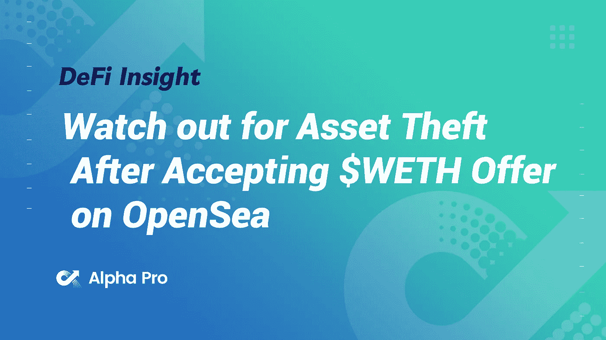
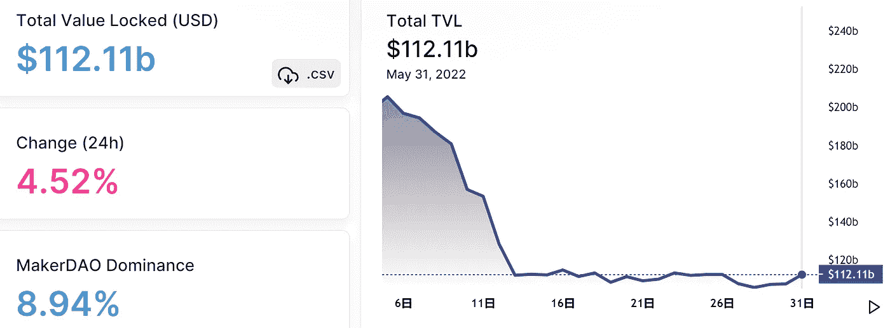
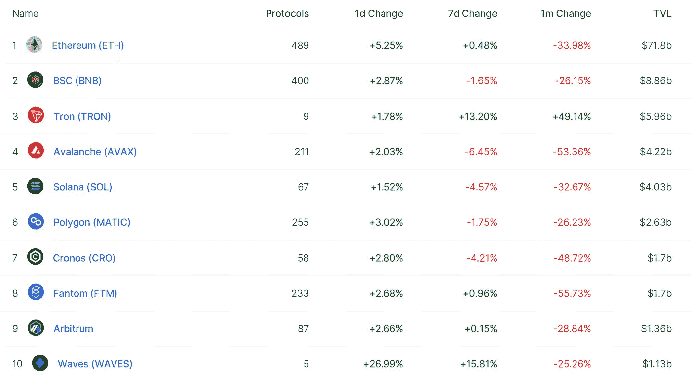
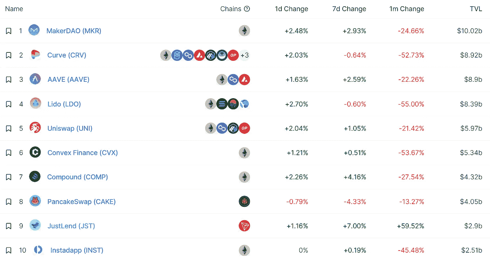
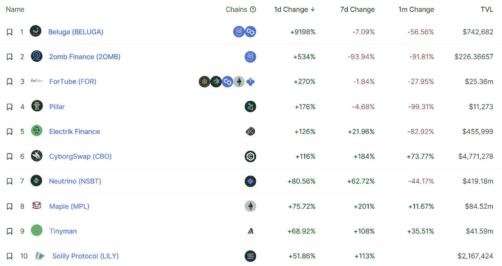
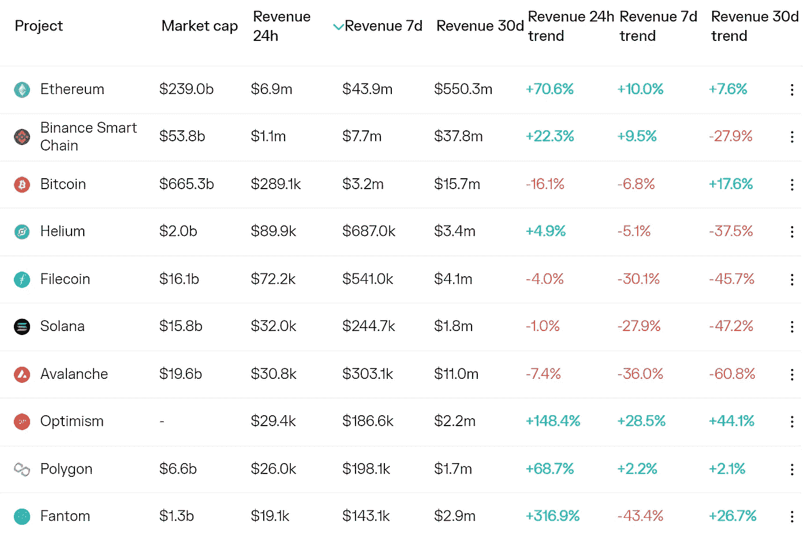
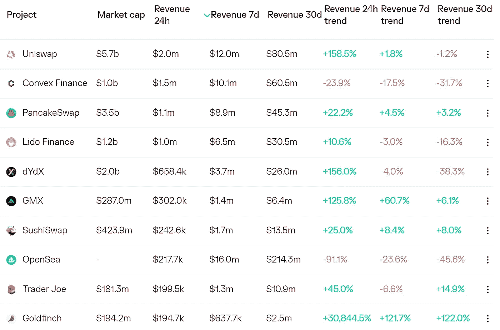
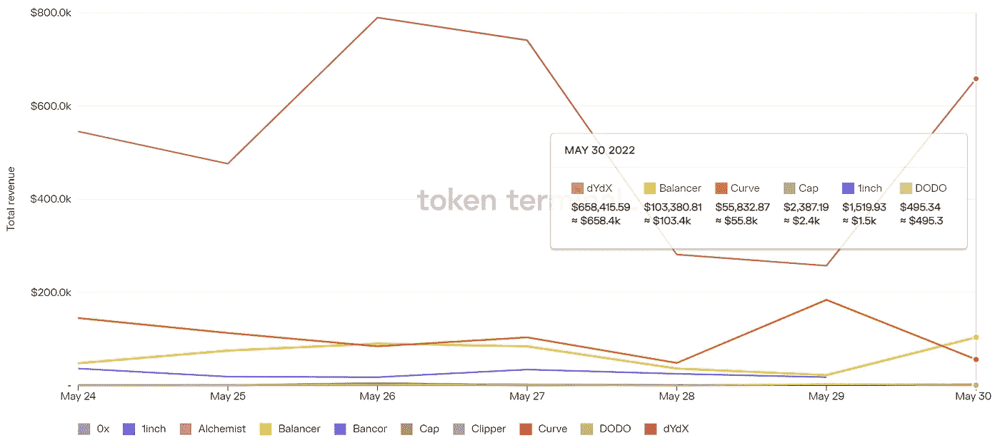
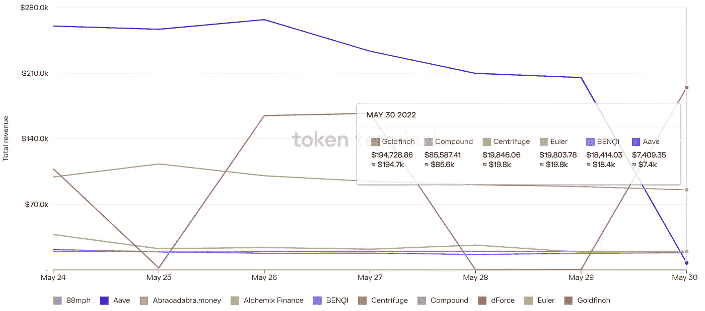

# DeFi Insight |在 OpenSea 上接受$WETH 报价后，小心资产被盗

> 原文：<https://medium.com/coinmonks/defi-insight-watch-out-for-asset-theft-after-accepting-weth-offer-on-opensea-98cd6ff6d9fb?source=collection_archive---------33----------------------->

2022 年 5 月 31 日

*今日 DeFi 数据&由 DeFi Insight 为您带来的新闻*

> *"* 据报道，黑客将空投一系列未知的 NFT，然后发送 1-2 美元的报价，诱骗用户接受报价。一旦用户完成交易，黑客就能够控制用户钱包中的资产。攻击的确切原因尚不清楚，可能是 OpenSea 公开代码后发现的漏洞。*“@*[*来源*](https://twitter.com/0xfoobar/status/1531397484840374285?s=20&t=KmE5wf5amPBYz5ejapPMVg)

# 最新消息

## 贷款

**/**贷款协议[枫叶金融](https://app.maple.finance/#/xmpl)推出$MPL 赌注

## 外汇

**[l 银行交易所](https://bitcoinist.com/lbank-exchange-will-list-fuji-fjt-on-june-1-2022/)将于 2022 年 6 月 1 日让富士(FJT)上市**

## **稳定币**

**随着投资者纷纷退出，跆拳道复活的 [Luna 2.0](https://fortune.com/2022/05/30/do-kwon-luna-2-airdrop-plunges/) token 首次亮相就暴跌**

****、**、[镜像协议](https://cryptobriefing.com/mirror-protocol-exploited-again/)目前正遭受攻击**

## **交叉链**

****跨链桥[星门](https://twitter.com/StargateFinance/status/1531397505904037888?s=20&t=NfbWlO0vAtK2eUupZ81uOg)启动天然气输送功能****

## ****第二层****

******[不可变 X](https://dappradar.com/blog/immutable-x-now-supports-metamask-mobile-app) 现在支持 MetaMask 手机 App******

******流行的以太坊 DeFi 管理应用程序扩展到 Arbitrum 和乐观******

## ******测试网******

********[Ropsten](https://blog.ethereum.org/2022/05/30/ropsten-merge-announcement/)合并公告********

## ******支付******

********[起草人](https://ambcrypto.com/draftkings-puts-out-plan-to-to-accept-crypto-payments-in-the-future/?utm_source=blockworks-research)提出未来接受加密支付的计划********

## ******鲸鱼******

********【39.1 亿美元[比特币巨鲸](https://dailyhodl.com/2022/05/31/3910000000-bitcoin-whale-enters-massive-btc-accumulation-mode-amid-crypto-bounce/)在加密反弹中进入大规模 BTC 积累模式********

## ******政策与法规******

******更多的加密公司转移到瑞士以避免监管限制******

********,**[新加坡](https://www.bloomberg.com/news/articles/2022-05-31/singapore-starts-digital-asset-initiative-amid-crypto-exodus)在加密离职潮中启动数字资产计划******

****澳大利亚消费者团体呼吁紧急监管加密技术****

****据报道，日本首相对秘密税制改革持开放态度****

****印度与国际货币基金组织、世界银行敲定加密咨询文件****

****巴西监管机构现在要求对数字货币交易纳税****

## ****NFT****

******17 次公告牌全球十大说唱歌手以 [NFT](https://nulltx.com/17-times-billboard-global-top-10-rapper-announces-exclusive-membership-pass-in-nft-pfp-profile-picture-format/) PFP(个人资料图片)格式公布专属会员通行证******

## ******基金******

********Checkout.com 创始人支持 DeFi 平台[Alloy](https://www.theblockcrypto.com/linked/149384/checkout-com-founder-backs-defi-platform-alloy-in-3-million-pre-seed-round)300 万美元的种子前期融资********

********[Kryptomon](https://cryptonews.com/news/kryptomon-raises-usd-10m-led-by-nfx-to-scale-blockchain-based-gaming-universe.htm)筹集 1000 万美元，由 NFX 领导，以扩大基于区块链的游戏世界********

********[smart chain Defi](https://www.digitaljournal.com/pr/smartchain-defi-announces-a-16-million-series-a-round-led-by-binance-labs-to-build-a-one-stop-infrastructure-for-its-web3)宣布获得由币安实验室牵头的 1600 万美元的 A 轮融资，为其 WEB3 构建一站式基础设施********

********[S ' pore-based Chain Debrief](https://vulcanpost.com/789610/chain-debrief-focuses-on-crypto-education-singapore/)专注于密码教育，而不是“告诉人们该买哪种硬币”********

## ******观点******

********[Argo CEO](https://cryptoslate.com/argo-ceo-peter-wall-claims-bitcoin-is-gold-2-0-will-become-hedge-against-inflation/)彼得·沃尔宣称比特币是黄金 2.0，将成为对冲通胀的工具********

# ******数据和分析******

## ******锁定的总价值(TVL)******

******目前全网 DeFi 总锁定量为 1121.1 亿美元，24 小时增长 4.52%。******

************

## ******TVL 评出的十大连锁酒店******

************

## ******|最新 TVL 十大项目******

************

## ******|过去 24 小时内 TVL 增长的前 10 个项目******

************

## ******协议收入******

## ******|累计总收入最高的项目(24H)_ 区块链(L1)******

************

## ******|累计总收入最高的项目(24H) _Dapps (L2)******

************

## ******|前 10 大交易所的每日收入******

************

## ******|十大贷款协议的每日收入******

************

# ******深潜******

********[**比特币 SONGSHEET**](https://bitcoinmagazine.com/culture/bitcoin-songsheet-science-fiat-hype) **:科学如何成为菲亚特炒作机器**********

**** [## 比特币歌曲集:科学如何成为一个菲亚特炒作机器

### 这是 Jimmy Song 的观点社论，他是一名比特币开发者、教育家、企业家和程序员，拥有超过 20…

bitcoinmagazine.com](https://bitcoinmagazine.com/culture/bitcoin-songsheet-science-fiat-hype) 

**[**创造一种加密货币**](https://www.makeuseof.com/how-hard-is-it-to-create-a-cryptocurrency/) **有多难？****

** [## 创造一种加密货币有多难？

### 如今，有近 20，000 种不同的加密货币在流通。自比特币以来，事情已经有了很大的发展…

www.makeuseof.com](https://www.makeuseof.com/how-hard-is-it-to-create-a-cryptocurrency/) 

**许多人相信加密货币，但崩溃可能导致** [**监管和新的消费者保护**](https://www.abc.net.au/news/2022-05-31/cryptocurrency-crash-leads-to-regulation-and-consumer-protection/101105622)

 [## “这个系统对消费者不利”:许多人相信加密技术，但现在监管者正在打转

### 马克斯·莫尔德正竭尽全力使收支平衡。他努力成为一名优步车手。他正在画他的…

www.abc.net.au](https://www.abc.net.au/news/2022-05-31/cryptocurrency-crash-leads-to-regulation-and-consumer-protection/101105622) 

**[**给加密世界的备忘录**](https://forkast.news/memo-to-crypto-world-wall-street-is-here-to-stay/?utm_source=blockworks-research) **:华尔街在这里停留****

** [## 给加密世界的备忘录:华尔街已经存在

### 本月 UST 稳定币数十亿美元的崩溃中出现的一个主题是将其归咎于邪恶的…

forkast.news](https://forkast.news/memo-to-crypto-world-wall-street-is-here-to-stay/?utm_source=blockworks-research)** 

# **报告**

****[**硬化霍德尔斯**](https://insights.glassnode.com/the-week-onchain-week-22-2022/) **双降** _glassnode****

> ****在 5 月初的抛售之后，一个值得注意的积累趋势的转变正在进行。比特币霍德勒(Bitcoin HODLer)类别仍是仅存的类别，但他们的累积行为表明，随着价格调整至 3 万美元以下，比特币价格将翻倍。****

******·真实世界加密贷款？ByBit Shorts，**[**Danksharding**](https://members.delphidigital.io/reports/real-world-crypto-loans-bybit-shorts-intro-to-danksharding)_ Delphi digital 简介****

******[**Ramp**](https://www.theblockresearch.com/ramp-network-company-intelligence-143312)**网络公司情报** _theblockresearch******

******[**仲裁者**](https://tokeninsight.com/en/research/analysts-pick/the-poems-in-the-arbitrum-odyssey) **奥德赛** _tokeninsight******

******关于:******

****DeFi Insight 是顶级 DeFi 和加密新闻和更新的来源。****

******https://twitter.com/AlphaPro_io**❤[t51】](https://twitter.com/AlphaPro_io)****

******❤RSS:**[**https://medium.com/feed/@alphapro.project**](https://medium.com/feed/@alphapro.project)****

****提供的信息应被视为发展新闻，而不是投资建议。**********