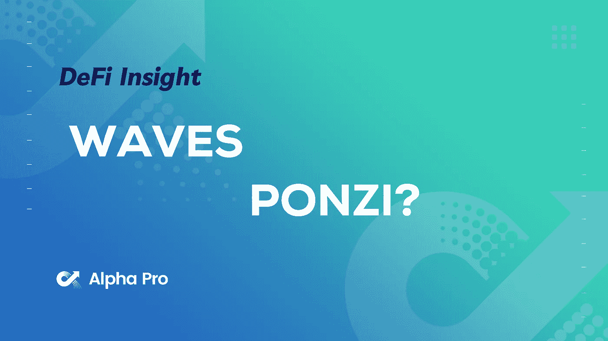
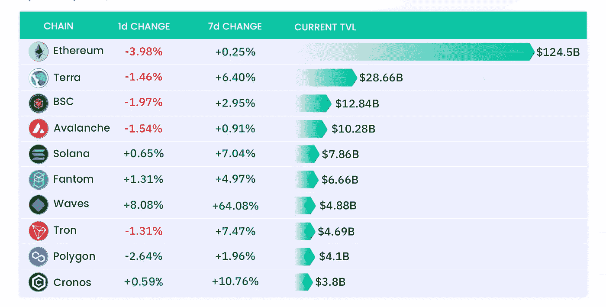
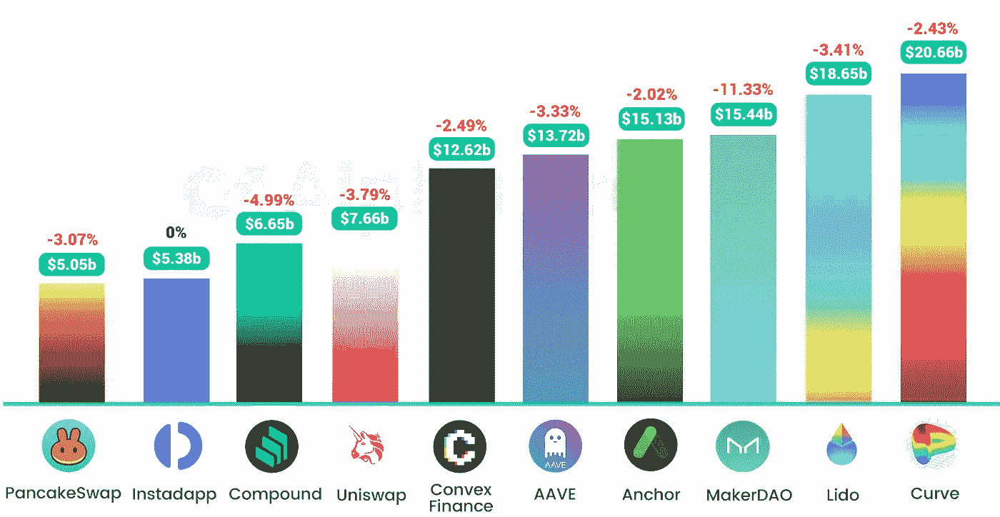
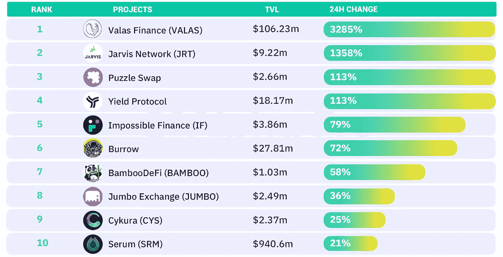
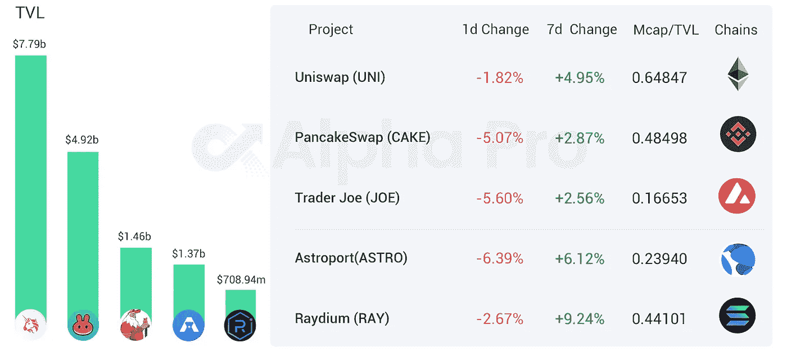
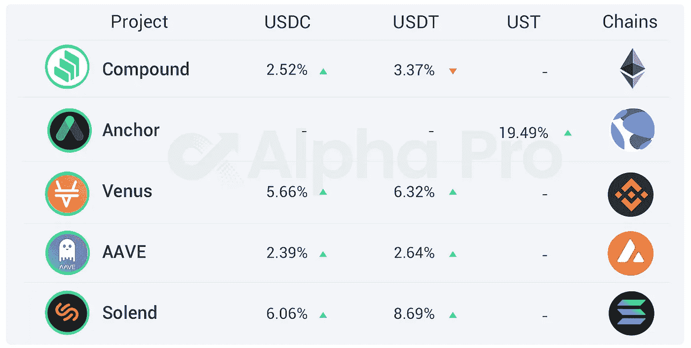

# DeFi Insight |WAVES 是加密领域最大的庞氏骗局

> 原文：<https://medium.com/coinmonks/defi-insight-waves-is-the-biggest-ponzi-in-crypto-f63c23071b6d?source=collection_archive---------24----------------------->

## 2022 年 4 月 1 日

*今日 DeFi 数据&由 DeFi Insight 为您带来的新闻。*

> 加密投资者 [@0xHamZ](http://twitter.com/0xHamZ) 今天在推特上说 WAVES 是加密领域最大的庞氏骗局。
> “它不计后果地操纵价格飙升，以 35%的利率借入 USDC 来购买自己的代币。要保持系统稳定，需要持续的市值增长。浪潮最终会崩溃，USDN 会与之决裂，”他说。[**来源**](https://twitter.com/0xHamz/status/1509581295621451779)

# 最新消息

## 定义

SEC:为[加密资产](https://www.sec.gov/oca/staff-accounting-bulletin-121)提供托管服务的上市公司应将加密资产视为负债并披露风险

尽管业界批评，欧盟议会还是通过了破坏隐私的[密码规则](https://www.coindesk.com/policy/2022/03/31/eu-parliament-votes-on-privacy-busting-crypto-rules-industry-rails-against-proposals/)

OCC 警告银行交易[加密衍生品](https://www.coindesk.com/policy/2022/03/31/wall-street-watchdog-cautions-banks-on-trading-crypto-derivatives/)

加密交易所[币安](https://www.reuters.com/legal/litigation/crypto-exchange-binance-wins-dismissal-us-lawsuit-over-digital-token-sales-2022-03-31/)赢得美国数字令牌销售诉讼的驳回

## 副链

Phala Network 赢得 [Polkadot 的第 13 次](https://twitter.com/PhalaNetwork/status/1509681358838272016?s=20&t=SHUDyw-Iyx5ZD6ShmXtdHw) parachain 老虎机拍卖

## 共链

卡瓦的以太坊合作链测试版即将推出

## 指标

T21 发布了一项交易费用减半的提案

**[**穿山甲**](https://pangolindex.medium.com/pangolin-receives-500k-from-terraform-labs-to-reward-ust-wormhole-liquidity-providers-6263454300d)**从 Terraform Labs 获得 50 万美元的流动性奖励****

## ****AMM****

****Starkswap 现在在 StarkNet 的 alpha 测试网上直播****

## ****贷款****

******[多链](https://www.aliens.com/livenews/latest/multichain-partners-with-lending-protocol-definer)合作伙伴与借贷协议定义者******

## ******桥梁******

********[**IOST**](/iost/project-entroverse-iosts-path-to-evm-compatibility-cross-chain-bridge-interoperable-c70a4ffa3ad2)**宣布 Entroverse 上线**********

## ******打桩******

********、**南森:[以太坊 2.0](https://pro.nansen.ai/eth2-deposit-contract) 总下注额接近 1100 万 ETH，创历史新高******

## ****稳定币****

******圈选 BNY 梅隆来保管 [USDC 储备](https://www.circle.com/en/pressroom/circle-selects-bny-mellon-to-custody-usdc-reserves)******

******提议的法案将要求 T21 的稳定债券由美元和政府债券支持******

## ******空投******

********[元素财政](https://mirror.xyz/0x3fcAf7DDf64E6e109B1e2A5CC17875D4a5993F39/bctuLRkf7oBL4mMJ9lPf0y0blFjBDslTUfUL0CEk1gc)发行治理令牌 ELFI********

## ******钱包******

********[1 inch](https://blog.1inch.io/the-1inch-wallet-for-android-is-released-21b04b0a450d)为安卓用户推出钱包应用********

## ******NFT******

********、**《忍者神龟》1987 年动漫版将在 NFT[上映](https://twitter.com/tmntnft/status/1509518543984996358?s=20&t=xLP9t3TldUMq_ZAWfM8pNg)******

******[精灵 2.0](https://twitter.com/geniexyz/status/1509579213086638081) 移动支持现已上线******

********志那都红豆空投 NFT“官方的东西”总交易额超过1700 万美元********

********[**克莱·汤普森**](https://hypebeast.com/2022/3/klay-thompson-nba-top-shot-game-recognize-game-nft-collection-release-info)**和 NBA 顶级投篮掉落新“游戏认游戏”NFT 装**********

********[**百无聊赖的猿猴**](https://beincrypto.com/bored-ape-discord-hack-results-pilfered-primates/)**不和钻营导致灵长类动物被盗**********

## ******基金******

********Iconic 推出全球首款 [EOS ETP](https://iconicholding.com/launch-eos-etp/?utm_medium=social&hss_channel=tw-893059976373182464)********

******SEC 文件显示，区块链安全公司 CertiK 刚刚筹集了 8800 万美元******

********Terra NFT 市场 [OnePlanet](https://bitrss.com/news/247242/terra-based-nft-marketplace-oneplanet-raises-3-3m-round-led-by-hashed) 融资 330 万美元，由 Hashed 领投********

********/**新的[3.35 亿英尺长](https://fantom.foundation/blog/new-335m-ftm-incentive-program-with-gitcoin-grants/)奖励计划，含 Gitcoin 赠款******

******,**axel erator 多链赠款挑战:[构建 Web3 超级应用](https://axelar.network/multichain-grant-axelerator-program)****

****2022 年 Q1，THORChain 的国库资产超过 2 亿美元****

# ****数据和分析****

## ****TVL 增长排名前 10 的连锁店****

********

## ****最新 TVL 十大项目****

********

## ****过去 24 小时 TVL 变化的前 10 个项目****

********

## ****德克斯 TVL 排名****

*****DEX 跌幅最大的是*[*astro port*](https://defillama.com/protocol/astroport)**，损失了 6.39%******

**********

## *****APY DeFi 贷款公司*****

******USDC:最高贷款利率:* [*索伦德*](https://solend.fi/dashboard)*6.06% APY******

******USDT:最高贷款利率:* [*索伦德*](https://solend.fi/dashboard)*8.69% APY******

**********

# *****深潜*****

*******第一个** [**赚钱的区块链**](https://newsletter.banklesshq.com/p/the-first-profitable-blockchain?s=r)*****

***** [## 第一个盈利的区块链

### 跨越 9 个以上网络的跟踪和交易亲爱的无银行国家，利润=总收入-总支出有些人认为这…

newsletter.banklesshq.com](https://newsletter.banklesshq.com/p/the-first-profitable-blockchain?s=r) 

**[**加密展望**](https://embernodes.substack.com/p/crypto-outlook-for-q2-2022?s=r) **为 Q2 2022****

** [## Q2 2022 加密货币展望

### 宏观俄罗斯-乌克兰战争一直是过去几周的趋势头条，这一事件引发了很多…

embernodes.substack.com](https://embernodes.substack.com/p/crypto-outlook-for-q2-2022?s=r) 

**现在是 2023 年——以下是你希望了解的 2022 年以太坊** 的情况

 [## 现在是 2023 年——以下是 2022 年你希望了解的以太坊

### 2021 年对以太坊而言是多事之秋，但对 1 美元的 ETH 而言，2021 年的价格走势难以预料，原因是它的表现落后于很多公司……

medium.com](/deus-ex-dao/its-2023-here-s-what-you-wish-you-knew-about-ethereum-in-2022-7c635c229a78) 

**开采结束:以太坊股权凭证** [合并](/momentum6/the-end-of-mining-the-ethereum-proof-of-stake-merge-2f10c761dd29)

 [## 挖掘的终结:以太坊股权证明合并

### ETH 正在从 PoW 转向 PoS 共识机制，以确认交易区块，这一过程通常被称为“The…

medium.com](/momentum6/the-end-of-mining-the-ethereum-proof-of-stake-merge-2f10c761dd29) 

**如何找到** [**石币宝石**](https://twitter.com/DeFi_educator/status/1509278699597836290)

**crystal vale 子网俯冲**

# 报告

**南森对 NFTs 的报道集中在**[**Arbitrum One**](https://www.nansen.ai/research/nansens-coverage-of-nfts-on-abitrum-one-a-deep-dive?utm_source=blog&utm_medium=twitter&utm_campaign=arbitrum-on-nfts-01042022)

> 与 2021 年第四季度相比，2022 年 Q1 在 Arbitrum One 上处理的交易量和完成的交易数量有所增加。今年以来，我们看到 Arbitrum One NFT 用户增长了 205%。
> Arbitrum One 的新用户和回归用户增长依然起伏不定。
> 周销售额在 1000 笔以上、周销售额在 10 笔以上的合同，自年初以来持续增长。
> 目前，4.5%的钱包在基于 Arbitrum 的 NFTs 中的投资回报率至少达到 100%，排名前 20 位的钱包投资回报率都超过了 10，000%。这在很大程度上是通过财宝的免费造币厂模式，推出了流行的 Smol Brains 和军团 NFTs。

**[**市场洞察力**](https://members.delphidigital.io/reports/market-insights-goodbye-q1-you-wont-be-missed)**——再见 Q1，你不会被错过的 _ 德尔福数字****

****[**数字资产**](https://data.cryptocompare.com/reports/digital-asset-management-review-march-2022)**—3 月 _** 密码比较****

******[**Tezos 基金会**](https://tezos.foundation/reports/)**Reports _**Tezos . Foundation******

****一场 **回合:******

****DeFi Insight 是顶级 DeFi 和加密新闻和更新的来源。****

******https://twitter.com/AlphaPro_io 推特:******

********❤RSS:**[**https://medium.com/feed/@alphapro.project**](https://medium.com/feed/@alphapro.project)******

****提供的信息应被视为发展新闻，而不是投资建议。****

> ****加入 Coinmonks [电报频道](https://t.me/coincodecap)和 [Youtube 频道](https://www.youtube.com/c/coinmonks/videos)了解加密交易和投资****

# ****另外，阅读****

*   ****[OKEx vs KuCoin](https://coincodecap.com/okex-kucoin) | [摄氏替代品](https://coincodecap.com/celsius-alternatives) | [如何购买 VeChain](https://coincodecap.com/buy-vechain)****
*   ****[ProfitFarmers 点评](https://coincodecap.com/profitfarmers-review) | [如何使用 Cornix Trading Bot](https://coincodecap.com/cornix-trading-bot)****
*   ****[如何匿名购买比特币](https://coincodecap.com/buy-bitcoin-anonymously) | [比特币现金钱包](https://coincodecap.com/bitcoin-cash-wallets)****
*   ****[瓦济里克斯 NFT 评论](https://coincodecap.com/wazirx-nft-review)|[Bitsgap vs Pionex](https://coincodecap.com/bitsgap-vs-pionex)|[坦吉姆评论](https://coincodecap.com/tangem-wallet-review)****
*   ****[如何使用 Solidity 在以太坊上创建 DApp？](https://coincodecap.com/create-a-dapp-on-ethereum-using-solidity)***********