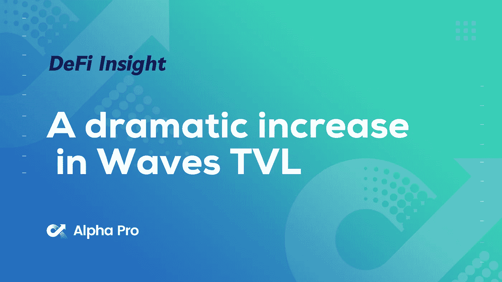
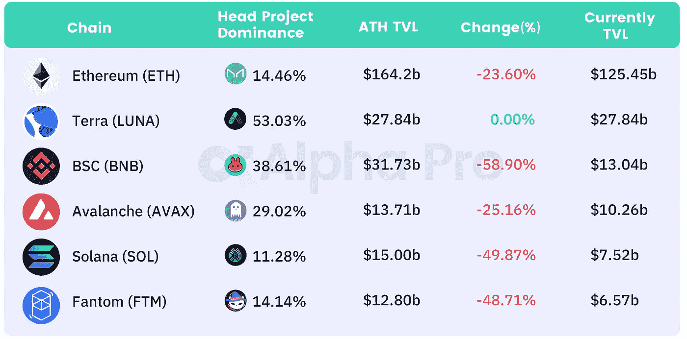
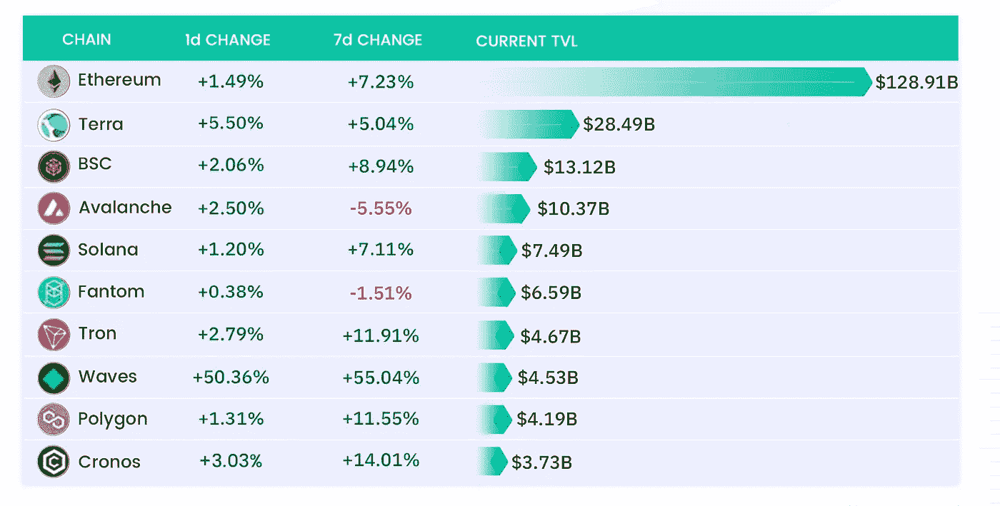
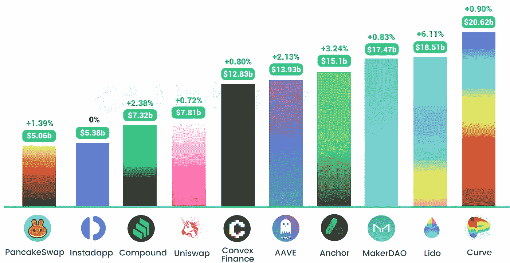
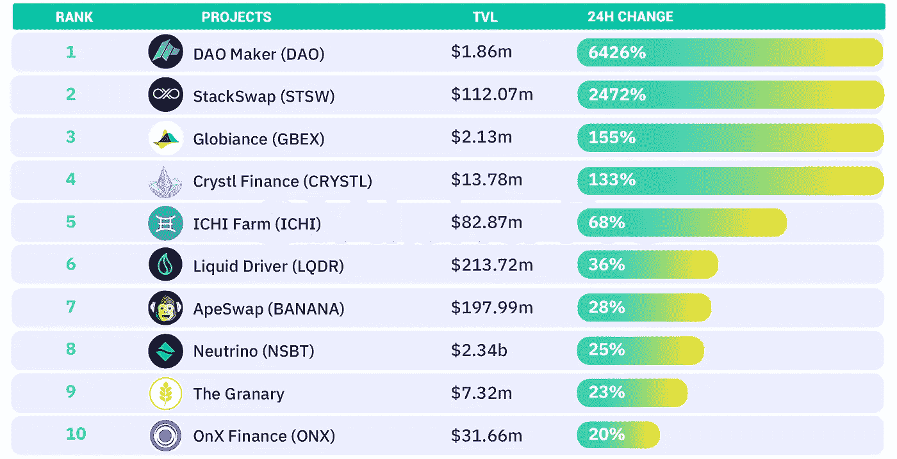
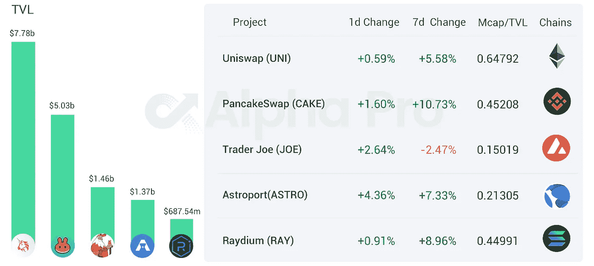
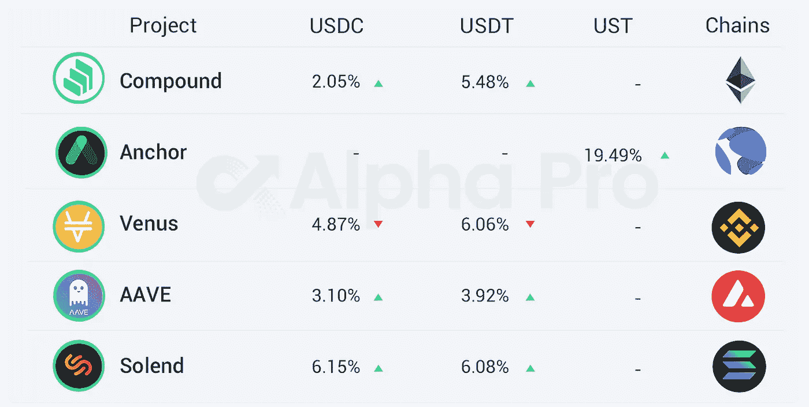

# DeFi Insight | Waves TVL 达到 44.6 亿美元，24 小时内增长 48.01%

> 原文：<https://medium.com/coinmonks/defi-insight-waves-tvl-reached-4-46-billion-up-48-01-in-24-hours-b61522ee0f73?source=collection_archive---------39----------------------->

## 2022 年 3 月 29 日

*今日 DeFi 数据&由 DeFi Insight 为您带来的新闻。*

> 来自 Defillama 的数据显示，Waves 的 TVL 在 3 月 29 日达到 44.6 亿美元，24 小时内上涨 48.01%。Waves 在过去 30 天上涨了 262%。【 [**来源**](https://defillama.com/chain/Waves)

# 最新消息

## 定义

币安实验室宣布投资 [Aptos 实验室](https://www.binance.com/en/blog/ecosystem/binance-labs-makes-strategic-investment-in-aptos-labs-for-the-industry-adoption-acceleration-421499824684903620)

米尔科米达 C1 将 EVM 兼容性带到了[卡达诺](/@milkomedafoundation/milkomeda-c1-launch-evm-on-cardano-is-available-starting-today-4a2c6ad26e9d)

Waves 在美国推出 [Waves Labs](https://financialpost.com/pmn/press-releases-pmn/business-wire-news-releases-pmn/waves-labs-launches-in-the-us-and-announces-its-leadership-team)

FTX 宣布与 TradingView 合作

南森:7 天[活动地址](https://twitter.com/nansen_ai/status/1508715975251836932)按链

美国众议院提议由财政部发行一种硬件支持的匿名形式的数字现金

随着公司在 FCA 截止日期前发声，英国面临[秘密外流](https://ca.finance.yahoo.com/news/u-k-faces-crypto-exodus-063718024.html)

拜登白宫预计未来十年从加密税收规则更新中获得 100 亿美元

SEC 提议将受监管交易商的定义扩大至[被动做市商](https://twitter.com/jchervinsky/status/1508487461474869250)

## 稳定币

**[系绳](https://twitter.com/paoloardoino/status/1507802434785132544?s=21&t=fco-2PNMTDMLSm3FbkAJSA)储备投资组合灵活性增加，风险偏好趋于保守**

## **指标**

****[平衡器](/balancer-protocol/vebal-is-live-aeda1ae13e20)宣布 veBAL 正式上线****

## ****贷款****

******[大院](https://compound.finance/governance/proposals/92)通过奖励减半的提议，将推出新的奖励计划******

********,**DeFi 贷款协议 Alchemix 计划将 V2 扩展至 [Fantom](https://forum.alchemix.fi/public/d/302-aip-42-fantom-launch-omnibus-proposal)******

## ****桥梁****

****集成星际之门的 SushiSwap 已经开始对快照进行投票****

******[Beamer Bridge](/@BeamerBridge/announcing-beamer-bridge-69ce1b59b5ca)宣布启动测试网络，并计划实现兼容 EVM 的 Rollup L2 之间的直接传输******

## ******钱包******

********[meta mask](https://twitter.com/MetaMask/status/1508580273868353537?ref_src=twsrc%5Etfw)Mobile v 4 . 3 . 1 推出，iOS 版本现支持 Visa 和 MasterCard********

## ******|警报******

********/**[Cashio 攻击者](https://etherscan.io/tx/0xb34bbfe78d56eac5576157671f9735d6888f89e8e4af2b1b7d6a2ffdecd90451)将退还损失少于 10 万美元的用户******

## ****市值****

****卡尔达诺的市值超过 410 亿美元，超过了索拉纳和泰拉****

****Terra 的市值创下历史新高****

## ****鲸鱼****

******三箭资本地址流入 [2000 ETH](https://www.aliens.com/livenews/latest/three-arrows-capital-address-inflow-of-2000-eth)******

## ******NFT******

********柏林科技公司[燃料公司为其 NFT 平台向€融资 150 万](https://ffnews.com/newsarticle/fuel-raises-e1-5m-for-its-no-code-nft-platform-for-creators/)********

********NFT 市场 [Blur 完成 1100 万美元的种子轮投资，由 Paradigm 领投](https://mirror.xyz/blurdao.eth/4V0dY_-ob5rBxl664deMASnH2wRsgcrGS20lpdurBa0)********

********[德克斯古鲁](https://twitter.com/dexguru/status/1508466121917181954?s=19)将开放 NFT 铸币厂，持有者可以参与古鲁道治理********

********Animoca Brands，育碧投资 1200 万美元用于区块链游戏[《穿越时代》](https://www.coindesk.com/business/2022/03/28/animoca-brands-ubisoft-invest-in-12m-round-for-blockchain-game-cross-the-ages/)********

## ******基金******

******继投资者兴趣之后，FTX 加密交易所也在考虑外部投资者的投资******

********/**如果 SEC 拒绝 [ETF 请求](https://twitter.com/crypto/status/1508591515374825476)，灰度可能会探索选项******

******、**智慧树推出涵盖 [SOL、ADA 和 DOT](https://finance.yahoo.com/news/wisdomtree-launches-crypto-etps-solana-070000119.html) 的 etp****

******[机构加密资金](https://cointelegraph.com/news/institutional-crypto-funds-see-largest-capital-inflows-for-3-months)见 3 个月最大资金流入******

# ******数据和分析******

## ******TVL 和 ATH 排名前六的连锁酒店对比******

************

## ******TVL 增长排名前 10 的连锁店******

************

## ******最新 TVL 十大项目******

************

## ******过去 24 小时 TVL 变化的前 10 个项目******

************

## ******德克斯 TVL 排名******

******指数中涨幅最大的是 [Astroport](https://defillama.com/protocol/astroport) ，上涨 4.36 **%********

********

## ****APY DeFi 贷款公司****

*****USDC:最高贷款利率:* [*索伦德*](https://solend.fi/dashboard)*APY*****

*****USDT:最高贷款利率:* [*索伦德*](https://solend.fi/dashboard)*6.08% APY*****

********

# ****深潜****

******[**熊市**](https://newsletter.banklesshq.com/p/is-the-bear-market-over?s=r) **结束了吗？********

**** [## 熊市结束了吗？

### 过去两周 Crypto 涨了很多。我们脱离险境了吗？

newsletter.banklesshq.com](https://newsletter.banklesshq.com/p/is-the-bear-market-over?s=r) 

**思考利率衍生品及其应用** [**中的密码**](https://mirror.xyz/0xF53F15B93e1F0Ce72bC96b850Db7576cC3bf6FE6/hi1kx2ercCmysM1d0uXg8RLZNNmVNmE7lqn9hmXUuRY)

 [## 对利率衍生品及其应用的思考...

### 衍生品在加密货币中很快变得非常流行，其交易量主要部署在期货上。这些…

镜像. xyz](https://mirror.xyz/0xF53F15B93e1F0Ce72bC96b850Db7576cC3bf6FE6/hi1kx2ercCmysM1d0uXg8RLZNNmVNmE7lqn9hmXUuRY) 

**如何在 2022 年建立一个** [**稳固的加密组合**](https://twitter.com/thedefiedge/status/1508475727552811009)

# **报告**

****波尔卡多特生态系统概述**[**@ messari . io**](https://messari.io/article/polkadot-ecosystem-overview)**

> **—波尔卡多特的前 11 个副链是活的。
> —前 11 条副链粘合 1.26 亿 DOT(占总供应量的 11%；价值 21 亿美元)。
> —每条副链都为生态系统带来独特的功能和使用案例。下一个主要的技术任务是建立交叉共识消息格式(XCM)。**

****复苏之路**[**@ insights . glass node . com**](https://insights.glassnode.com/the-week-on-chain-week-13-2022/)**

****灰度公司情报**[**@ the block research**](https://www.theblockresearch.com/grayscale-company-intelligence-139356)**

****快闪更新—比特币突围火花新希望**[**@ Delphi digital**](https://members.delphidigital.io/reports/flash-update-bitcoin-breakout-sparks-new-hope)**

**一场 **回合:****

**DeFi Insight 是顶级 DeFi 和加密新闻和更新的来源。**

****https://twitter.com/AlphaPro_io**❤**

****❤RSS:**[**https://medium.com/feed/@alphapro.project**](https://medium.com/feed/@alphapro.project)**

**提供的信息应被视为发展新闻，而不是投资建议。**

> **加入 Coinmonks [电报频道](https://t.me/coincodecap)和 [Youtube 频道](https://www.youtube.com/c/coinmonks/videos)了解加密交易和投资**

# **另外，阅读**

*   **[Bookmap 点评](https://coincodecap.com/bookmap-review-2021-best-trading-software) | [美国 5 大最佳加密交易所](https://coincodecap.com/crypto-exchange-usa)**
*   **[如何在 FTX 交易所交易期货](https://coincodecap.com/ftx-futures-trading) | [OKEx vs 币安](https://coincodecap.com/okex-vs-binance)**
*   **[CoinLoan 审查](https://coincodecap.com/coinloan-review) | [YouHodler 审查](/coinmonks/youhodler-4-easy-ways-to-make-money-98969b9689f2) | [BlockFi 审查](https://coincodecap.com/blockfi-review)**
*   **XT.COM 评论[币安评论](https://coincodecap.com/profittradingapp-for-binance) |**
*   **[SmithBot 评论](https://coincodecap.com/smithbot-review) | [4 款最佳免费开源交易机器人](https://coincodecap.com/free-open-source-trading-bots)******