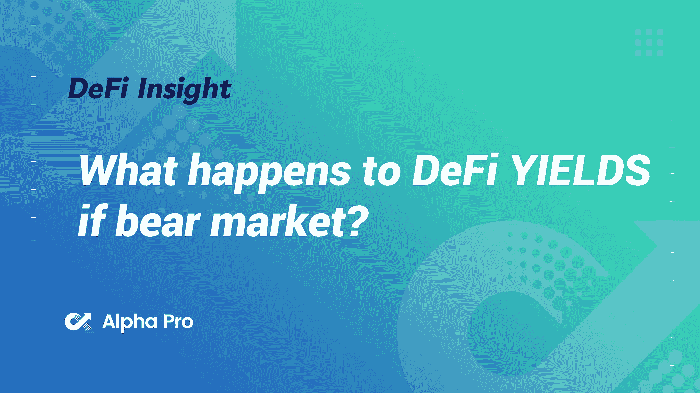
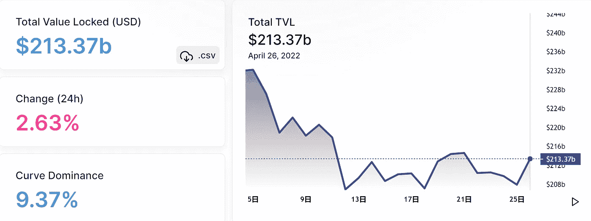
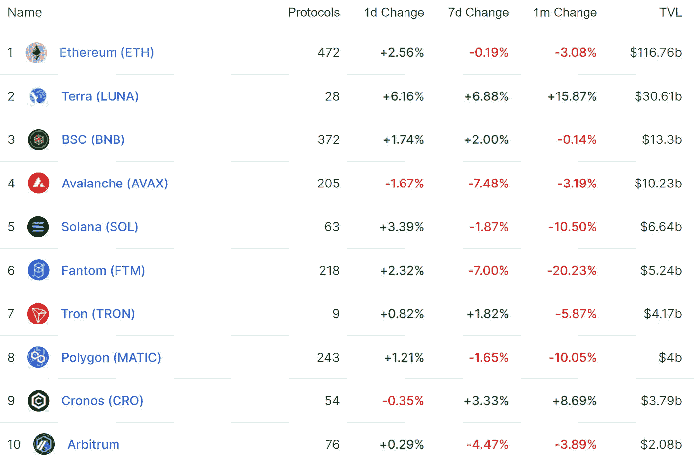
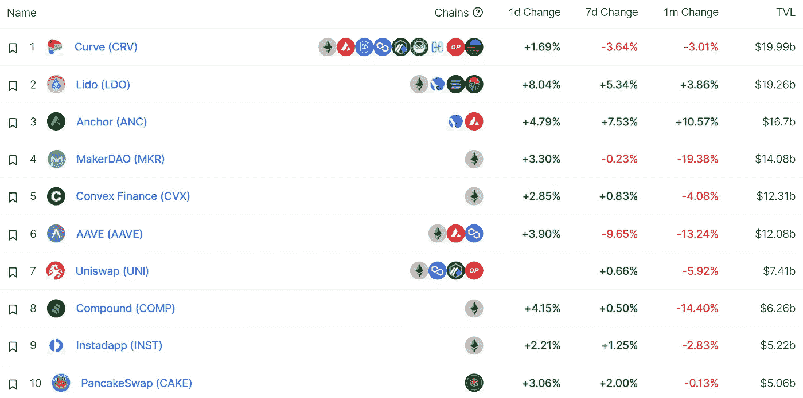
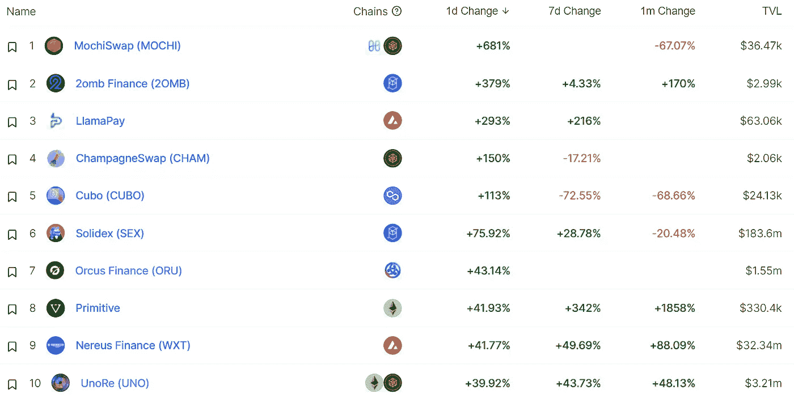
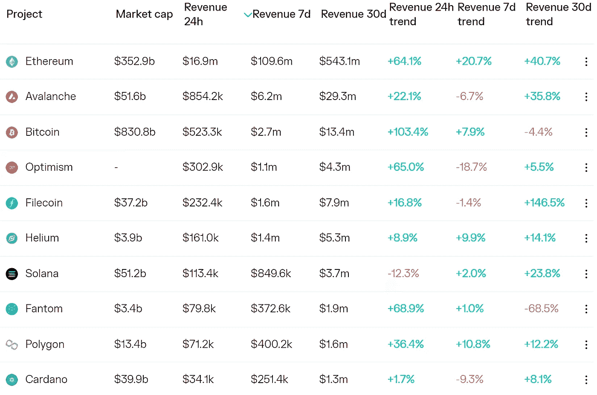
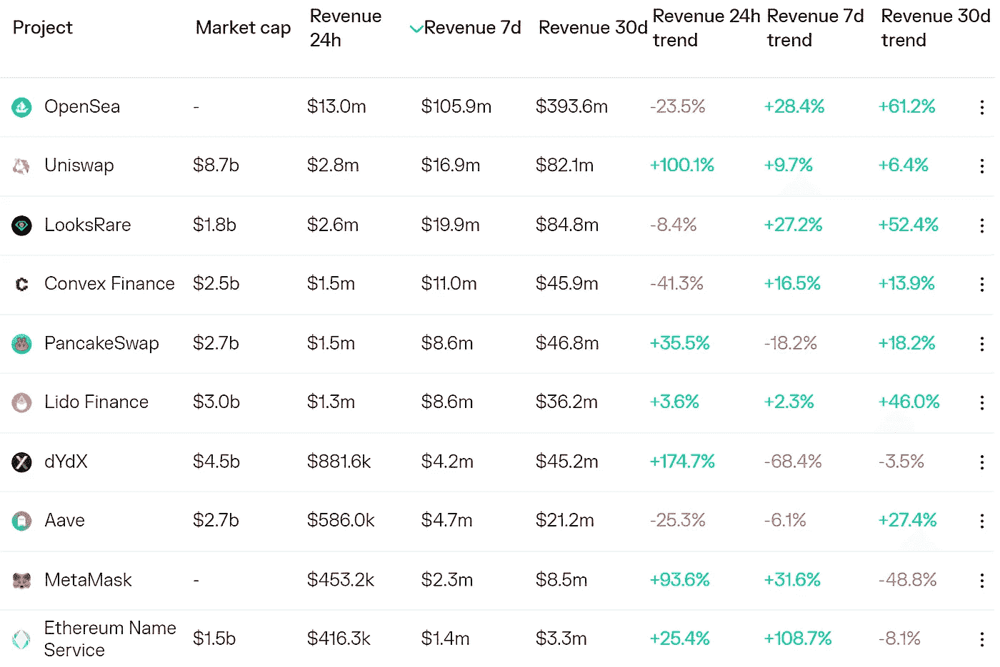
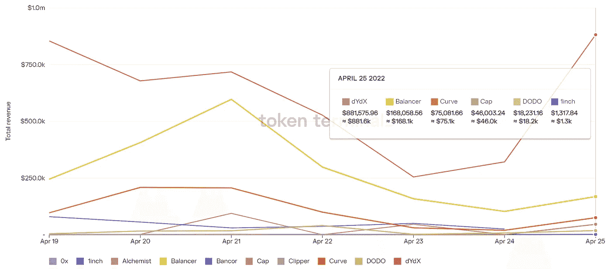
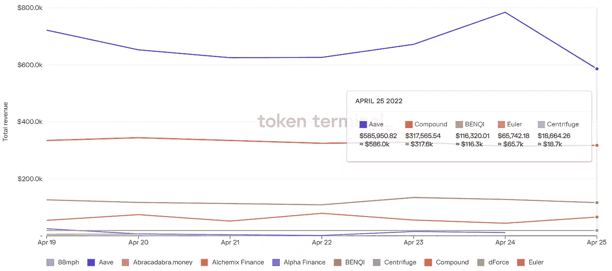

# DeFi Insight |如果熊市，DeFi 收益率会怎样？

> 原文：<https://medium.com/coinmonks/defi-insight-what-happens-to-defi-yields-if-bear-market-b3c924fa1ceb?source=collection_archive---------21----------------------->

2022 年 4 月 26 日

*今日 DeFi 数据&由 DeFi Insight 为您带来的新闻。*

> *哪些产量是可持续的？
> 哪会不了了之？
> 
> 下面是一些真实的分析&例子来切入“逢低买入！“噪音。*
> 
> *保护你的利润和避免 2022 年破产的 6 个策略。**[***来源***](https://twitter.com/FabiusMercurius/status/1517917310786301952)***

# ***最新消息***

## ***贷款***

*****机构贷款协议[枫叶金融](https://twitter.com/maplefinance/status/1518581900645969920?s=19)与 Circle 等合作发放 4500 万美元无担保贷款*****

## *****外汇*****

*****币安交易量飙升超过 4400 亿美元，创季度新高*****

## *****打桩*****

*******PRESS release chain info[启动](https://ambcrypto.com/chaininfo-launches-ethsta-to-provide-data-services-for-eth-2-0-staking/) Ethsta 为 ETH 2.0 staking 提供数据服务*******

## *******稳定币*******

*********/**USN stable coin 在 Near 协议上运行*******

## *******EVM*******

*********[Evmos](https://twitter.com/EvmosOrg/status/1518752071486476288)宣布将推迟到 4 月 27 日重新上线*********

## *********提议*********

***********寿司 2.0:一次[重组](https://forum.sushi.com/t/sushi-2-0-a-restructure-for-the-road-ahead/10111)的前路***********

## *********空投*********

***********,**[Gem 首席开发者](https://discord.com/channels/902947010636820572/905376795900129302/968167512493670490):收购 OpenSea 后仍有可能空投*********

## *******|令牌*******

*******五月初将推出*******

*********[多边形](https://twitter.com/0xPolygonNews/status/1518500039965913088):MATIC 的破坏已经超过 65 万，约占总供应量的 0.27%*********

## *********NFT*********

***********第 58 届格莱美金像奖最佳说唱歌手[克瑞丝·布朗](https://twitter.com/chrisbrown/status/1518711356886708226)发布《光环》NFT***********

***********DC 蝙蝠侠系列 NFT《蝙蝠罩子》今日开启[预售](https://nft.dcuniverse.com/splash)***********

***********NFT 世界[更新](https://twitter.com/nftworldsNFT/status/1518669320628281344?s=20&t=alJNw4u3uWdswNF1ByfoHg)创世纪替身系列 NFT 造币时代***********

***********宇迦实验室的新项目 [Otherside](https://twitter.com/OthersideMeta/status/1518733999405137920) 将使用荷兰拍卖，并且只支持 ApeCoin 支付***********

***********[OpenSea](https://twitter.com/opensea/status/1518590087285678081)宣布收购 NFT 交易集成商 Gem***********

***********NFT 借贷协议[JPEG](/@jpegd/jpegd-protocol-launch-e255f32546bb)d 将于 4 月 27 日发布，支持加密朋克***********

## *********基金*********

***********月鸟母公司证明完成 1000 万美元[融资](https://twitter.com/moonbirds_xyz/status/1518655410495918080)，由七七六领投***********

## *********观点*********

*********Twitter 接受埃隆·马斯克每股 54.20 美元的收购要约*********

*********萨姆·班克曼-弗里德描述了高产农业，留下马特·莱文[发呆](https://www.bloomberg.com/news/articles/2022-04-25/sam-bankman-fried-described-yield-farming-and-left-matt-levine-stunned?utm_campaign=socialflow-organic&utm_source=twitter&utm_content=business&cmpid=socialflow-twitter-business&utm_medium=social)*********

# *********数据和分析*********

## *********锁定的总价值(TVL)*********

*********目前全网 DeFi 总锁定量为 2133.7 亿美元，24 小时增长 2.63%。*********

******************

## *********TVL 评出的十大连锁酒店*********

******************

## *********|最新 TVL 十大项目*********

******************

## *********|过去 24 小时内 TVL 增长的前 10 个项目*********

******************

## *********协议收入*********

## *********|累计总收入最高的项目(24H)_ 区块链(L1)*********

******************

## *********|累计总收入最高的项目(24H) _Dapps(L2)*********

******************

## *********|前 10 大交易所的每日收入*********

******************

## *********|十大贷款协议的每日收入*********

******************

# *********深潜*********

***********[**Terra DeFi**](https://defieducation.substack.com/p/terra-defi-part-2-of-2?s=r)***********

******* [## Terra DeFi(第 2 部分，共 2 部分)

### 欢迎头像！现在尘埃落定，有更多的空间进行理性分析，我们将结束我们的…

defieducation.substack.com](https://defieducation.substack.com/p/terra-defi-part-2-of-2?s=r) 

**[**靠近数据线程**](https://twitter.com/resdegen/status/1517948546401587200)**

****1q 22**中，Crypto VC[**投资了**](https://twitter.com/alphanonceStaff/status/1518492891684872193) **哪里*********** 

# *******报告*******

*********[**状态**](https://messari.io/article/state-of-fei-q1-2022) **对费的议定书 2022**_ 梅萨里*********

> *******PCV 仍然资金充足，并为新产品的分配或利用提供了许多机会。*******
> 
> *******像 Turbo 这样的新工具正在开发中，以利用 Fei 协议的能力来铸造稳定的货币，并管理与 Rari Capital 贷款平台的挂钩。*******
> 
> *******与同行相比，FEI stablecoin 的采用率和表现较差，但尽管市场波动，它仍保持了挂钩的稳定性。*******
> 
> *******向 Dao 提供流动性解决方案的潜在市场总额高达数十亿美元，并将随着市场整体的发展而扩大。*******

*********A**[**关于链上流动性的报告**](https://tokeninsight.com/en/report/2927)**_ token insight*********

> *********2020 年 2 月中旬，分散财务应用程序锁定的总价值首次超过 10 亿美元。在 2020 年“DeFi summer”的推动下，它甚至不需要一年就翻了 20 倍，达到 200 亿美元，只需要 10 个月就可以达到 2000 亿美元。鉴于目前的增长速度，想象 DeFi 市场在一两年内达到一万亿美元似乎并不奇怪。我们可以将这种巨大的增长归因于一件事——流动性。回顾过去，DeFi 的扩张可以被定义为三个时代，每个时代都代表着在消除流动性障碍和提高市场对参与者的吸引力和效率方面的又一重大发展。*********

***********[**增长中的**](https://insights.glassnode.com/the-week-onchain-week-17-2022/) **永久互换的主导地位** _insights.glassnode***********

*********■Terra Luna:******数字资产能否提振电商市场？**_ 硬币电报*********

*********数字资产资金流** [**每周**](https://blog.coinshares.com/volume-76-digital-asset-fund-flows-weekly-report-a8e9cb9e443c) **报告** _coinshares*******

*********IMF 全球金融稳定** [**报告**](https://www.imf.org/en/Publications/GFSR/Issues/2022/04/19/global-financial-stability-report-april-2022)**2022 年 4 月:不到 10 个账户在 DeFi 借贷市场提供 50%的存款流动性** _imf*******

*********关于:*********

*******DeFi Insight 是顶级 DeFi 和加密新闻和更新的来源。*******

*********https://twitter.com/AlphaPro_io 推特:*********

***********❤RSS:**[**https://medium.com/feed/@alphapro.project**](https://medium.com/feed/@alphapro.project)*********

*******提供的信息应被视为发展新闻，而不是投资建议。*******

> *******加入 Coinmonks [电报频道](https://t.me/coincodecap)和 [Youtube 频道](https://www.youtube.com/c/coinmonks/videos)了解加密交易和投资*******

# *******另外，阅读*******

*   *******[印度最佳 P2P 加密交易所](https://coincodecap.com/p2p-crypto-exchanges-in-india) | [柴犬钱包](https://coincodecap.com/baby-shiba-inu-wallets)*******
*   *******[8 大加密附属计划](https://coincodecap.com/crypto-affiliate-programs) | [eToro vs 比特币基地](https://coincodecap.com/etoro-vs-coinbase)*******
*   *******[最佳以太坊钱包](https://coincodecap.com/best-ethereum-wallets) | [电报上的加密货币机器人](https://coincodecap.com/telegram-crypto-bots)*******
*   *******[交易杠杆代币的最佳交易所](https://coincodecap.com/leveraged-token-exchanges) | [购买弗洛基](https://coincodecap.com/buy-floki-inu-token)*******
*   *******[3 commas vs Pionex vs Cryptohopper](https://coincodecap.com/3commas-vs-pionex-vs-cryptohopper)|[Bingbon Review](https://coincodecap.com/bingbon-review)*******