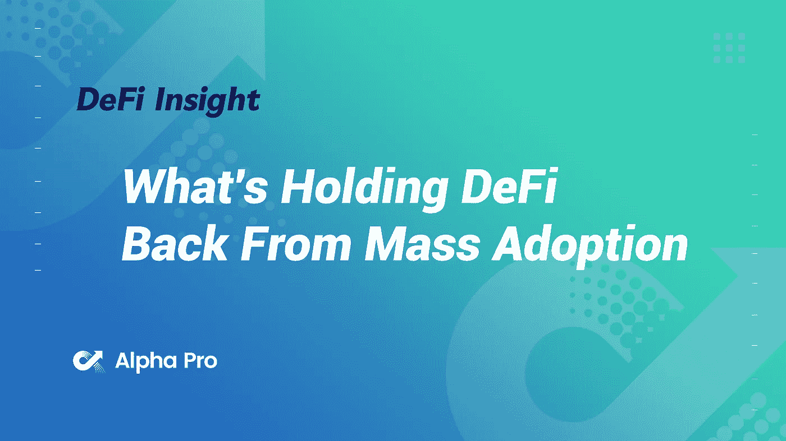
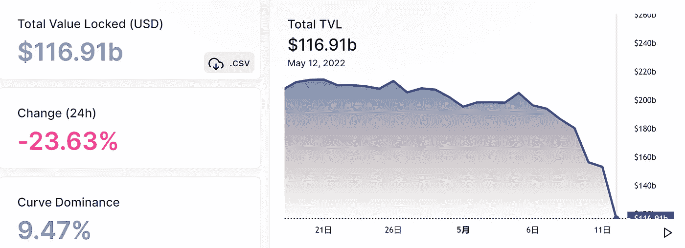
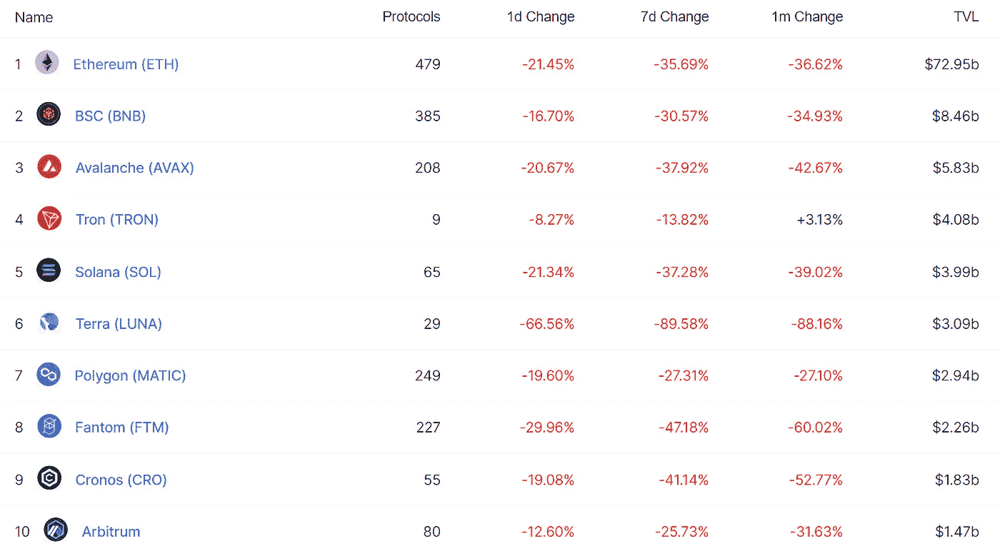
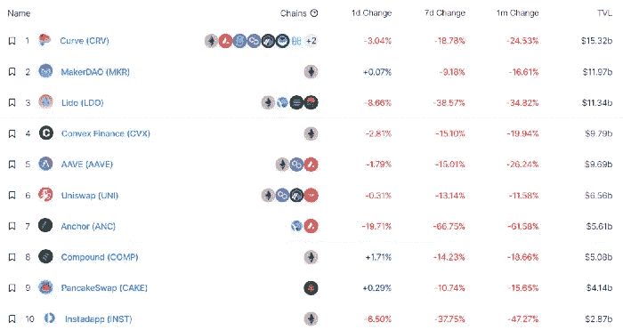
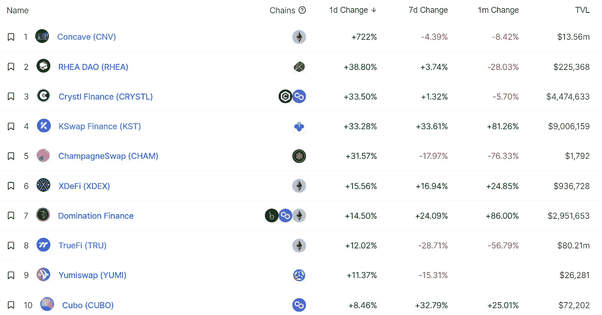
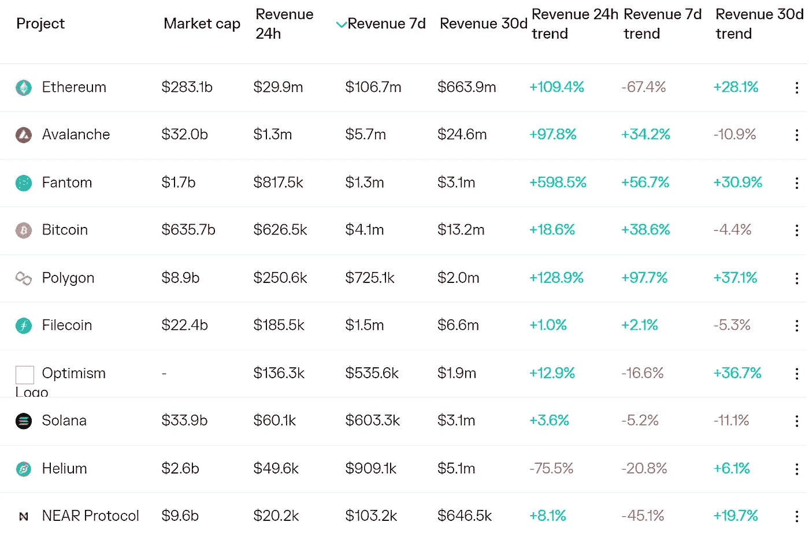
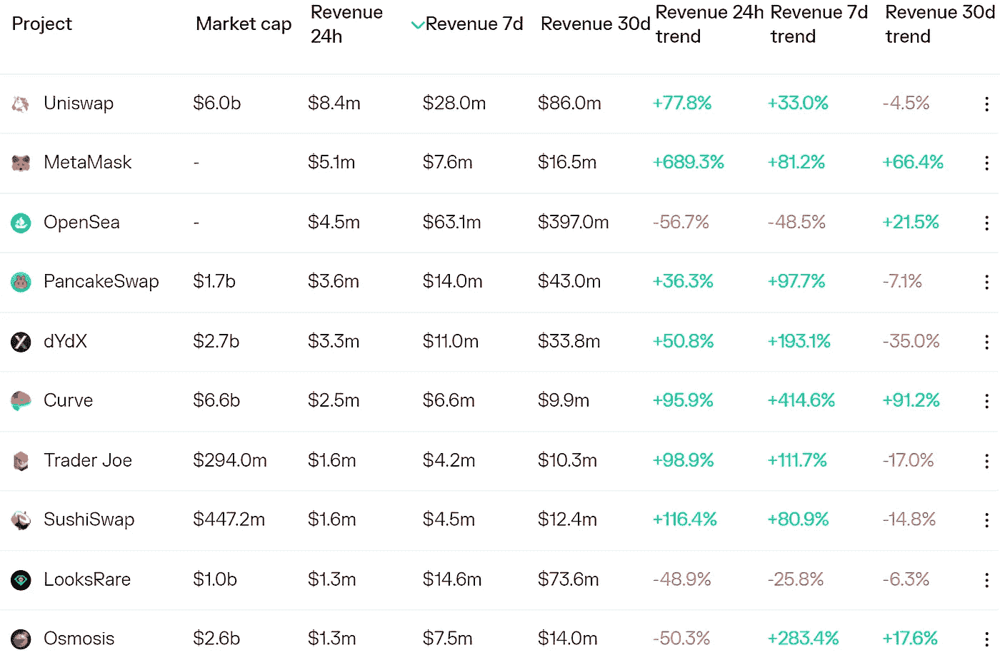
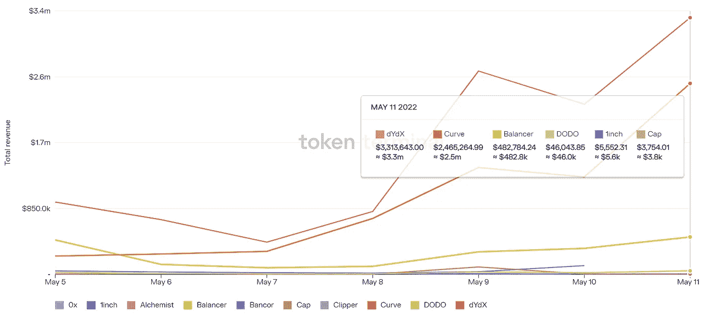
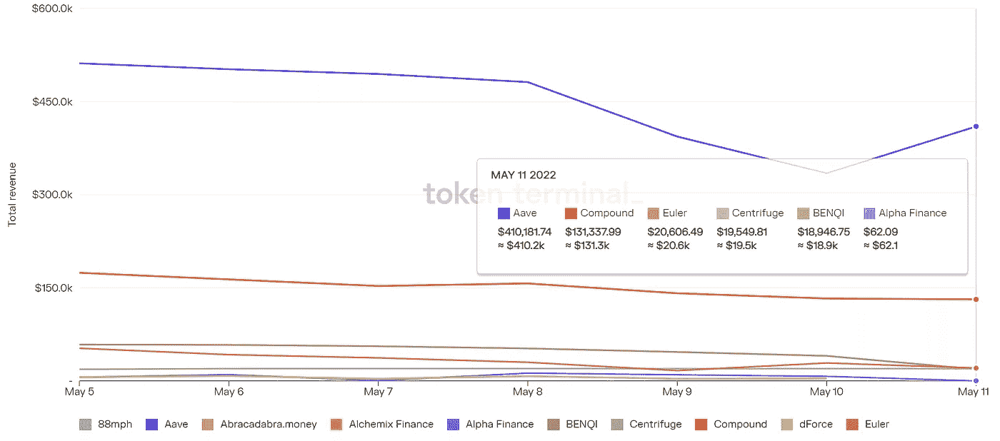

# DeFi Insight |是什么阻碍了 DeFi 的大规模采用

> 原文：<https://medium.com/coinmonks/defi-insight-whats-holding-defi-back-from-mass-adoption-9f69fb50f2ae?source=collection_archive---------38----------------------->

2022 年 5 月 12 日

*今日 DeFi 数据&由 DeFi Insight 为您带来的新闻。*

> *"* 密码市场动荡不安，不是吗？
> 
> 作为这篇文章的前奏，我们想提醒大家，你的投资组合的市值，你的净值，你的交易..他们不是一切。过去 10 年是一个回报轻松的时期，而且基本上只是上涨。过去两年是我们有生之年市场上最激进的金融收益。
> 
> 没有什么能永远保持金色，宝贝。
> 
> 如果你长期看好 crypto(我们是)，将会有重大的买入机会。如果你留下来，你会学到在下一轮牛市中成功所需要的东西(它会来的)。与此同时，继续积累现金，打造你的事业和/或生意。”@ [德非教育](https://defieducation.substack.com/p/whats-holding-defi-back-from-mass?utm_source=%2Finbox&utm_medium=reader2&s=r)

# 最新消息

## 指标

**[曲线](https://twitter.com/CurveFinance/status/1524571585943908353?s=20&t=5MogpR_oq5u5v_HUUMi-rA):昨日交易额突破 44 亿美元，UST 设计不稳定**

****[Bancor 3](https://twitter.com/Bancor/status/1524391095312044032)来了！****

## ****稳定币****

******、** [系绳](https://twitter.com/Tether_to/status/1524652531170881537):共计 10.2 亿美元的美元将跨链转换，USDt 总供应量不变****

****分散银行:在最坏的情况下，我们将能够回购所有发行的美元****

****美国证券交易委员会已经起诉了 Terraform Labs。律师们表示，它完全有理由调查 UST****

****贝莱德和城堡否认交易坑爹的稳定币****

****对于算法稳定点数来说，**/**Terra 崩溃可能会导致[结束](https://blockworks.co/terra-collapse-could-spell-end-for-algorithmic-stablecoins/)****

## ****交叉链****

******Celer 已经与[和【Encentive 合作，在他们的 DeFi builder 平台上支持 cBridge 集成](https://twitter.com/CelerNetwork/status/1524570052510425088)******

## ******|令牌******

********[锂电](https://twitter.com/LithiumFinance/status/1524278353720754179?s=20&t=oT9SmUODbdrLQsB9eFbZUw)宣布其令牌组学********

## ******钱包******

********[Exodus](https://www.globenewswire.com/news-release/2022/05/11/2441117/0/en/Exodus-Reports-First-Quarter-2022-Results.html)报告 2022 年第一季度业绩********

## ******提议******

********[寿司 2.0 提案](https://twitter.com/SushiSwap/status/1524556085826310144?s=20&t=thMVItyi6jR-P_QLKTer5A)刚刚通过快照********

## ******政策与法规******

********[FASB](https://twitter.com/saylor/status/1524420424544702467?s=20&t=Fwy3IZlU48dVhaU08h4HfA)同意审核交易所交易的数字资产和商品的会计核算********

******T21 的秘密投资者可能支付的税款还不到他们所欠税款的一半******

## ******NFT******

********[宝石升级](https://twitter.com/gemxyz/status/1524416624782151681?s=20&t=JzSPRErpO9HyTpkHYH7SiQ):扫数据********

******百威啤酒推出 Dwyane Wade NFTs 来推广其无酒精啤酒******

********、**open sea 上的真实性:验证和防抄袭更新******

****随着 UST 股市暴跌，NFT 股市交易量激增****

******[Adidas Originals](https://twitter.com/adidasoriginals/status/1524396240569610241):我们将实物商品的索赔时间延长至 5 月 18 日******

********百事可乐与 Billboard 合作，在 BBMAs 期间打造[“赢家俱乐部”](https://twitter.com/pepsi/status/1524393265633632256) NFT 系列********

## ******基金******

******BVNK 因其加密银行服务获得 4000 万美元******

******凯西·伍德的方舟投资公司在交易所股票暴跌时获得了 50 多万股比特币基地股票******

********[bit coke](https://bitcoke.medium.com/bitcoke-completed-20-million-financing-with-a-constortim-led-by-huobi-exchange-daeb07ad15e2)与火币交易所牵头的财团完成 2000 万美元融资********

********[【动物穿越遇上《我的世界》】](https://www.coindesk.com/business/2022/05/11/animal-crossing-meets-minecraft-branch-raises-125m-for-play-to-earn-project/):分行为“游戏赚到”项目筹集 1250 万美元********

# ******数据和分析******

## ******锁定的总价值(TVL)******

******目前全网 DeFi 总锁定量为 1169.1 亿美元，24 小时下降 23.63%。******

************

## ******TVL 评出的十大连锁酒店******

************

## ******|最新 TVL 十大项目******

************

## ******|过去 24 小时内 TVL 增长的前 10 个项目******

************

## ******协议收入******

## ******|累计总收入最高的项目(24H)_ 区块链(L1)******

************

## ******|累计总收入最高的项目(24H) _Dapps (L2)******

************

## ******|前 10 大交易所的每日收入******

************

## ******|十大贷款协议的每日收入******

************

# ******深潜******

********[**得救**](https://messari.io/article/salvation-lies-within) **在于**********

 ****[## 比特币和加密价格，新闻，图表和研究

### 编辑描述

梅萨里·io](https://messari.io/article/salvation-lies-within)**** 

******UST**[**德佩格**](https://murrayrudd.substack.com/p/ust-depeg?utm_source=%2Finbox&utm_medium=reader2&s=r)****

**** [## UST·德佩格

### 这是一篇我不喜欢写的文章。许多月神持有者昨天被彻底摧毁了(今天-自由落体…

murrayrudd.substack.com](https://murrayrudd.substack.com/p/ust-depeg?utm_source=%2Finbox&utm_medium=reader2&s=r) 

**[**如何最大化**](https://newsletter.banklesshq.com/p/how-to-maximize-your-eth-staking?utm_source=%2Finbox&utm_medium=reader2&s=r) **你的 ETH 赌注收益率****

** [## 如何最大化您的 ETH 赌注收益

### 当你加入亲爱的无银行国家，我们爱 ETH。我们称之为三点资产。比如…

newsletter.banklesshq.com](https://newsletter.banklesshq.com/p/how-to-maximize-your-eth-staking?utm_source=%2Finbox&utm_medium=reader2&s=r)** 

# **报告**

****不止 JPEGs:如何** [**百无聊赖的泼猴**](https://www.nansen.ai/research/more-than-jpegs-how-bored-ape-yacht-club-built-an-nft-empire) **游艇俱乐部建立起一个 NFT 帝国**_ 南森**

> **猿类已经从简单的 JPEG 格式的 NFT 演变成一个更广泛的生态系统，变得像 Supreme 这样的品牌一样具有文化影响力。他们的迅速崛起几乎是前所未闻的，主流时尚品牌和基于密码的项目都无法匹敌。**
> 
> **尽管至少可以说，他们迄今取得的一切都令人印象深刻，但这可能只是他们将创造的更大宇宙的开始。持有人的活动表明，德根斯和 smart money 都对 BAYC 的未来持类似的乐观态度。该团队关于由类人猿统治世界的梦想可能并不遥远，类人猿可能会成为元宇宙的统治者。**

****绘制出**[**GSR**](https://www.theblockresearch.com/mapping-out-gsr-portfolio-145824)**组合** _theblockresearch**

****一个** [**看**](https://www.theblockresearch.com/a-look-at-secret-network-144326) **在秘密网** _theblockresearch**

****[**穿山甲**](https://messari.io/article/pangolin-avalanche-based-dex-with-a-cross-chain-vision) **:基于雪崩的 DEX，具有跨链视野** _messari****

******新** [**Dapps 报告**](https://dappradar.com/blog/new-dapps-report-ens-domains-10k-club-numbers-dont-lie) **: ENS 域名，10k 俱乐部——数字不会说谎** _dappradar****

******[**索拉纳**](https://mirror.xyz/0x9b7e7c5B53081d0C6d09b91F13783D58B772b011/hO_K5NBB57DHH1CyAI4Nzqj--Yv-La0asj2rh76wsVw) **项目收入周报 _** AlphaPro******

******关于:******

****DeFi Insight 是顶级 DeFi 和加密新闻和更新的来源。****

******https://twitter.com/AlphaPro_io 推特:******

********❤RSS:**[**https://medium.com/feed/@alphapro.project**](https://medium.com/feed/@alphapro.project)******

****提供的信息应被视为发展新闻，而不是投资建议。********