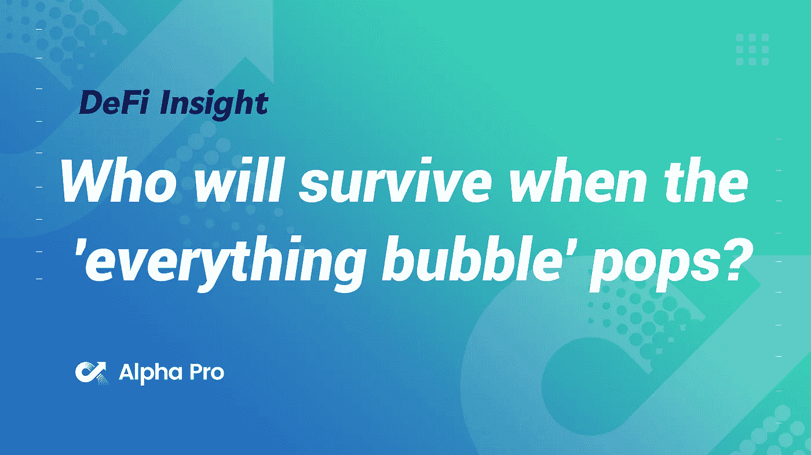
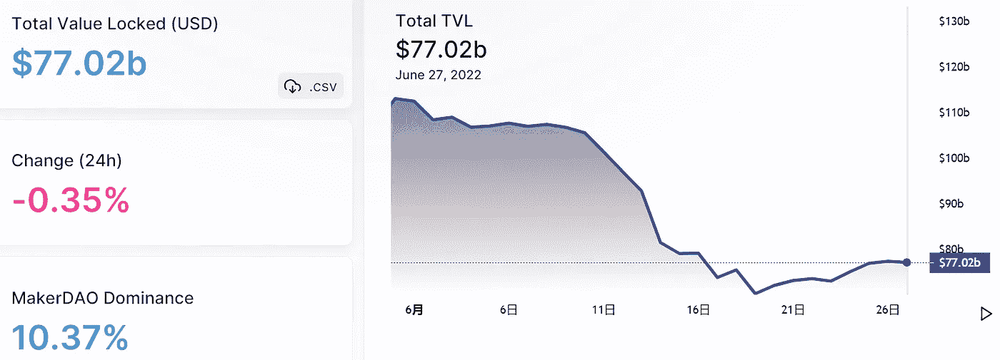
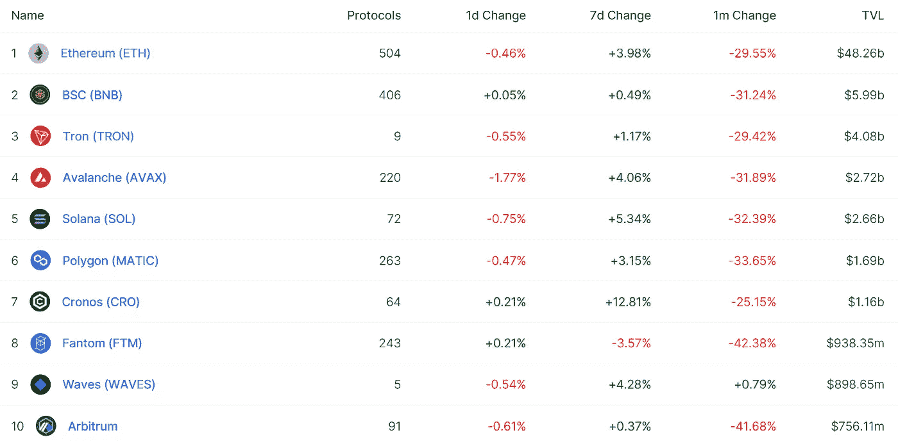
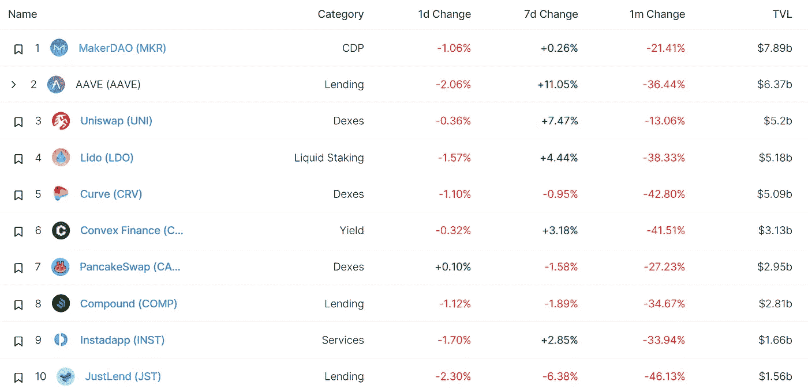
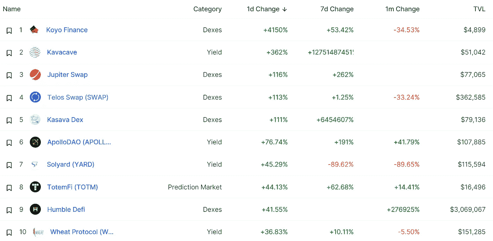
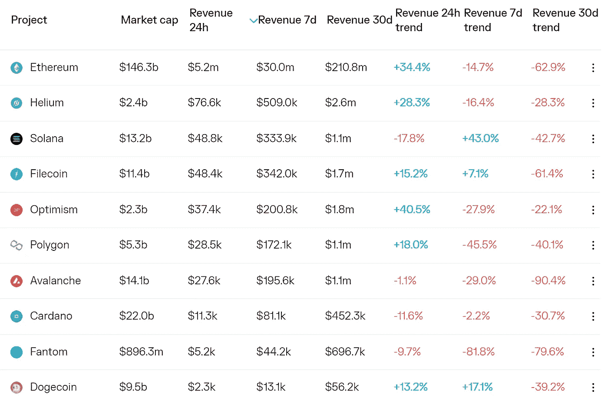
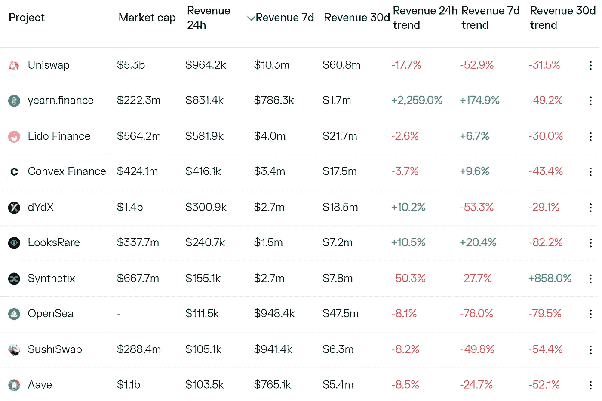
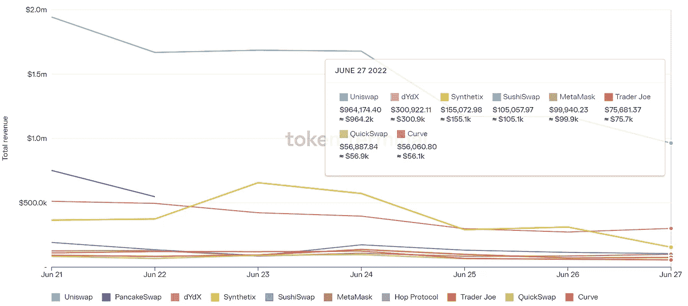
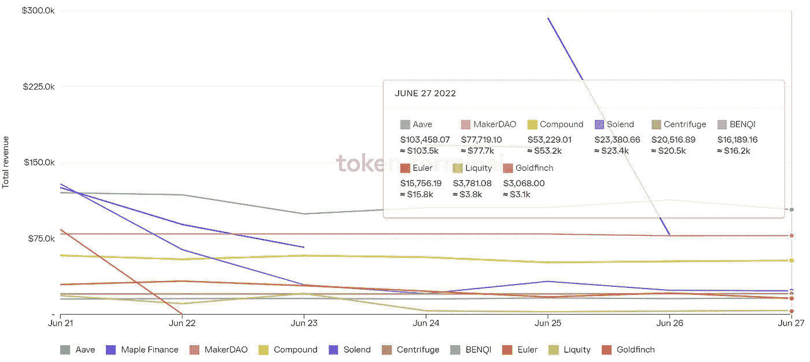

# 当“一切泡沫”破灭时，谁将幸存？

> 原文：<https://medium.com/coinmonks/defi-insight-who-will-survive-when-the-everything-bubble-pops-a8a32144a8d0?source=collection_archive---------14----------------------->

2022 年 6 月 28 日

*今日 DeFi 数据&由 DeFi Insight 为您带来的新闻*

> *“*当 2020 年 3 月第一次 Covid 锁定开始时，股市和比特币暴跌。没人知道这种病毒会有多危险或无害，也不知道关闭全球化经济会带来什么影响。接下来两年发生的事情在很多层面上都是前所未有的。政府和中央银行加入进来，新的资金变得几乎任何人都可以在文件下签名，我们得到的是有史以来最便宜的融资环境。
> 
> 这导致了“一切泡沫”，从房地产到 meme 股票、指数基金、比特币和数千种加密货币，一切都突破了历史高点，让人们欢欣鼓舞。不管你投资了什么，只要买些东西，然后等着“数字上升”就行了。每个人都是天才。快乐时光。*“@*[*来源*](https://pomp.substack.com/p/who-will-survive-when-the-everything)

# 最新消息

## 贷款

**/**密码社区混淆为[摄氏度](https://cointelegraph.com/news/crypto-community-confused-as-celsius-continues-with-weekly-rewards)继续每周奖励

当律师推动第 11 章破产时，寻求客户的支持

## 外汇

印度的加密货币交易所正在向更友好的国家转移

CoinFLEX 发行 4700 万美元代币，等待“加密鲸”付款

Crypto.com 从 Earn 计划中删除 Dogecoin、Shiba Inu 和其他狗

币安期货将推出 BUSD 保证金交易，并以高达 20 倍的杠杆连接永久合约

## 支付

**Crypto.com 现在将允许用户[用 Apple Pay 购买密码](https://bitcoinist.com/crypto-com-allow-users-to-buy-crypto-with-apple-pay/)**

****区块链支付平台 [KONPAY](https://www.prnewswire.com/news-releases/blockchain-payment-platform-konpay-hot-debut-in-bybit-301576398.html) 火热亮相 Bybit****

## ****政策与法规****

******,**保管骗子钱包的加密交易所对受害者的损失“不负责任”，[法院规定](https://cryptonews.com/news/crypto-exchange-that-hosted-scammers-wallet-not-liable-for-victims-losses-court-rules.htm)****

******/**比特币 ETF 决议前 [SEC 裁决](https://blockworks.co/grayscale-encouraged-by-sec-rulings-ahead-of-bitcoin-etf-decision/)鼓励灰度****

****欧盟计划禁止对稳定货币的存款支付利息****

****报道:[摩洛哥中央银行](https://news.bitcoin.com/report-moroccos-central-bank-to-unveil-crypto-regulation-bill-soon/)即将公布加密监管法案****

## ****NFT****

****NFT 的营销人员。纽约市喜欢元宇宙的机会& [NFTs](https://beincrypto.com/marketers-at-nft-nyc-relish-opportunities-in-metaverse-nfts/)****

******[涂鸦](https://twitter.com/doodles/status/1541614804963434496)公布第二季 NFT 细节******

## ******基金******

********[灰度](https://www.bloomberg.com/news/articles/2022-06-27/grayscale-bitcoin-trust-lines-up-jane-street-virtu-in-etf-bid?srnd=cryptocurrencies-v2#xj4y7vzkg)比特币信托排队 Jane Street，Virtu 在 ETF 竞价********

******巴西独角兽 [CloudWalk](https://www.prnewswire.com/news-releases/brazilian-unicorn-cloudwalk-launches-its-own-blockchain-301575909.html) 推出自己的区块链******

******加密数据公司 [Kaiko](https://www.bloomberg.com/news/articles/2022-06-28/crypto-data-firm-kaiko-raises-53-million-during-market-rout#xj4y7vzkg) 在市场崩溃期间筹集了 5300 万美元******

# ******数据和分析******

## ******锁定的总价值(TVL)******

******目前全网 DeFi 总锁定量为 770.2 亿美元，24 小时下降 0.35%。******

************

## ******TVL 评出的十大连锁酒店******

************

## ******|最新 TVL 十大项目******

************

## ******|过去 24 小时内 TVL 增长的前 10 个项目******

************

## ******协议收入******

## ******|累计总收入最高的项目(24H)_ 区块链(L1)******

************

## ******|累计总收入最高的项目(24H) _Dapps (L2)******

************

## ******|前 10 大交易所的每日收入******

************

## ******|十大贷款协议的每日收入******

************

# ******深潜******

********我的密码投资** [**失误与教训**](https://crypto.nateliason.com/p/mistakes-lessons?utm_source=%2Finbox&utm_medium=reader2)******

**** [## 我的秘密投资错误和教训

### 好吧，看起来欢乐时光可能要结束了。过去的一年半是疯狂的。已经…

crypto.nateliason.com](https://crypto.nateliason.com/p/mistakes-lessons?utm_source=%2Finbox&utm_medium=reader2) 

**比特币真的是对抗通胀的** [**对冲**](https://bitcoinmagazine.com/markets/is-bitcoin-really-a-hedge-against-inflation) **吗？**

 [## 比特币真的是通货膨胀的对冲工具吗？

### 这是投资者、获奖企业家、作家和播客主持人乔丹·沃兹的观点社论…

bitcoinmagazine.com](https://bitcoinmagazine.com/markets/is-bitcoin-really-a-hedge-against-inflation) 

**为什么加密救市是一把** [**双刃剑**](https://cryptoslate.com/op-ed-why-crypto-bailouts-are-a-double-edged-sword/)

 [## 专栏:为什么加密救助是一把双刃剑

### 快进到今天，比特币已经成功引领了数字资产的去中心化运动，这在某种程度上…

cryptoslate.com](https://cryptoslate.com/op-ed-why-crypto-bailouts-are-a-double-edged-sword/) 

为什么 dApp 现在要离开以太坊？

 [## 为什么 dApp 现在要离开以太坊？

### 深入了解 dYdX 的宇宙之旅——以及它对 Web3 的意义

newsletter.banklesshq.com](https://newsletter.banklesshq.com/p/dydx-cosmos-ethereum) 

# 报告

**[**这次是不同的**](https://insights.glassnode.com/the-week-onchain-week-26-2022/) **？**_ 玻璃节点**

> **几乎所有比特币的宏观指标都处于历史低点，表明可能形成底部。许多公司的股价甚至与之前历史水平相差个位数百分点。随着无数的地板形成信号闪烁，问题是，这一次会有所不同吗？**

****[**block fi**](https://www.theblockresearch.com/blockfi-company-intelligence-154220)**公司情报** _theblockresearch****

******[**Arbitrum vs 乐观派**](https://members.delphidigital.io/reports/arbitrum-vs-optimism-liquidation-cascades-lidos-steth-depeg) **m、清算喀、丽都的 stETH Depeg** _delphidigital******

******[**thor swap**](https://messari.io/article/thorswap-solving-cross-chain-s-centralization-problem)**:解决跨链的集中化问题** _messari******

******关于:******

****DeFi Insight 是顶级 DeFi 和加密新闻和更新的来源。****

******https://twitter.com/AlphaPro_io 推特:******

********❤RSS:**[**https://medium.com/feed/@alphapro.project**](https://medium.com/feed/@alphapro.project)******

****提供的信息应被视为发展新闻，而不是投资建议。****

> ****加入 Coinmonks [电报频道](https://t.me/coincodecap)和 [Youtube 频道](https://www.youtube.com/c/coinmonks/videos)了解加密交易和投资****

# ****另外，阅读****

*   ****[3 商业评论](/coinmonks/3commas-review-an-excellent-crypto-trading-bot-2020-1313a58bec92) | [Pionex 评论](https://coincodecap.com/pionex-review-exchange-with-crypto-trading-bot) | [Coinrule 评论](/coinmonks/coinrule-review-2021-a-beginner-friendly-crypto-trading-bot-daf0504848ba)****
*   ****[莱杰 vs n 格拉夫](/coinmonks/ledger-vs-ngrave-zero-7e40f0c1d694) | [莱杰纳诺 s vs x](/coinmonks/ledger-nano-s-vs-x-battery-hardware-price-storage-59a6663fe3b0) | [币安评论](/coinmonks/binance-review-ee10d3bf3b6e)****
*   ****[加密交易机器人](/coinmonks/crypto-trading-bot-c2ffce8acb2a) | [Bingbon 评论](https://coincodecap.com/bingbon-review)****
*   ****[Bybit Exchange 审查](/coinmonks/bybit-exchange-review-dbd570019b71) | [Bityard 审查](https://coincodecap.com/bityard-reivew) | [Jet-Bot 审查](https://coincodecap.com/jet-bot-review)****
*   ****[3 commas vs Cryptohopper](/coinmonks/3commas-vs-pionex-vs-cryptohopper-best-crypto-bot-6a98d2baa203)|[赚取加密利息](/coinmonks/earn-crypto-interest-b10b810fdda3)****
*   ****最好的比特币[硬件钱包](/coinmonks/hardware-wallets-dfa1211730c6) | [BitBox02 回顾](/coinmonks/bitbox02-review-your-swiss-bitcoin-hardware-wallet-c36c88fff29)********