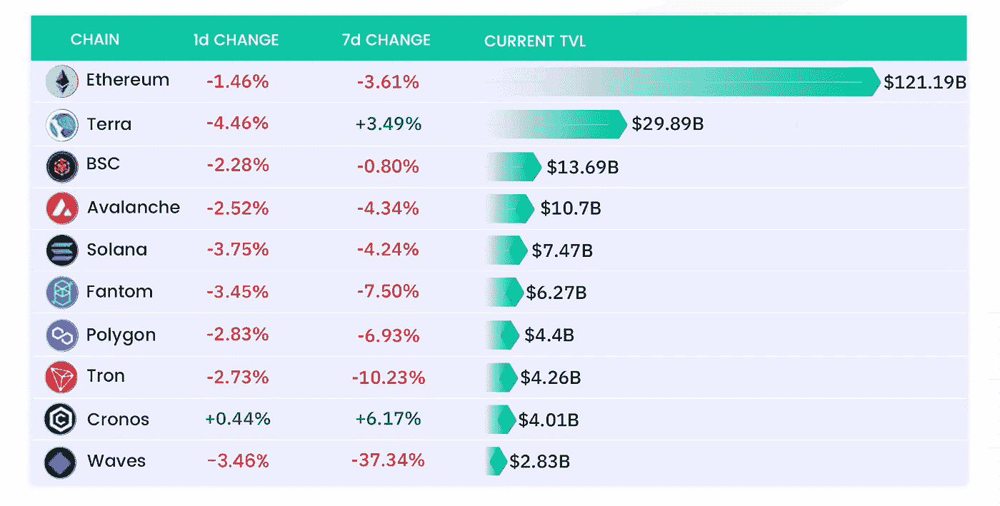
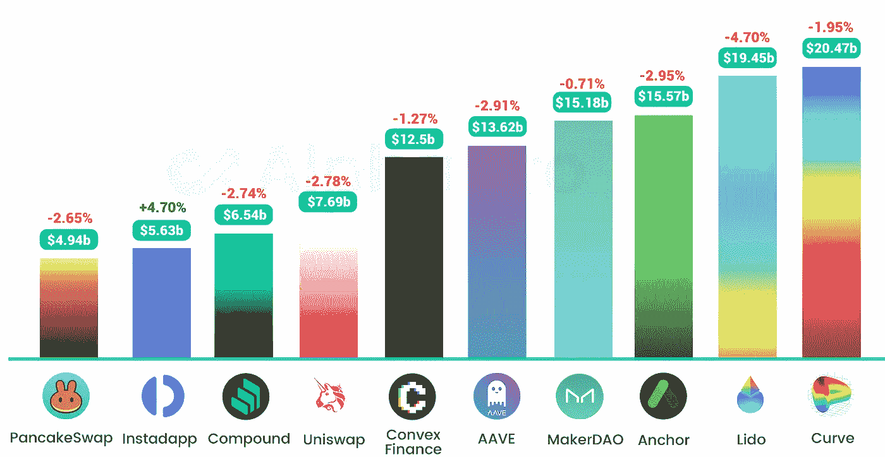
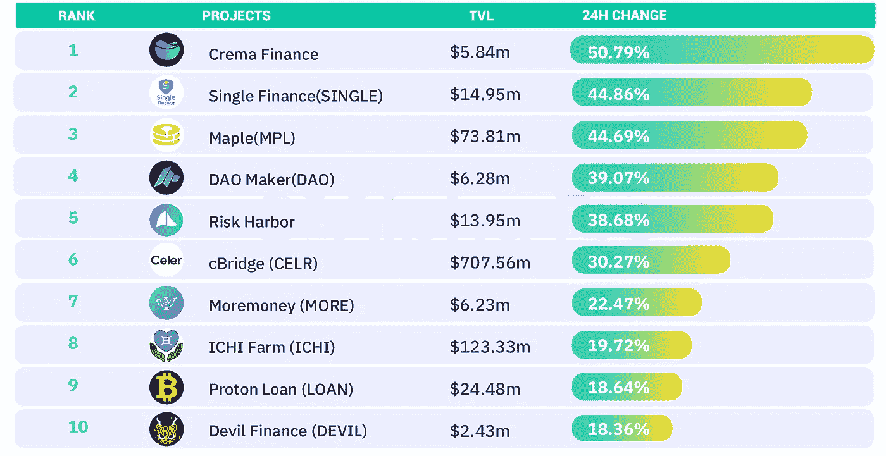
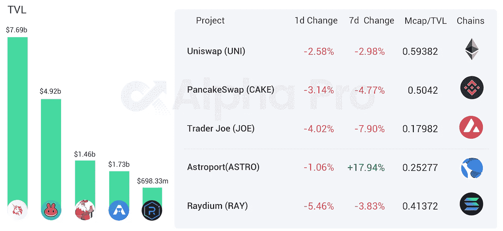
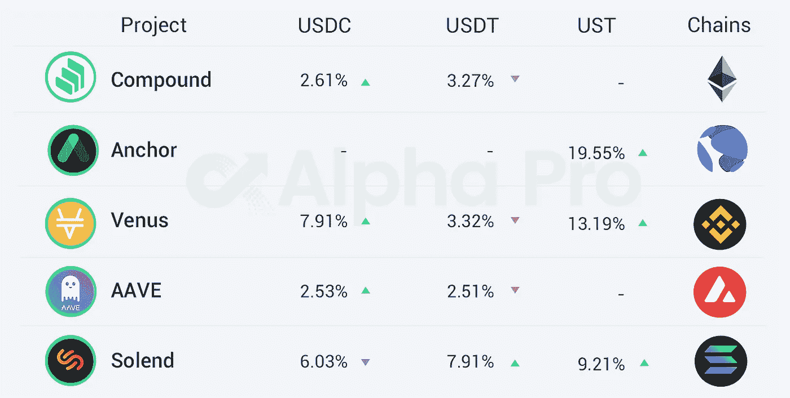

# DeFi Insight |为什么 DeFi 应该让市场像华尔街银行一样

> 原文：<https://medium.com/coinmonks/defi-insight-why-defi-should-make-markets-like-wall-street-banks-19d5ed9a881?source=collection_archive---------42----------------------->

## 2022 年 4 月 7 日

*今日 DeFi 数据&由 DeFi Insight 为您带来的新闻。*

> DeFi 的核心承诺是一个向所有人开放的全球金融体系。它消除了对银行和中央控制的需求，为消费者和小企业节省了数百亿美元的中介机构从日常金融交易(如购买一杯咖啡或跨境汇款)中收取的费用。
> 
> 像每一个改变模式的创新一样，DeFi 生态系统经历了成长的痛苦，但其长期价值已经成为焦点。与传统金融相比，每个月都会推出新的协议，提供更高的回报和更低的准入门槛，DeFi 正在迅速吸引新用户。[**来源**](https://thedefiant.io/why-defi-should-make-markets-like-wall-street-banks/)

# 最新消息

## 定义

诺沃格拉茨说，一旦美联储暂停，比特币将[走向‘月球’](https://cryptonewswire.org/index.php/2022/04/07/bitcoin-will-go-to-the-moon-once-fed-pauses-novogratz-says/)

微观战略首席执行官说[比特币比黄金更适合微观战略](https://twitter.com/JSeyff/status/1511449701312249866?t=IwOTRhOiA3QG1dHynG97vA&s=19)

SEC 主席 Gensler 要求工作人员与 CFTC 合作[监管加密交换](https://news.bitcoin.com/sec-chair-gensler-asks-staff-to-collaborate-with-cftc-on-regulating-crypto-exchanges/)

## 贷款

**、**密码借贷平台 BlockFi [列出 AVAX](https://blockfi.com/earn-avax)

**Nexo 推出大宗经纪平台 [Nexo Prime](https://www.nasdaq.com/press-release/nexo-launches-digital-asset-prime-brokerage-unit%3A-nexo-prime-2022-04-06)**

## **稳定币**

****美国参议员图米发布法案草案，为稳定共和党人[建立框架](https://www.banking.senate.gov/imo/media/doc/the_stablecoin_trust_act.pdf)****

## ****|选项****

******[Psy 季度回顾](/psyoptions/psy-quarterly-review-q1-2022-9bfac02b4d35) : Q1 2022******

## ******测试网******

******卡瓦宣布推出以太坊[共链测试网](https://twitter.com/kava_platform/status/1511718842027937804)******

********仲裁宣布启动[硝基开发网络](/offchainlabs/its-nitro-time-86944693bf29)********

## ******外汇******

********FTX 与 AZA Finance 合作在非洲推出加密交易平台********

## ******加速器******

********Terraform Labs 与 [LongHash Ventures](https://decrypt.co/97044/terraform-labs-longhash-ventures-terra-accelerator-program) 合作********

## ******支付******

******刚刚消息:菲律宾最大的数字支付公司启用了加密交易******

********/**bit pay 支持[闪电网](https://bitcoinmagazine.com/business/bitpay-to-support-lightning-network)******

****比特币基地与印度移动支付系统 UPI 合作，允许印度用户直接购买加密货币****

## ****|令牌****

******,**ve MULTI Proposal—下注 MULTI，获得 [Multichain 费用奖励](/multichainorg/vemulti-proposal-stake-multi-get-multichain-fees-rewards-d8d13b9e20cb)****

******、**脸书所有者 Meta 用“扎克雄鹿”和[创造者硬币](https://www.ft.com/content/50fbe9ba-32c8-4caf-a34e-234031019371)瞄准金融****

## ****|警报****

******,**Juno mainnet 将于世界标准时间 4 月 7 日 21:00 重新启动****

## ****NFT****

******,**OpenSea 开始激活对[基于 Solana 的 NFTs](https://www.theblockcrypto.com/linked/140690/opensea-goes-live-with-support-for-solana-based-nfts?utm_source=twitter&utm_medium=social) 的支持****

******ESPN 油墨与汤姆·布拉迪的 [NFT 平台](https://www.theblockcrypto.com/linked/140906/espn-inks-collaboration-deal-with-tom-bradys-nft-platform)合作交易******

******据报道，动视公司盯上了未来使命召唤游戏中的[【NFT 包含】](https://www.dexerto.com/call-of-duty/activision-reportedly-eyeing-nft-inclusion-future-call-of-duty-games-1798020/)******

******在多尔西的[第一条推特上花了 290 万美元的首席执行官](https://www.bloomberg.com/news/articles/2022-04-07/dorsey-s-first-tweet-offered-for-48-million-on-nft-marketplace)想以 4800 万美元卖掉它******

********派拉蒙全球第一部 [NFT 作品集](https://www.startrek.com/news/first-nft-collection-from-paramount-global-and-recur-partnership-to-drop-with-star-trek-on)将于 4 月 9 日与《星际迷航》再次合作********

********紫水晶与梦露遗产合作铸造玛丽莲[梦露 NFTs](https://www.voguebusiness.com/technology/a-virtual-marilyn-monroe-in-fendi-and-miu-miu-how-the-icons-estate-is-getting-a-web-30-revival)********

********NFT 平台 bitsCrunch 加入万事达卡的启动路径[加密程序](https://markets.businessinsider.com/news/stocks/mastercard-to-incubate-nft-focused-startup-bitscrunch-via-its-%E2%80%9Cstart-path%E2%80%9D-startup-engagement-program-11217944)********

********solv✕条财:第一张[债券凭证 IVO](https://solvprotocol.medium.com/solv-strips-finance-the-first-bond-voucher-ivo-e17622a08485)********

## ******基金******

********、**灰度调整[多元化基金中的加密资产敞口](https://blockworks.co/grayscale-adjusts-cryptoassets-exposure-in-diversified-funds/)******

****币安的风险投资公司想募集一只外部基金****

****GOGO 协议筹集 200 万美元来加强用户友好的 DeFi 协议****

****Unifimoney 为其为银行和信用社提供的交钥匙数字财富管理平台获得了 1000 万美元的种子投资****

******桥网私募债[融资轮](/@bridgenetwork/94ded7402945)******

********SEC 批准 Teucrium 的比特币[期货 ETF](https://www.coindesk.com/policy/2022/04/06/sec-approves-teucriums-bitcoin-futures-etf/)********

********区块链基础设施公司 [SenseiNode 关闭 360 万美元](https://www.coindesk.com/business/2022/04/06/senseinode-raises-36m-as-latams-first-blockchain-infrastructure-firm/?outputType=amp)种子轮********

# ******数据和分析******

## ******TVL 增长排名前 10 的连锁店******

************

## ******最新 TVL 十大项目******

************

## ******过去 24 小时 TVL 变化的前 10 个项目******

************

## ******德克斯 TVL 排名******

*******DEX 跌幅最大的是* [Raydium](https://defillama.com/protocol/raydium) *，损失了 5.46%*******

************

## ******APY DeFi 贷款公司******

*******USDC:最高贷款利率:*[*V*enus](https://app.venus.io/market)*7.91% APY*******

*******USDT:最高贷款利率:* [*索伦德*](https://solend.fi/dashboard)*7.91% APY*******

************

# ******深潜******

********上链** [**选项**](https://zeeprime.capital/a-lot-of-on-chain-options-but-few-to-exercise-a-deep-dive-into-defi-option-protocols/) **很多，但锻炼**的很少******

**** [## 有很多链上选项，但很少行使- Zee 主要资本

### 深入了解 DeFi 选项协议如果您以前读过任何关于选项的文章，现在您可能知道…

zeeprime.capital](https://zeeprime.capital/a-lot-of-on-chain-options-but-few-to-exercise-a-deep-dive-into-defi-option-protocols/) 

**Crypto 可以修复** [**公共物品**](https://newsletter.banklesshq.com/p/crypto-can-fix-public-goods?s=r)

 [## 密码可以修复公共物品

### 亲爱的无银行国家，我们依靠政府来解决市场失灵——他们应该…

newsletter.banklesshq.com](https://newsletter.banklesshq.com/p/crypto-can-fix-public-goods?s=r) 

**[**的未来**](https://www.neelsomani.com/blog/future-of-terra-defi.php)**

** [## 地球的未来

### TL；dr: 75%的$UST 因其高固定收益而被持有。当收益率下降时，为了让$UST 保持…

www.neelsomani.com](https://www.neelsomani.com/blog/future-of-terra-defi.php) 

**Frax:每一个分散的** [**稳定的货币**](/@rshetty23/frax-every-decentralized-stablecoin-will-become-a-central-bank-f2818d5fc336) **都会变成一个中央银行**

 [## 弗雷克斯:每一个分散的稳定货币都将成为一个中央银行

### Frax 是一种分数算法稳定币，似乎正处于成为中央银行的前沿。至…

medium.com](/@rshetty23/frax-every-decentralized-stablecoin-will-become-a-central-bank-f2818d5fc336) 

**如何评估一个 Altcoin，打造一个** [**投资论文**](https://twitter.com/kamikaz_ETH/status/1511647828325834752)

**什么是** [**词汇学**](https://twitter.com/thedefiedge/status/1511737802655903744) **以及你应该注意什么**** 

# **报告**

****[**Dapp 行业报告**](https://dappradar.com/blog/dapp-industry-report-q1-2022-overview) **: Q1 2022 概览 _dappradar******

> ****2022 年的前三个月提醒了 dapp 行业的每个人，这个新生的空间在我们眼前发展得有多快。来自不同类别的 Dapps 即游戏、DeFi 和 NFTs——在我们面前展示了他们的潜力，同时也强调了在完全成为主流之前必须解决的挑战。****

******[**四月调研**](https://www.theblockresearch.com/april-research-and-analysis-report-140912) **及分析报告 _theblockresearch********

******2022 年 3 月月度走势图:市场复苏** [**更多交易**](https://crypto.com/research/march-monthly-chartbook-market-recovers-more-trading-activities/) **活动 _crypto.com******

****一场 **回合:******

****DeFi Insight 是顶级 DeFi 和加密新闻和更新的来源。****

******https://twitter.com/AlphaPro_io**❤****

********❤RSS:**[**https://medium.com/feed/@alphapro.project**](https://medium.com/feed/@alphapro.project)******

****提供的信息应被视为发展新闻，而不是投资建议。****

> ****加入 Coinmonks [电报频道](https://t.me/coincodecap)和 [Youtube 频道](https://www.youtube.com/c/coinmonks/videos)了解加密交易和投资****

# ****另外，阅读****

*   ****[3 商业评论](/coinmonks/3commas-review-an-excellent-crypto-trading-bot-2020-1313a58bec92) | [Pionex 评论](https://coincodecap.com/pionex-review-exchange-with-crypto-trading-bot) | [Coinrule 评论](/coinmonks/coinrule-review-2021-a-beginner-friendly-crypto-trading-bot-daf0504848ba)****
*   ****[莱杰 vs n rave](/coinmonks/ledger-vs-ngrave-zero-7e40f0c1d694)|[莱杰 nano s vs x](/coinmonks/ledger-nano-s-vs-x-battery-hardware-price-storage-59a6663fe3b0) | [币安评论](/coinmonks/binance-review-ee10d3bf3b6e)****
*   ****[Bybit Exchange 审查](/coinmonks/bybit-exchange-review-dbd570019b71) | [Bityard 审查](https://coincodecap.com/bityard-reivew) | [Jet-Bot 审查](https://coincodecap.com/jet-bot-review)****
*   ****[3 commas vs crypto hopper](/coinmonks/3commas-vs-pionex-vs-cryptohopper-best-crypto-bot-6a98d2baa203)|[赚取加密利息](/coinmonks/earn-crypto-interest-b10b810fdda3)****
*   ****最好的比特币[硬件钱包](/coinmonks/hardware-wallets-dfa1211730c6) | [BitBox02 回顾](/coinmonks/bitbox02-review-your-swiss-bitcoin-hardware-wallet-c36c88fff29)********