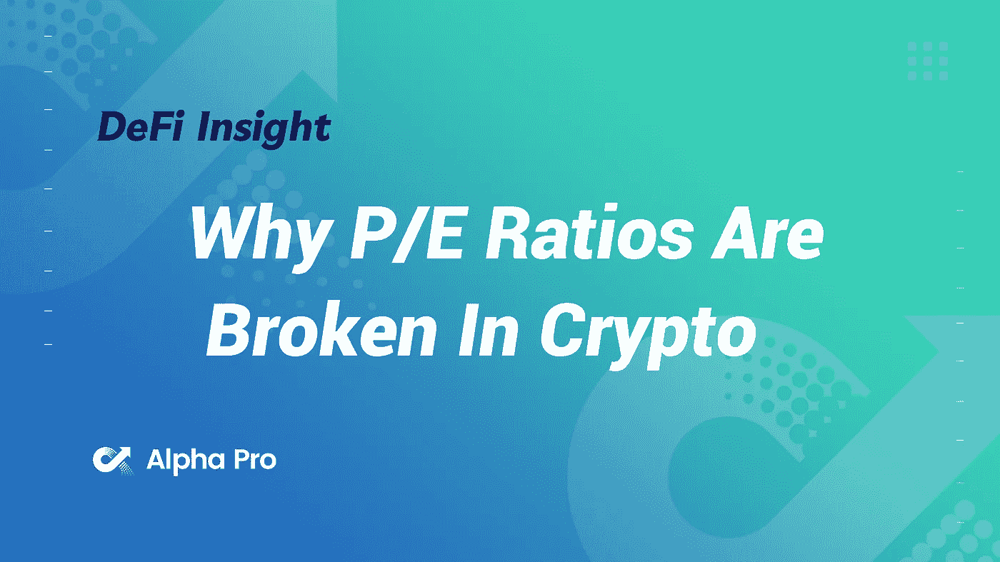
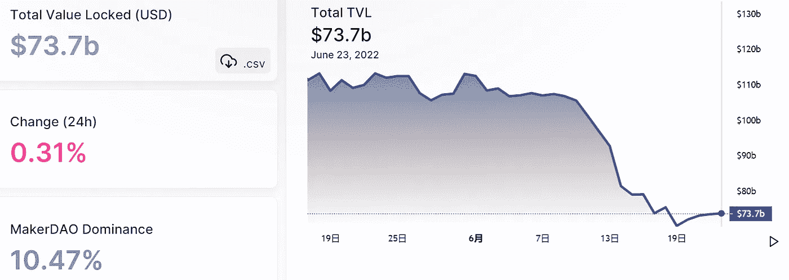
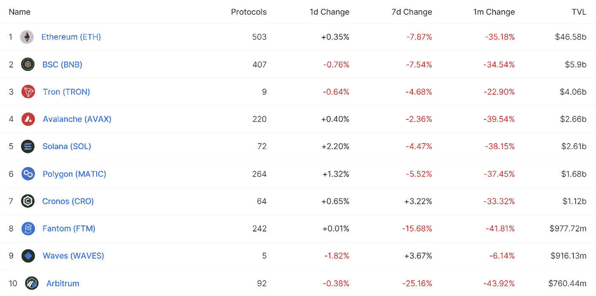
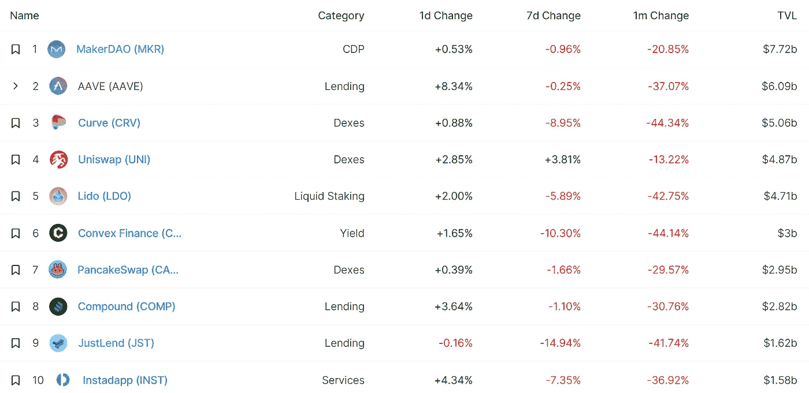
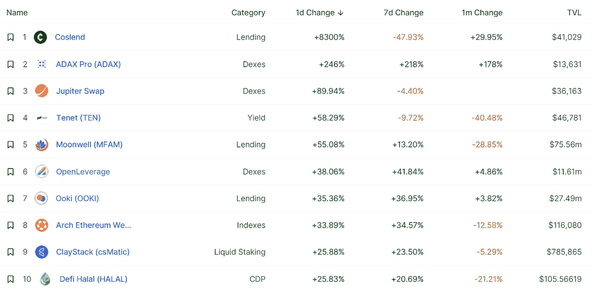
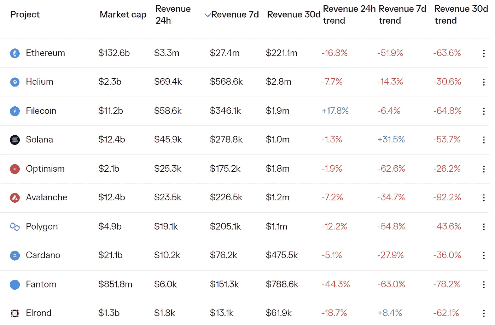
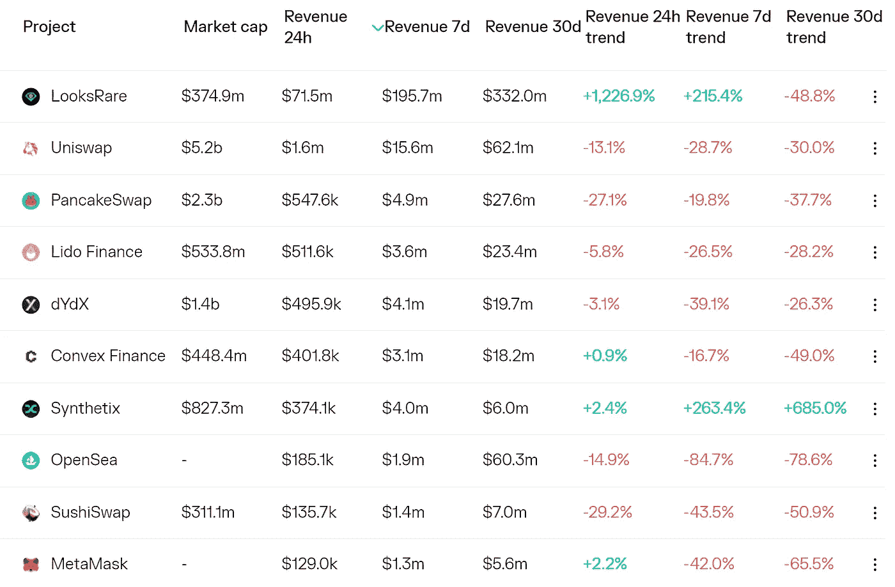
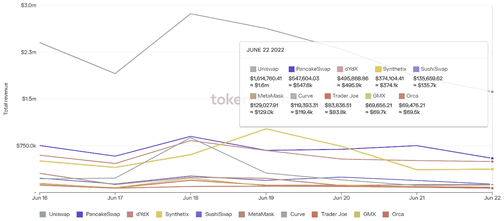
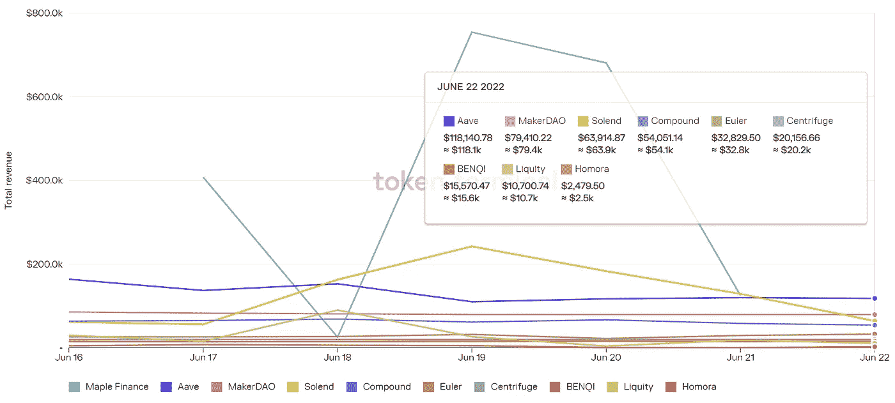

# DeFi Insight |为什么市盈率在加密中被打破

> 原文：<https://medium.com/coinmonks/defi-insight-why-p-e-ratios-are-broken-in-crypto-341f10748eb6?source=collection_archive---------26----------------------->

2022 年 6 月 23 日

*今日 DeFi 数据&由 DeFi Insight 为您带来的新闻*

> *“*记住，传统市场中的市盈率是当前价格与年收益之比。在 crypto 中，我们看到人们用最后一个月或最后三个月的数据，然后按年计算(乘以 12 或 4)得出年收入，然后加上一个市盈率以供比较。
> 
> 事情是这样的:在像 DeFi 这样不稳定的情况下，最近的收益很可能会成为衡量一年收益的糟糕指标。DeFi 收益是投机者获取价值的函数。虽然总会有一些猜测，但是 crypto 的复制-粘贴特性意味着猜测会被类似的项目分食，并且最终总是失败。*“@*[*来源*](https://defieducation.substack.com/p/why-pe-ratios-are-broken-in-crypto?utm_source=%2Finbox&utm_medium=reader2)

# 最新消息

## 贷款

枫叶公司向巴别金融公司提供了 1000 万美元的无担保贷款

Nexo 聘请花旗银行在市场动荡期间为收购提供建议

## 外汇

**[比特币基地](https://cryptopotato.com/coinbase-discontinues-coinbase-pro-puts-all-features-under-main-platform/?utm_source=blockworks-research)停止比特币基地 Pro，将所有功能放在主平台下**

## **稳定币**

**随着隐性冬天的加深，稳定的竞争优势创下历史新高**

**跆拳道的秘密帝国在 400 亿美元的崩溃中倒下了。他有一枚新硬币给你。**

## **交叉链**

****[thor chain](/thorchain/thorchain-mainnet-achieved-19a7145ea51a)Mainnet 达成！****

## ****第二层****

******[Polygon](https://www.cryptoglobe.com/latest/2022/06/matic-surges-26-after-polygons-launch-of-zk-powered-self-sovereign-identity-solution/?utm_source=blockworks-research)推出 ZK 支持的自我主权身份解决方案后，MATIC 股价飙升 26%******

## ******资产管理******

********[Nova Finance](https://www.zdnet.com/finance/blockchain/nova-finance-seeks-to-make-defi-accessible-to-every-investor-through-automation/)寻求通过自动化和教育让每个投资者都能接触到 DeFi********

## ******采矿******

********,**[秘密采矿](https://beincrypto.com/crypto-mining-the-ways-the-industry-is-going-green/?utm_source=blockworks-research):行业走向绿色的方式******

## ****政策与法规****

****Crypto.com 和另外两个 VASPs 在新加坡获得 MAS 批准****

****美联储主席鲍威尔称软着陆将是“具有挑战性的”，呼吁进行秘密监管****

****美国参议员要求 GitHub 用户就加密立法发表意见****

****安大略省证券委员会对比特和库科恩处以罚款****

****新加坡誓言对加密“毫不留情”****

## ****NFT****

******易贝深入研究[NFTs](https://beincrypto.com/ebay-delves-deeper-into-nfts-with-knownorigin-acquisition/)KnownOrigin 收购******

## ******基金******

********、**、[未来基金](https://www.crypto-reporter.com/press-releases/future-fund-raises-3-8-million-to-build-a-blockchain-micro-investment-platform-based-on-tokenized-cashback-rewards-33015/)募集 380 万美元，建立基于代币返现奖励的区块链小额投资平台******

******[投资者](https://www.benjamindada.com/thepeer-2-1million-seed-api-fintech/)筹集了 210 万美元的种子资金，用于深化产品创新和扩大客户群******

********投资平台 [Finhay](https://www.financemagnates.com/fintech/news/investment-platform-finhay-raises-25-million-in-series-b-round/) 在 B 轮融资 2500 万美元********

## ******观点******

********比特币是股市底部的领先指标，[莫比乌斯说](https://www.bloomberg.com/news/articles/2022-06-22/bitcoin-is-leading-indicator-of-stock-market-bottom-mobius-says#xj4y7vzkg)********

# ******数据和分析******

## ******锁定的总价值(TVL)******

******目前全网 DeFi 总锁定量为 737 亿美元，24 小时增长 0.31%。******

************

## ******TVL 评出的十大连锁酒店******

************

## ******|最新 TVL 十大项目******

************

## ******|过去 24 小时内 TVL 增长的前 10 个项目******

************

## ******协议收入******

## ******|累计总收入最高的项目(24H)_ 区块链(L1)******

************

## ******|累计总收入最高的项目(24H) _Dapps (L2)******

************

## ******|前 10 大交易所的每日收入******

************

## ******|十大贷款协议的每日收入******

************

# ******深潜******

********介绍** [**连锁分析**](https://blog.chainalysis.com/reports/chainalysis-crypto-incident-response-program/) **突发事件响应程序********

**** [## 介绍 chain analysis 加密事故响应程序

### 加密货币合法使用的增长远远超过犯罪使用的增长，交易…

blog.chainalysis.com](https://blog.chainalysis.com/reports/chainalysis-crypto-incident-response-program/) 

**[**链条**](https://research.thetie.io/chainlink-staking-v01-roadmap/) **锁紧:v0.1 路线图****

** [## 链环桩:v0.1 路线图 TIE 研究

### 在我们上一篇关于神谕的论文中，我们深入研究了构成这些新旧网络的错综复杂之处。在…中

研究. thetie.io](https://research.thetie.io/chainlink-staking-v01-roadmap/) 

**十大最佳** [**浏览器加密钱包**](https://newsletter.banklesshq.com/p/crypto-wallets-browser?utm_source=%2Finbox&utm_medium=reader2)

 [## 十大最佳浏览器加密钱包

### 探索名义金融亲爱的无银行国家，我们很多人都记得当它…

newsletter.banklesshq.com](https://newsletter.banklesshq.com/p/crypto-wallets-browser?utm_source=%2Finbox&utm_medium=reader2) 

**[**布洛克菲**](https://bitcoinmagazine.com/business/blockfi-and-voyager-get-bailed-out-by-ftx) **和航海家被 FTX 保释****

** [## 布洛克菲和航海家号被 FTX 保释出来

### 以下节选自比特币杂志 Pro 的最近一期，比特币杂志的高级市场时事通讯…

bitcoinmagazine.com](https://bitcoinmagazine.com/business/blockfi-and-voyager-get-bailed-out-by-ftx)** 

# **报告**

****[**一次飞向安全**](https://crypto.com/research/may-2022-monthly-chartbook-flight-to-safety-in-uncertain-times/) **在不确定的时代【2022 年 5 月海图】** _crypto****

> ****DeFi 贷款机构的贷存比显示其财务状况良好。在 Compound 继续去杠杆化的同时，借款人仍持有马克道和 AAVE 的抵押品头寸。BAYC 和 CryptoPunks 等 NFT 热门项目的底价在 6 月份继续下跌。****

******[**比特币挖矿状态**](https://www.theblockresearch.com/state-of-bitcoin-mining-h1-2022-153175)**:H1 2022**_ the block research******

******分析师注:**[**Uniswap**](https://messari.io/article/analyst-note-uniswap-x-genie)**x Genie**_ messari****

******【直播】出自** [**NFT 纽约市&隐朋克**](https://members.delphidigital.io/reports/live-from-nft-nyc-cryptopunks-catch-wind) **捕风** _delphidigital****

******关于:******

****DeFi Insight 是顶级 DeFi 和加密新闻和更新的来源。****

******https://twitter.com/AlphaPro_io**❤****

********❤RSS:**[**https://medium.com/feed/@alphapro.project**](https://medium.com/feed/@alphapro.project)******

****提供的信息应被视为发展新闻，而不是投资建议。****

> ****加入 Coinmonks [电报频道](https://t.me/coincodecap)和 [Youtube 频道](https://www.youtube.com/c/coinmonks/videos)了解加密交易和投资****

# ****另外，阅读****

*   ****[WazirX vs coin dcx vs bit bns](/coinmonks/wazirx-vs-coindcx-vs-bitbns-149f4f19a2f1)|[block fi vs coin loan vs Nexo](/coinmonks/blockfi-vs-coinloan-vs-nexo-cb624635230d)****
*   ****[本地比特币评论](/coinmonks/localbitcoins-review-6cc001c6ed56) | [加密货币储蓄账户](https://coincodecap.com/cryptocurrency-savings-accounts)****
*   ****[什么是融资融券交易](https://coincodecap.com/margin-trading) | [成本平均法](https://coincodecap.com/dca)****
*   ****[支持卡审核](https://coincodecap.com/uphold-card-review) | [信任钱包 vs 元掩码](https://coincodecap.com/trust-wallet-vs-metamask)****
*   ****[Exness 点评](https://coincodecap.com/exness-review)|[moon xbt Vs bit get Vs Bingbon](https://coincodecap.com/bingbon-vs-bitget-vs-moonxbt)****
*   ****[如何开始通过加密贷款赚取被动收入](https://coincodecap.com/passive-income-crypto-lending)**********