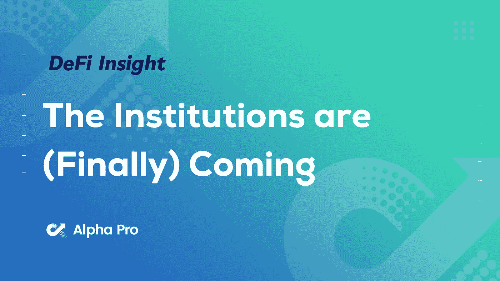
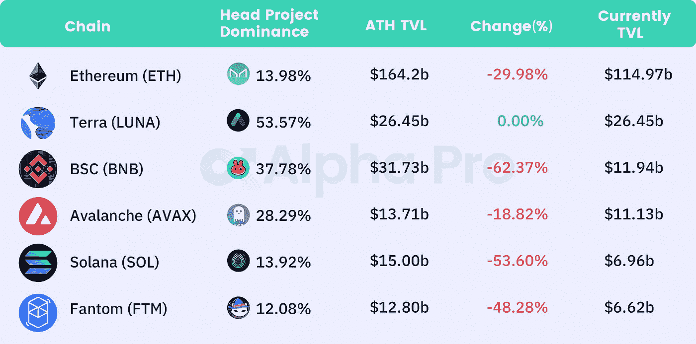
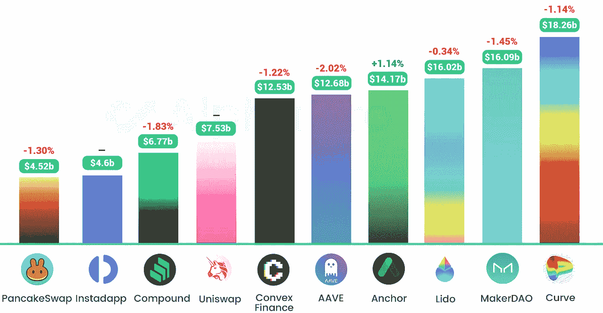
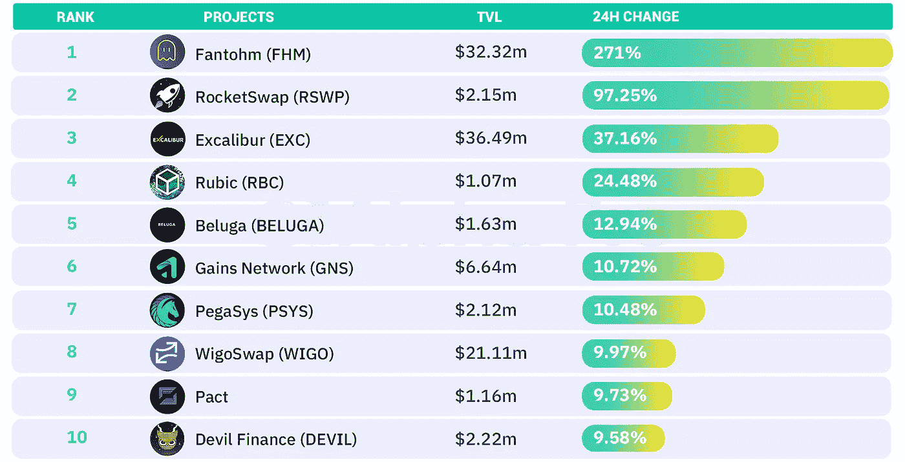
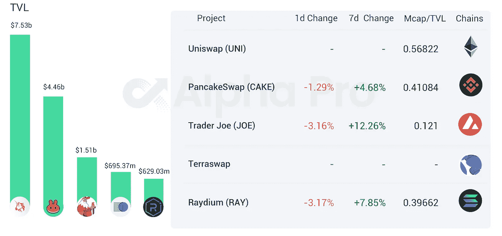
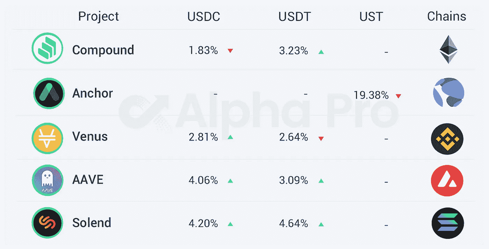

# DeFi Insight | 2022 年会是大多数机构采用加密货币的一年吗？

> 原文：<https://medium.com/coinmonks/defi-insight-will-2022-be-the-year-most-institutions-adopt-cryptocurrency-f5a99818408b?source=collection_archive---------40----------------------->

## 2022 年 3 月 21 日

## **报告:** [**机构**](https://messari.io/article/the-institutions-are-finally-coming) **终于来了@Messari**

> 机构投资者终于开始推动加密技术的进一步发展。最近的报告显示，70–80%的人计划在近期进行分配。
> 在上一个周期中错过的促进投资的急需基础设施和入口现在出现了。缺乏监护权被认为是投资的最大障碍。世界上最大的托管银行最近增加了加密托管..风险投资和对冲基金资本正处于历史最高水平，并显示出持续增长的迹象。与 2017 年周期相比，他们正在投入 100 倍的可用资本。FOMO 是真实的。投资了加密技术的机构每年比没有投资的机构高出 2.82%。
> 在一个收益匮乏的世界，高潜在回报投资正在被重新评估。

# 最新消息

## 定义

**TVL 动向:**目前全网 [DeFi](https://defillama.com/) 总锁定量为 2090 亿美元，24 小时内下降 1.02%

新的[加密法规](https://forkast.news/headlines/crypto-regulation-tax-reform-australia/)——包括税收改革——即将来到澳大利亚

**前总统打赌杨安泽:“DC 雷达之外的加密时代即将结束”**

**美国财政部:法定货币仍占金融犯罪的大部分**

**印度可能对秘密交易征收 28%的商品及服务税**

****卡塔尔计划发放数字银行牌照[探索 CBDC](https://cryptopotato.com/qatar-plans-to-issue-digital-bank-licenses-and-explore-a-cbdc-report/)****

****马来西亚通信部建议将密码作为法定货币****

******[**FTX**](https://twitter.com/sbf_ftx/status/1505683776722120704?s=21)**在澳洲建立本地业务********

## ******协议******

******Amasa & Animocabrands 将扩大 Web3 盈利潜力的范围******

*******[Gensyn](https://techcrunch.com/2022/03/21/gensyn-applies-a-token-to-distributed-computing-for-ai-developers-raises-6-5m/?tpcc=tcplustwitter)完成 650 万美元的种子融资******

*******[Sunny](/sunny-aggregator/sunsbr-launch-181ac28d5d26)推出 sunSBR，用户可以将 SBR 转换为 sunSBR******

******SushiSwap 发起社区提案，为[寿司道](https://forum.sushi.com/t/sushi-legal-structure/9720)建立基础******

******维塔利克·布特林提出新的分片提案 [EIP-4844](https://twitter.com/VitalikButerin/status/1505180310773944324?s=19)******

******雪崩时启动的子查询******

******NFT 贷款协议 [BendDA](https://twitter.com/BendDAO/status/1505770416459378692) O 宣布 BEND token 空投和 IFO 启动******

******BNB 链和以太坊上的[保护伞联网](https://twitter.com/peckshield/status/1505495324516782081) k 奖励池被抽干，黑客获利 70 万美元******

******李。金融宣布被利用，29 个钱包受影响******

******时代杂志接受 [ApeCoin 订阅](https://twitter.com/timepieces/status/1505531375222501380)******

## ******稳定币******

********亚洲数字银行推出 A-Bank 超级钱包，支持两种稳定币: [USDT 和美元](https://www.digitalnewsasia.com/business/asia-digital-bank-launches-its-e-wallet)********

********、**力瑞资本与[奥林巴斯道](https://twitter.com/OlympusDAO)达成[道协议](https://www.withtally.com/governance/eip155:1:0x0BEF27FEB58e857046d630B2c03dFb7bae567494/proposal/15812851838923579560813132538154057188122556009569708685901700070430672511861)******

## ****鲸鱼****

****以太鲸购买价值 660 万美元的猿****

# ****数据和分析****

## ****TVL 和 ATH 排名前六的连锁酒店对比****

********

****Source:[https://defillama.com/](https://defillama.com/)****

## ****最新 TVL 十大项目****

********

****Source:[https://defillama.com/chains](https://defillama.com/chains)****

## ****过去 24 小时 TVL 变化的前 10 个项目****

********

****Source: [https://defillama.com/](https://defillama.com/) Projects TVL≥1m****

## ****德克斯 TVL 排名****

*****DEX 跌幅最大的是* [Raydium](https://defillama.com/protocol/raydium) *，跌了 3.17%*****

********

****Source: [https://defillama.com/protocols/Dexes](https://defillama.com/protocols/Dexes)****

## ****APY DeFi 贷款公司****

*****USDC:最高贷款人:索伦德，利率为 4.20% APY*****

*****USDT:最高贷款人:索伦德，利率为 4.64% APY*****

********

# ****深潜****

******后来者的** [**密码指南**](https://www.nytimes.com/interactive/2022/03/18/technology/cryptocurrency-crypto-guide.html#)****

**** [## 后来者的密码指南

### 直到最近，如果你住在旧金山以外的任何地方，有可能几天甚至几周没有…

www.nytimes.com](https://www.nytimes.com/interactive/2022/03/18/technology/cryptocurrency-crypto-guide.html) 

**[**坚固度**](https://graph.org/Solidity-Cheatsheets-Pack-03-20) **备忘单包+奖金****

 **[## 重定向你-媒体

### 编辑描述

medium.com](https://medium.com/r?url=https%3A%2F%2Fgraph.org%2FSolidity-Cheatsheets-Pack-03-20)** 

****[**LDO**](https://twitter.com/0xHamz/status/1505619864228020226)**分析******

******创始人小贴士** [**筹集资金**](https://twitter.com/Shaughnessy119/status/1505652479559716871)****

******杰森对** [**密码投资**](https://twitter.com/mrjasonchoi/status/1505620196999921668?s=21) 的想法****

******去年** [**bot 对 bot**](https://twitter.com/bertcmiller/status/1505698943598010371?s=21) **攻击********** 

****一场 **回合:******

****DeFi Insight 是顶级 DeFi 和加密新闻和更新的来源。****

******https://twitter.com/AlphaPro_io 推特:******

********https://medium.com/feed/@alphapro.project**RSS:******

******提供的信息应被视为发展新闻，而不是投资建议。******

> *******加入 Coinmonks* [*电报频道*](https://t.me/coincodecap) *和* [*Youtube 频道*](https://www.youtube.com/c/coinmonks/videos) *了解加密交易和投资*******

# ******另外，阅读******

*   ******[3 商业评论](/coinmonks/3commas-review-an-excellent-crypto-trading-bot-2020-1313a58bec92) | [Pionex 评论](https://coincodecap.com/pionex-review-exchange-with-crypto-trading-bot) | [Coinrule 评论](/coinmonks/coinrule-review-2021-a-beginner-friendly-crypto-trading-bot-daf0504848ba)******
*   ******[莱杰 vs n rave](/coinmonks/ledger-vs-ngrave-zero-7e40f0c1d694)|[莱杰 nano s vs x](/coinmonks/ledger-nano-s-vs-x-battery-hardware-price-storage-59a6663fe3b0) | [币安评论](/coinmonks/binance-review-ee10d3bf3b6e)******
*   ******[Bybit Exchange 评论](/coinmonks/bybit-exchange-review-dbd570019b71) | [Bityard 评论](https://coincodecap.com/bityard-reivew) | [Jet-Bot 评论](https://coincodecap.com/jet-bot-review)******
*   ******[3 commas vs crypto hopper](/coinmonks/3commas-vs-pionex-vs-cryptohopper-best-crypto-bot-6a98d2baa203)|[赚取加密利息](/coinmonks/earn-crypto-interest-b10b810fdda3)******
*   ******最好的比特币[硬件钱包](/coinmonks/hardware-wallets-dfa1211730c6) | [BitBox02 回顾](/coinmonks/bitbox02-review-your-swiss-bitcoin-hardware-wallet-c36c88fff29)******