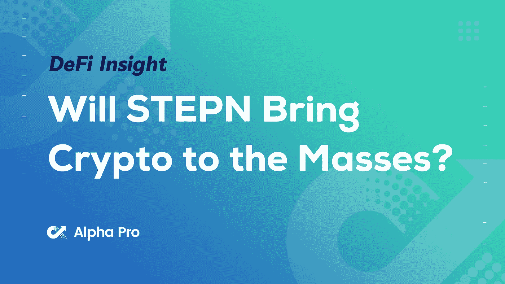
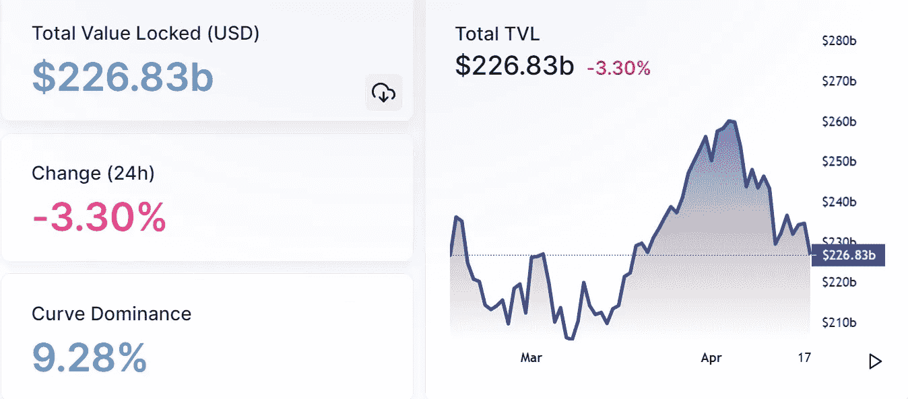
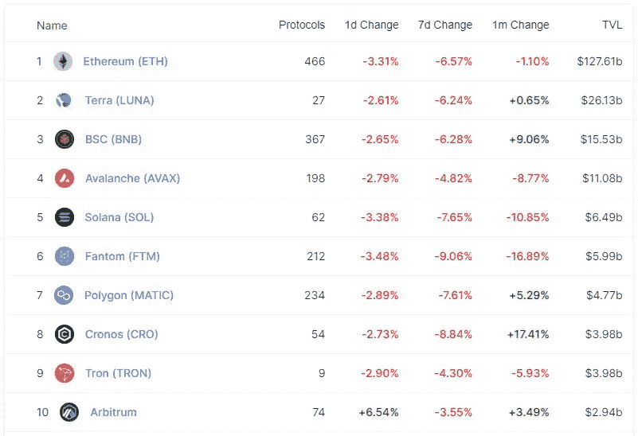
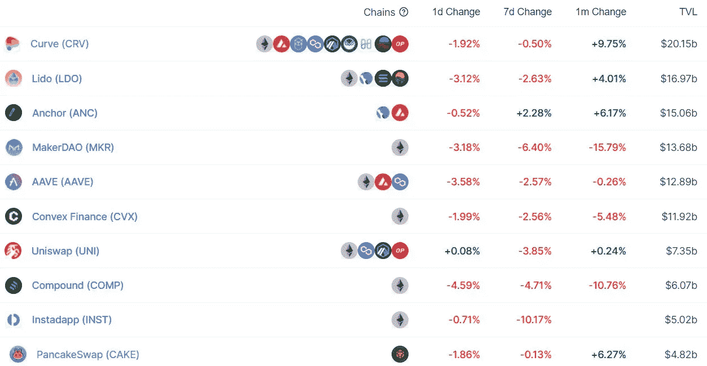
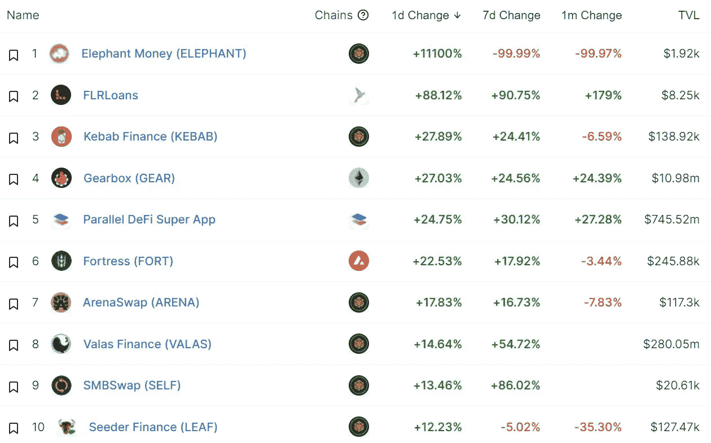
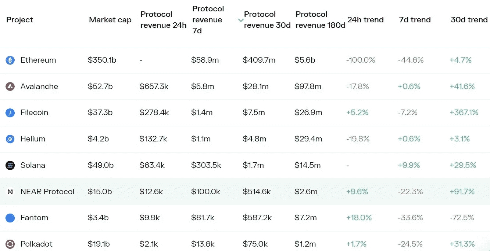
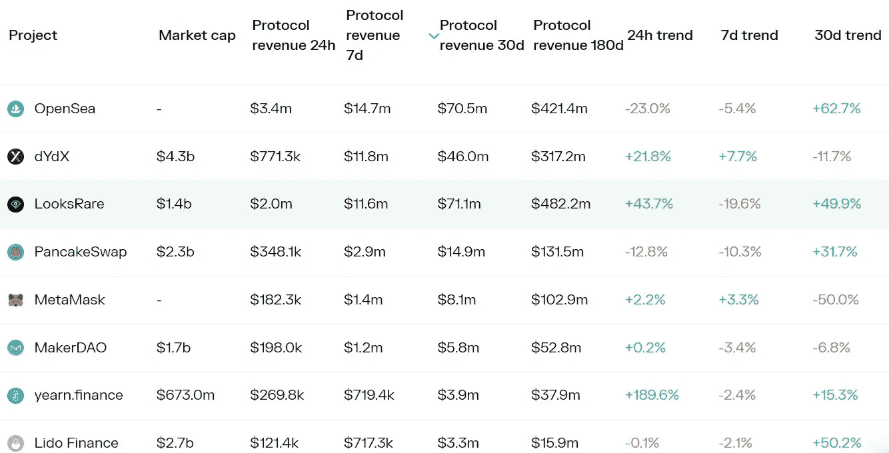
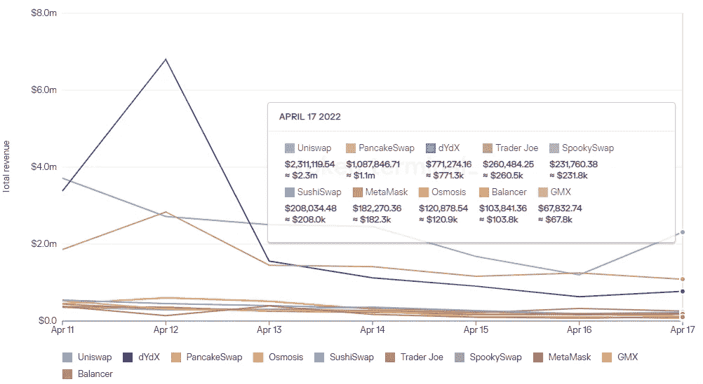
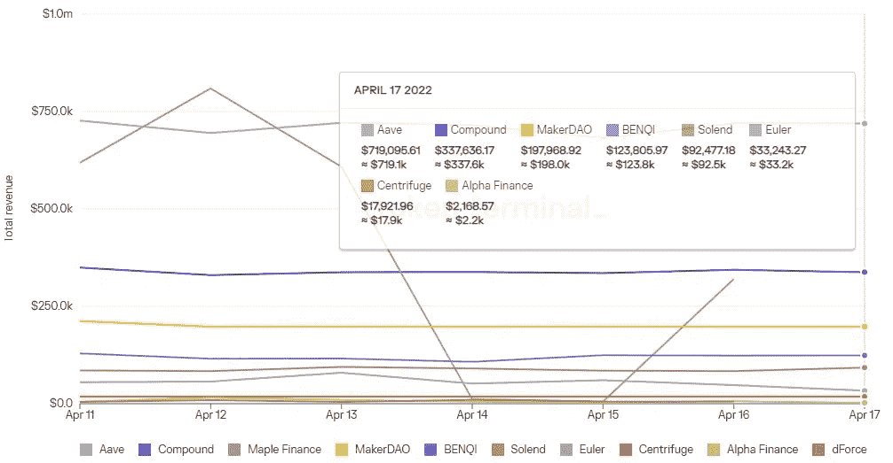

# DeFi Insight | STEPN 会把 Crypto 带给大众吗？

> 原文：<https://medium.com/coinmonks/defi-insight-will-stepn-bring-crypto-to-the-masses-fb17f0d5f8fb?source=collection_archive---------35----------------------->

## 2022 年 4 月 18 日

*今日 DeFi 数据&由 DeFi Insight 为您带来的新闻。*

> “我对 STEPN 感到兴奋，因为我真的认为它可能是一个革命性的健身应用程序，也可能是第一个将大量非加密人员纳入链的应用程序。
> 
> 我的非加密朋友不关心花哨的 DeFi 产品或令人困惑的流动性优化过程。但是他们对走路赚钱很感兴趣。一旦他们钱包里有了一些索尔和 USDC，也许他们会想探索如何赚取利息或以此为抵押借款。一旦你在游戏中有了一些皮肤，DeFi 会变得更有趣。”[**【纳特艾利森】**](https://cryptonat.substack.com/p/stepn?s=r)

# 最新消息

## 指标

**/**[uni Swap](https://news.bitcoin.com/uniswap-launches-swap-widget-devs-can-embed-the-dex-with-one-line-of-code/)推出交换小部件——开发人员可以用“一行代码”嵌入 Dex

## 贷款

**借贷协议 [Yeti 金融](https://twitter.com/YetiFinance/status/1515375143043751936) Mainnet 上线**

****/**关于如何使用 [Yeti Finance](https://twitter.com/0xtruco/status/1515694357562773505) 来增加既定收益率资产的杠杆的快速线索**

## **稳定币**

****[UST 市值超过 BUSD，排名第三](https://coinmarketcap.com/view/stablecoin/)****

******、**跨链稳定币交易协议[天狼星金融](https://twitter.com/Sirius_Finance/status/1515370846100987904)已启动 mainnet 并开始流动性挖掘****

******[USDC](https://usdc.cool/)对雪崩的供应量突破 12 亿美元******

## ******甲骨文******

********截至 Q1 2022，Chainlink 已支持超过 900 个分散式 [oracle networks](https://mobile.twitter.com/chainlink/status/1515376272674902024)********

## ******桥梁******

********[dForce](https://twitter.com/dForcenet/status/1515687118131150856)宣布推出跨链桥接工具 dForce Bridge********

## ******钱包******

********[meta mask](https://twitter.com/MetaMask/status/1515727239391809536?s=20&t=g4HNVNTJV_XS7Dlj8blrgg)建议用户禁用 iCloud 备份，以免被网络钓鱼诈骗窃取数据********

********[**HyperPay**](https://twitter.com/Hyperpay_tech/status/1515894739953807362)**钱包新增跨链即时兑换功能**********

## ******|警报******

********初步分析显示[青苗](https://twitter.com/peckshield/status/1515713013868814336?s=20&t=Xuwq7sq3-4SSRbFnfJ4xDw)养殖场的损失约为 1.82 亿美元********

## ******鲸鱼******

******鲸鱼警报:75000 条鲸鱼被转移到 FTX，价值 2 . 28 亿美元******

## ******政策与法规******

********监管秘密税收[方面的法律草案](https://news.bitcoin.com/draft-law-regulating-aspects-of-crypto-taxation-submitted-to-russian-parliament/)提交给俄罗斯议会********

******德国超越新加坡和美国成为对加密最友好的国家******

## ******NFT******

******现代汽车集团将推出基于社区的 NFT 市场，并发布官方的 NFT******

********NFT 项目[月鸟](https://moonbirds.xyz/)公开造币厂销售一空，成功募集 6600 万美元********

********、**移动赚钱应用 [STEPN](https://twitter.com/Stepnofficial/status/1515512544810893313) 日活跃用户超过 30 万******

******选秀节目《美国偶像》与西塔实验室推出实时[预测 NFT](https://cryptoslate.com/american-idol-to-roll-out-real-time-predictive-nfts-in-partnership-with-theta-labs/)******

********路易威登推进 NFT 实验，将 [NFT 奖励](https://www.theblockcrypto.com/post/142276/louis-vuitton-releases-new-nfts-as-fashion-brands-continue-experiments-in-gaming)引入其手机游戏“路易:游戏”********

# ******数据和分析******

## ******锁定的总价值(TVL)******

******目前全网 DeFi 总锁定量为 2268.3 亿美元，24 小时内下降 3.30%。******

************

## ******TVL 评出的十大连锁酒店******

************

******[https://defillama.com/chains](https://defillama.com/chains)******

## ******|最新 TVL 十大项目******

************

******[https://defillama.com/](https://defillama.com/)******

## ******|过去 24 小时 TVL 十大项目变化******

************

******[https://defillama.com/](https://defillama.com/)******

## ******协议收入******

## ******|累计协议收入排名靠前的项目(7D)_ 区块链(L1)******

************

******[https://tokenterminal.com/terminal/metrics/protocol_revenue](https://tokenterminal.com/terminal/metrics/protocol_revenue)******

## ******累计协议收入排名靠前的项目(7D) _ **Dapps (L2)********

************

## ******|前 10 大交易所的每日收入******

************

******[https://tokenterminal.com/terminal/markets/defi](https://tokenterminal.com/terminal/markets/defi)******

## ******|十大贷款协议的每日收入******

************

******[https://tokenterminal.com/terminal/markets/defi](https://tokenterminal.com/terminal/markets/defi)******

# ******深潜******

********安德烈·克罗尼耶:** [**隐文化**](https://andrecronje.medium.com/the-rise-and-fall-of-crypto-culture-3d0e6fd3e0e9) 的兴衰******

 ****[## 秘密文化的兴衰

### Crypto 死了。加密万岁。

andrecronje.medium.com](https://andrecronje.medium.com/the-rise-and-fall-of-crypto-culture-3d0e6fd3e0e9)**** 

******衡量影响** [**隐藏的 DEX 成本**](https://blog.0x.org/measuring-the-impact-of-hidden-dex-costs/)****

**** [## 衡量隐性 DEX 成本的影响

### 在本报告中，我们揭开滑动的帷幕——我们看看什么是滑动，并深入探讨 0x API…

blog.0x.org](https://blog.0x.org/measuring-the-impact-of-hidden-dex-costs/) 

**[**熊市中的两种策略**](https://twitter.com/hnt_guy/status/1514797393765568515)****** 

# ****报告****

******[**复合**](https://messari.io/article/state-of-compound-q1-2022)**Q1 2022 _ 梅萨里********

> ****⇢未偿还贷款和存款分别下降 42%和 32%。
> 第一季度，⇢清算指标增长 290%，超过 1.34 亿美元。
> 本季度⇢薪酬激励下降了 50%,到第二季度将降至零。
> 季度平均借款和存款利率分别为 3.8%和 1.5%
> 戴季度存款在第一季度下降了 90%以上****

****一场一场**回合:******

****DeFi Insight 是顶级 DeFi 和加密新闻和更新的来源。****

******https://twitter.com/AlphaPro_io**[**❤**](https://twitter.com/AlphaPro_io)****

******❤RSS:**[**https://medium.com/feed/@alphapro.project**](https://medium.com/feed/@alphapro.project)****

****提供的信息应被视为发展新闻，而不是投资建议。****

> ****加入 Coinmonks [电报频道](https://t.me/coincodecap)和 [Youtube 频道](https://www.youtube.com/c/coinmonks/videos)了解加密交易和投资****

# ****另外，阅读****

*   ****[Bookmap 点评](https://coincodecap.com/bookmap-review-2021-best-trading-software) | [美国 5 大最佳加密交易所](https://coincodecap.com/crypto-exchange-usa)****
*   ****最佳加密[硬件钱包](/coinmonks/hardware-wallets-dfa1211730c6) | [Bitbns 评论](/coinmonks/bitbns-review-38256a07e161)****
*   ****[新加坡十大最佳加密交易所](https://coincodecap.com/crypto-exchange-in-singapore) | [购买 AXS](https://coincodecap.com/buy-axs-token)****
*   ****[红狗赌场评论](https://coincodecap.com/red-dog-casino-review) | [Swyftx 评论](https://coincodecap.com/swyftx-review) | [CoinGate 评论](https://coincodecap.com/coingate-review)****
*   ****[投资印度的最佳密码](https://coincodecap.com/best-crypto-to-invest-in-india-in-2021)|[WazirX P2P](https://coincodecap.com/wazirx-p2p)|[Hi Dollar Review](https://coincodecap.com/hi-dollar-review)****