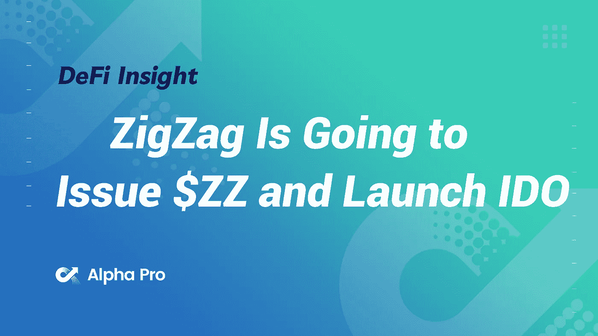
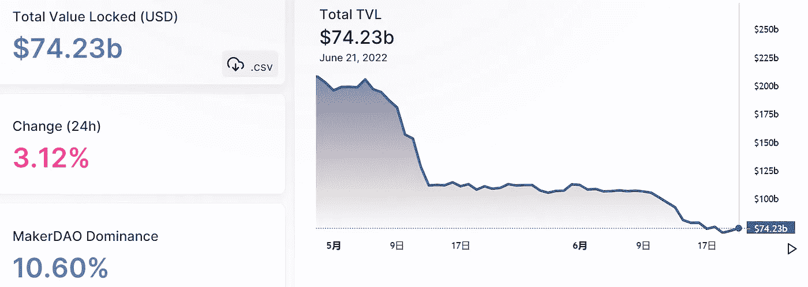
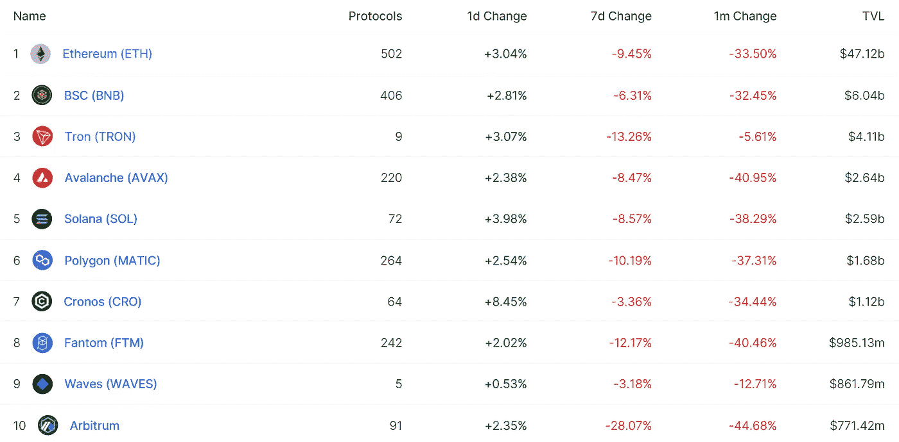
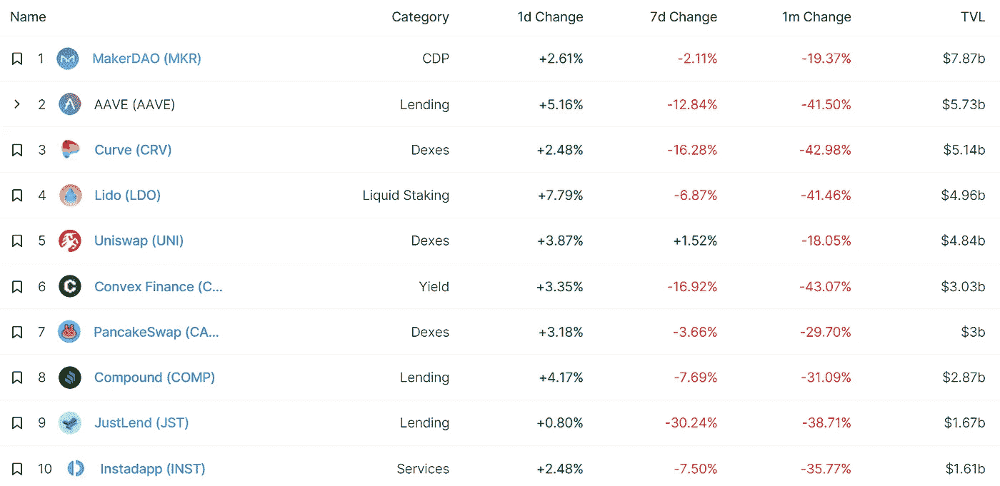
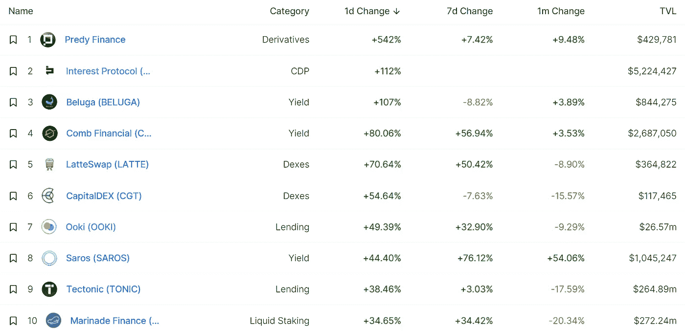
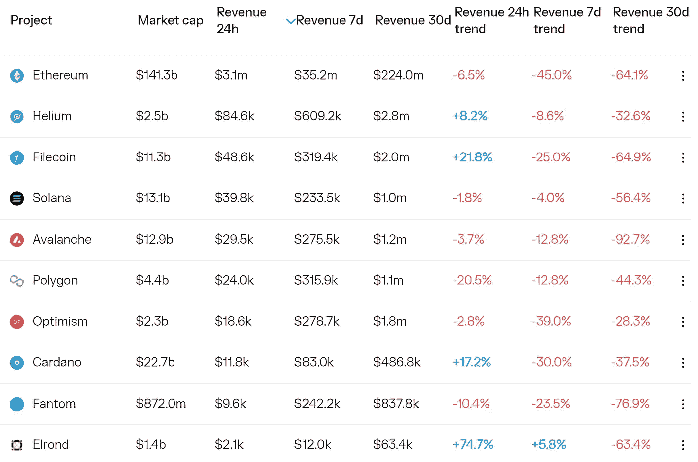
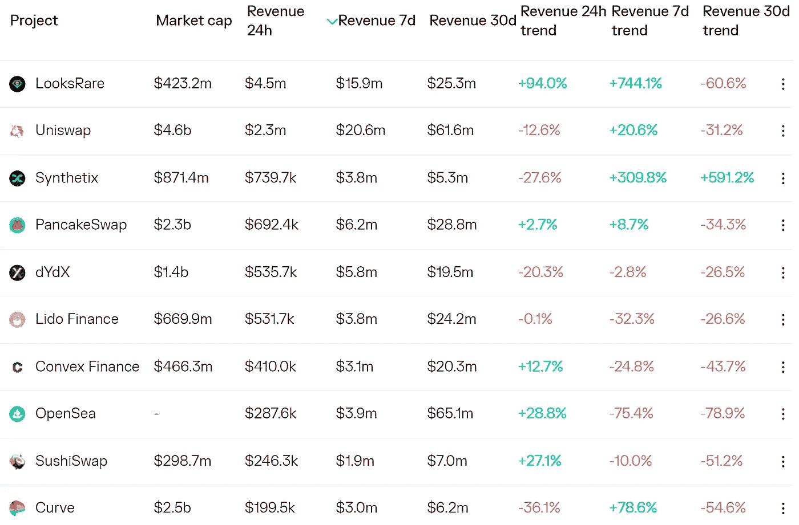
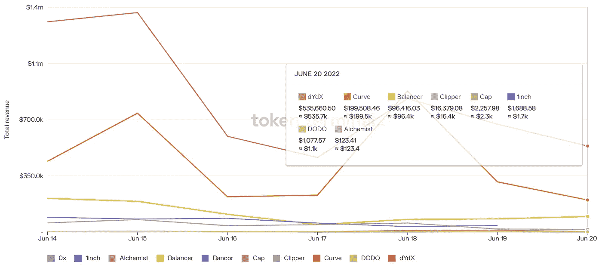
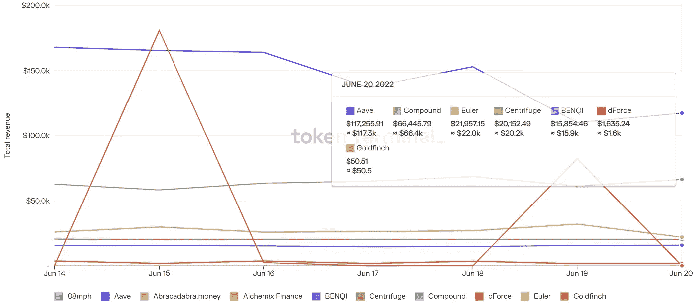

# DeFi Insight | ZigZag 要发行$ZZ，推出 IDO

> 原文：<https://medium.com/coinmonks/defi-insight-zigzag-is-going-to-issue-zz-and-launch-ido-9e45716a3550?source=collection_archive---------18----------------------->

2022 年 6 月 21 日

*今日 DeFi 数据&由 DeFi Insight 为您带来的新闻*

> 基于 zkSync 的 DEX ZigZag 宣布，它将推出其令牌$ZZ，第一轮 IDO 将于 6 月 24 日下午 3 点在自己的平台上举行。$ZZ 总供货量为 1 亿，IDO 供货量为 2m。用户需要使用$USDC 购买$ZZ。与此同时，ZigZag 将推出其 DAO，令牌将不得不进入流通，以允许投票。IDO 的第一轮允许用户在早期阶段成为 DAO 的一部分，他们将有投票权来决定空投的资格标准和令牌用例。目前，$ZZ 只在 zkSync 上提供现货交易。随着 zkSync 2.0 和 StarkNet 的发布，将推出融资融券和永续期货。*@*[来源](https://twitter.com/ZigZagExchange/status/1538914642277281793)

# 最新消息

## 贷款

如何证明批评家是错误的，在市场下跌中价格飙升至 0.9 美元

**[巴别金融](https://cryptopotato.com/babel-finance-set-to-delay-debt-payments-refutes-invovlement-with-3ac/?utm_source=blockworks-research)设定延迟债务支付，驳斥与 3AC 的牵连**

****[Solend](https://govern.solend.fi/dao/SLND/proposal/CmrzCA2vQxqptyzZ8A9RSG9GeC7gB8nxKs2RvXiiwvh6)发布新 SLND3 提案投票****

## ****外汇****

****随着 Hoo.com 交易所重新开放一些代币取款业务，Finblox 争夺更多的流动性，加密余波继续在 T21 蔓延****

******[cloud flare 宕机](https://techcrunch.com/2022/06/21/cloudflare-outage-crypto-exchanges/)打击加密交易所 FTX、Bitfinex 等******

## ******测试网******

********以太坊测试网[信标链](https://cointelegraph.com/news/ethereum-testnet-beacon-chain-launched-and-ready-for-trial-merge)启动，准备试合并********

## ******支付******

********加密支付处理器[共付](https://www.cryptoninjas.net/2022/06/20/crypto-payment-processor-coinpaid-increases-capital-reserves-to-5m-eur/)将资本储备增加到 500 万欧元********

## ******政策与法规******

********欧洲加密独角兽[比特熊猫](https://www.coindesk.com/policy/2022/06/21/european-crypto-unicorn-bitpanda-is-now-regulated-in-spain/?utm_medium=referral&utm_source=rss&utm_campaign=headlines)现在在西班牙受到监管********

******BTC 市场成为首家获得金融服务许可证的澳大利亚加密公司******

********[英国政府](https://www.coindesk.com/policy/2022/06/20/uk-government-backtracks-on-unhosted-wallet-data-collection-proposal/)撤回非托管钱包数据收集提案********

## ******NFT******

******自 7 月 21 日以来，OpenSea 的月度交易量创下新低，下跌了 195%******

********[BAYC](https://twitter.com/BoredApeYC/status/1538915309905760256?s=20&t=EvhymCEHDxBSCA-uHDtRPw)宣布与《滚石》杂志合作推出 NFT********

********[月付](https://www.theblock.co/post/153119/moonpay-officially-launches-utility-nft-minting-service-hypermint)正式推出公用事业 NFT 造币服务 HyperMint********

## ******基金******

******Afropolitan 从 Balaji Srinivasan 和其他人那里筹集了数百万美元来建立一个数字国家******

********、** Cypher Capital、火币创投、GSR Capital、LD Capital 投资区块链游戏平台“MetaOne”的 [$2M 回合](https://finance.yahoo.com/news/cypher-capital-huobi-ventures-gsr-053500251.html?.tsrc=fin-srch&guccounter=1&guce_referrer=aHR0cHM6Ly93d3cuY2hhaW5jYXRjaGVyLmNvbS8&guce_referrer_sig=AQAAABPqFkzTsgWPw7PWHiYUZ0REaT6Mvz6x6p2Qjop8LWjX-pqQNmy2FPlUTDqK2qUpGSBdESw)******

## ****观点****

****德意志银行预计，随着美联储采取“激进的加息路径”，美国经济衰退将会更快、更严重****

******Crypto 是基于大傻瓜理论:[菲律宾即将上任的中央银行行长](https://forkast.news/headlines/crypto-greater-fool-theory-philippines/?utm_source=blockworks-research)******

******萨尔瓦多总统称“比特币会回升，不要担心，享受生活”******

********/**[华尔街分析师](https://www.youtube.com/watch?v=XrerhHg-QE0)说美联储控制所有资产！******

# ****数据和分析****

## ****锁定的总价值(TVL)****

****目前全网 DeFi 总锁定量为 742.3 亿美元，24 小时增长 3.12%。****

********

## ****TVL 评出的十大连锁酒店****

********

## ****|最新 TVL 十大项目****

********

## ****|过去 24 小时内 TVL 增长的前 10 个项目****

********

## ****协议收入****

## ****|累计总收入最高的项目(24H)_ 区块链(L1)****

********

## ****|累计总收入最高的项目(24H) _Dapps (L2)****

********

## ****|前 10 大交易所的每日收入****

********

## ****|十大贷款协议的每日收入****

********

# ****深潜****

******[**比特币的下一步**](https://bitcoinmagazine.com/markets/whats-next-for-bitcoin) **是什么？********

**** [## 比特币的下一步是什么？

### 以下是一份免费的完整摘录，摘自最近一期的比特币杂志 Pro,《比特币杂志的溢价市场》…

bitcoinmagazine.com](https://bitcoinmagazine.com/markets/whats-next-for-bitcoin) 

**在** [**熊市**](https://www.newsbtc.com/news/company/in-a-bear-market-hold-onto-your-coins-try-to-earn-more-cryptos/) **中，抓住你的硬币&努力赚更多的硬币**

 [## 在熊市中，握紧你的硬币，努力赚更多的钱

### 受到卢纳和 UST 崩溃的打击，以及另一轮加息和资产负债表收缩的影响…

www.newsbtc.com](https://www.newsbtc.com/news/company/in-a-bear-market-hold-onto-your-coins-try-to-earn-more-cryptos/) 

**顶级** [**工具**](https://bitcoinist.com/top-tools-to-remain-anonymous-in-the-crypto-market/) **在密码市场保持匿名**

 [## 在加密市场保持匿名的顶级工具| Bitcoinist.com

### 加密货币市场中的匿名是一个重要的安全元素。拒绝向第三方提供个人…

bitcoinist.com](https://bitcoinist.com/top-tools-to-remain-anonymous-in-the-crypto-market/) 

**[**皇帝的衣服**](https://theknower.substack.com/p/where-are-the-emperors-clothes?utm_source=%2Finbox&utm_medium=reader2) **在哪里？****

** [## 皇帝的衣服在哪里？

### 一次拍摄。让我们轻松地回顾一下过去一周半发生的所有事情。加密是一个战场…

theknower.substack.com](https://theknower.substack.com/p/where-are-the-emperors-clothes?utm_source=%2Finbox&utm_medium=reader2) 

**分散存储:** [**Web3**](https://tokeninsight.com/en/research/market-analysis/decentralized-storage-a-pillar-of-web3) 的支柱

 [## TokenInsight _ 区块链评级 _ 区块链投资研究 _ 加密货币评级

### 作为一家数据和技术驱动的区块链技术公司，TokenInsight 提供专业的区块链数据、评级…

tokeninsight.com](https://tokeninsight.com/en/research/market-analysis/decentralized-storage-a-pillar-of-web3) 

# 报告

**[**倒下的多米诺骨牌**](https://insights.glassnode.com/the-week-on-chain-week-25-2022/) **:全线投降** _glassnode**

> **比特币市场本周经历了一场大规模的去杠杆化事件，跌破了 2017 年的 2 万美元 ATH。随着交易所、贷款机构和对冲基金破产、流动性不足或被清算，链内和链外实体都去杠杆化了。**

****[**Nubank**](https://www.theblockresearch.com/nubank-company-intelligence-152963)**公司情报** _theblockresearch****

******[**投保**](https://messari.io/article/insurace-cover-your-assets) **:保你的资产** _messari******

******[**数字资产**](https://coinshares.com/research/digital-asset-fund-flows) **资金流动周报** _coinshares******

******关于:******

****DeFi Insight 是顶级 DeFi 和加密新闻和更新的来源。****

******https://twitter.com/AlphaPro_io**❤[t53】](https://twitter.com/AlphaPro_io)****

******❤RSS:**[**https://medium.com/feed/@alphapro.project**](https://medium.com/feed/@alphapro.project)****

****提供的信息应被视为发展新闻，而不是投资建议。****

> ****加入 Coinmonks [电报频道](https://t.me/coincodecap)和 [Youtube 频道](https://www.youtube.com/c/coinmonks/videos)了解加密交易和投资****

# ****另外，阅读****

*   ****[如何在 FTX 交易所交易期货](https://coincodecap.com/ftx-futures-trading) | [OKEx vs 币安](https://coincodecap.com/okex-vs-binance)****
*   ****[CoinLoan 评论](https://coincodecap.com/coinloan-review) | [YouHodler 评论](/coinmonks/youhodler-4-easy-ways-to-make-money-98969b9689f2) | [BlockFi 评论](https://coincodecap.com/blockfi-review)****
*   ****[XT.COM 评论](https://coincodecap.com/profittradingapp-for-binance)币安评论 |****
*   ****[SmithBot 评论](https://coincodecap.com/smithbot-review) | [4 款最佳免费开源交易机器人](https://coincodecap.com/free-open-source-trading-bots)****
*   ****[比特币基地僵尸程序](/coinmonks/coinbase-bots-ac6359e897f3) | [AscendEX 审查](/coinmonks/ascendex-review-53e829cf75fa) | [OKEx 交易僵尸程序](/coinmonks/okex-trading-bots-234920f61e60)****
*   ****[如何在印度购买比特币？](/coinmonks/buy-bitcoin-in-india-feb50ddfef94) | [瓦济克斯评论](/coinmonks/wazirx-review-5c811b074f5b)**********