# Defi 投资论题—第一部分

> 原文：<https://medium.com/coinmonks/defi-investment-thesis-part-1-d882c3dfb12e?source=collection_archive---------11----------------------->

[在我的上一篇帖子](/coinmonks/rise-and-fall-of-defi-2-0-2f775ea50bd0)中，我讨论了 Defi 2.0 的兴衰。我谈到了 Defi 2.0 的主要结构缺陷&我们需要改进的领域，以使 Defi 3.0 更加强大和有弹性。在本文中，我使用第一原理方法来确定 Defi 未来 7 到 8 年的潜在机会。(请注意，我不喜欢短线交易、先令等。并且喜欢对 Defi 生态系统采取基本的、长期的观点)

## FUD

Terra 崩溃后，Twitter 社区的很大一部分人似乎对 Defi 失去了信心。甚至像迈克尔·塞勒这样的人似乎也认为目前的 Defi 是不可持续的。

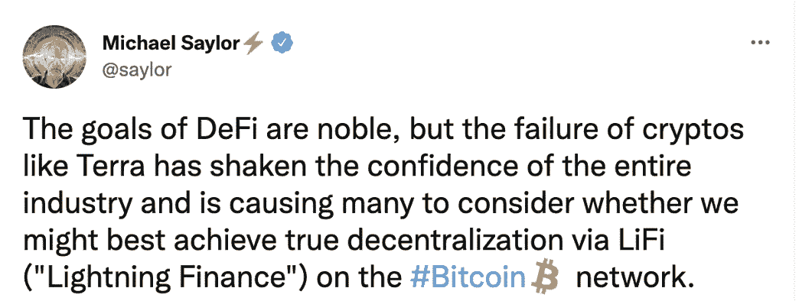

Source: Twitter @saylor

虽然这种观点很有道理，但所有创新项目在早期阶段看起来都像是“庞氏骗局”，这也同样成立。

让我们探究一下为什么…

## 创新还是庞氏？

早期投资者从高风险的创新中获得巨大回报，这种巨大的回报吸引了新的投资者，他们(通常)最终以“不合理”的高估值投资，这根本不符合基础技术当前的成熟水平。

这种“庞氏骗局”的好处是，这些进来的投资者(通常是“愚蠢的资本”)通过为高风险的好项目提供资金，为它们提供了生命线。如果没有异常高的初始回报所引发的对创新的大肆宣传/兴奋，科技企业家通常不可能拥有必要的资源来实现大胆的愿景。

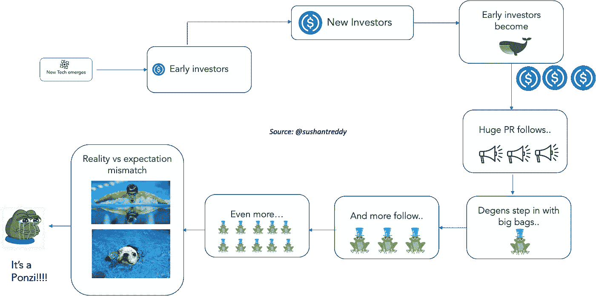

Current Ponzi Cycle in Defi

不幸的是，炒作也吸引了许多想利用这种兴奋感的“不靠谱”项目。普通投资者无法准确估计项目的价值，也不具备区分好项目和坏项目的工具。流入此类项目的愚蠢资本最终会流入聪明人的手中，这些人能够准确估计正在建设的项目的长期价值。

当现实出现时，弱者在遭受重大损失后被迫弃牌退出。这造成了恐慌、沮丧以及价格和价值的大幅下跌。正是在这个阶段，我们看到了主要的负面情绪，主要是在后期投资者中。

对此的唯一解药是建立你自己的长期假设，DYOR，并根据客观数据(不是“他说，她说”的数据，而是包括交易量、TVL、开发者、git 承诺、竞争、市场增长等在内的实际数据)不断调整假设。)

## 我的基本假设

我使用的一种方法是假设一个“最终状态”，然后回滚到当前状态，以确定为实现该最终状态而需要解决的缺失块/问题。

因为我定义了自己的最终状态，所以我花很少的时间去预测结果，而花很多时间去预测达到那个结果的最可能的路径。至少，这种方法从分析中剔除了犬儒主义。

作为 Defi 的长期信徒，我将从我的基本假设开始——

> “Defi 将在 2030 年存活。Defi 的效率、成本和速度将是 Cefi 的 10 倍。

从今天到 2030 年，有很多**未知的未知**可以使我的假设无效。政府可以禁止 Defi，CBD 可以消灭 Defi，等等。

在这篇文章中，我只是假设我的假设是真的(我强烈相信它会是真的)，并预测它所需的乐高积木是真的。

在我们继续下一步之前，这里是我的免责声明

> 这篇文章中没有什么是“投资建议”——我只是陈述我的个人观点。我没有资格提出任何投资建议&请仅将此贴作为教育内容阅读。

所以让我们深入研究一下。

## 第一性原理方法

作为一名工程师，我求助于我的“第一原理”方法来解决这个问题。

让我首先列出实现这一最终状态所需的 Defi 的关键构件。我在下面的图表中列出了它们

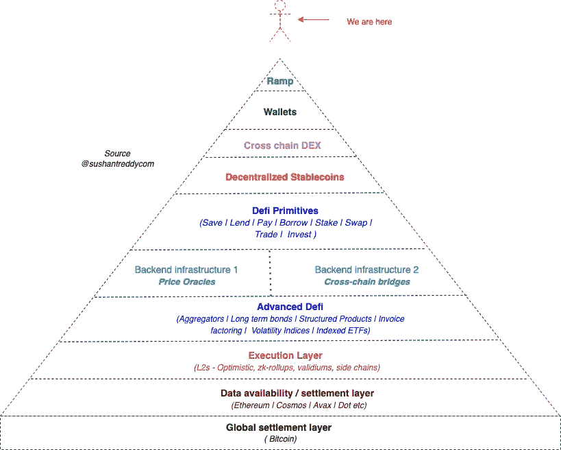

Defi Lego blocks & eco-system

我将走进每一块乐高积木，探索其中的“阿尔法”机会。

在这篇文章中，我将涵盖加密菲亚特坡道，钱包，和跨链索引。在接下来的几篇文章中，我将介绍剩余的部分。

> 加入 Coinmonks [电报频道](https://t.me/coincodecap)和 [Youtube 频道](https://www.youtube.com/c/coinmonks/videos)了解加密交易和投资

## 1.平面加密坡道

Defi 投资者需要的第一个乐高积木是能够通过 fiat-crypto 斜坡将 fiat 转换为 crypto，反之亦然。在入口匝道，我们将菲亚特转换为加密(购买加密)，在出口匝道，我们将加密转换回菲亚特(出售加密)。为了 Defi 的发展，进入和退出加密世界的平面到加密轨道必须便宜和无缝。

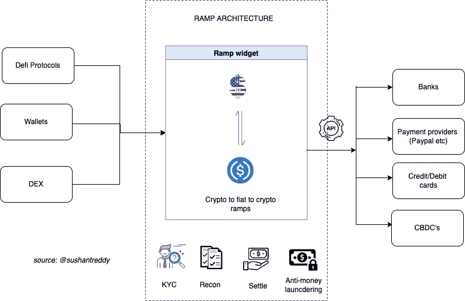

Crypto-Fiat Ramps are a key lego block for Defi

传统上，坡道是由集中交易所提供的(CEX)。CEXs 是投资者使用菲亚特购买密码的第一站。但随着分散交易所 dex(稍后将详细介绍)的预期兴起，Defi 可能会在加密领域获得其“Stripe”等价物。

处理所有文档/KYC、后端对账、支付和结算需求并提供简单的 APIs 前端小部件来处理入口/出口交易的公司将具有巨大的价值。

新的 Defi 协议、wallets & DEX 应该能够通过简单地添加几行现成的代码(即条纹模型)。

[在我的上一篇文章](/coinmonks/rise-and-fall-of-defi-2-0-2f775ea50bd0)中，我讨论了 Defi 3.0 支持现实世界借贷活动的必要性。由于在可预见的未来，大多数真实世界的交易将采用法定货币，因此上/下斜坡对于借贷、交易、投资、保险等真实世界用例的增长至关重要。

未来的 Ramps 还需要与一系列 CBDC(中央银行数字货币)集成，并需要支持与支付提供商和银行的集成。这一领域有许多待开发的创新…

不幸的是，这是政府检查加密活动最容易的攻击媒介。建造这些上/下坡道的公司必须应对当地央行和政府的大量监管、反洗钱和外汇合规要求。

我个人的哲学是尽可能远离政府/监管机构，因为我认为他们是一个净‘价值’破坏机器。

> **虽然加密菲亚特坡道是一个必要的具有巨大增长潜力的乐高积木，但我不认为这是一个高“阿尔法”机会，主要是因为涉及监管合规风险&。**

## 2.钱包

钱包是普通用户进入加密(及其子集，Defi)的门户。一个新的加密投资者将与之互动的第一个软件是一个“钱包”。作为市场领导者，Metamask 拥有超过 3000 万用户，在加密社区中非常受欢迎。

用户通过 Metamask 确认交易并支付、接收和交换硬币/代币——仅 Metamask 在 2021 年就创造了超过 2 亿美元的收入。

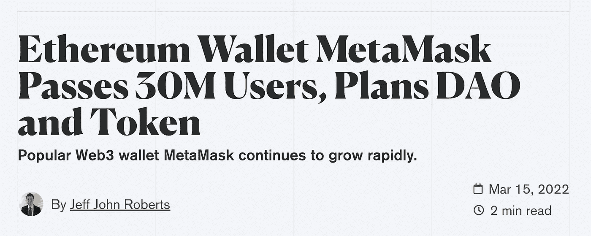

Metamask is the default application for crypto (Source: decrypt.co)

尽管钱包取得了巨大成功，但它们仍有很长的路要走。以下是当今钱包的一些问题

1.  **高额费用**:大部分钱包都在 L1 上运行，并向用户征收高额油费。40-50 美元的汽油费在以太坊很常见&如此高的交易成本往往会排挤小散户投资者。随着主要执行将转移到具有超低汽油费的 L2s，下一代钱包将建立在 L2 链的顶部。
2.  **可怜的 UX:** 如今，一个普通的 Defi 用户不得不浏览至少 10 个不同的网站来入股/经营/出借 crypto。虽然这对早期用户和爱好者来说是可以的，但下一个十亿用户不会乐意从一个网站转移到另一个网站。下一代钱包应该有一个简单的&直观的 UX，为普通人的需求而设计。从投资到借贷，从赌博到耕作到交易，钱包应该在一个地方提供一切。

crypto 仍处于早期阶段，最大钱包的月活跃用户仅占信用卡用户总数的 1%。假设第二层支付网络扩大，信用卡和借记卡很有可能会过时。

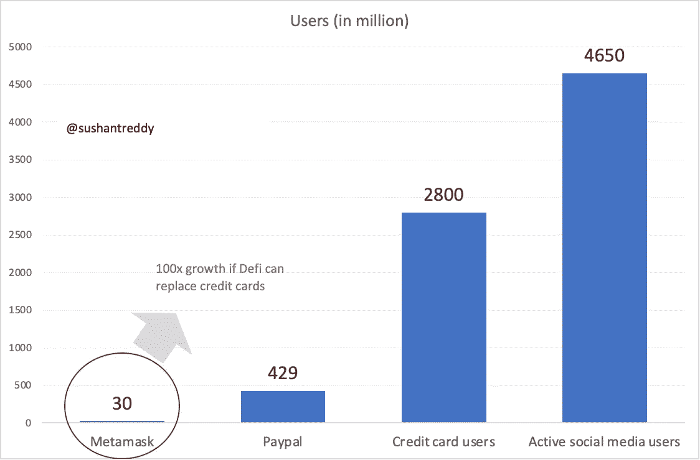

Wallet users are a fraction of potential users

由于钱包控制着零售用户，钱包将对任何 Defi 协议上的每笔交易收取“佣金”。每个 Defi 协议都必须支付钱包才能接触到散户投资者。不管哪个 Defi 协议赢，只要 Defi 赢，钱包就翼。

我非常看好 Metamask 和 Argent 等钱包，这两家公司都表示计划推出代币。这是一个巨大的“阿尔法”机会，我会密切关注。

> 没有钱包的大规模采用，Defi 就无法成功。未来的钱包将有直观的 UX，并将在 L2s 上运行。一个重要的 alpha 机会—Metamask 和 Argent 是两个潜在的机会。

## 3.跨链分散交换

第三个乐高积木是“跨链分散交易所”——交易所是一个加密投资者可以买卖其资产的地方。如上所述，这些通常是任何持有法定货币的投资者的第一选择。

第一波加密技术的采用是由集中交易所(CEX)引领的，如比特币基地、币安、FTX、北海巨妖等。集中交易使得投资者以合理的交易费用买卖密码变得容易。作为加密领域的主要做市商平台，CEXs 为数以千计的新加密项目创造了巨大的流动性。

与 DEX 相比，cex 有许多优势(正如它现在存在的那样)。我用**红色**突出显示了德克斯比 CEX 差的地方，用**绿色**突出显示了德克斯比 CEX 好的地方。CEX 的主要优势是高流动性(低滑点)，多样化的代币世界，以及大交易商喜欢的订单式做市。

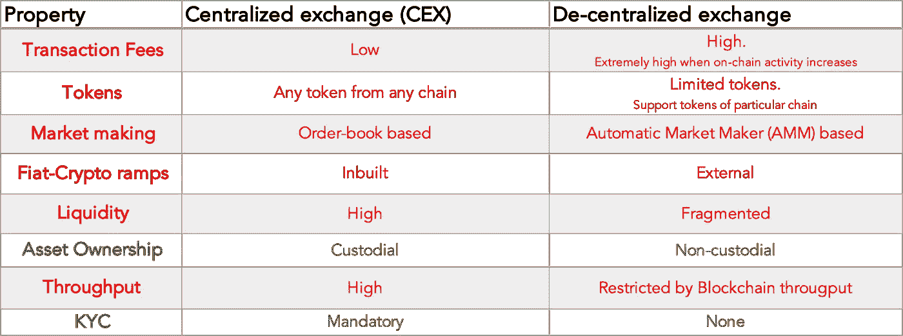

CEX v/s DEX

让我们来看看突出这一点的一些数字:

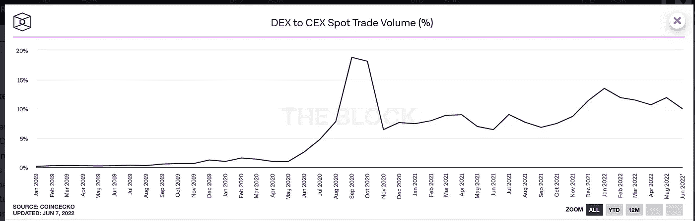

Source: The Block Crypto

上图显示，在现货市场，T4 指数的总成交量仅为 CEX 总成交量的 10%左右。DEX/CEX 交易量的总体趋势线明显在增加。

如果我们看看最著名的 DEX(Uniswap)v/s top cex，我们会发现 unis WAP 现在的交易量几乎与比特币基地相当。

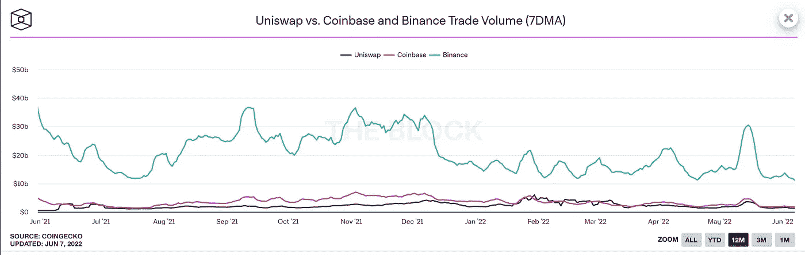

UniSwap has caught up with Coinbase (Source: The Block Crypto)

**即将到来的 DEX 优势**

我预计在未来 5 年内，DEX 现货交易量将达到 CEX 交易量的 50%。下一波 DEX 创新将有 3 个组成部分——稳健的基于订单簿的做市、深度流动性和多链资产交易。

1.  **L2 基德克斯的崛起**

由于第二层汇总的兴起，以前是集中交易所的特权的订单簿现在可以被分散的平台访问。有了链上和链下 ZK-roll ups(validium)，多次失败出价/报价的成本将不再是一个关键因素。这方面的一个例子是 dYdX，它使用 StarkWare 第 2 层技术来建立其永久交易平台。

**2。跨链指数的上升**

dex 的另一个主要缺点是它们无法与另一个链上的令牌通信。Uniswap、Curve 等 dex 只能处理以太坊链上的 ERC-20 令牌。

与 CEX 用户可以出售自己的 ETH 来购买 BTC 或 AVAX 不同，DEX 用户只能处理与他正在使用的链兼容的令牌。包装资产(WBTC、WETH 等)更像是“黑客”，而不是真正可扩展的解决方案。这些打包的资产通常由中央托管人管理，这与 DEX 的目的背道而驰。

这就是真正经过战斗考验的跨链 dex 发挥作用的地方。THORChain 等玩家正在建立非托管平台，以分散的方式帮助交换本地资产。随着跨链通信技术(在下一节讨论)的改进，将会出现更多的跨链桥，允许用户访问大量的硬币/代币。

**3。跨链信息平台的兴起**

dex 的另一个主要限制是跨多个链的流动性分散。如今，每个连锁店都有自己位于 AMM 的 DEX(以太坊上的 Uniswap 和 Curve，AVAX 上的 TraderJoe，Fantom 上的 SpookySwap 等)。这导致了流动性“孤岛”，无法在不造成重大损失的情况下处理巨额交易。

下滑会产生意想不到的影响，如强制清算抵押品等，导致用户体验不佳。用户也可以在高流动性的集中交易所进行买卖，在那里他们可以得到最优惠的价格。

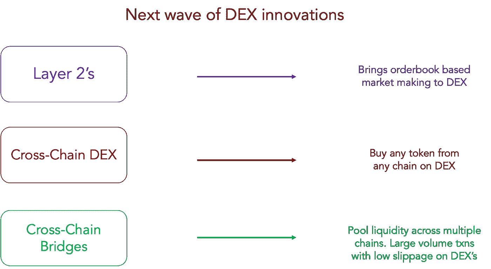

Next wave of DEX innovation

**大机遇**

我们在这里谈论的是大数字——让我们使用一些经验法则计算来量化市场机会。

Block Research 估计，2021 年在集中交易所交易的资产为 14 万亿美元，比上一年增长 689%。在 1.6 万亿美元的平均市值下，交易量/市值比达到约 9 倍。假设 2021 年是牛市的一年，让我们以约 6 倍的交易量/市值倍数来看。

如果我们假设保守的 50% CAGR 市值，我们最终得出 2030 年的市值约为 30 万亿美元。这使得我们的交易资产总额达到 180 万亿美元。

假设其中 50%在 DEX 上交易，我们得出的数字是 90 万亿美元。如果我们收取 0.1%的交易费，那么 dex 的年收入将达到 900 亿美元。

将其与 DEX 的当前收入和销售价格进行比较。Uniswap 的收入约为 9 亿英镑，市盈率为 6 倍。一个真正的跨链 DEX 建立在第 2 层上，由跨链桥提供动力，汇集流动性，可以轻松赚取 250 亿美元。市盈率为 6，我们谈论的是 1500 亿美元的市值，即使对 Uniswap 来说也是 100 倍的增长机会。

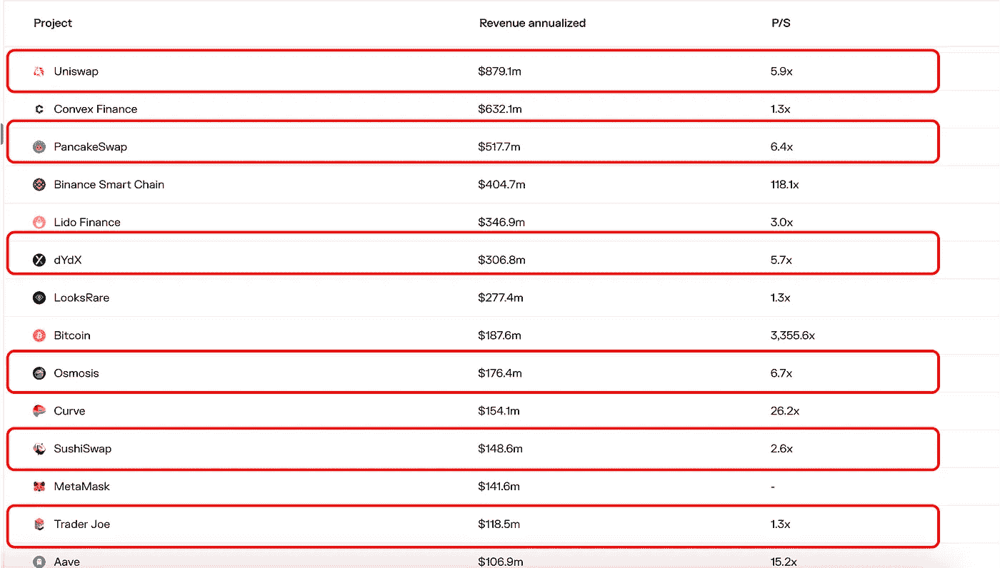

Source: Token Terminal

## 结论

总结一下，下面是这篇文章的要点:

1.  从加密到加密的坡道是巨大的机会，但存在与法规冲突的风险。当 CBDCs 上线时，这里可能会有机会。由于高监管和合规风险，我个人将远离这一领域
2.  钱包是通往密码世界的大门。如果加密钱包可以取代信用卡，我们可以看到活跃用户至少增长 100 倍。下一代钱包将在第二层上运行，并将支持所有的 Defi 原语。所有 Defi 协议都将争先恐后地与钱包合作，并为其向用户提供接入而付费。我认为 Metamask 和 Argent 是钱包领域巨大的潜在机会(预计两者都将很快推出自己的代币)。
3.  德克斯目前正在做 10%的 CEX 卷。我认为，由于 L2s、跨链 DEX 和跨链消息平台的出现，下一波 DEX 创新将使 DEX-CEX 交易量在未来 3 年内增加 50%。我预计到 2030 年，dex 的潜在收入机会为 900 亿美元。**我认为 Thorchain、dYdX、Uniswap、Curve 和 Cosmos DEXs(重力、渗透)等平台是 DEX 领域的潜在机会。**

在我的下一篇文章中，我将讨论我的 Defi 假设中的下一组乐高积木。订阅，不要错过未来的更新。