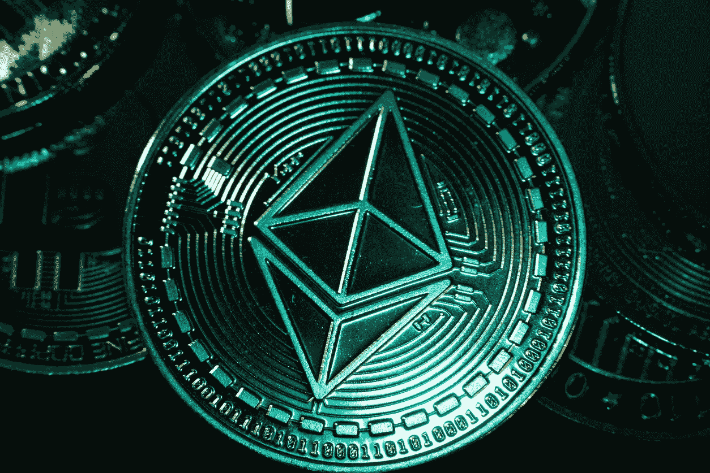
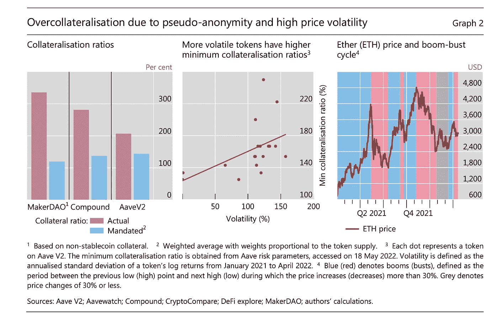
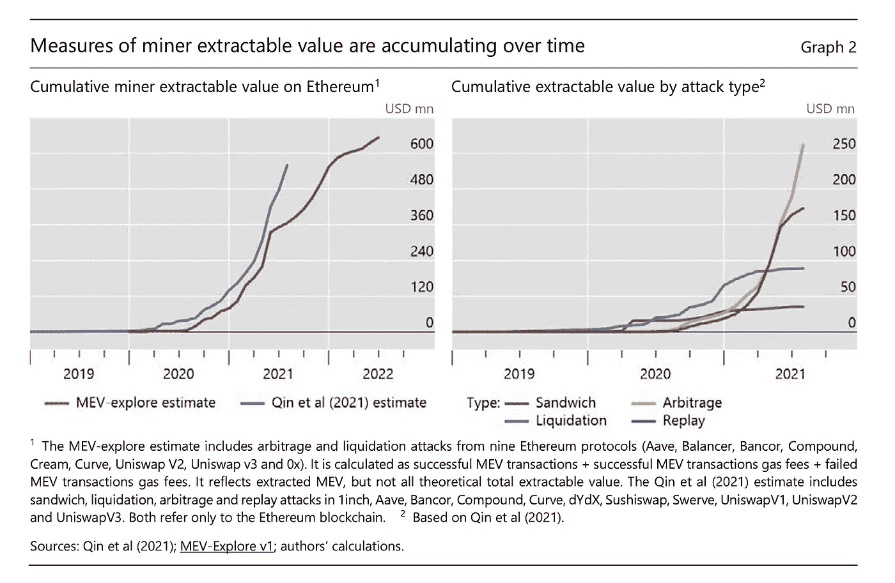
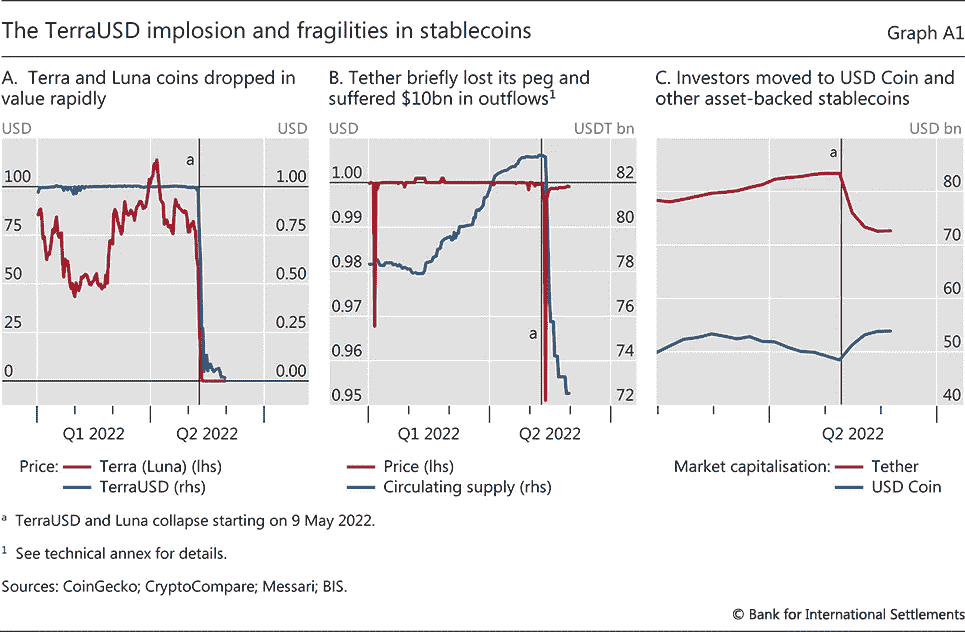
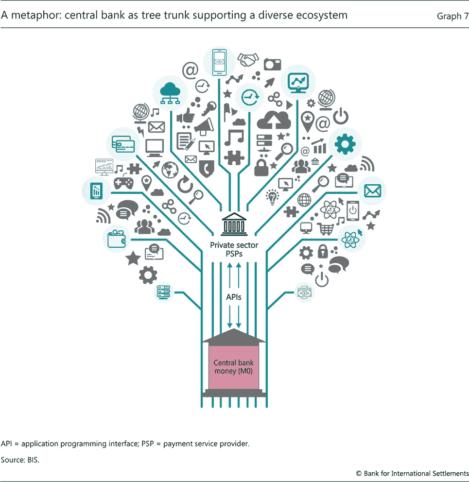

# 迪菲死了。戈夫菲万岁。🙄

> 原文：<https://medium.com/coinmonks/defi-is-dead-long-live-govfi-5a4843242067?source=collection_archive---------10----------------------->

国际清算银行提出了一个基于主权的互联货币框架的愿景，DeFi 社区无需申请。

Source: iStock

国际清算银行(BIS)似乎感觉到了由最近的 stablecoin 崩溃、客户资产锁定和加密领域的普遍破产(我们最近的“加密冬天”)导致的水中的血液，在 DeFi、crypto、CeFi、Web3 上发布了 3 篇独特但内在关联的重要论文。

国际清算银行为区块链技术提供了更好的服务，纯粹作为全球主权国家支付基础设施的公用事业(在本文中讽刺地称为“GovFi”)。

在 2022 年 6 月 14 日发布的第一篇论文中:[“DeFi lending:无信息的中介”](https://www.linkedin.com/posts/gregorywagner_defi-lending-intermediation-without-information-activity-6942598081704054784-LtPv/)，国际清算银行提出了合理的论点，即 DeFi lending 不为非银行或银行存款不足的人服务，这应该是证明更广泛采用 DeFi 产品的主要原因:

[Source: BIS “DeFi lending: intermediation without information”](https://www.bis.org/publ/bisbull57.htm)

*   没有任何形式的无抵押违约贷款。资产和超额抵押都是为大量“伪匿名”借款人服务所必需的，而这两者都不是非银行机构所能负担得起的。
*   国际清算银行表示,“DeFi 仍然是一个幻想”,因为只有“了解你的客户”KYC(一个据称是集中的公用事业)可以实现可信的信用评估，并提供无担保贷款，这是为银行贷款不足的人服务的一个关键组成部分。
*   因此，DeFi 贷款仍然主要用于机构加密资产投机，因此对“实体经济贷款”没有用处
*   国际清算银行认为，对 DeFi 技术来说，将实物资产标记化是一个机会，它可以解锁“锁定的股权”，应该被用来帮助抵押贷款。

在 2022 年 6 月 16 日发表的第二篇论文中: [*【矿商作为中介:加密和 DeFi 中的可提取价值和市场操纵】*](https://www.bis.org/publ/bisbull58.htm) *，*国际清算银行认为，在“工作证明”(PoW)分散共识验证下，对矿商的经济激励正在鼓励加密市场操纵；一种不道德的，不道德的，基本上是非法的行为:

[Source: BIS: “Miners as intermediaries: extractable value and market manipulation in crypto and DeFi”](https://www.bis.org/publ/bisbull58.htm)

*   矿商在经济上受到激励，根据每笔交易给区块带来的回报大小，对某些交易进行优先排序。这被称为“矿工提取值”(MEV)。
*   MEV 可能会导致市场操纵策略，因为矿商能够敏锐地洞察到，每笔优先交易在整体发布之前会如何影响市场。这种操纵策略包括“前跑”、“后跑”、“三明治交易”等等。
*   像许多人一样，国际清算银行强调了明确而迫切的监管需求，以协调加密市场与证券和其他受监管市场。
*   这篇及时的论文恰好与 [SEC 最近对“订单流支付”](https://www.bloomberg.com/news/articles/2022-06-08/sec-chief-takes-aim-at-payment-for-order-flow-in-sweeping-plans)的重新审查相吻合，这是一种由做市商获得订单流的方法，做市商向经纪人支付(奖励)订单并执行股权交易。

最近一篇论文，发表于 2022 年 6 月 21 日 [*III。未来的货币体系*](http://III. The future monetary system) ”，国际清算银行利用其之前的论点阐述了其最终愿景:通过各种央行数字货币(CBDCs)的互联网络实现货币全球化。

> …甚至受监管的、由政府支持的稳定银行也能支持支付网络的想法，被国际清算银行彻底否定了..

在这里，国际清算银行宣布，去中心化、自主化的支付架构概念一出现就不复存在了。国际清算银行认为，只有数字账本技术(DLT)的元素应该被挽救——用于主权国家支付基础设施(CBDCs)的用途。

这篇论文接着指出，国际清算银行否定了稳定货币代表任何可行的支付工具的概念。以 TerraUSD 内爆为背景，国际清算银行认为，即便是受监管的、由菲亚特支持的稳定银行也能支撑支付网络的观点是站不住脚的:

[Source: BIS “The Future Monetary System”](https://www.bis.org/publ/arpdf/ar2022e3.htm)

*   国际清算银行认为，稳定的货币“提高了”央行发行的资金的可信度，但缺乏央行提供的任何保护或监管护栏。
*   国际清算银行声称，稳定货币目前一般不用于支付，而是主要用于促进加密货币套利，这实际上束缚了流动性，并使货币系统分裂。
*   国际清算银行指出，“一些人质疑是否应该禁止稳定的硬币”。
*   然后，国际清算银行重申了之前的说法，即 DLT 目前的状态存在结构性限制，这使得它高度分散，不可扩展，容易受到大规模黑客攻击和欺诈的影响。

为了更好地保护消费者免受加密欺诈，消除监管套利，降低系统风险并支撑加密经济带来的金融稳定，国际清算银行提出了“未来货币体系的更光明愿景”:

国际清算银行的结论是，基于主权的支付轨道建立在成熟的数字分类账技术上，支持 CBDCs(由 API 网络提供支持)，将更好地实现货币市场的更大控制、稳定性和安全性，同时鼓励货币的全球互操作性。

> 国际清算银行强调，世界已经从国际清算银行称之为“岛屿经济体”的货币优势小筒仓中发展起来

[Source: BIS — III. The future monetary system](https://www.bis.org/publ/arpdf/ar2022e3.htm)

*   在提议的 CBDC 支付基础设施下，交易验证可能通过交易参与者以及验证交易唯一性的第三方参与者(公证人)的一致意见来实现，以防止重复花费。国际清算银行表示，“央行是公证人的自然候选人”。
*   国际清算银行强调，世界已经从国际清算银行称之为“岛屿经济体”的优秀货币小筒仓中发展起来，世界已经准备好接受一个全球互联的支付解决方案，称为多 CBDC (mCBDC)平台(有人可能会说，这已经具备了单一货币全球化的开端)。
*   在全球 mCBDC 结构下，简化的 KYC 尽职调查(如验证的证书)可以识别消费者，保护隐私，并解决金融包容性的障碍(显然，DeFi 社区尚未找到答案)。
*   国际清算银行得出结论，全球 CBDC 网络符合公众的最佳利益，他们将领导央行界鼓励在这一倡议中的合作。

离别的思绪

> ..国际清算银行的提议还让人想起一个反乌托邦的场景，即主权国家可以轻而易举地行使权力，监控和控制消费者支付。

*   对于全球支付基础设施面临的挑战，国际清算银行提出了一个理论上理想化、操作上优雅的解决方案。全球支付基础设施将完全由主权国家运营。
*   虽然国际清算银行建议在批发 CBDCs 和零售支付之间划定界限，但国际清算银行坚持认为“央行是验证过程的核心”。
*   关于全球 CBDC 支付轨道的提议意味着不仅仅是转向技术更先进的 SWIFT 版本。主权国家也可能充当“公证人”，在共识机制下验证交易。这将敲响警钟。
*   尽管国际清算银行对全球互联的 mCBDC 框架的乌托邦式观点提供了“未来货币体系的更光明愿景”，但国际清算银行的提议也唤起了一种反乌托邦情景，即主权国家可以轻松行使权力来监控和控制消费者支付。

> 社会评分、恶习指数和其他情景的建立会起到限制甚至否定消费者使用货币支付的自由意志的作用。

*   在错误的 mCBDC 情景下，主权国家可能会发展其公证交易验证权力，以更容易地证明对消费者支付的控制。公民社会评分、恶习指数和其他情景的建立可能会起到限制甚至否定消费者使用货币支付的自由意愿的作用。
*   从不信任到“信任我们”
*   从无限制支付到允许支付
*   从 DeFi 到 CeFi 再到 GovFi

不幸的是，由 DeFi 社区开发的区块链技术本应*减少*对日益集中的政府支付控制的依赖，但最终可能是同样的技术，进一步集中和全球化了货币的未来。

> 加入 Coinmonks [电报频道](https://t.me/coincodecap)和 [Youtube 频道](https://www.youtube.com/c/coinmonks/videos)了解加密交易和投资

# 另外，阅读

*   [如何在 FTX 交易所交易期货](https://coincodecap.com/ftx-futures-trading) | [OKEx vs 币安](https://coincodecap.com/okex-vs-binance)
*   [CoinLoan 审查](https://coincodecap.com/coinloan-review) | [YouHodler 审查](/coinmonks/youhodler-4-easy-ways-to-make-money-98969b9689f2) | [BlockFi 审查](https://coincodecap.com/blockfi-review)
*   [XT.COM 评论](https://coincodecap.com/profittradingapp-for-binance)币安评论 |
*   [SmithBot 评论](https://coincodecap.com/smithbot-review) | [4 款最佳免费开源交易机器人](https://coincodecap.com/free-open-source-trading-bots)
*   [比特币基地僵尸程序](/coinmonks/coinbase-bots-ac6359e897f3) | [AscendEX 审查](/coinmonks/ascendex-review-53e829cf75fa) | [OKEx 交易僵尸程序](/coinmonks/okex-trading-bots-234920f61e60)
*   [如何在印度购买比特币？](/coinmonks/buy-bitcoin-in-india-feb50ddfef94) | [WazirX 评论](/coinmonks/wazirx-review-5c811b074f5b)