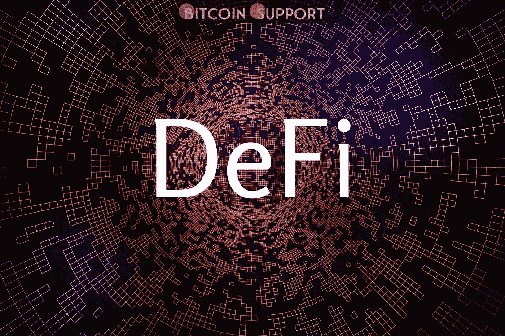
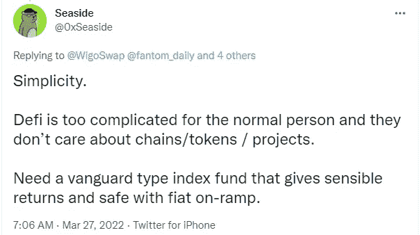
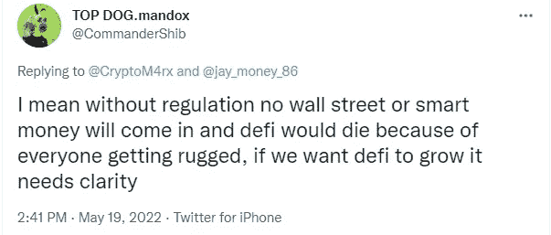

# DeFi 还不晚；它需要做的就是解决这三个主要问题

> 原文：<https://medium.com/coinmonks/defi-isnt-dead-it-just-needs-to-address-these-three-major-issues-5b5ea4a6918d?source=collection_archive---------23----------------------->

## **德菲没有死；它只需要解决这三个主要问题**

对于 DeFi 来说，这是艰难的一年，除非项目优先考虑安全性、监管和可用性，否则事情不太可能有所改善。

一些分析师很好地记录了去中心化金融面临的持续挑战，最近 Terra 生态系统的崩溃进一步证实了 DeFi 存在严重问题的事实。https://twitter.com/petergyang/status/1524395033570422784

让我们来看看专家们认为 DeFi 需要做些什么来复兴自己。

## **可用性得到改善**

迄今为止，复杂的界面、令人困惑的多步下注过程以及各种代币收益率的不明确性，阻碍了开放和不受审查地进入全球去中心化金融系统的承诺。

https://twitter.com/RugDocIO/status/1480185183882166276

大多数平台上的用户体验达不到人们对价值数百万美元的平台的期望，而且布局可能很复杂，糟糕的文档让用户感到沮丧。越来越多的区块链网络拥有自己的 DeFi 生态系统，这可能会让从未使用过软件钱包的新人望而生畏，增加了他们的困惑。

最后，需要一个更有效的系统在一个安全的环境中对公众进行 DeFi 教育，以帮助大规模采用。否则，你将面临与当前金融体系相同的问题，只有一小部分人从中受益。

## **优先考虑安全必须成为重中之重**

因为任何人都可以用华而不实的承诺启动一个项目，结果只会让天真的投资者上当受骗，留给他们一个毫无价值的代币，DeFi 行业通常被称为狂野西部。精明的合同缺陷也会耗尽善意项目的流动性。2022 年 2 月对虫洞令牌桥的攻击导致了 120，000 个包裹以太(wETH)令牌的丢失，这就是最近的一个例子。

为了让更多的人在探索不断扩大的 DeFi 生态系统时感到安全，为了让政府远离该行业，将需要针对恶意行为者和协议漏洞的更高级别的安全性和保护。

相关:- [比特币价格已升至 32.3K 美元，但三个因素可能会限制其复苏](https://bitcoinsupports.com/the-price-of-bitcoin-has-risen-to-32-3k/)

## 你可以自我监管，也可以被监管

对于许多 DeFi 分析师来说，第三个最重要的因素是需要更清晰的监管。虽然许多加密投资者重视该资产类别不受监管的性质，但尚未参与加密货币和 DeFi 的大多数公众可能会保持警惕，直到政府批准该资产类别。

由于最近 Terra 生态系统的崩溃，监管可能是 DeFi 首先要克服的挑战之一。这些法规的最终形式尚不清楚，但它们将作为 DeFi 部门发展和成熟的起点。

**免责声明:以上为作者观点，不应视为投资建议。读者应该自己做研究。**