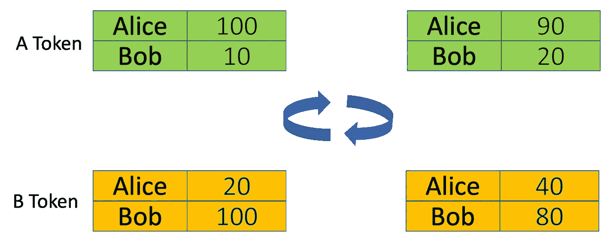
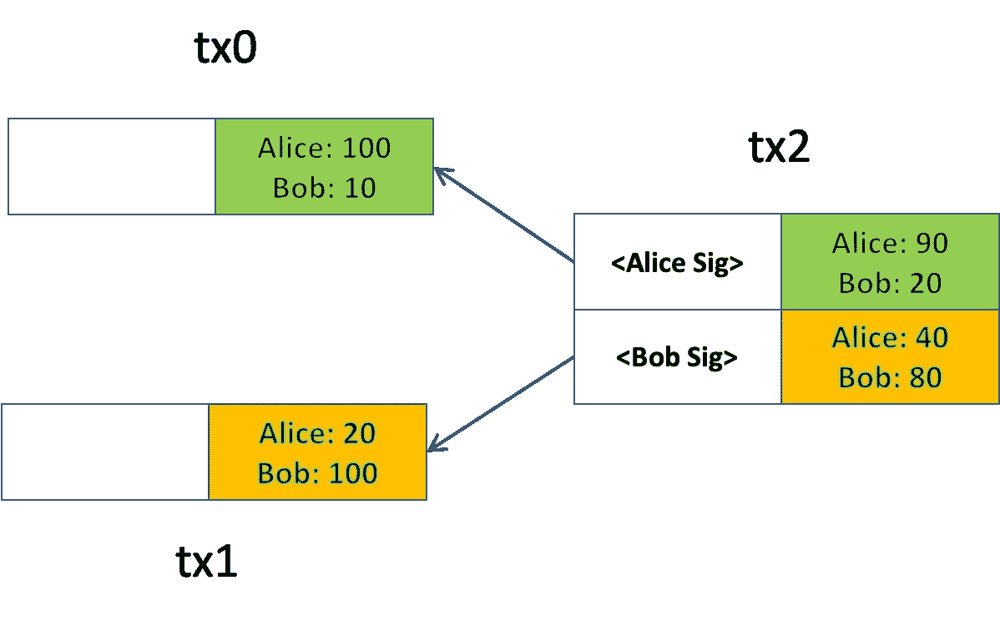

# 比特币定义第一部分:可替代代币和代币互换

> 原文：<https://medium.com/coinmonks/defi-on-bitcoin-part-1-fungible-tokens-and-token-swap-f1e86683ee3b?source=collection_archive---------5----------------------->

分散金融(DeFi)最近经历了快速增长，因为它声称可以解决遗留金融系统中固有的问题。

DeFi 没有与比特币联系在一起，因为传统观点认为比特币无法支持它。

在这个系列中，我们将证明 DeFi 不仅在比特币上是可行的，而且从成本、安全性、可组合性和可伸缩性方面来看，在比特币上运行 DeFi 实际上比在其他区块链上更有优势。我们将涵盖 DeFi 基础设施和原语，它们可以组合成乐高积木来构建各种 DeFi 应用程序，如交易所、借贷平台和 NFT 市场。

在本系列的第一部分中，我们展示了如何实现可替换令牌以及如何原子地交换它们。

# 可替代代币

本质上，可替换的令牌合同是一个表/分类帐。每个条目包含一个用户(此处标识为比特币公钥)和她拥有的令牌数量。可选地，发行者可以铸造新代币。下面这个契约实现了这样一个基本令牌，类似于以太坊里的 [ERC20](https://ethereum.org/en/developers/docs/standards/tokens/erc-20/) 令牌标准。

[ERC20 Contract](https://github.com/sCrypt-Inc/boilerplate/blob/master/contracts/erc20.scrypt)

它是[一个有状态契约](/coinmonks/introducing-stateful-properties-f0f6bce45a06)(第 5 行)，包含一个将每个用户映射到其令牌余额的表(第 6 行)。

*   **铸造**:铸造新代币并分配给接收者。只有发行者(第 3 行的*铸币者*)可以铸造新代币，在第 11 行检查。第 13 行检查接收者的旧余额，第 14 行增加它。第 16 行使用 OP_PUSH_TX 作为[保持状态，我们总是这样做](/coinmonks/introducing-stateful-properties-f0f6bce45a06)。
*   **transferFrom** :将令牌从发送方转移到接收方。第 22 行验证发送者。第 24 行检查其余额，第 23 行确保她有足够的代币，之后她的余额被扣除，接收者的余额增加相同的数量。第 30 行像以前一样保持状态。

注意 [***SigHash。第 35 行使用了单个***](https://github.com/bitcoinbook/bitcoinbook/blob/a3229bbbc0c929dc53ec11365051a6782695cb52/ch06.asciidoc#signature-hash-types-sighash) ，以确保契约总是在与其被调用的输入相同的索引输出中。

# 代币交换

既然我们有代币，让我们交换它们。

在典型的代币交换中，爱丽丝用鲍勃的 **y** 数量的 **B** 代币交换 **x** 数量的 **A** 代币。在下面的例子中， **x** 是 10， **y** 是 20，这意味着每个 **A** 代币值 2 个 **B** 代币。

Alice swaps 10 **A** Tokens for 20 **B** Tokens from Bob: before/after on the left/right

我们想以原子方式交换它们:要么爱丽丝收到 20 个 **B** 代币，鲍勃收到 10 个 **A** 代币，要么两者都没有收到任何代币。为了实现这一点，我们利用比特币的 UTXO 模型:每笔交易可以有多个输入和输出。爱丽丝或鲍勃(或类似交易所的第三方)创建交易 ***tx2*** 。它的第一个和第二个输入花费来自 ***tx0*** 和 ***tx1*** ，其中一个输出分别包含最新的 **A** 和 **B** 令牌契约。它的第一个和第二个输出分别包含更新的 **A** 和 **B** 令牌契约。

Alice 可以在签名之前验证一切(例如，汇率和金额)是否正确。鲍勃也可以。值得注意的是，一方签字后(爱丽丝或鲍勃都可以先签字)，另一方在不使现有签名失效的情况下，不能单方面涂改 ***tx2*** 。由于一个交易只能被矿工作为一个整体接受或拒绝，交换是原子性的。

Token Swap Transactions

## 与以太坊相比

以太坊中的代币交换通常分两步进行:

1.  Alice 和 Bob 批准了一份互换合同，以消费一定数量的代币，这称为批准 ERC20 中的津贴。
2.  互换合约执行实际的交换。

互换合约本质上充当了一个可信的第三方。在步骤 1 之后，欺诈合同可以任意转移令牌并窃取它们。或者互换合约有 bug 导致批准的代币被烧或被盗。在我们的代币交换中，用户在任何时候都可以完全控制汇率和金额，而不必信任第三方。因此，它是非托管的，更安全。

> 加入 Coinmonks [电报频道](https://t.me/coincodecap)和 [Youtube 频道](https://www.youtube.com/c/coinmonks/videos)了解加密交易和投资

## 另外，阅读

*   [3 商业评论](/coinmonks/3commas-review-an-excellent-crypto-trading-bot-2020-1313a58bec92) | [Pionex 评论](https://blog.coincodecap.com/pionex-review-exchange-with-crypto-trading-bot) | [Coinrule 评论](/coinmonks/coinrule-review-2021-a-beginner-friendly-crypto-trading-bot-daf0504848ba)
*   [莱杰 vs n rave](/coinmonks/ledger-vs-ngrave-zero-7e40f0c1d694)|[莱杰 nano s vs x](/coinmonks/ledger-nano-s-vs-x-battery-hardware-price-storage-59a6663fe3b0) | [币安评论](/coinmonks/binance-review-ee10d3bf3b6e)
*   [Bybit Exchange 审查](/coinmonks/bybit-exchange-review-dbd570019b71) | [Bityard 审查](https://blog.coincodecap.com/bityard-reivew) | [Jet-Bot 审查](https://blog.coincodecap.com/jet-bot-review)
*   [用信用卡购买密码的 10 个最佳地点](https://blog.coincodecap.com/buy-crypto-with-credit-card)