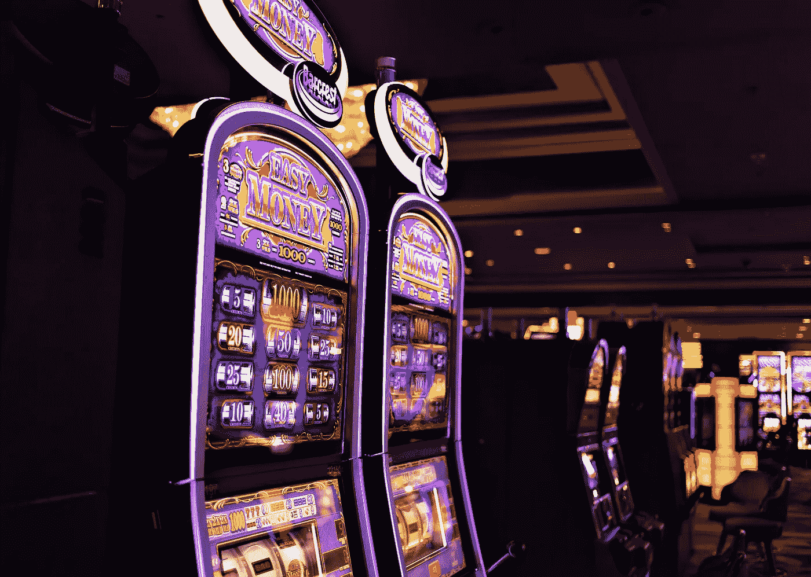
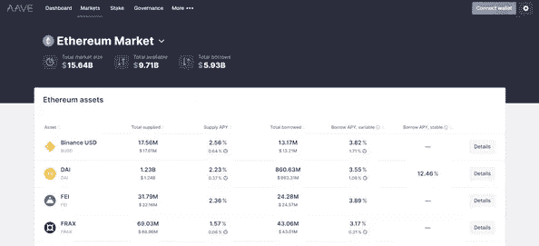
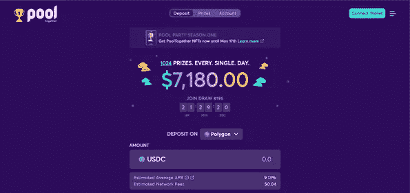

# DeFi 本周比赛

> 原文：<https://medium.com/coinmonks/defi-play-of-the-week-5798eb4bc784?source=collection_archive---------48----------------------->

**短版**

-在 Aave 上存放抵押品
-在 USDC 贷款
-在 Pooltogether 上存放 USDC
-希望中大奖

市场下跌，人们感到恐惧，预测者预测宏观底部即将到来。因此，对 DeFi 用户来说是安全的。在这篇文章中，我将概述一个低风险低回报的 DeFi 游戏。这部戏的主要目的是让大家更加熟悉 DeFi 领域提供的所有金融工具。

**风险分类:可忽略不计**

这一策略中包含的唯一风险是贷款，我建议将贷款价值(LTV)比率保持在 30%以下。这为市场波动留下了很大的余地，即使是大幅下跌也不会引发清算事件。这出戏的真正成本是机会成本；无论你在 Aave 上存放了什么资产，都有可能在其他地方得到更好的利用。

**奖励:低**

估计平均年利率为 9.14%。这个 APR 是作为一个粗略的近似值计算的，作为一个分散的彩票运气在这个协议的实际回报上起着巨大的作用。存款越多，赢的机会就越大。
APR 计算:每日奖金 X 365 /活期存款[【1】](#_ftn1)
【100 美元存款使参与者有 1/280.37 的获胜机会。[【2】](#_ftn2)这一数字随着参与人数和存款总额的变化而不断波动。每天有 1024 个奖项，总价值为 7180 美元。明细如下:
1 人 1000 美元
3 人 100 美元
12 人 50 美元
48 人 10 美元
960 人 5 美元

**分散贷款**

贷款对现代世界和现代生活方式至关重要。信用和抵押担保的概念将世界推向了一个经济繁荣的新时代。人们现在可以为他们认为合适的任何目的借入资本。然而，银行对任何寻求贷款的个人都附加了一长串的要求和检查。这些障碍在 DeFi 中被废除，任何有抵押品的人都可以立即获得贷款。Aave 拥有超过 120 亿美元的锁定流动性，并通过三条链运行:以太坊、雪崩和多边形。连接非托管钱包，存入资产作为抵押，借入 USDC。

[https://app.aave.com/markets/](https://app.aave.com/markets/)

**Aave**

一个分散化的借贷平台，将两个独立的方聚集在一起:希望从闲置资金中赚取利息的贷款方，以及希望出于自定义目的获得资本的借款方。任何拥有非保管钱包的人都可以使用 Aave，并且可以在全球范围内使用。它为那些无法通过传统金融获得资本的人提供了通过分散金融获得资本的机会。不需要就协议中的贷款条款进行谈判，因此可以建立一个更有效的货币市场。

**贷款为什么要抵押密码？**

抵押贷款对借款人来说意味着更低的风险，因此资本可以在没有官僚程序的情况下立即贷出。贷方从投资杠杆中获益。通常情况下，参与者会贷款购买资产，而不是出售资产，因为他们相信资产的价值会在未来升值，因此出售资产是一个糟糕的经济决策。出售资产也可能引发参与者希望避免的应税事件。因此，借款人可以立即保证担保贷款，贷款人可能需要现金，而不必出售他们的资产。投资杠杆允许参与者保留对其资产的完全所有权，这是由资产将升值的信念支撑的，同时获得所需的资本。

[https://app.pooltogether.com/deposit](https://app.pooltogether.com/deposit)

**Pooltogether**

分散了锁定流动性超过 4000 万美元的无损失彩票。它是多链可操作的，最大的三个链镜像 Aave 上可用的链，即以太坊、雪崩和多边形。它被称为无损失彩票，因为它正是如此。不是通过购买门票来收集奖金，而是将参与者的资本聚集起来，并借给其他分散的协议，在那里产生利息，然后一个幸运的获胜者将收到这笔收集的资本利息付款。所有参与者保留存款，并可随时提取。

欢迎 DeFi 带给世界的机遇。祝你好运。

[【1】](#_ftnref1)[https://docs.pooltogether.com/faq/prizes-and-winning](https://docs.pooltogether.com/faq/prizes-and-winning)

[【2】](#_ftnref2)[https://pooltogether.com](https://pooltogether.com)

> 加入 Coinmonks [电报频道](https://t.me/coincodecap)和 [Youtube 频道](https://www.youtube.com/c/coinmonks/videos)了解加密交易和投资

# 另外，阅读

*   [10 本关于加密的最佳书籍](https://coincodecap.com/best-crypto-books) | [英国 5 个最佳加密机器人](https://coincodecap.com/uk-trading-bots)
*   [Koinly 点评](https://coincodecap.com/koinly-review) | [Binaryx 点评](https://coincodecap.com/binaryx-review) | [Hodlnaut vs CakeDefi](https://coincodecap.com/hodlnaut-vs-cakedefi-vs-celsius)
*   [MoonXBT vs Bybit vs 币安](https://coincodecap.com/bybit-binance-moonxbt) | [硬件钱包](/coinmonks/hardware-wallets-dfa1211730c6)
*   [火币交易机器人](https://coincodecap.com/huobi-trading-bot) | [如何购买 ADA](https://coincodecap.com/buy-ada-cardano) | [Geco。一次回顾](https://coincodecap.com/geco-one-review)
*   [币安 vs 比特邮票](https://coincodecap.com/binance-vs-bitstamp) | [比特熊猫 vs 比特币基地 vs Coinsbit](https://coincodecap.com/bitpanda-coinbase-coinsbit)
*   [如何购买 Ripple (XRP)](https://coincodecap.com/buy-ripple-india) | [非洲最好的加密交易所](https://coincodecap.com/crypto-exchange-africa)