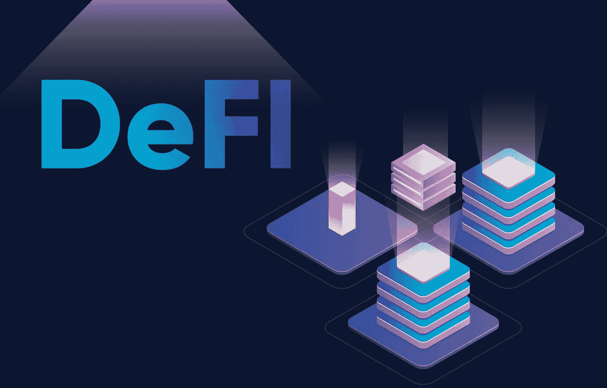
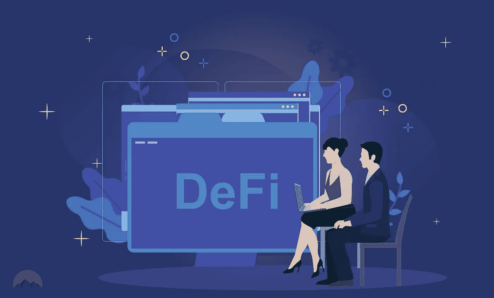

# DeFi 项目是否致力于他们所宣称的？

> 原文：<https://medium.com/coinmonks/defi-projects-dentralized-financial-system-4b0094fbfa86?source=collection_archive---------70----------------------->

## 回顾 DeFi 系统，它帮助用户比限制走得更远——请继续关注本文！

DeFi or decentralized financial system

# **简介**

D 由于加密货币市场的快速积极发展，越来越多的人打算投资它。但无论如何，开始的要点之一，尤其是在金融事务中，是我们对其基本概念的熟悉。DeFi 是数字货币市场中最广为人知的概念之一。但是，在任何方向开始操作，尤其是在投资和交易数字货币时，必须考虑的一个主要问题是熟悉其基本概念。

# **什么是 DeFi？**

分散金融(DeFi)是一种基于金融的技术，可以管理金融服务(如贷款和交易)，无需银行和机构的监督。

就我们所知，银行和金融机构一直控制着世界金融体系。在传统的金融系统中，当我们想要接收或发送资金时，我们需要一个称为银行的中介来完成这项工作。但在许多情况下，这些金融中介机构犯下腐败或无意的错误，危及许多人的财产。然而，我们需要一个中介来转移我们可以信任的资金。

由于区块链，一个去中心化的金融系统或 DeFi 已经被创建来防止这些问题。这一功能已被我们以前交易的金融中介所取代。

Defi and Cryptocurrency

# **DeFi 提供不同的功能**

如前所述，DeFi 的重要功能是像任何金融机构一样消除金融中介。换句话说，DeFi 是股票经纪业务的加密版本；但这还不是全部。

除了详细解释的主要功能，DeFi 还包括借贷平台、Dex、Daaps 等功能。这听起来像是对加密货币事务感兴趣的人打算建立另一个版本的华尔街。

# **DeFi 优势**

***不受地域限制的便捷访问**

***贷款系统**

***透明度**

***安全性**

***货币银行服务**

*   **可编程**

> 加入 coin monks[Telegram group](https://t.me/joinchat/Trz8jaxd6xEsBI4p)学习加密交易和投资

# **什么是 DeFi 平台？**

如果你已经回答了 DeFi 是什么的问题，那么找出平台的概念就不会那么难了。

DeFi 平台连接借款人和贷款人，消除了身份检查过程。通过这种方式，区块链技术可以让另一方获得风险更低的服务，也可以提供更便宜、更快的贷款，而不受地域限制。换句话说，DeFi 平台允许人们从其他人那里借款，考虑价格变化，交易数字货币，利用 DeFi 保险抵御风险，并最终获利。

# **DEX；分散式交易所**

分散交易所是一种平台和程序，使交易者能够购买、出售和交换数字货币与法定货币或其他数字货币。这些分散化的交易所对代币和生态系统至关重要，因为它们中的许多都允许用法定货币支付。没有加密货币的人也可以购买美元、欧元等加密货币。通过这些交流。

流行的去中心化交易所有 [PancakeSwap](https://v1exchange.pancakeswap.finance/#/) 、 [Uniswap](https://uniswap.org/) 、 [Tokenlon](https://tokenlon.im/) 、 [0x Protocol](https://www.0x.org/) 、 [Venus](https://venus.io/) 、 [Sushiswap](https://www.sushi.com/) 、 [BurgerSwap](https://burgerswap.org/trade/swap) 、 [Curve Finance](https://curve.fi/) 。

Decentralized exchanges

# **DeFi 的缺点是什么？**

***智能合同解决漏洞**

***用户体验差**

***可扩展性**

# 结论

目前，99%的加密货币交易仍然通过集中交易所进行。但这种情况预计将在未来几年得到扭转，许多交易将通过分散式交易所进行。分散金融仍处于初级阶段，生态系统可能会陷入一些不道德的行为，如黑客攻击和任何可能通过漏洞发生的欺诈行为。然而，如果你打算在这个领域工作，你最好先和专家谈谈，并且记住这个市场需要相对于它所提供的回报的大量风险。

(作者:法里巴·哈扎伊)