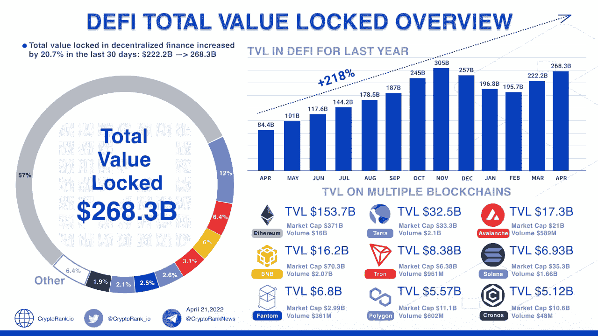
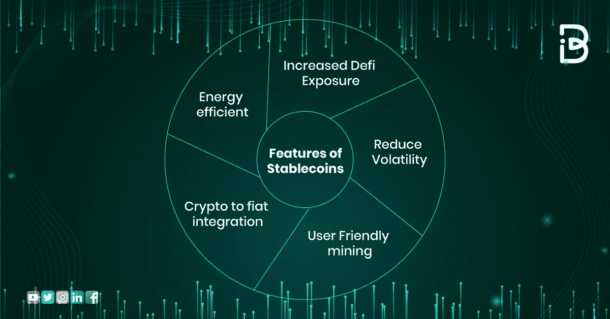
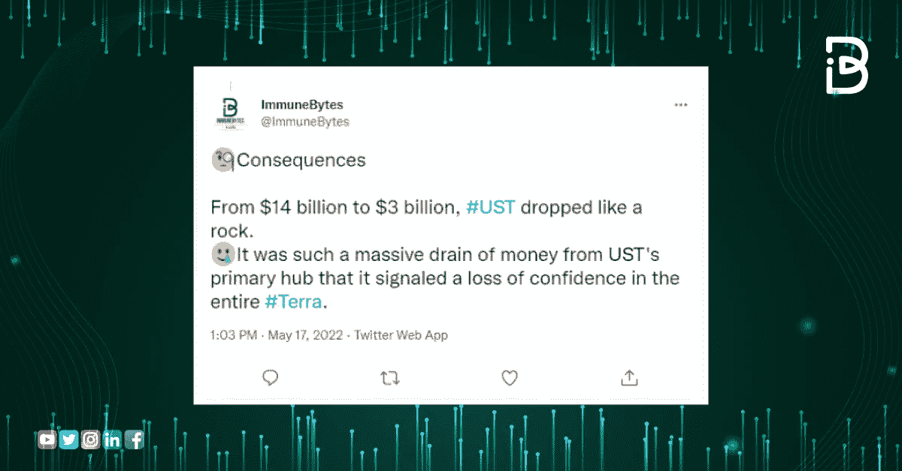
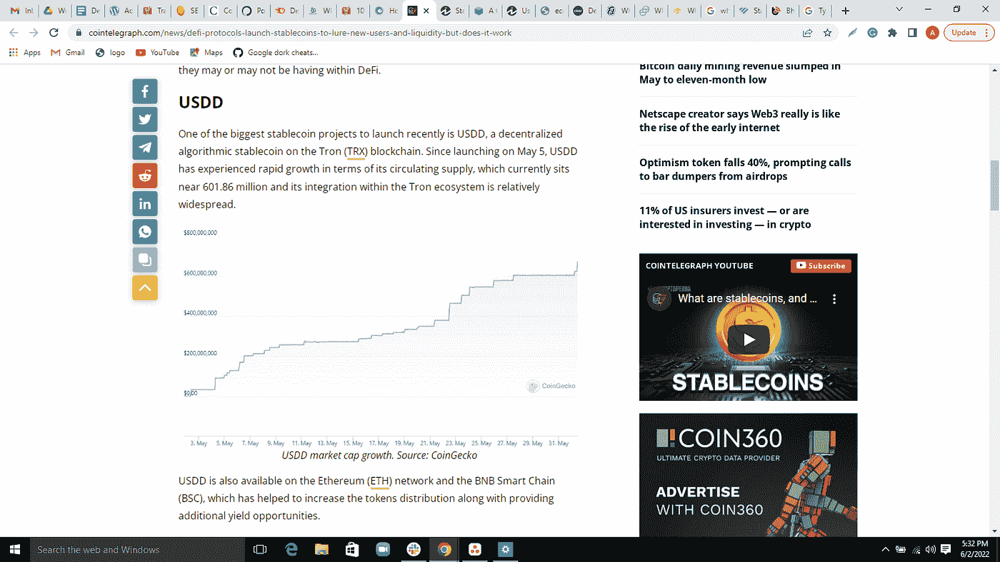

# DeFi 协议和流动性

> 原文：<https://medium.com/coinmonks/defi-protocols-and-liquidity-f5d80f103e43?source=collection_archive---------8----------------------->

**简介**

分散金融正在颠覆世界传统的金融氛围吗？

毫无疑问，Defi 是我们今天所经历的银行系统的下一代。它没有对货币、金融产品和服务的集中控制。

随着令牌化的数字货币和稳定的硬币创造流动性，Defi 领域已经发展成为一个集成了 Defi 协议和金融工具的大规模网络。

在本博客中，我们将针对与分散式融资相关的以下方面:

*   什么是 Defi 协议？
*   最佳 Defi 协议
*   什么是 Defi 流动性？
*   Defi 流动资金池是如何运作的？
*   什么是 Defi stablecoins？
*   稳定币的特点使其成为一种有吸引力的投资选择
*   2022 年最佳投资者名单
*   总结
*   关于免疫字节

我们开始吧！

**什么是 Defi 协议？**

下一代银行系统 Defi 将改变我们未来体验金融服务的方式，而 Defi 协议是实现这一目标的途径。

它们是自治守则或智能合同，旨在解决传统银行环境的缺点。这些代码一旦部署在区块链平台上，就不会改变，可以无缝地用于 Defi 提供的贷款、借款、投资和其他金融服务。

虽然，像任何其他金融媒介一样，Defi 在总锁定价值上看到了自己的一套波动。根据 Cryptorank 的数据，Defi 的总锁定价值为 2683.8 亿美元，是印度 GDP 的两倍多。

来源:[https://news . crypto rank . io/defi-total-value-locked-overview-4/](https://news.cryptorank.io/defi-total-value-locked-overview-4/)

当然，你一定想体验一下目前最好的 Defi 协议。

**这里列出了一些最好的 Defi 协议:**

1.  Aave
2.  曲线
3.  利多
4.  锚
5.  马克道
6.  凸金融
7.  UniSwap

毫无疑问，金融世界依赖于流动性，分散金融也不例外。现在让我们看看是什么创造了 Defi 环境中的流动性。

**什么是 Defi 流动性池？**

我们刚才谈到的分散式金融协议在智能合约中存储了一系列加密资产，也称为流动性池。基本上，流动性池是锁定在智能合约中的资金集合。

流动性池允许用户在分散的交易平台上进行分散的交易和借贷等功能。

与交易员使用的传统实体市场不同，Defi 使用自动化做市商。它允许以无许可的方式自动交易数字资产。

在这里，流动性提供者为他们池中的交易提供资金，并赚取与其总流动性份额成比例的交易费用。

**Defi 流动性池如何运作？**

流动性池是分散金融世界中经济活动的密码提供者。

为了在 DEX 环境中交换代币，交易商依赖流动性池来提供特定的代币。这些池是自动执行的智能合约，带有锁定的加密令牌。由另一套被称为自动做市商(AMM)的智能合约支持，有助于维持流动性池的平衡。

根据池中提供的流动性，在 AMM 上执行交易。因此，没有实际的卖方在出售密码，而是有足够流动性的池执行操作。

现在，我们知道了支持分散融资机制的因素，Defi 领域又有了新的参与者，即 Defi Stablecoins。

让我们也来看看这个，

**什么是 Defi stablecoins？**

定义稳定货币是与另一种货币或资产挂钩的加密实体，通常是法定货币，但也有几种其他类型的稳定货币。

一种稳定、可扩展且安全的加密资产，作为高度不稳定的加密领域的替代方案。

**稳定币的特点使其成为一种有吸引力的投资选择。**

1.  **降低波动性**

由于有稳定的货币或资产支持，稳定的货币不受分散金融体系所面临的波动的影响。

**2。对 Defi 的暴露增加**

波动性是阻碍投资者进入分散市场的一个主要问题。稳定的投资有助于增加投资者的信任。

**3。高能效**

稳定的 coins 确保降低能耗，同时提高事务吞吐量。

**4。用户友好型采矿**

矿工不需要复杂的开采技术来开采黄金或货币支持的稳定的硬币。

**5。密码-菲亚特集成**

这使得在 Bitfinex 等几个 Defi 交易平台上的广泛接受和简单交易成为可能。

稳定的硬币有各种各样的好处。以下是 Defi 世界推出的不同类型的稳定币。

1.  以商品为基础的稳定资产包括以黄金为基础的、以宝石为基础的等。
2.  菲亚特支持的稳定的硬币
3.  加密支持的 stablecoins
4.  算法支持的稳定积分

**2022 年最佳稳定投资公司**

TerraUST stablecoin 股价大幅下跌的消息在投资者中造成了严重的不信任，事实上，这表明了对整个 Terra 的信任的丧失。随着 UST 在 Defi Stablecoins 领域建立了一个空白，多个协议跳入同一个池中。

因此，一些 Defi stablecoins 进入加密市场，寻求新的和现有的投资者的注意，以及捕捉流动性。

让我们来看看 2022 年你能买到的最好的 Defi Stablecoins。

1.  **USDD**

最大的稳定硬币项目之一是根据创区块链协议启动的。自 2022 年 5 月推出以来，它经历了流通供应量的快速增长，目前为 6.0186 亿。

**2。FUSD**

最近发布的 Fantom 区块链协议稳定版。美元有多个抵押品支持，包括 FTM、、DAI、SPIRIT 和 wrapped tether。

**3。系绳**

投资者最喜欢的稳定硬币。Tether 是由美元支持的最古老、可能也是最安全的加密资产之一。Tether 是 Defi 领域低风险交易和反市场波动的掌舵人。

**4。币安美元**

继稳定币之后，Defi 空间中最具代表性的一种。BUSD 与美元挂钩，由纽约州金融服务局批准和监管。

**5。数字黄金令牌**

这是一种由黄金支撑的稳定硬币，是根据以太坊区块链协议开发的。它以黄金和对以太坊的信任双重后盾吸引投资者。

还可以查看 2022 年 [**前 5 的 BSC 项目**](https://blog.immunebytes.com/5-most-promising-projects-on-the-binance-smart-chain/) 。

**总结**

去中心化金融将改变人们未来体验金融服务的方式。虽然，随着去中心化世界中稳定资本和其他实体数量的增加，全球各国政府如何应对不断扩大的 Defi 领域还有待观察。

毫无疑问，正是智能合约为分散化金融体系的几乎所有领域提供了动力。

为了让您的智能合同成为黑客难以攻克的难题，请利用 ImmuneBytes 的审计服务。我们顶尖的智能合同审核员将对您的代码进行彻底审查，不留任何漏洞。

另外，请继续关注 ImmuneBytes，了解更多关于 Defi、元宇宙和 Web3 宇宙的信息。

# 关于免疫字节

**ImmuneBytes** ，一家区块链安全公司，为企业和初创公司提供全面的**智能合同审计**解决方案，让他们的应用安全起步。我们的旅程始于促进即将到来的区块链世界的安全，提高大规模系统的性能。

然而，区块链培育了一个安全的交易环境，基于这种技术构建的应用程序也有自己的漏洞。由于在区块链交易中没有修改的余地，智能合同需要彻底评估，以防止任何进一步的漏洞将您的项目变成一个奢侈的利用。

**ImmuneBytes** 管理 stern[**smart contract audits**](https://www.immunebytes.com/)，采用静态和动态分析，同时检查合同代码和 gas 优化，不给 bug 留下任何逃脱途径。

> 交易新手？尝试[加密交易机器人](/coinmonks/crypto-trading-bot-c2ffce8acb2a)或[复制交易](/coinmonks/top-10-crypto-copy-trading-platforms-for-beginners-d0c37c7d698c)