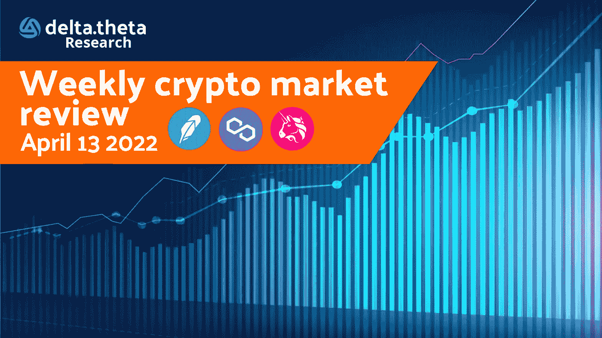
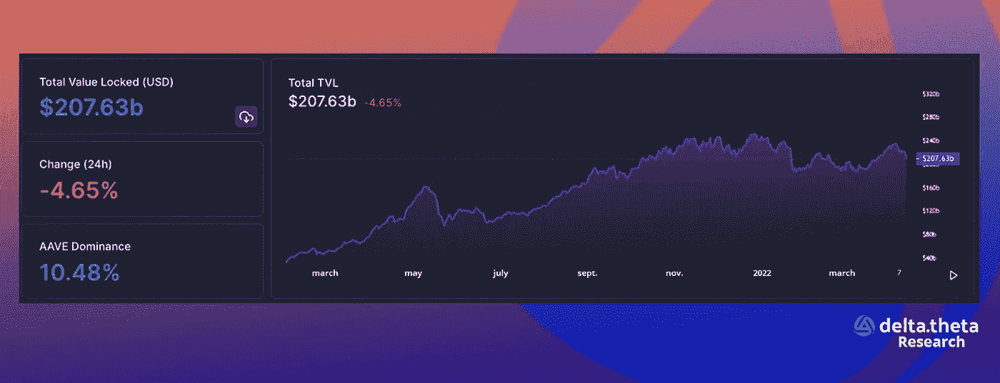
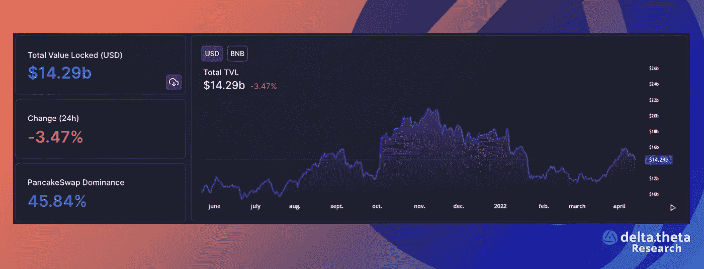
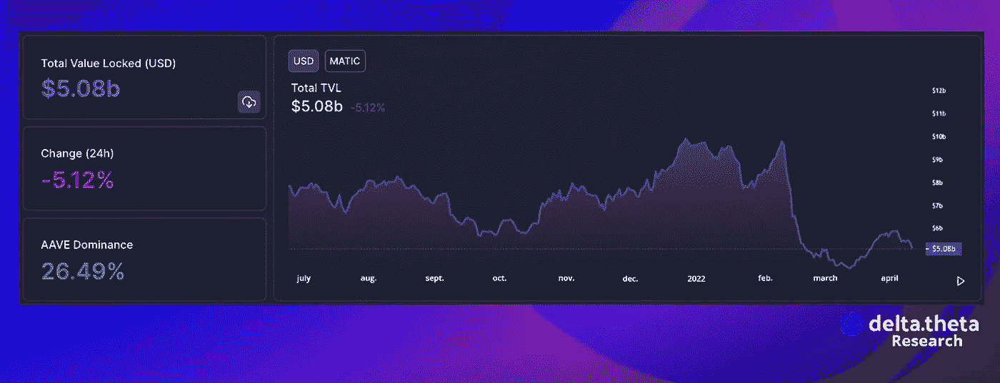

# DeFi review —产品不仅仅是一个象征

> 原文：<https://medium.com/coinmonks/defi-review-product-weighs-more-than-a-token-c07cb497d5af?source=collection_archive---------47----------------------->

在所有区块链中，锁定(TVL)的总区块链价值对最近的市场崩溃作出了反应，并显示下降了 200 多亿美元(约 10%)。值得强调的是，这一指标的下降，以及资产从合同中撤出，是由合同中锁定资产的美元价值下降造成的。

过去一周，BNB 智能链内锁定(TVL)的总价值下降了 4 亿美元(约 2.7%)。相对而言，这比总体数字低几倍。

多边形区块链内锁定的总价值(TVL)在过去一周减少了 1.7 亿美元(3.2%)。

# 新闻

Uniswap 实验室，Uniswap 去中心化交换协议的主要开发者，[已经推出了一个新的风险投资部门](https://techcrunch.com/2022/04/11/defi-giant-uniswap-launches-venture-arm-to-invest-in-other-crypto-companies/)。Uniswap Labs Ventures 将投资各种类别的 web 3 项目，特别关注建设区块链基础设施、开发工具和面向消费者的应用程序的初创公司。在推出其风险部门之前，Uniswap Labs 投资了 11 家初创公司，包括 MakerDAO、Aave、Compound Protocol、PartyDAO、LayerZero 和 tentry 等。

BNB 智能链开发商[币安已经获得阿布扎比全球市场(ADGM)的](https://cointelegraph.com/news/binance-receives-in-principle-approval-to-operate-in-abu-dhabi)原则批准，作为数字资产的经纪交易商运营。据币安中东和北非业务负责人、前 ADGM 业务负责人表示，按交易量计算，这家全球最大的加密货币交易所现在应该已经完成了申请程序。除了扩大其交易所业务，币安还将在迪拜世界贸易中心开设一个区块链技术中心。

流行的交易应用程序 Robinhood [已经在其终端添加了](https://www.theblockcrypto.com/post/141574/robinhood-appears-to-be-adding-four-cryptos-including-shiba-inu-and-solana)几种流行的加密货币。这些包括炒作 meme Shiba Inu，分散式贷款协议化合物，以及区块链本地令牌 Solana 和 Polygon。该交易所为四种硬币中的每一种都添加了特殊的附加页面，通知潜在的交易者他们可以注册购买或出售每种加密货币。

区块链领先的开发商 Avalanche 的艾娃实验室公司正在筹集新一轮资金。新的估值将使该公司成为世界上估值最高的加密货币初创公司之一。这家由康奈尔大学(Cornell University)教授艾明·冈·西尔弗(Emin Gun Silver)创立并领导的公司正在融资 3.5 亿美元，总估值为 52.5 亿美元。说到 TVL，这个区块链在 2021 年底在这个指标上取得了显著的增长，目前在以太坊、Terra 和 BSC 之后的绝对排名中位列第四。

1️⃣ [如何通过 dex 购买$ dlta】](https://optiondeltatheta.medium.com/how-to-buy-dlta-through-dexs-27184213b93a)

2️⃣ [如何使用 ChainPort 在网络间移动 DLTA 令牌](https://optiondeltatheta.medium.com/how-to-transfer-dlta-tokens-between-networks-using-chainport-851e30ab4bbd)

3️⃣ [专业版指南](https://optiondeltatheta.medium.com/pro-version-guide-32e843713ba8)

4️⃣ [基本术语摘要](https://optiondeltatheta.medium.com/basic-options-terminology-step-by-step-digest-part-1-4700d0bd63a3)

在 DOT/MATIC/AAVE 和其他 at 上的交易选项 [deltatheta.tech](https://app.deltatheta.tech/terminal/DOT-BUSD)

[电报聊天](https://t.me/deltatheta) // [交易场外聊天](https://t.me/deltatheta_TradingGroup)

> *加入 Coinmonks* [*电报频道*](https://t.me/coincodecap) *和* [*Youtube 频道*](https://www.youtube.com/c/coinmonks/videos) *了解加密交易和投资*

# 另外，阅读

*   [Bookmap 评论](https://coincodecap.com/bookmap-review-2021-best-trading-software) | [美国 5 大最佳加密交易所](https://coincodecap.com/crypto-exchange-usa)
*   最佳加密[硬件钱包](/coinmonks/hardware-wallets-dfa1211730c6) | [Bitbns 评论](/coinmonks/bitbns-review-38256a07e161)
*   [新加坡十大最佳加密交易所](https://coincodecap.com/crypto-exchange-in-singapore) | [收购 AXS](https://coincodecap.com/buy-axs-token)
*   [红狗赌场评论](https://coincodecap.com/red-dog-casino-review) | [Swyftx 评论](https://coincodecap.com/swyftx-review) | [CoinGate 评论](https://coincodecap.com/coingate-review)
*   [投资印度的最佳加密软件](https://coincodecap.com/best-crypto-to-invest-in-india-in-2021)|[WazirX P2P](https://coincodecap.com/wazirx-p2p)|[Hi Dollar Review](https://coincodecap.com/hi-dollar-review)