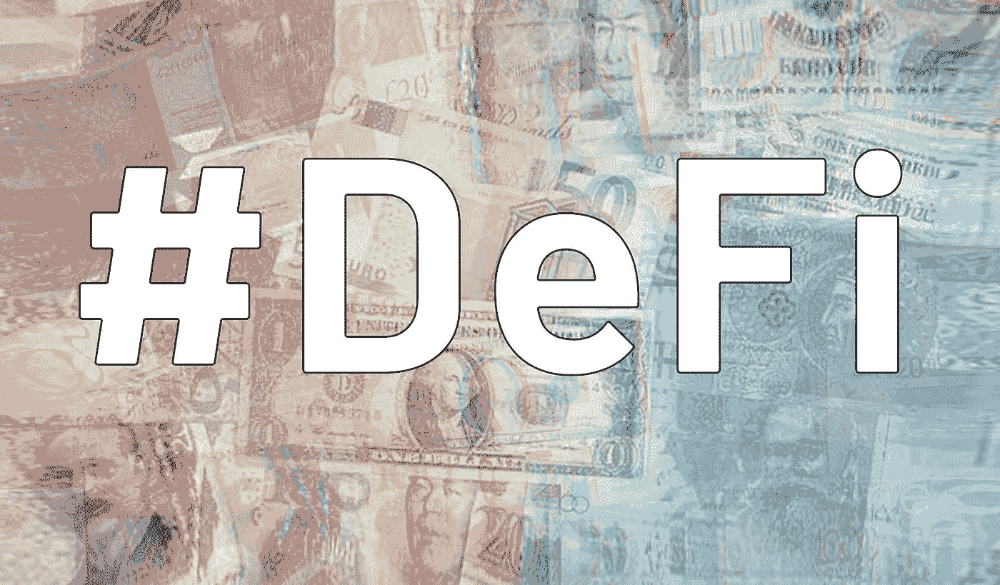
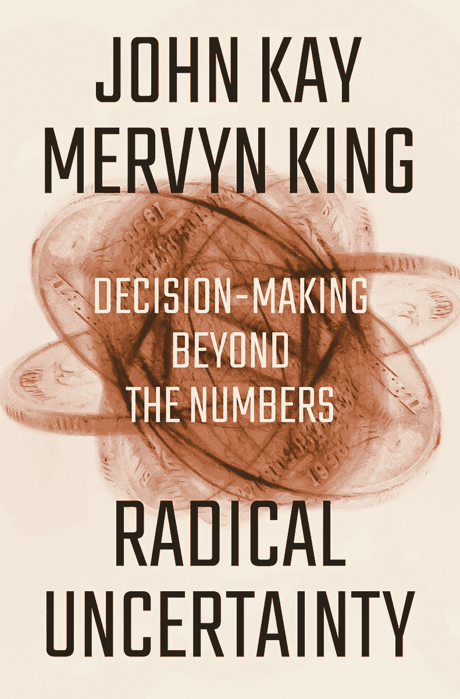
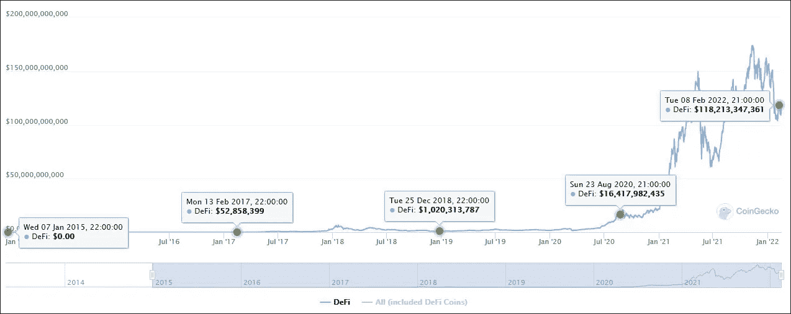
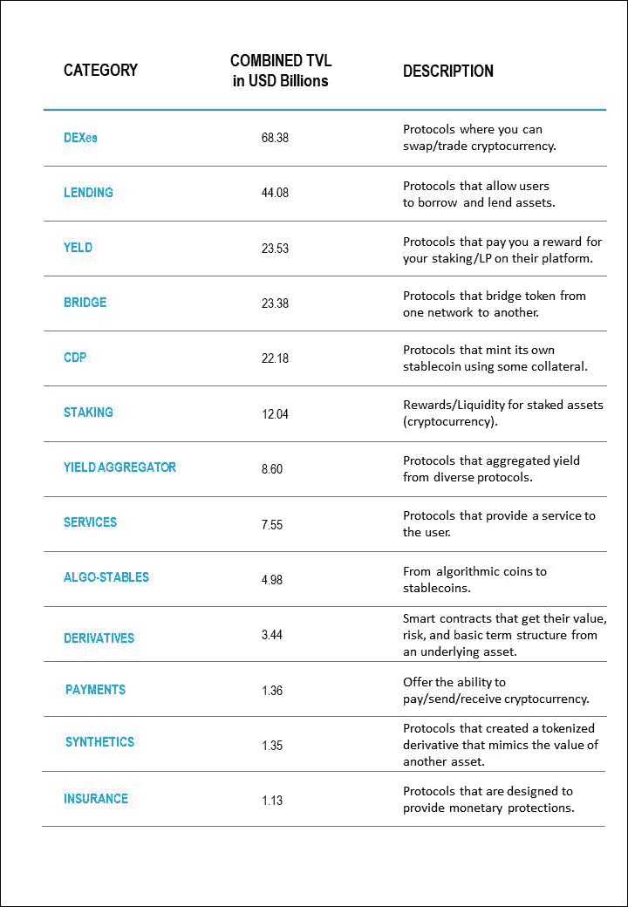
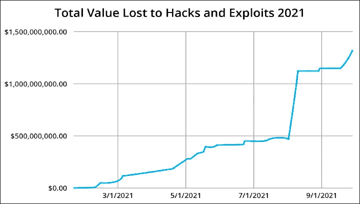

# DeFi 风险评估:分散融资中成功和盈利的终极方法

> 原文：<https://medium.com/coinmonks/defi-risk-assessment-the-ultimate-approach-to-success-and-profit-in-decentralized-finance-ef1b542761be?source=collection_archive---------5----------------------->

在讨论 DeFi 的潜力和威胁之前，我想澄清风险和不确定性之间的区别，为什么我称之为评估方法，最后，强调为什么这些是 DeFi 成功的关键因素。

如果你是 DeFi 新手，想了解一下，我推荐这篇 Investopedia 文章:[去中心化金融(DeFi)定义](https://www.investopedia.com/decentralized-finance-defi-5113835)。如果你想知道为什么分散金融很重要，我写的这篇文章可能会对 DeFi 提供一个“浪漫”的观点:[什么是 DeFi，为什么它很重要？](/coinmonks/what-is-defi-and-why-does-it-matter-679a7492f0b0)

# **让我们碰碰运气吧！**

风险管理既是一门科学，也是一门艺术，旨在用当前的行动创造一个理想的未来，帮助消除可能的不愉快的结果，同时增强有利的结果。如果说在遥远的过去，人类受到神谕的支配，那么在现代社会，尖端技术已经让人类能够以令人羡慕的准确度预测未来的趋势和事件。

然而，许多大公司仍然面临破产；经济危机已经是全球金融体系的一个特征；健康问题不断困扰着人类，而没有创新阻止新疾病的物化；天灾袭击六大洲，年复一年，日复一日；所有这一切都是在没有采取任何行动来避免这种“扭曲”的情况下发生的。

然而，哪里出了问题？整个行业的风险评估都很糟糕。大学和商学院——企业界的基石——提供了一种短视的风险管理观点。对大多数人来说，风险是不确定的不利环境，可能会损害市场和企业。

从本质上讲，风险是可测量的和已知的不确定性事件，其发生会给目标带来积极或消极的结果，无论目标是什么。其他风险属于未知领域，但经过充分调查后是可以解决的。

另一方面，不确定性，或者说纯粹的不确定性，是任何无法用概率分析来解释甚至计算的东西。因此，风险是一种可解决的不确定性，这种不确定性可以通过概率推理或进一步调查来设想，而不确定性是纯粹的不确定性。

> 我确信，大多数日常事件都源于人类行为的不确定性，其影响无法通过某种奇特的策略预先测量或预测。

《彻底的不确定性:超越数字的决策》一书的作者默文·金和约翰·凯，对什么能被概率设想和什么不能被概率设想做出了鲜明的区分:“概率推理最引人注目的延伸是在那些可能的结果被很好地定义，导致它们的潜在过程很少随时间改变，并且有大量历史信息的情况下。”

但在“对潜在过程的了解并不完善，过程本身也在不断变化，它们运行的方式不仅取决于人们做什么，还取决于人们怎么想的地方，概率思维可能看起来很美很吸引人，但可悲的是，它对现实世界问题的适用性是有限的。”

Radical Uncertainty: Decision-Making Beyond the Numbers

DeFi 是一个新兴的市场，有大量的风险需要管理，不确定性需要面对。当你在一个萌芽状态的市场“下注”时，概率估计可能会有所帮助，但硬币最有希望的一面在于了解你周围的环境。如果金融背景在投资时至关重要，那么在处理不熟悉的经历时，叙述是最重要的。所以，让我们定义吧！

# DeFi 景观

DeFi 是一个有 7 年历史的行业，自成立以来一直呈指数增长。从 2017 年到 2022 年初，DeFi 部门已经成为一个数十亿美元的行业，并有望在未来几年内成为一个万亿美元的业务。

根据 Coingecko 的数据，在撰写本文时，**的 DeFi 市场资本总额超过 1150 亿美元**，其中**锁定的总价值约为 1800 亿美元【TVL】**，日交易量超过 60 亿美元**。该数据表明在 5 年内**增长了 230，000%**。尽管如此，这是一个婴儿产业排练的第一步。下图揭示了截至 2015 年 DeFi 市场的升值情况。**

****

**Defi Market Cap | Source: Coingecko**

**合并后的 DeFi 部分仅占比特币当前市值的 15%**——占主导地位的比特币目前定价为 43240 美元，总市值为 8400 亿美元。与整个加密货币市场(今天估计为 2.14 万亿美元)相比，DeFi 协议的全部价值是最小的，占该金额的 5.6%。对于一个打算打破全球金融体系范式的行业来说，这只是微不足道的一部分。****

**在 2017 年的一份报告中，世界银行关注了至少 17 亿没有银行账户的成年人。这似乎不是一个选择，因为维持一个银行账户对这些人来说非常昂贵。这是 DeFi 要填补的一个大缺口。**

**假设你足够幸运，有一份不错的工作和收入。在这种情况下，与传统银行相比，分散的金融服务可以提供一个绝佳的投资机会，并带来难以想象的被动收入。**

**下表—信息来源于 DefiLlama 网站—按类别突出显示了 DeFi 行业及其市场份额和简要说明。来自 DefiLlama 和 Coingecko 网站的数据略有不同。尽管如此，这份榜单还是给出了这个市场的概况及其前景。**

****

**DeFi Market by Category | Source: DefiLlama**

**值得注意的是，这个列表比这个更广泛。DeFi 空间提供了许多其他可以利用的可能性。尽管 DeFi 是一个有利可图的行业，但投资它带来的机会和威胁一样多。**

# **定义风险和不确定性**

**DeFi 既是一项金融创新，也是一项技术创新。除此之外，分散金融的世界渗透到许多其他知识领域，并不局限于它最明显的两个方面。金融和技术愿景必须与宏观经济、监管、道德和伦理概念一起进行更深入的研究——对于一个宣扬无国界金融体系、几乎没有国家干预的发明来说，这是一个相当大的挑战。**

**这些特征表明，评估一种新的、不断变化的金融工具的风险是多么具有挑战性。在下面的文章中，我强调了 DeFi 中一些最重要的问题。**

# ****集中化****

**DeFi 有多分散？这个问题没有单一的答案。正如智能合约是去中心化金融的心脏一样，Dao 是这个自动化系统的肝脏。分散的自治组织是 DeFi 的治理委员会或决策者。但与公司治理机构不同，DAO 是由软件规则自动化的。每当需要做出决定时，代币持有者有权投票支持或反对某项提案。**

**但是在这个领域没有什么是完全分散的。为了使 DeFi 计划成为现实，开发团队必须首先对决策负责。该团体持有必须沿途分发的令牌，以创建民主的决策过程。这可以通过几种方式来实现。因此，权力下放成为一个目标。**

**随着令牌的分发，出现了其他问题，主要是关于投票模型:**

*   **令牌分发将如何进行？**
*   **参与决策过程的人必须拥有的最低代币数量是多少？**
*   **一个拥有大量令牌的人能够集中决策并支持有利于自身利益的计划吗？**
*   **那些支持违背道德原则的倡议的人会受到什么惩罚？**
*   **谁来判断什么是不道德的行为？**

> **集权或分权不是非黑即白的问题。对这一威胁的真正回应取决于对该计划透明度的理解。 **这和知道谁来定规则一样重要。****

# ****信息不对称****

**信息不对称甚至不是风险，而是事实。当经济关系的一方比另一方掌握更多信息时，就会发生这种情况。几乎每个行业都是如此。不对称信息有两种:隐藏特征和隐藏动作。**

**最民主的 DAO 并不保证被批准的特性或提议会以您预想的方式实现，或者它们是否会被实现。没那么简单。**

**首先，你必须问自己，产品开发团队是否有必要的技能来实现批准的需求，并仍然按照最后期限的期望？是否需要雇佣合格的人员，工资多少？即使这些条件得到了满足，我们也必须意识到，在创新环境中，失败是受欢迎的，也是学习曲线的一部分。你准备好了吗？智能合约并不像一些人认为的那样“智能”;它们仍然需要一个聪明的头脑来编纂。**

**请帮我一个忙，不要牺牲自己。你不会得到这些答案。这就是信息不对称隐藏特征的一面。**

**虽然隐藏特征描述了交易的一方知道另一方不知道的事情，但是隐藏动作是由一方执行的另一方无法观察到的动作。**

**获得初始投资后，计划被取消，创始人收回所有存款，这种情况并不少见。或者用恶意代码实现的应用程序，以使最大的令牌持有者受益。**

**同样，透明度是必须的。**

# ****流动性低****

**与传统金融系统甚至一般的加密货币市场相比，DeFi 协议中的流动性非常低。低流动性表明了 DeFi 行业仍然需要发展和成熟，以及其最有前途的一面，这对于这个新生领域中渴望风险的投资者来说是一个绝佳的机会。但它也带来了一些严重的威胁。**

**与流动性不足相关的最常见案例与一种欺诈有关，这种欺诈鼓励投资者向分散交易所的资金池中增加流动性。随着越来越多的人将他们的资产锁定在交易所，代币价值上升，项目背后的团队立即出售所有代币，导致其价格暴跌。**

**由于缺乏流动性，还会出现许多其他风险。然而，这是最常见的，也是一种地毯拉。**

# ****技术问题****

**DeFi 平台是建立在软件代码上的自动化生态系统。如果不良行为者精心策划伤害投资者，并利用繁荣的市场，大多数举措都着眼于长期。然而，漏洞确实存在，尤其是在代码中，黑客们急于利用它们。**

**根据区块链安全和审计公司 CertiK 的一份报告，2021 年，DeFi 平台上的黑客攻击比前一年增加了一倍多，达到超过 13 亿美元。值得一提的是，大多数损失是由集中化问题造成的。**

**虽然这是一个相当大的数字，但 CertiK 的研究强调，按比例计算，黑客攻击和漏洞利用造成的损失每年都在减少。**

****

**Total Value Lost to Hacks and Exploits | Source: CertiK**

# ****可用性问题****

**DeFi 平台上的用户体验还有很多需要改进的地方，现在就相信那些“没有银行账户”的成年人会很容易地获得分散式服务还为时过早。一些应用程序非常复杂，即使对于金融和加密货币专家来说也是如此。好消息是，我看到了一场改变这种动态的运动，平台变得越来越容易接近。**

# ****监管问题****

**尽管世界各地的当局和机构对加密货币实施了如此多的禁令和攻击，但市场仍在增长，没有逆转的迹象。现在，政府必须应对另一项叫做 DeFi 的创新。**

**监管可能需要一段时间，甚至可能失败，但它终将到来。一个有能力吸引数万亿美元资金、雄心勃勃要将自己树立为全球市场新常态的行业，将无法免受监管机构的审查。**

**监管将如何实现？不知道。这是目前为止最好也是唯一可能的答案。**

****会强制吗？**是和否。任何旨在忠实于其分散化特征的计划都不应拘泥于集中治理机构的监管方面。**

**我不记得中本聪去美国证券交易委员会申请实施比特币的许可，就像我不记得维塔利克·布特林申请开发区块链以太坊的授权一样。比特币和以太坊都不受监管，没有边界，去中心化，并且被广泛接受。**

****监管缺失会吓跑投资者吗？一瞬间的反省足以让你相信这是极不可能发生的。一个安全、快速、可靠的 DeFi 平台就像比特币一样不可阻挡。****

**你可能想知道在 DeFi 中成功的终极方法。这就是:尊重模型，但怀疑它们在现实世界中的有用性。尽可能计算风险。最重要的是，学会接受和处理不确定性。目前，这就是我们生活在一个中央集权的世界中所需要的一切。**

**我还不知道去中心化的世界会是什么样子，但是一旦我知道了，我会第一个告诉你。**

**如果你已经做到了这一步，并且喜欢它，不要忘记[关注我](https://marciogandara.medium.com)以获得新故事的更新。谢谢大家！**

**[***莱娅***](https://marciogandara.medium.com/avalia%C3%A7%C3%A3o-de-riscos-em-defi-a-melhor-abordagem-para-ter-sucesso-e-ganhar-dinheiro-com-defi-6cc64cd63f7b)**

**[**Twitter:GandaraMarcio**](https://twitter.com/gandaramarcio)**

** [## 中本聪被遗忘的著作:比特币既不是庞氏骗局，也不是欺诈计划，而且…

### 多里安·中本聪过去常常不被人注意地走过加州圣盖博的街道，直到莉亚·古德曼来了…

medium.com](/coinmonks/the-forgotten-writing-of-satoshi-nakamoto-bitcoin-is-neither-a-ponzi-nor-a-fraudulent-scheme-and-ae2d75242fb9)** 

> **加入 Coinmonks [电报频道](https://t.me/coincodecap)和 [Youtube 频道](https://www.youtube.com/c/coinmonks/videos)了解加密交易和投资**

*   **[如何匿名购买比特币](https://coincodecap.com/buy-bitcoin-anonymously) | [比特币现金钱包](https://coincodecap.com/bitcoin-cash-wallets)**
*   **[币安 vs FTX](https://coincodecap.com/binance-vs-ftx) | [最佳(索尔)索拉纳钱包](https://coincodecap.com/solana-wallets)**
*   **[如何在 Uniswap 上交换加密？](https://coincodecap.com/swap-crypto-on-uniswap) | [A-Ads 评论](https://coincodecap.com/a-ads-review)**
*   **[加密货币储蓄账户](/coinmonks/cryptocurrency-savings-accounts-be3bc0feffbf) | [YoBit 评论](/coinmonks/yobit-review-175464162c62)**
*   **[Botsfolio vs nap bots vs Mudrex](/coinmonks/botsfolio-vs-napbots-vs-mudrex-c81344970c02)|[gate . io 交流回顾](/coinmonks/gate-io-exchange-review-61bf87b7078f)**
*   **[CoinFLEX 评论](https://coincodecap.com/coinflex-review) | [AEX 交易所评论](https://coincodecap.com/aex-exchange-review) | [UPbit 评论](https://coincodecap.com/upbit-review)**