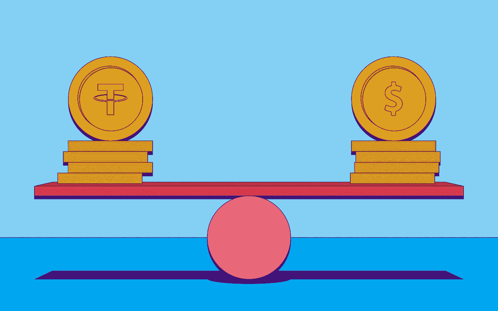
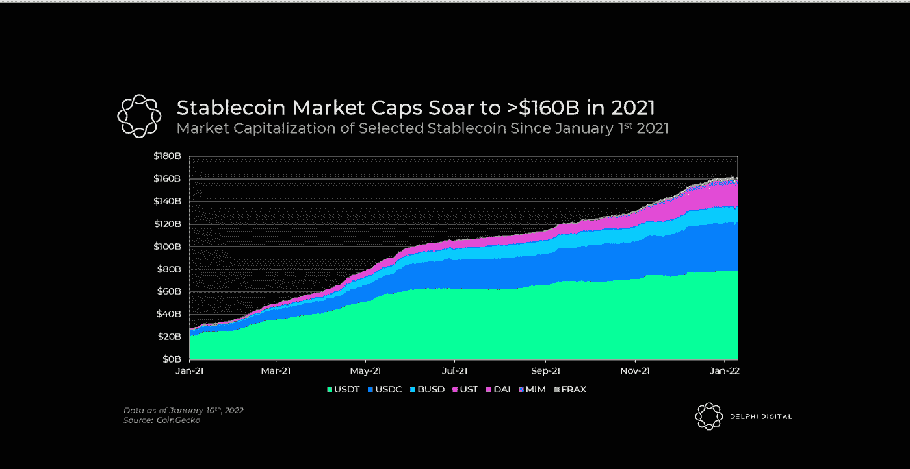
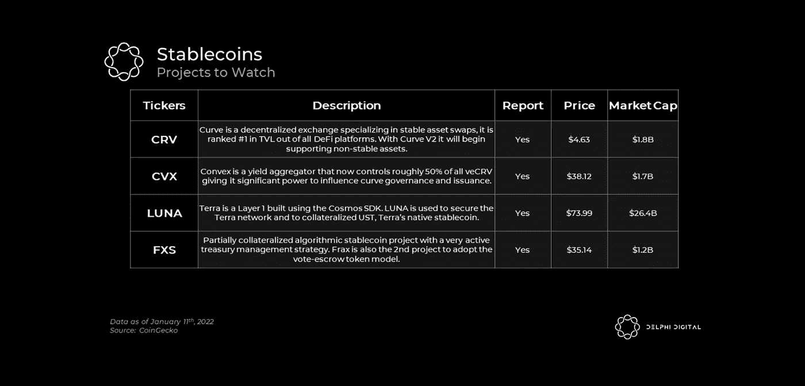

# 稳定曲线和曲线战争

> 原文：<https://medium.com/coinmonks/defi-stablecoins-and-curve-wars-9b5fe0910a91?source=collection_archive---------32----------------------->

Stablecoins 在 2021 年爆发，总市值超过 1500 亿美元。这种激增证明了作为 crypto 的“杀手级应用”之一的出色产品市场适应性，像 USDC 和 USDT 这样的资产几乎在整个加密生态系统中变得普遍。你会问，什么是稳定币？。稳定货币是一种加密货币，试图提供价格稳定，并由储备资产支持。我坚信这一趋势将会继续，因为有几个有影响力的催化剂已经为他们的成功铺平了道路:

*   投资者和交易者可以毫不费力地将风险规避期的风险敞口与高波动性配对。Stablecoins 已经成为 CeFi 和 DeFi 的普遍贸易组合。
*   DeFi 中的稳定债券提供了高收益机会，而没有基础资产波动的风险。
*   在任何时间与世界上任何人进行未经许可的交易，几乎即时结算，没有与当前金融系统相关的常见摩擦。

曲线战争可以定义为不同协议之间的竞赛，这些协议不断试图确保它们的首选池提供最高的 CRV 奖励(“贿赂”)。曲线战争导致$CRV 的购买压力增加。

Crypto 是一个巨大的激励设计游戏，价值数十亿美元。聪明地设计激励机制的项目赢得了巨大的权力和财富。激励机制设计不佳的项目会看到它们的代币变为零。

**DeFi 中的大多数激励设计都集中在解决两个问题:**

1.  劝阻人们出售你的代币
2.  鼓励人们让你的代币更有流动性

从历史上看，这种奖励结构是直接的:我向你支付稳定的代币流，以换取你为我的代币创造的流动性。但现在我们看到了流动性市场，领先的协议可以为投资者聚集各种机会，通过提供流动性来赚取收益。协议可以付钱给投资者，帮助他们增加代币的流动性。

这种聚合以及随之而来的流动性竞争正在各种平台上展开，但这场战斗在曲线金融上最为激烈。因此，流动性竞争被亲切地称为“曲线战争”。

但正如我们将看到的，曲线只是开始。流动性战争可能会塑造 DeFi 的未来，并定义许多未来的投资机会。

# 要看的故事

image by Delphi Digital

**分散的马厩**

监管部门对稳定水泥的打击可能会迫使边缘用户和建筑商使用分散的替代品。

作为关键基础设施的曲线(CRV ):谈论稳定的资本，尤其是分散的资本，而不提及稳定资本的“制王者”——曲线，是一个挑战。曲线治理可以引导 CRV 发行到资金池，直接导致更高的流动性挖掘回报，从而增加 TVL。由于流动性对稳定的债券至关重要，Curve 是稳定债券最重要的基础设施。Convex，Convex 控制了所有曲线治理的大约一半，允许它投票或被贿赂来创建所有 DeFi 中最具流动性的稳定币池。Convex 使用户能够获得流动性，并从基于以太坊的 stablecoin exchange Curve Finance 中赚取费用，

值得注意的是，Uniswap 最近一直在从 Curve 夺取 stables trading 的市场份额。稳定掉期的平均费用通常比 Uniswap 上的类似交易高出 1.5 至 2 倍，这有时增加了后者的吸引力。

convex(CVX)的治理黑洞:主要的 stablecoin 项目已经意识到 Curve 的每周计量权重分配对于保持其高流动性至关重要。失去投票权意味着有限合伙人的收益率下降，资本可能会转移到其他地方。现在，一场所谓的“战争”随之而来，各种协议公开贿赂选票，用本地令牌奖励 veCRV 持有者。2021 年 4 月，convecrv 首创了这种贿赂游戏，用 1%的空投换取 veCRV 持有者的支持。现在，它已经对 Curve 宝贵的治理投票产生了巨大的影响:Curve TVL 的 85%是通过 Convex 直接路由和下注的。所有 veCRV 供应的近一半为 Convex 所有。简而言之，Convex 是协议控制的价值(PCV)的新模型，它开创了通过治理积累权力的先河。

**曲线+凸共生:**

Curve 和 Convex 有一种共生关系，这使得 Curve 成为 TVL 的头号应用程序，价值 230 亿美元(目前的 TVL 在发布时接近 190 亿美元)。这种关系有助于两家公司在 2021 年的表现超过许多其他 DeFi“蓝筹股”。

“在我看来，Convex 的令牌组学是 DAO 元治理以及在 2021 年重新思考激励调整方面发生的最独特的事情之一。我还认为，越来越多的协议转向投票托管令牌模型将成为 Convex 的强大推动力。

**生息的 dApps**

image by Delphi Digital

好好利用你稳定的储蓄，赚取一些利息。像加密中的一切一样，预测的年百分比收益率(APY)可以根据实时供应/需求每天变化。

**稳定的收入是好的投资吗？**

稳定的收入被认为是非常安全的长期投资来源。在动荡和恶劣的市场条件下，稳定的债券为资产提供了很好的保护。

希望你有一个精彩的阅读

UNI 市场份额大放异彩，稳定的竞争，新鲜的农场…[https://members . Delphi digital . io/reports/uni-market-share-shines-stable coins-wars-fresh-farms/](https://members.delphidigital.io/reports/uni-market-share-shines-stablecoins-wars-fresh-farms/)

> 加入 Coinmonks [电报频道](https://t.me/coincodecap)和 [Youtube 频道](https://www.youtube.com/c/coinmonks/videos)了解加密交易和投资

# 另外，阅读

*   [Bookmap 评论](https://coincodecap.com/bookmap-review-2021-best-trading-software) | [美国 5 大最佳加密交易所](https://coincodecap.com/crypto-exchange-usa)
*   最佳加密[硬件钱包](/coinmonks/hardware-wallets-dfa1211730c6) | [Bitbns 评论](/coinmonks/bitbns-review-38256a07e161)
*   [新加坡十大最佳加密交易所](https://coincodecap.com/crypto-exchange-in-singapore) | [购买 AXS](https://coincodecap.com/buy-axs-token)
*   [红狗赌场评论](https://coincodecap.com/red-dog-casino-review) | [Swyftx 评论](https://coincodecap.com/swyftx-review) | [CoinGate 评论](https://coincodecap.com/coingate-review)
*   [投资印度的最佳密码](https://coincodecap.com/best-crypto-to-invest-in-india-in-2021)|[WazirX P2P](https://coincodecap.com/wazirx-p2p)|[Hi Dollar Review](https://coincodecap.com/hi-dollar-review)
*   [加拿大最佳加密交易机器人](https://coincodecap.com/5-best-crypto-trading-bots-in-canada) | [库币评论](https://coincodecap.com/kucoin-review)