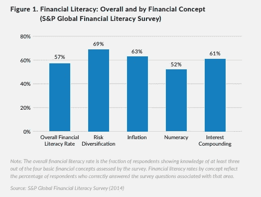

# DeFi 结构化产品

> 原文：<https://medium.com/coinmonks/defi-structured-products-f1fdc15c8942?source=collection_archive---------6----------------------->

金融很复杂。这是没有办法的。根据米尔肯研究所的数据，只有 52%的美国人被认为懂金融。金融知识分为八个部分:借款、储蓄、盈利、消费、信息来源、投资、保险和理解风险。关于借贷、赚钱和储蓄的知识是普通美国人掌握最多的知识(米尔肯)。然而，投资和风险管理中的金融知识是最低的。如果有一种方法可以简化复杂的投资和风险管理系统，会怎么样？我来介绍一下结构性理财产品

**结构性理财产品**

根据维基百科的定义，结构性产品是基于单一证券、一篮子证券、期权、指数和衍生品的预包装结构性金融投资策略。

尽管 ETF 不被视为结构性产品，但我相信它们是解释它们的最佳方式。我不会深究，但 ETF 的核心是一篮子股票。我可以拥有一只 ETF，而不是一只股票，拥有 15 只股票。这分散了我的投资组合，有效地降低了一些风险。如果我把所有的鸡蛋放在一个篮子里，而那个篮子掉了，我所有的鸡蛋都会碎，我将一无所有。ETF 将这些鸡蛋分散在不同数量的篮子里。

结构性产品和 ETF 有什么关系？目标是让消费者更容易购买。ETF 让投资各种股票变得更加容易，而结构性产品简化了预期的投资策略。

**DeFi 中的结构性产品**

DeFi 正处于初级阶段，其结构化产品协议也是如此。虽然在传统金融世界中有许多类型的金融结构性产品，但这是一个加密博客。我们将专注于加密结构化产品。开创分散结构产品的三个协议是 Ribbon Finance、Tranchess 和 Goldfinch

**丝带金融(RBN)**

我们将关注的第一个结构化产品是带状金融。Ribbon Finance 是首个基于以太坊区块链的 DeFi 结构化产品。Ribbon Finance 是一个分散的期权库，为用户提供加密结构产品。Ribbon 将期货、期权和固定收益策略结合起来，以提高投资组合的风险回报。

丝带的核心产品是他们的“Theta Vault”。根据 Ribbon 的文件，“Theta Vaults 使用保险库术语，因为它源于将您的资产存入保险库并从中赚取收益的想法，一劳永逸。”(θ指期权价值因时间推移而下降的比率(Investopedia))。用户将他们的资产存入 Ribbon 的智能合约，并自动开始运行特定的期权策略。

Ribbon 目前有两种期权策略:看涨期权和看跌期权。期权是一种典型投资者不理解的金融工具，所以投资者不理解更复杂的期权策略是有道理的。简单地定义这些策略:备兑买入策略从卖出潜在上涨中获得收益，而卖出策略从中性/价格升值中获得收益。

目前，丝带是四个链:以太坊，雪崩，索拉纳和极光。他们有 11 种当前选择策略。他们是

*   Sol 覆盖呼叫
*   Avax 覆盖呼叫
*   USDC 看跌出售(Avax)
*   ETH 覆盖呼叫
*   渴望 USDC 卖(ETH)
*   Staked ETH 覆盖呼叫
*   WBTC 覆盖呼叫
*   Avax 覆盖呼叫
*   已覆盖呼叫
*   USDC 卖方市场(ETH)
*   猿覆盖呼叫

**Ribbon Finance 实用程序**

Ribbon 的效用在于，它允许投资者轻松获得 DeFi 期权策略。目前期权占不到 10 亿美元的 TVL，排名 15/18。Derbit 是目前加密选项的头号交易所。两个问题:这是一个集中的交换，非常复杂。在传统市场中，期权是提高仓位和管理风险的神奇工具。Ribbon 的价值源于 DeFi option 策略的简单性和易用性。随着期权在 crypto 中越来越受欢迎，像 Ribbon 这样易于使用的结构化产品将会蓬勃发展。

**免责声明:YIELD % RIBBON 提供的并非无风险/被动。期权极其复杂多变。没有适当的知识，你很容易失去你的投资**

**份额(国际象棋)**

Tranchess 是一款收益增强结构性产品，为 BTC 和瑞士联邦理工学院的投资组合提供风险/回报解决方案。份额基金的灵感来自传统的份额基金，在任何时候，用户出资的部分被分配一段固定的时间，并产生利息。

本质上，Tranchess 是一个令牌化的结构性基金。在该基金中，有三种令牌迎合不同的风险偏好。这三个令牌是$QUEEN、$BISHOP 和$ROOK，其中$CHESS 是治理令牌。

Bishop 是稳定收益回报，Rook 是杠杆加密资产交易，Queen 是长期加密持有。

女王是主要的资金，这是一个 BTC 跟踪令牌+一个产量农业的特点。女王与 BTC 的价格完全相关。

现在，有趣的部分。在国际象棋协议中，女王是主基金，象和车是副基金。这些标志携手合作。就像我之前说的，毕夏普有稳定的回报。主教持有者通过向车持有者提供流动性来获得收益。本质上，Bishop 是 delta 中性的，因此不受波动性的影响。

Rook 是皇后的另一个子基金。Rook 是一个没有强制平仓的杠杆产品。车持有者从毕夏普(稳定收益的来源)借款，并在跟踪 BTC 女王的主要基金中获得杠杆。车持有者从皇后那里得到收益和损失。与传统的杠杆投资组合不同，Rook 没有清算的风险，因为它是从 Queen 借款。

**国际象棋实用程序**

在传统金融领域，份额已经非常受投资者欢迎。通过分散基金中的资本，份额为饥渴的投资者提供了不同的风险。Tranches 是区块链的第一个份额基金(据我所知)。份额将随着机构的发展而繁荣。由于机构对加密的风险厌恶程度较低，尤其是 DeFi，持有比特币的份额基金极具吸引力。Tranchess 的价值主张是，它允许不同的风险偏好提高头寸，没有强制平仓的机会，或者继续分配给 BTC 有损失风险的低收益头寸。

**金翅雀(GFI)**

最后一个结构化产品是 Goldfinch，这是一个用于加密贷款的分散信用池。金翅雀允许您更快地获得资本通过加密贷款没有加密抵押品。Goldfinch 的文件称，“这是最终为世界上大多数人打开加密贷款的缺失部分。金翅雀社区向世界各地的公司提供贷款，从新兴市场开始。

金翅雀的工作原理是向贷款企业提供信用额度。这些企业将在 USDC 获得贷款，并可以将其兑换为菲亚特或部署为 USDC。该协议的参与者包括借款人、支持者、流动性提供者和审计师。借款人是寻求通过金翅雀协议开立信用额度的参与者。支持者评估借款池，并决定是否提供第一损失资本。流动性提供者向资金池提供资本并赚取收益。最后，审计员投票批准借款人。

该协议分为三个部分:高级部分、高级部分和初级部分。LPers 向高级池提供流动性，然后通过杠杆模型在高级部分自动分配。因此，优先池提供了借款人池的多样化和支持者第一损失资本的优先级别

在金翅雀上借款不像你典型的 DeFi 借款过程，Aave 和 Compound 提供。Goldfinch 能够通过协商一致的机制通过**信托提供无抵押的加密贷款。**创建一个借款池，这是借款人借以偿还资本的智能合同。一旦支持者通过独特的实体检查(kyc)进行评估，并且审计员批准(他们可以拒绝贷款)，贷款就会通过。

**金翅雀实用程序**

金翅雀正在寻求解决世界上最大的问题之一，全球低收入人群缺乏金融服务。对于在美国生活在贫困线以下的人来说，如果没有良好的信用评分，几乎不可能获得有吸引力的贷款。我甚至无法想象在一个发展中的第三世界国家获得贷款是什么感觉。加密贷款，没有加密抵押品，为全球陷入困境的市场提供金融解决方案。轻松获得金融服务将帮助后代摆脱贫困，接受教育，积累财富，并进一步创新我们的社会。

本(男子名)

***推特:*** *@ben_kaplan23*

***Tiktok:***@ crypto _ Kaplan

***信标:****[beacons.ai/cryptokaplan](https://www.tiktok.com/link/v2?aid=1988&lang=en&scene=bio_url&target=http%3A%2F%2Fbeacons.ai%2Fcryptokaplan)*

> *加入 Coinmonks [电报频道](https://t.me/coincodecap)和 [Youtube 频道](https://www.youtube.com/c/coinmonks/videos)了解加密交易和投资*

# *另外，阅读*

*   *[3 商业评论](/coinmonks/3commas-review-an-excellent-crypto-trading-bot-2020-1313a58bec92) | [Pionex 评论](https://coincodecap.com/pionex-review-exchange-with-crypto-trading-bot) | [Coinrule 评论](/coinmonks/coinrule-review-2021-a-beginner-friendly-crypto-trading-bot-daf0504848ba)*
*   *[莱杰 vs n rave](/coinmonks/ledger-vs-ngrave-zero-7e40f0c1d694)|[莱杰 nano s vs x](/coinmonks/ledger-nano-s-vs-x-battery-hardware-price-storage-59a6663fe3b0) | [币安评论](/coinmonks/binance-review-ee10d3bf3b6e)*
*   *[Bybit Exchange 审查](/coinmonks/bybit-exchange-review-dbd570019b71) | [Bityard 审查](https://coincodecap.com/bityard-reivew) | [Jet-Bot 审查](https://coincodecap.com/jet-bot-review)*
*   *[3 commas vs crypto hopper](/coinmonks/3commas-vs-pionex-vs-cryptohopper-best-crypto-bot-6a98d2baa203)|[赚取加密利息](/coinmonks/earn-crypto-interest-b10b810fdda3)*