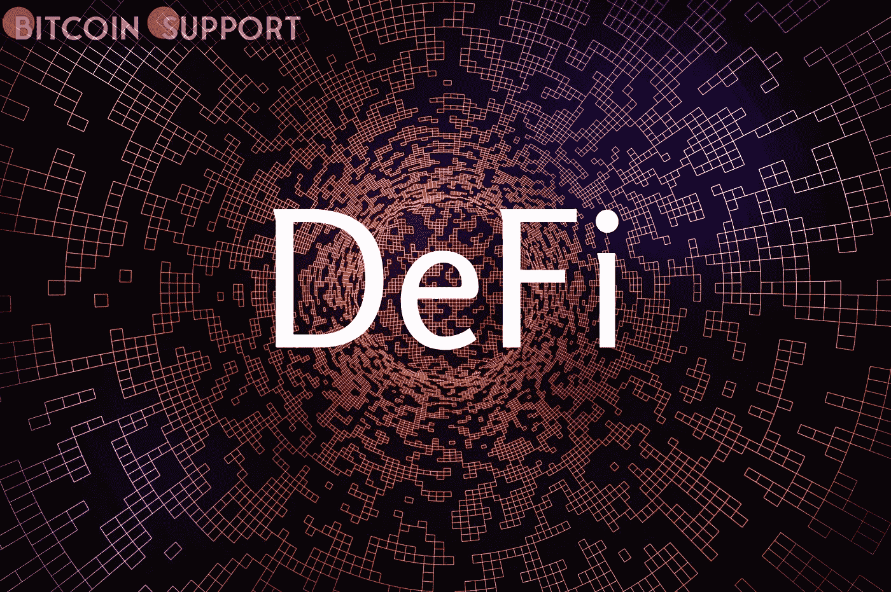
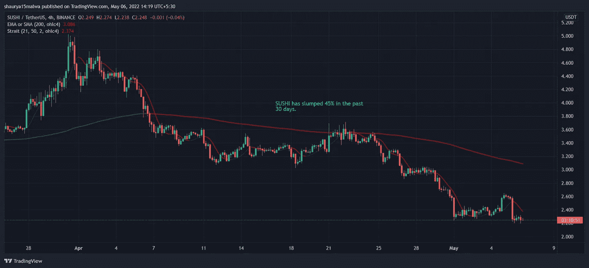
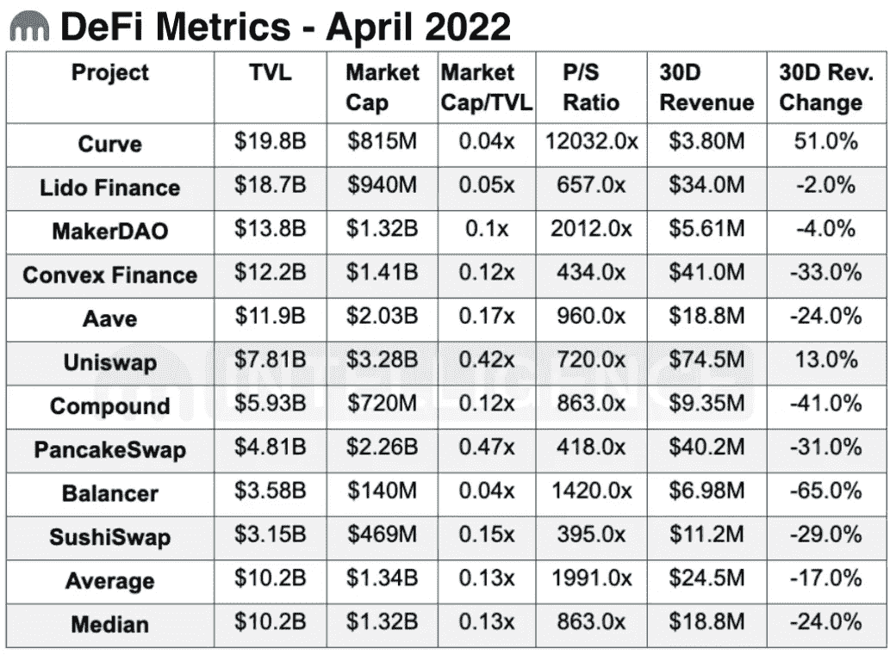

# DeFi Tokens 四月份收入下降；Memecoins 表现出色

> 原文：<https://medium.com/coinmonks/defi-tokens-revenues-fall-in-april-memecoins-outperform-9e60cfcb48c2?source=collection_archive---------69----------------------->

**For full blog visit:-**[**https://bitcoinsupports.com/defi-tokens-revenues-fall-in-april-memecoins-outperform/**](https://bitcoinsupports.com/defi-tokens-revenues-fall-in-april-memecoins-outperform/)

4 月份对于加密货币来说是一个糟糕的月份，尽管它在过去是一个好月份。北海巨妖加密交易所的一项研究发现，dogecoin (DOGE)和 shiba inu (SHIB)等 memecoins 在 4 月份表现良好，但 aave (AAVE)和 thorchain (RUNE)等 DeFi tokens 损失惨重。

如果以比特币(BTC) 17%的跌幅为基准，更广泛的 DeFi 板块平均下跌 34%。紧随其后的是第一层的令牌，或基础区块链，损失了 33%。使用 DeFi 的人可以通过智能合约而不是通过第三方进行交易、借贷和借钱。

DeFi 代币每年都是最大的输家。投资者平均损失了超过 71%的资金。大多数 DeFi 协议都是建立在以太坊平台上的。以太坊的原生令牌 Ether (ETH)相比之下涨了 3%。

专注于 DeFi 的符文，价值损失 51%，是那个板块最多的。最小亏损 22%。上个月有三只一级股票下跌了至少 34%。他们是索拉纳，雪崩，和接近协议。DeFi 项目的收入也有所下降，这是用户每次用钱在协议上做一些事情所获得的收入。协议从交易量中抽取一小部分作为费用。代币的价格可能已经下降，这可能使投资者对这个项目不太感兴趣。金融平台 SushiSwap 的收入下降了 29%，而 DeFi exchange Balancer 的收入下降了 66%。这就是他们收入的变化。过去一个月，CoinGecko 的数据显示，他们的代币寿司和 BAL 分别下跌了 46%和 18%。

**For full blog visit:-**[**https://bitcoinsupports.com/defi-tokens-revenues-fall-in-april-memecoins-outperform/**](https://bitcoinsupports.com/defi-tokens-revenues-fall-in-april-memecoins-outperform/)

最后，只有 Curve (CRV)和 Uniswap (UNI)赚了钱。Curve 月份比 3 月份多赚了 51%的钱。Uniswap 多赚了 13%的钱。不过，强劲的基本面没有发挥作用，CRV 和 UNI 在过去一个月分别下跌了 15%和 34%。

**For full blog visit:-**[**https://bitcoinsupports.com/defi-tokens-revenues-fall-in-april-memecoins-outperform/**](https://bitcoinsupports.com/defi-tokens-revenues-fall-in-april-memecoins-outperform/)

Memecoins 和 exchange tokens 是表现最好的两个加密领域。它平均损失了 19 %,但是像 OKB 和 FTT 这样的交易所平均只损失了 13%。另一方面，Memecoins 损失了大约 20%。由于 Monero (XMR)和 Zcash (ZEC)等公司的加入，隐私令牌的表现也不错，涨幅达到 16%。4 月份，不可替代代币(NFT)的交易量上升，尽管用户数量保持不变。日均成交量上涨 40%，平均交易金额也上涨了同样的幅度。

总部位于以太坊的 NFT 流行收藏 CryptoPunks 失去了投资者的青睐，按市值排名下滑至第三位，而变种人 Ape 游艇俱乐部以 20 亿美元的市值跃升至第二位。

**完整博客访问:-**[**https://bitcoinsupports . com/defi-tokens-revenues-fall-in-April-meme coins-exper/**](https://bitcoinsupports.com/defi-tokens-revenues-fall-in-april-memecoins-outperform/)

**免责声明:以上为作者观点，不应视为投资建议。读者应该自己做研究。**

> 加入 Coinmonks [电报频道](https://t.me/coincodecap)和 [Youtube 频道](https://www.youtube.com/c/coinmonks/videos)了解加密交易和投资

# 另外，阅读

*   [印度最佳 P2P 加密交易所](https://coincodecap.com/p2p-crypto-exchanges-in-india) | [柴犬钱包](https://coincodecap.com/baby-shiba-inu-wallets)
*   [八大加密附属计划](https://coincodecap.com/crypto-affiliate-programs) | [eToro vs 比特币基地](https://coincodecap.com/etoro-vs-coinbase)
*   [最佳以太坊钱包](https://coincodecap.com/best-ethereum-wallets) | [电报上的加密货币机器人](https://coincodecap.com/telegram-crypto-bots)
*   [交易杠杆代币的最佳交易所](https://coincodecap.com/leveraged-token-exchanges) | [购买 Floki](https://coincodecap.com/buy-floki-inu-token)