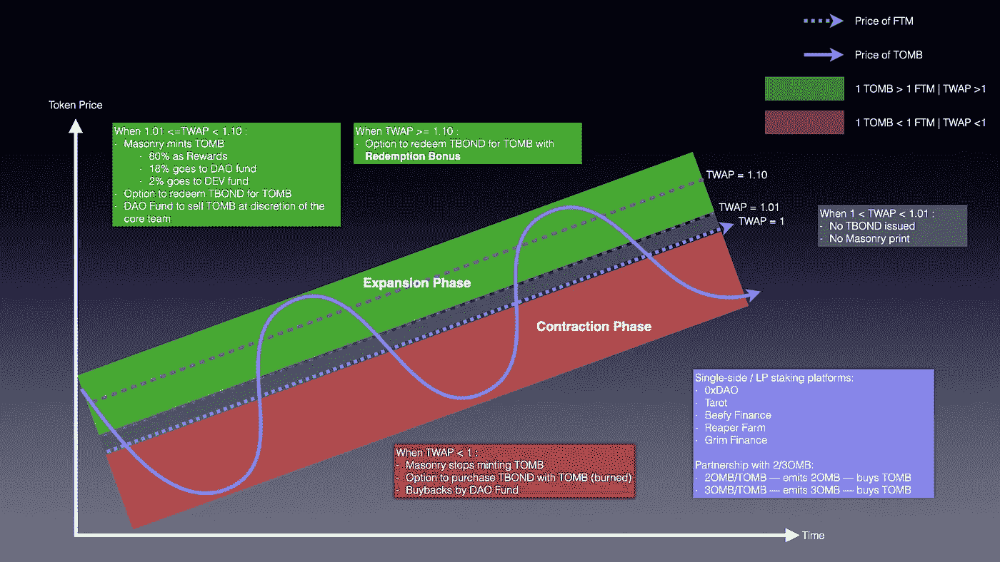

# DeFi——坟墓金融象征经济学。这是怎么回事？

> 原文：<https://medium.com/coinmonks/defi-tomb-finance-tokenomics-what-is-going-on-6859fdb289c6?source=collection_archive---------0----------------------->

*免责声明:墓穴金融还很有实验性。提到的任何东西都只是我对 https://docs.tomb.finance/的***以及它如何可能使博弈论有意义的解释。不是财务建议。**

*在进入令牌机制的细节之前，首先，让我们了解一下当坟墓与 FTM 挂钩时意味着什么。为了过于简化，假设 FTM 是太阳，墓叉是围绕太阳旋转的行星之一(墓叉是太阳系的其他行星)。坟墓在不停地运动，围绕着 FTM 旋转。*

**

*For illustration purposes only.*

*坟墓应该以粗略但不精确的引导路径围绕 FTM 旋转。由于市场力量，坟墓相对于 FTM 的价格可能会偏离。尽管如此，还是有一些适当的机制，希望坟墓的变化不会超过一个理想的范围，我将在下面更详细地解释为什么会这样。*

*一些背景:*

**1) TWAP 代表坟墓/英尺 3 的时间加权平均价格。**

**2)坟墓是一种代币，用作与无上限供应交换的媒介。**

**3) TSHARES(墓穴股份)代表墓穴协议的价值以及股东对其保持墓穴接近挂钩能力的信任，限量供应 70，000 股。**

**4) TBOND(坟墓债券)是债券。**

**5)膨胀阶段——当 TWAP > = 1.01 时(坟墓在标桩上方)**

**6)禅相——当 1 < = TWAP < 1.01(墓在 peg)**

**7)收缩期——当 TWAP < 1(墓在木桩下方)**

*用户可以通过四种方式参与协议。*

*1)在坟墓中下注等量的坟墓和 FTM/FTM LP(在墓地中)以赢得 TSHARES。*

*2)在 TSHARES/FTM LP(在墓地)中下注等量的 TSHARES 和 FTM，以赚取 TSHARES。*

*3)将 TSHARES 桩入 TSHARES 池(砖石结构中)以获得坟墓。在允许提款之前有 6 个时期(1.5 天)的锁定期。*

*4)收缩阶段买入 TBOND，扩张阶段赎回。*

**

*For illustration purposes only.*

*作为一个概述，下面是一个如何设计坟墓融资操作的令牌组学的说明。*

**

*For illustration purposes only.*

*我将部分介绍在扩张阶段刺激墓价下跌的机制，在收缩阶段刺激墓价上涨的机制，以及改善墓价与 FTM 挂钩的其他机制。*

*当 TWAP < 1, Tomb Protocol is in the Contraction Phase. At this point, the Masonry will not be minting any TOMB — The intention is to eliminate inflationary pressure on the circulating supply. The protocol will activate the option for users to purchase TBOND with TOMB. TOMB used for the purchase will be burned out of circulation — reducing circulating supply, creating scarcity for TOMB. Lastly, at the discretion of the core team, the DAO fund will perform buybacks at an undisclosed period (to prevent front running) — this reduces circulating supply in the hands of the public.*

*When 1 <= TWAP < 1.01, Tomb Protocol is in the Zen Phase. There is no active mechanism in operation in this phase as the price of TOMB is where it is supposed to be, pegged to FTM. There is no minting of TOMB in the Masonry and no TBOND is issued for the purchase.*

*When TWAP > 1.01 时，盗墓协议正处于资料片阶段。这是德根县农民高兴得跳起来了。石匠开店并开始铸造坟墓，用疯狂的年息奖励股东——这带来了巨大的通胀压力，以抵消市场对坟墓的需求。此外，债券持有人可以用债券赎回坟墓，增加了坟墓的流通供应，增加了通货膨胀的压力。红利，当 TWAP > 1.10 时，TBOND 持有人可以用赎回红利赎回其 TBOND。更多奖励——激励持有债券的时间更长。点击此处链接至计算兑换红利的等式—[https://docs.tomb.finance/faq-1#2.-计算赎回美元债券奖金的公式是什么](https://docs.tomb.finance/faq-1#2.-what-is-the-formula-to-calculate-the-redemption-bonus-for-usdtbond)*

*而德根出产的农民享有 85%的铸造墓，18%的铸造墓从砖石直接交给道基金。在核心团队的酌情决定下，来自道基金的资金被卸载到市场上，从而在市场上产生卖出压力，并为道基金赚取利润，为收缩阶段做准备，以进行回购。*

*除了上述机制之外，还与 Fantom 生态系统的其他协议建立了伙伴关系。总的来说，这些合作关系创造了更可预测的市场条件，减少了坟墓的流通供应，并在总体上推动了坟墓价格的上涨。综合所有可用平台，估计 70.9%的流通墓被押，这是一个非常健康的市场平均数字。*

**

*还有即将推出的 Lif3，协议自有流动性，可以增强道基金的火力，进一步完善墓协议的流动性市场，获得更好的交易体验。*

*目前，对庞氏经济学的依赖程度很高，其长期成功将取决于许多因素，仅举几个例子:*

*Fantom 生态系统的长期乐观前景。*

*2)核心团队维持健康的财资运作，以长期渡过熊市。*

*3)叶主席领导和团结社区。*

*4)坟墓/TSHARES 的使用案例，以提高粘性，将雇佣军资本转化为长期持有者。*

*PS:致所有德根产量的农民——保持安全。*

> *加入 Coinmonks [电报频道](https://t.me/coincodecap)和 [Youtube 频道](https://www.youtube.com/c/coinmonks/videos)了解加密交易和投资*

# *另外，阅读*

*   *[如何在加拿大购买加密货币？](https://coincodecap.com/how-to-buy-cryptocurrency-in-canada)*
*   *[无聊猿游艇俱乐部(BAYC)评论](https://coincodecap.com/bored-ape-yacht-club-bayc-review)*
*   *[5 款最佳加密交易终端](https://coincodecap.com/crypto-trading-terminals) | [最佳 DeFi 应用](https://coincodecap.com/best-defi-apps)*
*   *[最佳网上赌场](https://coincodecap.com/best-online-casinos) | [币安评论](/coinmonks/binance-review-ee10d3bf3b6e) | [BitMEX 评论](https://coincodecap.com/bitmex-review)*
*   *[麻雀交换评论](https://coincodecap.com/sparrow-exchange-review) | [纳什交换评论](https://coincodecap.com/nash-exchange-review)*
*   *[美国最佳加密交易机器人](https://coincodecap.com/crypto-trading-bots-in-the-us) | [经常性回顾](https://coincodecap.com/changelly-review)*
*   *[在印度利用加密套利赚取被动收入](https://coincodecap.com/crypto-arbitrage-in-india)*
*   *[Godex.io 审核](/coinmonks/godex-io-review-7366086519fb) | [邀请审核](/coinmonks/invity-review-70f3030c0502) | [BitForex 审核](https://coincodecap.com/bitforex-review)*