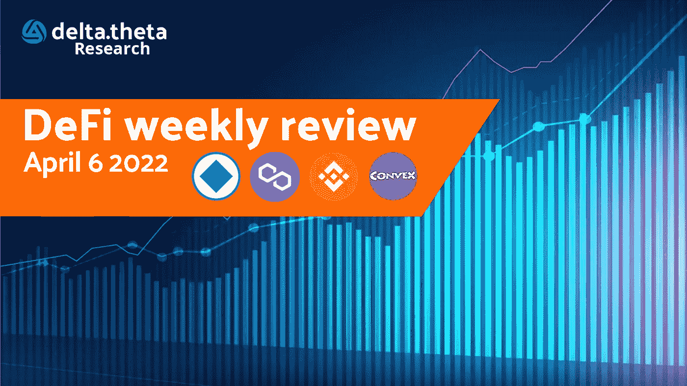
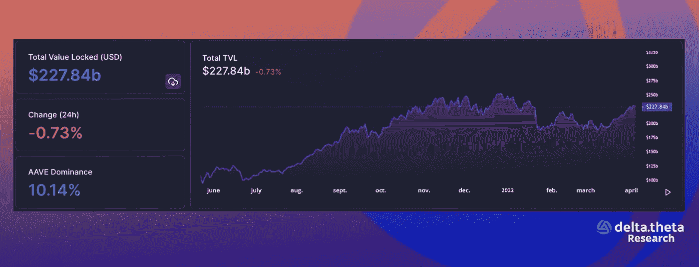
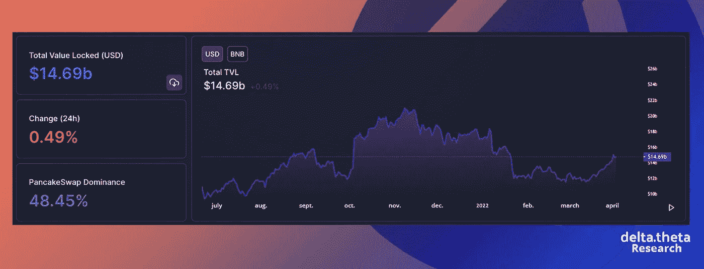
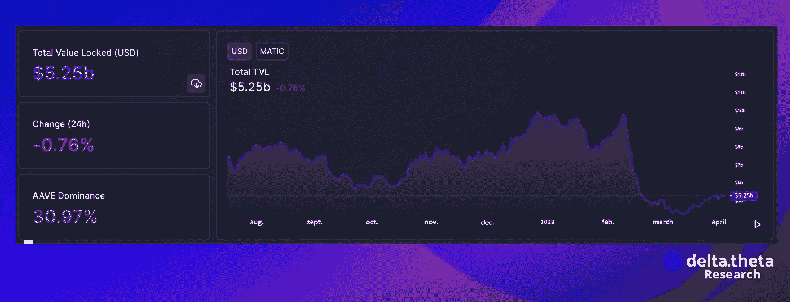

# DeFi 每周评论/4 月 6 日

> 原文：<https://medium.com/coinmonks/defi-weekly-review-april-6-957206c1bd74?source=collection_archive---------44----------------------->

过去一周，整个区块链锁定(TVL)的资金总额增加了 42 亿美元(约增长 1.8%)。过去一周的特点是加密市场的整合和高度不确定性，这解释了这一低迷的增长率。

在过去的一周，锁定在 BNB 链中的总价值增加了 12 亿美元(8.1%)。币安的区块链是如何获得正确营销策略的一个很好的例子:[格莱美奖合作伙伴](https://www.bsc.news/post/binance-officially-becomes-exchange-partner-of-the-grammy-awards)和迈克·泰森的 [NFT 系列](https://www.bsc.news/post/mike-tyson-mystery-box-comes-to-binance-nft-cz-takes-notice)证实了这一点。

Polygon 的区块链 TVL 在过去一周上涨了 2700 万美元(涨幅 5.4%)。

# 新闻

随着 WAVES 作为支持与美元挂钩的加密货币的令牌出现两位数的价格下跌，Waves 生态系统的算法稳定币,[失去了与美元挂钩的汇率](https://cointelegraph.com/news/neutrino-dollar-breaks-peg-falls-to-0-82-amid-waves-price-manipulation-accusations)。本应与美元保持 1:1 比率的美元兑日元周一早盘下跌逾 15%，至 0.83 美元。这发生在 Waves 团队和 FTX 加密交易所创始人萨姆·本克曼-弗里德之间的冲突中。双方互相指责对方操纵。

Convex Protocol 是一个为使用 Curve 稳定币的人提供更多奖励的平台，[修复了](https://www.theblockcrypto.com/post/140554/convex-finance-addresses-bug-that-couldve-led-to-a-15-billion-rug-pull)一个可能导致 150 亿美元被盗的问题。当看似合法的加密货币项目随着投资者的资金消失时，就会发生拉地毯(字面意思:把地毯拉出来)。在过去的一年里，这已经成为分散化金融的一个切实问题。

继二月份令人印象深刻的表现之后，BNB 链上领先的去中心化交易所之一——bis WAP，继续达到新的里程碑。该平台发布的最新[数据显示，它已经打破了一些历史记录，是 BNB 链上性能最高的协议之一。该协议被 CoinMarketCap 列为四大去中心化交易所之一。BiSwap 现在拥有创纪录的 20 亿美元的日交易量。此外，该平台的活跃用户数量增加到 422 000 人，比以前的记录多 23 000 人。](https://twitter.com/Biswap_Dex/status/1511026458524897287?s=20&t=v-1FsjuIZjQ_Eqi2M9v0pg)

Polygon [发布了](https://news.bitcoin.com/polygon-announces-zero-knowledge-identity-platform-for-web3/)一个名为 Polygon ID 的新身份平台，旨在加强 Web3 应用的零知识身份识别。零知识汇总技术允许用户在不泄露不必要信息的情况下证明某事是真实的。polygon 团队还表示，ZK 技术对其至关重要。已经为这一领域的工作拨款超过 10 亿美元。

> 加入 Coinmonks [电报频道](https://t.me/coincodecap)和 [Youtube 频道](https://www.youtube.com/c/coinmonks/videos)了解加密交易和投资

# 另外，阅读

*   [如何匿名购买比特币](https://coincodecap.com/buy-bitcoin-anonymously) | [比特币现金钱包](https://coincodecap.com/bitcoin-cash-wallets)
*   [币安 vs FTX](https://coincodecap.com/binance-vs-ftx) | [最佳(SOL)索拉纳钱包](https://coincodecap.com/solana-wallets)
*   [比诺莫评论](https://coincodecap.com/binomo-review) | [斯多葛派 vs 3Commas vs TradeSanta](https://coincodecap.com/stoic-vs-3commas-vs-tradesanta)
*   [Capital.com 评论](https://coincodecap.com/capital-com-review) | [香港的加密借贷平台](https://coincodecap.com/crypto-lending-hong-kong)
*   [如何在 Uniswap 上交换加密？](https://coincodecap.com/swap-crypto-on-uniswap) | [A-Ads 评论](https://coincodecap.com/a-ads-review)