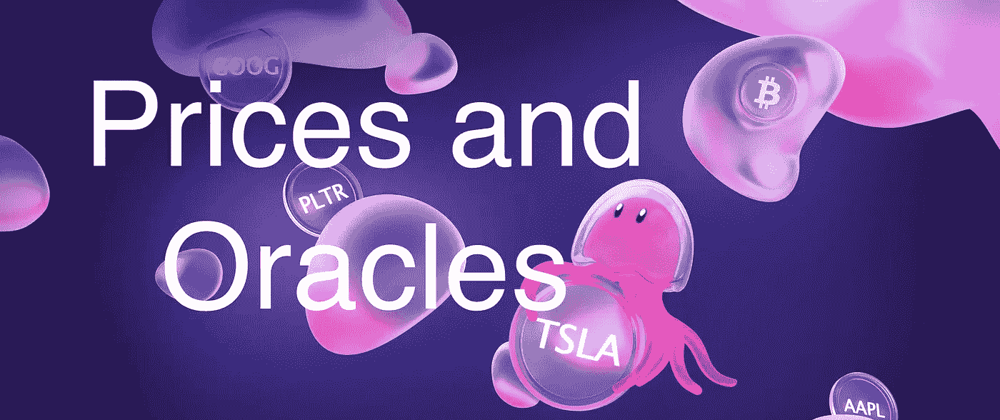
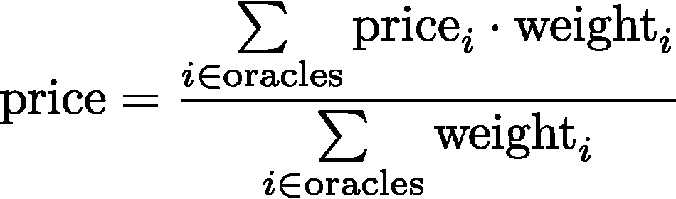

# 定义链基础:价格和神谕

> 原文：<https://medium.com/coinmonks/defichain-basics-prices-and-oracles-8afd0fb49a09?source=collection_archive---------11----------------------->

在 DeFiChain 上查看许多不同类型的价格有时会令人困惑。在这篇简短的文章中，我们将深入了解这个问题。

你在 DEX 上交易代币的价格就是我们所说的 *DEX 价格*。它完全由资金池中不同代币的比例决定，因此也由需求和供给决定。你可以在[这篇文章](https://learn.block6.tech/defi-chain-basics-decentralized-exchanges-c9e1b1727ea6)中找到更多关于 DEX 价格的信息。

# 甲骨文价格是多少？

除了 DEX 价格，当你通过金库铸造代币时，还有*甲骨文价格*变得相关。

oracle 价格由 DeFiChain 生态系统之外的资产价格决定，并用于确定您的保险库的抵押率。对于这些价格，根据令牌的不同，有不同的来源——称为*神谕*。例如，[一个用于股票价格的 oracle 是 NASDAQ](https://www.bloomberg.com/news/articles/2021-09-09/nasdaq-joins-blockchain-based-tokenized-stock-trading-venture) ，一个用于加密资产的 oracle 是 CoinMarketCap。

oracle 价格有几种不同的类型:

*   *活动*甲骨文价格。这是用于确定您的保险库的当前抵押率的值。
*   *下一个*甲骨文价格。这是用于确定“下一个”抵押比率的值。在下一个价格块(每 120 个价格块发生一次，因此大约每小时一次)，下一个价格成为活动价格。
*   *最新*甲骨文价格。这是神谕提供的最后价格的平均值。此时这纯粹是信息性的，但是对于下一个价格块，当时最新的 oracle 价格成为下一个价格。
    你可以在 [defiscan](https://defiscan.live/oracles) 上看到所有令牌和神谕的最新甲骨文价格。

所以有效的 oracle 价格总是提前 120 个街区(大约一个小时)知道。因此，它在外界看来有点落后于当前的价格。

# 神谕是如何工作的？

神谕是通过需要基金会成员授权的区块链交易指定的。oracle 与一个地址相关联，它有一个 oracle ID、一个应该提交价格和权重的令牌列表。

被指定为 oracle 的地址然后可以通过区块链提交其被指定的每个令牌的交易价格更新。oracle 大约每 15 分钟提交一次更新价格，令牌的聚合价格是所有活动 Oracle 价格的加权平均值。例如，如果一个权重为 10 的 oracle 将令牌定价为 100 美元，而另一个权重为 20 的 Oracle 将其估值为 120，则加权平均值将为(10 100 + 20 120)/(10 + 20) ≈ 113.33。通常，价格是根据不同的 oracle 价格和权重计算得出的，如下所示:

只有在过去一小时内提交了更新，oracle 才会被视为活动的。不活动的 Oracle 会被忽略，但至少要有两个活动的 Oracle。否则，受此价格影响的金库将被暂停/冻结，直到再次出现足够多的活动神谕。

# 谁控制着神谕？

据我所知，关于神谕来源的全部信息目前还没有公开，但正如我之前提到的，他们是由 DeFiChain 基金会的成员任命和控制的。

所以 DeFiChain 的这个方面还没有完全去中心化。正如在[粉色白皮书](https://github.com/DeFiCh/pinkpaper)中所陈述的计划，随着 [*操作符*和 *opspaces*](https://github.com/DeFiCh/pinkpaper/tree/main/operator) 的引入，这种情况将会改变。到那时，任何人(支付一定的费用)都将能够成为一名操作员，管理他们自己的 opspace，在那里他们可以选择 DeFi 操作，并任命他们自己的先知。

> 加入 Coinmonks [电报频道](https://t.me/coincodecap)和 [Youtube 频道](https://www.youtube.com/c/coinmonks/videos)了解加密交易和投资

# 另外，阅读

*   [什么是融资融券交易](https://coincodecap.com/margin-trading) | [成本平均法](https://coincodecap.com/dca)
*   [支持卡审核](https://coincodecap.com/uphold-card-review) | [信任钱包 vs 元掩码](https://coincodecap.com/trust-wallet-vs-metamask)
*   [Exness 点评](https://coincodecap.com/exness-review)|[moon xbt Vs bit get Vs Bingbon](https://coincodecap.com/bingbon-vs-bitget-vs-moonxbt)
*   [如何开始通过加密贷款赚取被动收入](https://coincodecap.com/passive-income-crypto-lending)
*   [BigONE 交易所点评](/coinmonks/bigone-exchange-review-64705d85a1d4) | [电网交易 Bot](https://coincodecap.com/grid-trading)
*   [氹欞侊贸易评论](https://coincodecap.com/anny-trade-review) | [CoinSpot 评论](https://coincodecap.com/coinspot-review)