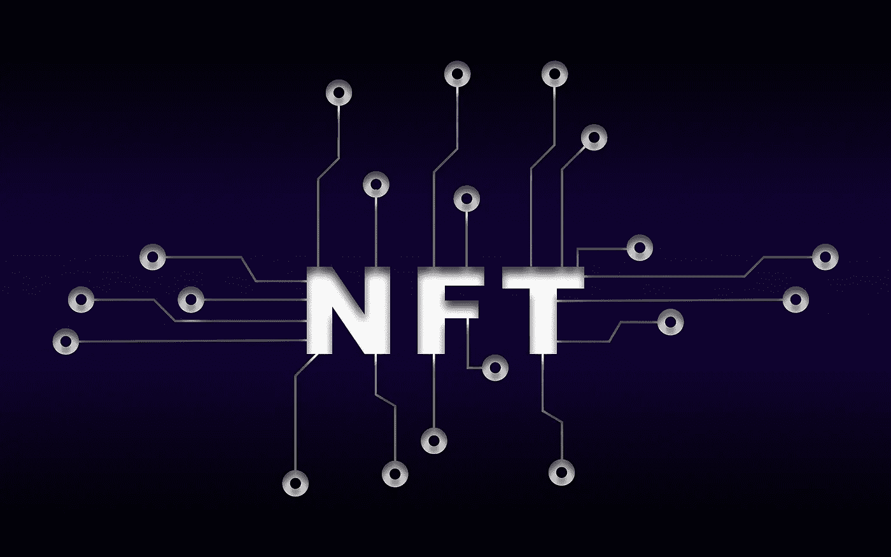

# 定义 NFT

> 原文：<https://medium.com/coinmonks/define-nft-f6f7fe2ebc07?source=collection_archive---------69----------------------->

Image by [Pete Linforth](https://pixabay.com/users/thedigitalartist-202249/?utm_source=link-attribution&utm_medium=referral&utm_campaign=image&utm_content=6850535) from [Pixabay](https://pixabay.com/?utm_source=link-attribution&utm_medium=referral&utm_campaign=image&utm_content=6850535)

FT 被定义为不可替代的代币，但可能有替代定义的空间，而不是在财务上。你可能会问为什么；请考虑以下情况。这里有一个例子，有人投资一个动画数字 NFT 被盗。

# **被盗财物**

W ait！什么？一幅 NFT 被偷了？既然 NFT 是建立在区块链技术上的，那怎么可能，我的权利得到了保护？如果你总是…