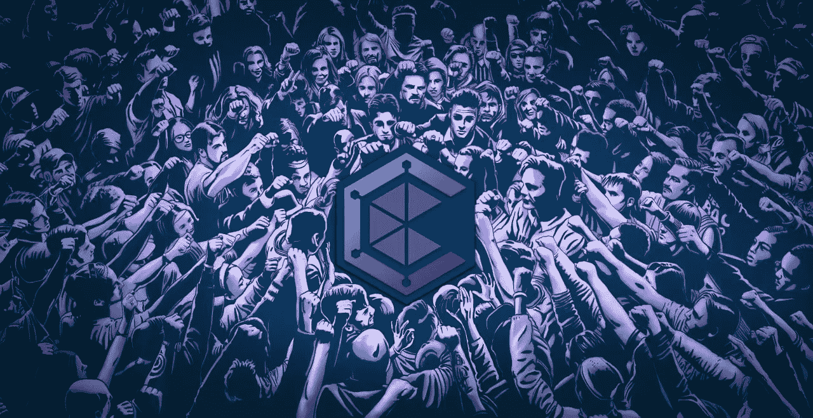

# 定义新令牌

> 原文：<https://medium.com/coinmonks/defining-the-new-token-c96314a77ec8?source=collection_archive---------24----------------------->

## $文明$硬币僧侣

## 构建文明的马赛克

#WeAreCIV

> 我们的刀投了新的令牌。我们来定义一下！

# 介绍我们的新令牌

公民们，这几天我的键盘很热！该社区正在多方面努力，这将使我们进一步巩固我们的根基，扩大$CIV 生态系统。

Sator 引入了推出新令牌的想法，导致了 CivFarm 的发布。DAO 投票批准了它，并定义了它的主要功能。让我们进入令牌组学的细节，翻译道最初批准的内容。

# 令牌组学

*   非常大的总供应量(许多 000): 1 万亿代币
*   首次推出后不可再铸造
*   可以按 DAO 定义的级别征税
*   部分-初始供应锁定流动性
*   部分-为库存锁定初始供应。

# 效用

在 DAO 投票后，机构群体定义了新令牌的效用:

*   民用贸易上的贸易
*   民用农场上的农场
*   购买文明实用工具 NFTs
*   从 civstore.com 购买物品
*   提供流动性
*   投资营销和开发
*   拥有 CIV 的知识产权
*   购买 CIV 游戏积分，一旦可用
*   按照社区的指示，向慈善机构捐款。

虽然 CIV 是一个被动的收入权益类代币，但新代币将成为我们更广泛的生态系统中主动资本现金类的补充。

# 收入

要获取新令牌，您可以:

*   在 CivFarm 上押$CIV
*   把新的代币押在文明农场
*   把 NFT 的公共设施收藏押在民用农场上
*   使用 CivTrade 等 CIV 产品
*   提供$CIV 流动性
*   提供新的代币流动性
*   积极为 [CIV 部落](https://news.civfund.org/tribes-of-civians-65f498ec1b1a)做贡献。

# 铸造

代币的分配基于代币点数(TP)，最初如下:

*   20 TP —农场新令牌-稳定币
*   15 TP —使用 CIV 产品
*   15 TP 农场新令牌-CIV
*   10 TP —农场$CIV-$ETH
*   10 TP —标记新令牌
*   10 TP —股份$CIV
*   10 TP —与部落合作
*   5 TP —入股 NFT 精英翡翠 2000
*   4 TP —入股新的公用事业公司 NFT A
*   3 TP —入股新的公用事业公司 NFT B
*   2 TP —入股新的公用事业公司 NFT C

这些分配奖励可以在 DAO 投票的基础上进一步修改。

# 税务明细

当征收任何交易税时，其分配如下:

*   50%烧伤$CIV
*   50%烧新代币。

转让税最初将在 4.5%左右，并随着时间的推移逐渐降低，以奖励持有人。

# 筹款

筹资目标为 1，500，000 美元(供应量的 8.3%)，以发行价的 38.9%为折扣，用于资助产品开发。

*   第一笔 50 万美元，以发行价的 50.0%折扣购买 3.3%的供应品
*   其他 100 万美元，以 5.0%的供应价格对发布价格打 33.3%的折扣。

新代币将以新代币/稳定币流动性推出。

## 锁

筹资代币的发行将根据有机市值增长的里程碑锁定，新代币将按如下方式分配给投资者:

*   在初始价格增长 30%的情况下，分发了 25%的筹资代币
*   在 60%的增长率下，下一个 35%的令牌将被分发
*   所有剩余的募款代币将以 2 倍于初始价格的价格发行。

在达到市值水平并持续至少连续 24 小时后，每次分配将仅执行一次。

## 利益

那些在筹款活动中投资至少 10 万美元支持推出新代币的人将获得折扣。他们还将在新的公用事业 NFT 铸造时获得第一笔分配，每投资 10 万美元就有一笔分配。这将允许我们在文明农场铸造新的代币。

哇，我写了。希望我没有让你厌烦？

期待来自我们开放透明的社区的反馈和问题。

哦，我差点忘了:你对这个标志好奇吗？嗯，我也是。很快…真的很近了。#WeAreCIV

不要错过任何新闻:加入我们的[官方电报通知频道](https://t.me/civfund)

幸福文明大厦

PS:要了解更多关于文明的知识，请阅读我们的[愿景博文](https://news.civfund.com/civilization-civ-decentralized-investing-for-everyone-99a8b38cb485):

 [## 文明$CIV:为每个人分散投资

### 全球首只 Dex 基金

news.civfund.org](https://news.civfund.org/civilization-civ-decentralized-investing-for-everyone-99a8b38cb485) 

# 关于文明

[文明](http://civfund.org/)是世界上第一个分散投资基金:由自己的投资者直接拥有和管理。令牌$CIV:社区投资工具。

它的 [CivTrade](https://app.civfund.org/) 在第一个月就达到了 500 万美元的交易量，每笔交易额外获得 1718 美元，同时比 Uniswap 节省了 25.3%的汽油。唯冠[升级版实现了与币安的功能等同，但完全 DeX / DeFi。](https://app.civfund.org/pro-trade/0x37fe0f067fa808ffbdd12891c0858532cfe7361d)

也被称为[金融燃烧人](https://news.civfund.com/the-burning-man-of-finance-fead2d86dffb)，文明现在计划 CivFarm 和 CivFund，让每个人都能享受分散金融的好处。有什么问题吗？请加入全球[电报](https://t.me/civsettlers)组。

[文明](http://civfund.org/) | [媒介](https://blog.civfund.com/)|[|](https://www.reddit.com/r/Chainlink/)[不和](https://discord.gg/Ja2nwAHEQd) | [电报](https://t.me/civsettlers) | [推特](https://twitter.com/civfund) | [道](http://dao.civfund.org/)|[Github](https://github.com/CivilizationCIV)|[Reddit](https://www.reddit.com/r/civfund/)