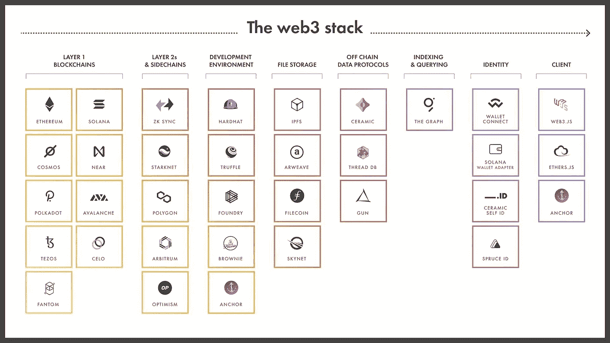

# 定义 web3 堆栈

> 原文：<https://medium.com/coinmonks/defining-the-web3-stack-d360ed87ae37?source=collection_archive---------3----------------------->

## 想要建立在 web3 上吗？Lakshay Maini 在一篇介绍性的指南中指出了 web3 技术栈的构建模块


当构建一个传统的 web 或移动应用程序时，我经常依靠一些构建模块来完成工作。

1.  API / app 服务器(REST 或 GraphQL)
2.  身份验证层(托管或手动)
3.  数据库ˌ资料库
4.  客户端框架、平台和库
5.  文件存储器

使用这些核心组件，我可以构建出我想要的大多数类型的应用程序，或者至少大部分都可以实现。那么这在 web3 中是什么样子的呢？

事实证明，这个问题的答案并不简单，因为:

1.  这种范式在许多方面完全不同
2.  web3 的工具、技术和生态系统不如 web2 成熟

我也更难理解如何建立和运行 web3 应用程序，因为我处理问题的方式与我在 web2 世界中的方式相同。

经过过去 8 个月左右的工作、研究、实验和构建，我想分享一下我所学到的东西。

# 什么是 web3？

在我们定义 web3 栈之前，让我们尝试定义 web3。取决于你问的是谁，有数不清的定义，但对我来说，我发现[这个](https://twitter.com/jbrukh/status/1449734638788821002)定义非常准确:

**Web3 是支持完全去中心化应用的协议栈。**

有了这个分散的技术栈，我们可以开始构建分散的应用程序，它们有自己的含义和特征。

web3 支持的一些特性包括:

*   分散式网络基础设施
*   所有权(数据、内容和平台)
*   原生数字支付
*   自我主权身份
*   分布式、无信任、强健的基础架构
*   开放、公共、可组合的后端

虽然一些建立在分散技术栈上的应用程序将取代它们的前辈，但区块链支持的新原语也使一种新的应用程序范式成为可能。

原生数字支付和公共后端基础设施——如机器学习、移动设备、虚拟现实和其他技术原语、平台和构建模块——使全新类型的应用程序得以构建，其中一些还无法想象。

这是否意味着一切都将被 web3 取代？不一定。虽然我确实认为对于某些类型的应用程序来说，基于分散的技术堆栈进行构建是一个更好的选择——就像几乎任何技术决策一样，这取决于您正在构建什么。

现在让我们开始深入 web3 堆栈，分为以下几类:

*   区块链
*   区块链开发环境
*   文件存储器
*   离线数据协议
*   API(索引和查询)
*   身份
*   客户端(框架和库)
*   其他协议



# 区块链

有无数的区块链可供你选择。没有哪一个是“最好的”，相反，你应该考虑它们之间的各种权衡。

当学习新东西时，对我来说很重要的一件事是将帕累托法则应用到我所学的东西中。也就是说，最有效地利用这些时间和精力的方式是什么？按照这个想法，我可以在最短的时间内获得最大的牵引力和动力，同时学习新的东西。

在区块链世界中，作为一名区块链开发者，学习 Solidity 和 [EVM](https://ethereum.org/en/developers/docs/evm/) (或以太坊虚拟机)可能是最好的选择。使用这个技能组合(和技术堆栈)，你不仅可以建造以太坊，还可以建造其他以太坊 2 层，侧链，甚至其他区块链，如 Avalanche，Fantom 和 Celo。

也就是说，Rust 开始在区块链世界变得越来越流行，Solana、NEAR、Polkadot 和其他人拥有一流的 Rust 支持。你可能也不会真的在学习中出错，但是对于初学者来说，如果今天有人问我，我会说扎实仍然是更好的选择。

除了这些建议之外，这里还有一个不完整的区块链样本，它将技术、公用事业、社区、发展势头和未来的生存能力紧密结合在一起:

*   [以太坊](https://ethereum.org/en/) —独创智能合约平台
*   ZK 汇总: [ZKSync](https://zksync.io/) 、 [Starknet](https://starkware.co/starknet/) 、 [Hermez](https://hermez.io/) —高吞吐量以太坊第二层，但不与 EVM 本地兼容
*   乐观汇总: [Arbitrum](https://offchainlabs.com/) & [乐观](https://www.optimism.io/) —以太坊层 2s，EVM 兼容(在此了解更多关于乐观汇总和 ZK 汇总的区别)
*   [多边形](https://polygon.technology/) —以太坊侧链
*   索拉纳——高吞吐量，便宜的交易，快速的封锁时间，但是比 EVM (Rust)更难学
*   [接近](https://near.org/) —第 1 层区块链，可以用 Rust 或 Assemblyscript 编写智能合同
*   [宇宙](https://v1.cosmos.network/)——互通区块链生态系统
*   [波尔卡多特](https://polkadot.network/)——基于区块链的计算平台，使区块链能够在此基础上执行他们之间的交易，创建一个互联的区块链互联网
*   [Fantom](https://fantom.foundation/?__cf_chl_tk=hkVqppeUFDfRzFwd6Ln5eCa_672VgYpga52iuUhMR4Q-1639611813-0-gaNycGzNCZE) — EVM 兼容层 1
*   [雪崩](https://www.avax.network/) — EVM 兼容层 1
*   [Celo](https://celo.org/) —兼容 EVM 的第 1 层，旨在让任何拥有智能手机的人都能轻松发送、接收和存储加密
*   [Tezos](https://tezos.com/) —非 EVM 兼容的第 1 层，许多 NFT 项目都在使用它

# 区块链开发环境

对于 EVM 开发，有一些很好的开发环境:

*   hard hat(JavaScript)是一个较新的选项，但它越来越受欢迎。他们的文档很棒，工具和开发人员体验都很完美，这也是我个人用来构建 dapps 的东西。
*   [Truffle](https://trufflesuite.com/) (JavaScript)是一套用于在 EVM 上构建和开发应用程序的工具。它是成熟的、经过战斗考验的、有据可查的。它已经存在了一段时间，许多开发人员都在使用它。
*   [Foundry](https://github.com/gakonst/foundry) 是来自 Paradigm 的一个新的 Solidity 开发环境，显示了很大的前景。关键的突出之处是编写可靠的测试的能力、对模糊化的支持和速度(它是用 Rust 编写的)。
*   Brownie 是一个基于 Python 的开发和测试框架，用于 Solidity / EVM 开发的智能合约。

对于 Solana 开发来说， [Anchor](https://project-serum.github.io/anchor/getting-started/introduction.html) 正在迅速成为新开发者的入口。它提供了一个 CLI 来搭建、构建和测试 Solana 程序，以及可以用来构建前端的客户端库。它还包括一个 DSL，抽象出了开发人员在开始 Solana 和 Rust 开发时经常遇到的许多复杂性。

# 文件存储器

在 web3 中，我们在哪里存储图像、视频和其他文件？存储这么大的外链通常非常昂贵，所以我们可能不想把它们存储在那里。

相反，我们可以使用少数文件存储协议之一:

*   [IPFS](https://ipfs.io/) —对等文件系统协议

***优点*** *:可靠，有据可查有一个大的生态系统*

***缺点*** *:如果数据没有被固定，可能会丢失*

*   Arweave 允许你永久存储数据，只需支付一笔交易费用。
*   来自 Protocol Labs 的 Filecoin，也是构建 IPFS 的团队，这是一个旨在提供持久数据存储系统的协议。开发者在 Filecoin 上有很多方法可以构建 T21，包括非常好的 web3.storage。
*   天网(Skynet)——我还没有在生产中使用过，但是已经试用过了，看起来效果不错。这里的 API [看起来很棒。我有一些问题，比如数据保存了多长时间，天网与其他协议的互操作性。](https://siasky.net/developers)

# 离线数据协议

此外，对于文件存储和链上存储，您可能还需要存储链外数据。您可能会像在传统技术堆栈中使用数据库一样使用这些类型的解决方案，但相反，它们会在分散网络上的 n 个节点上复制，因此更加可靠(至少在理论上)。

几个选项是:

*   陶瓷网络(Ceramic Network)—一个用于创建、托管和共享数据的分散式开源平台。陶瓷还有一个很好的身份协议，我稍后会谈到。这可能是我目前最喜欢的非链式存储解决方案。[这里有一个非常好的演示。](https://twitter.com/ceramicnetwork/status/1364631929262235648)
*   纺织 [ThreadDB](https://docs.textile.io/threads/) —基于 IPFS 和 Libp2p 构建的多方数据库。如果我理解正确的话，它目前可能正在经历一次大的 API 更改。我已经试过了，它显示了一些承诺，但文件和 DX 需要一些改进。
*   GunDB —一个分散的点对点数据库。Gun 已经存在了很长一段时间，一些非常有趣的应用程序已经用它构建出来了。

就成熟度而言，我认为链外存储解决方案的生态系统尚未达到构建一些开发人员可能需要的更高级用例的水平。这里的一些挑战是实时数据、冲突检测和冲突解决、书面授权、文档和一般开发人员体验。

将链外数据解决方案与区块链协议集成是我们在拥有能够支持任何类型应用的完全分散的协议栈之前需要跨越的最后一个大障碍。

# API(索引和查询)

与传统技术堆栈中的数据库相比，我们在区块链之上交互和构建的方式有很多不同。有了区块链，数据不是以一种可以直接从其他应用程序或前端高效或轻松消费的格式存储的。

区块链针对写操作进行了优化。你经常会听到围绕每秒交易量、阻塞时间和交易成本的创新。随着时间的推移，区块链数据以块的形式写入，除了基本的读取操作之外，其他任何操作都是不可能的。

在大多数应用程序中，您需要像关系数据、排序、过滤、全文搜索、分页和许多其他类型的查询功能。为此，需要对数据进行索引和组织，以便高效检索。

传统上，这是数据库在集中式技术堆栈中完成的工作，但 web3 堆栈中缺少索引层。

[图](https://thegraph.com/en/)是一个用于索引和查询区块链数据的协议，它使这个过程变得更加容易，并为此提供了一个分散的解决方案。任何人都可以构建和发布开放的 GraphQL APIs，称为子图，使区块链数据易于查询。

要了解更多关于这个图表的信息，请点击这里查看文档。

# 身份

在 web3 中，身份是一个完全不同的范例。在 web2 中，认证几乎总是基于用户的个人信息。这些信息通常是通过表单或 OAuth 提供者收集的，OAuth 提供者要求用户将这些信息交给他们，以换取对应用程序的访问权。

在 web3 中，身份完全围绕着钱包和[公钥加密](https://web3coder.medium.com/the-basics-of-public-key-cryptography-3f7a8732a072)的理念。

虽然“钱包”这个名称符合它的目的，但我发现新接触 web3 的人发现这个术语令人困惑，因为它与认证和身份有关。我希望在未来，我们可以找到其他方式来表达钱包是什么，因为它结合了金融的各个方面，也包括身份和声誉。

作为一名开发人员，您需要了解如何以各种方式访问用户的钱包和地址并与之交互。

在非常基本的层面上(也是非常常见的需求)，您可能希望请求访问用户的钱包。为此，你通常可以在窗口上下文(网络浏览器)中访问用户的钱包，或者使用类似于 [WalletConnect](https://walletconnect.com/) 或 [Solana 的钱包适配器](https://github.com/solana-labs/wallet-adapter)的东西。

例如，如果他们有以太坊钱包，你就可以访问 window . ether eum。Solana(window . Solana)、Arweave(window . arweavel)和其他一些网站也是如此。WalletConnect 适用于移动网络和 React Native，因为它允许用户直接从设备上使用他们的移动钱包进行授权。

如果您想自己处理身份验证，您可以允许用户签署一个事务，然后在某个地方对其进行解码以对用户进行身份验证，但这通常需要一个服务器。[这里的](https://docs.phantom.app/integrating/sending-a-transaction#signing-and-sending-a-transaction)是一个如何用 Solana / Phantom 做到这一点的例子。

以分散的方式管理用户配置文件怎么样？[陶瓷网络](https://developers.ceramic.network/learn/welcome/)提供最强大的协议和一套工具来管理分散的身份。他们最近发布了[一篇博客文章](https://blog.ceramic.network/the-next-architecture-for-building-web3-data-applications/)，概述了他们最近的一些更新，并给出了一些关于所有工具如何协同工作的指导方针。我会从那里开始，然后浏览[他们的文档](https://developers.ceramic.network/learn/welcome/)以了解如何开始构建，并考虑在这里查看我的示例项目[使用陶瓷](https://github.com/dabit3/decentralized-identity-example) [self.id](https://developers.ceramic.network/tools/self-id/overview/) 。

如果您想获取用户的 [ENS](https://docs.ens.domains/) 文本记录，`[ensjs](https://github.com/ensdomains/ensjs)`库为获取用户数据提供了一个很好的 API:

```
const ens = new ENS({ provider, ensAddress: getEnsAddress('1') })
const content = await ens.name('sha.eth').getText('avatar')
```

SpruceID 也是一个看起来很有前途的东西，但我还没有尝试过。

Ceramic 和 [Spruce](https://spruceid.dev/docs/didkit/) 都实现了 [W3C DID](https://www.w3.org/TR/did-core/) 规范，这本身也是我认为 web3 的一个构建模块。也就是说，DIDs 的任何集中式实现都违背了规范试图完成的目标。

# 客户

就 JavaScript 框架而言，你真的可以用你喜欢的任何东西来构建，因为客户端区块链 SDK 大多是框架不可知的。也就是说，React 内置了大量的项目和示例。还有一些像 [Solana Wallet Adapter](https://github.com/solana-labs/wallet-adapter) 这样的库为 React 提供了额外的实用程序，所以我认为学习或熟悉 React 可能是一个明智之举。

以太坊的客户端 SDK 有 [web3.js](https://web3js.readthedocs.io/en/v1.5.2/) 和 [ethers.js](https://docs.ethers.io/v5/) 。对我来说，Ethers 更容易理解，文档也更好，尽管 web3.js 存在的时间更长。

在索拉纳，你可能会和 [@solana/web3.js](https://docs.solana.com/developing/clients/javascript-api) 和/或[主播](https://project-serum.github.io/anchor/getting-started/introduction.html)一起工作。我发现 Anchor 客户端库是我构建 Solana 程序的首选，因为我正在使用 Anchor 框架，而且我发现它比`@solana/web3.js`更容易理解。

# 其他协议

Radicle 是一个建立在 Git 上的分散式代码协作协议。可以认为它是 GitHub 的一个去中心化版本。

[Livepeer](https://livepeer.org/) 是一个去中心化的视频流网络。它是成熟的，并被广泛使用，网络上有超过 70，000 个 GPU。

[Chainlink](https://chain.link/) 是一款 Oracle，支持访问真实世界的数据和离线计算，同时保持区块链技术固有的安全性和可靠性保证。

# 包扎

这篇文章将会是一篇活的文档，我在学习、试验和收集来自 web3 开发人员的反馈时会一直关注它。

如果您对我在这里遗漏的东西有任何反馈或想法，请联系我并与我分享您的想法。随着开发人员的加入和参与，看到围绕 web3 的所有活动令人兴奋。虽然基础设施仍在不断发展，但构建真正分散的协议和应用，让人们无需将权力和控制权交给大公司就能进行协调，这一愿景非常重要，我们即将实现这一愿景。

> *加入 Coinmonks* [*电报频道*](https://t.me/coincodecap) *和* [*Youtube 频道*](https://www.youtube.com/c/coinmonks/videos) *了解加密交易和投资*

# 另外，阅读

*   [币安 vs FTX](https://coincodecap.com/binance-vs-ftx) | [最佳(SOL)索拉纳钱包](https://coincodecap.com/solana-wallets)
*   [比诺莫评论](https://coincodecap.com/binomo-review) | [斯多葛派 vs 3Commas vs TradeSanta](https://coincodecap.com/stoic-vs-3commas-vs-tradesanta)
*   [Capital.com 评论](https://coincodecap.com/capital-com-review) | [香港的加密借贷平台](https://coincodecap.com/crypto-lending-hong-kong)
*   [如何在 Uniswap 上交换加密？](https://coincodecap.com/swap-crypto-on-uniswap) | [A-Ads 审查](https://coincodecap.com/a-ads-review)
*   [WazirX vs CoinDCX vs bit bns](/coinmonks/wazirx-vs-coindcx-vs-bitbns-149f4f19a2f1)|[block fi vs coin loan vs Nexo](/coinmonks/blockfi-vs-coinloan-vs-nexo-cb624635230d)
*   [本地比特币评论](/coinmonks/localbitcoins-review-6cc001c6ed56) | [加密货币储蓄账户](https://coincodecap.com/cryptocurrency-savings-accounts)
*   什么是融资融券交易
*   [支持卡审核](https://coincodecap.com/uphold-card-review) | [信任钱包 vs MetaMask](https://coincodecap.com/trust-wallet-vs-metamask)