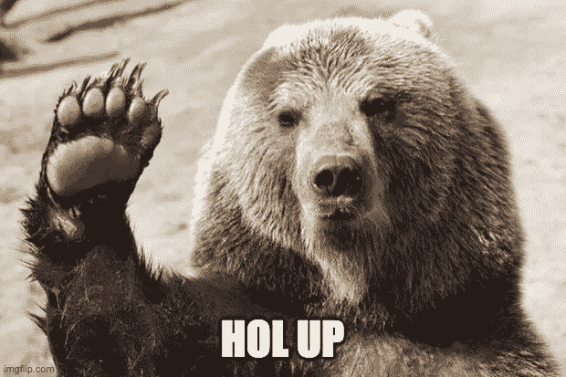

# 绝对不是熊市

> 原文：<https://medium.com/coinmonks/definitely-not-a-bear-market-a54e3c89f813?source=collection_archive---------8----------------------->

## 这是目前密码市场上的另一种东西

meme by author

我通常避免将加密市场最近的低迷称为熊市。我用了很多词。缓慢的市场，回调，抛售，或下跌趋势。但我很少使用“熊市”这个术语。(或者如果我曾经在那种罕见的场合，我并不是真心的。)出于迷因的目的，我最多使用“bera”这个术语。