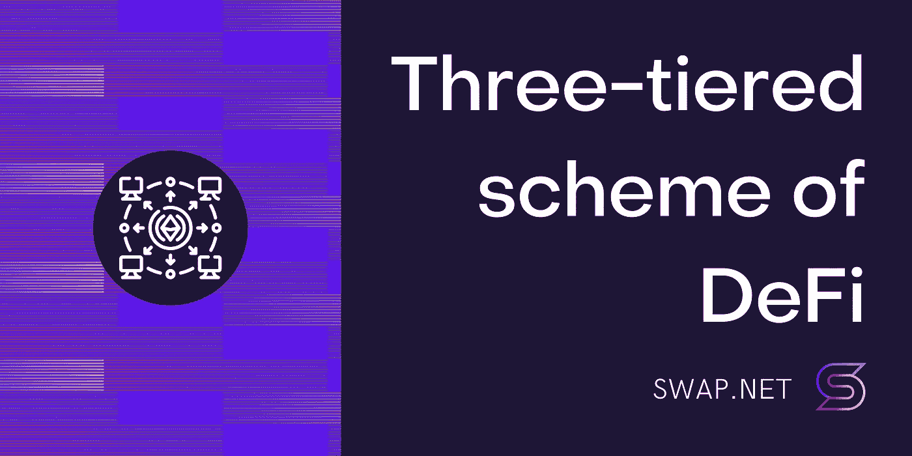
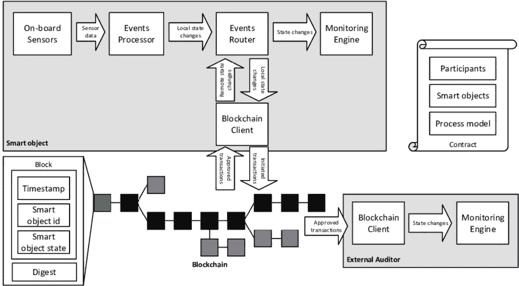

# DeFi 的三层方案

> 原文：<https://medium.com/coinmonks/defis-three-tiered-scheme-5739ea0cb9be?source=collection_archive---------27----------------------->

## 如果没有对这种三层结构的清晰理解，你将很难想象整个 DeFi 技术生态系统。没有这种远见，你仍然会在头脑中搞乱超面具、朋克、区块链和其他不可知的东西。

# 区块链——第一层

让我们记住我们所拥有的:

## 面向国家的区块链

*   Etherium 和基于它的区块链(Polygon/Matic，BSC 等。)是**面向国家的区块链**；
*   每个地址都用区块链的本国货币(ETH，BNB，MATIC)存储其余额值；
*   每个智能协定存储其持久变量的值；
*   在当前时间点(块 X)，**区块链的状态由网络中所有现有地址**和区块链中所有智能合同的当前持久性变量值的平衡来描述。

区块链的全部本质都反映在它目前的状态中；它的主要目的是存储变化状态的历史，一个不可变的、分布式存储的和完全透明的历史。

在区块链，隐藏任何事情都是不可能的。在区块链，唯一无法解决的问题是特定钱包地址的人格化(去匿名化)。其他一切——余额、交易、所有转账、合约调用等等——都可以被追踪、分析并得出一些结论。
还有一些特定的工具可以对区块链进行此类分析，例如使用专门的图形数据库来识别欺诈计划或其他有趣的交互。如上所述，区块链状态是区块链中所有现有地址加上区块链中所有智能合约的长期(持久)存储状态的总和。

换句话说，**区块链的状态是其长期存储器的瞬时**(在当前块内)快照，所有信息当前都存储在其中。最重要的是，除了区块链，这个**信息不会存储在其他任何地方**。

**Metamask 或 TrustWallet 不存储您的硬币**，从币安提取 BNB 到 Metamask 是不可能的，您首先在币安的余额中看到**您的 BNB** ，然后在您的 Metamask 中看到**这一事实只是当前区块链中记录的区块链当前状态的反映**。也就是说，你的资金首先在币安的托管账户，然后通过交易转移到你的非托管地址，这是你自己在元掩码中设置的。

因此，区块链是一个关于其状态的信息库，你可以说它保存了一份主拷贝。除了区块链， ***这种信息不会存储在其他任何地方*** *。*

## 处理

因此，所有当前可用的信息都存储在区块链中，并被称为区块链的当前状态。那么，区块链的状态是如何改变的，又是由什么改变的呢？

能够改变区块链状态的主要且唯一的力量是事务。这是唯一能改变钱包余额或改变智能合约长期记忆的东西。一旦矿工**在下一个块中包含了** **特定的一组交易**，涂抹它并将其包含在链中— **区块链的状态已经不可逆转地改变了**。

**我们对交易了解多少:**

*   从您的地址(帐户)进行的每一笔交易都必须用该帐户的密钥签名；
*   钱包总是要求用户确认操作——签署交易、发送交易、允许站点访问钱包等。；
*   在没有用户批准的情况下完成交易的唯一方法是知道帐户的密钥，并以编程方式生成签名和交易。

没有所谓的无主交易。网络上的任何交易总是从钱包地址开始。智能合约不能发起交易，但是可以(作为钱包的交易请求的一部分)进行所谓的内部调用，从其他合约中提取方法，发送硬币等。B **但是所有这些操作都将在发起事务的框架内以及用户分配给原始事务的 gas 的严格限制内执行。**

交易的发送者(发起者)总是可以通过用钱包的秘密密钥对交易进行签名来检查其有效性。所以知道秘钥的人就是主人。这就是为什么保持你的助记短语和私人钱包钥匙的秘密是非常重要的。

任何交易都做两件事之一——在钱包之间转移一枚区块链本地硬币**(标准交易)**或者调用某种智能合约的某种方法**(智能合约交易)**。

**或同时兼而有之。**在任何一种情况下，交易执行后，区块链的状态都会改变(可以改变)。智能合约事务可能需要代表被调用的智能合约执行一系列内部调用**(内部事务)**。但是整个链的发起者仍然是原始事务的发送者。

***因此，区块链的状态只能由区块链中正确生成、签名和包含的交易来改变。***

# 智能合同—第二层

## 基础

*   **智能合同**是在区块链节点上执行的软件代码，执行的结果(如果在软件中有明确说明)存储在区块链的一个特殊存储库中。让我们把存储在区块链**中的数据称为持久数据**。
*   智能合同代码一旦被注入到区块链中，就会被额外固定，以防止对代码的任何意外或有意的修改。
*   智能合约功能可以从外部触发(从用户的钱包或从另一个合约)，分为两大组:
    - **不改变**持久数据的状态(只读)；
    - **改变**持久数据的状态。

调用第一个组的函数既不耗费汽油也不耗费金钱，而且不会超出我们所关联的最近节点( **Balance Of，TotalSupply，Allowance** )。在区块链扫描仪中，这些功能列在合同的**阅读**选项卡中。

对第二组函数的调用成为一个成熟的事务，它被挖掘，包含在块中，结果被写入区块链。(**批准，转移，转移自**)。在区块链扫描仪中，这些功能都列在**合同的**标签上。

## 先进的

*   因为契约代码是固定的，我们不能改变它，但是我们可以改变存储在持久存储中的变量的状态。
*   **契约可以读取这些变量的值**并根据读取的值做出决定——是否执行代码、是否执行事务等。
*   如果合同中存在改变这些变量的值的外部函数，我们称这些函数为“**杠杆**”，管理员(通常是合同的当前所有者或“所有者”)可以通过这些函数改变合同的行为。
*   所有这些杠杆都必须出现在合同的**写**标签上。
*   **契约本身从不发起任何事情**。它被动地生活在区块链，等待被召唤。所有契约函数都是从外部调用的，要么是来自常规地址的事务，要么是来自另一个契约，但也只是作为初始事务的继续。
*   合同的普通交易在**交易**选项卡上可见，而合同对合同请求(**消息调用**)在**内部交易**选项卡上活动。

## 那么智能合约带来了什么？

生活在一个只有交易——钱包之间的转移是可能的——的区块链是相当无聊的，让人想起常规会计。然而，BTC 存在得相当成功，看不起所有这些新奇的智能合约、桥梁、副链和其他有趣的东西。

那么，智能合约给平静的会计生活带来了什么？他们已经将区块链从一个会计账簿转变为一个云数据中心。每个智能合约本质上都是硬确定的软件代码，有一个地址(区块链住所)和一个 ABI，这是调用智能合约功能的描述格式。

提醒一下，根据定义，嵌入区块链的智能合约是不可变的实体。只要区块链节点还活着，即使半个地球成了废墟，它也会继续工作。想象一下——目前，区块链上有成千上万的程序，随时可以运行，任何人都可以访问，只要他们知道自己的界面(ABI)。

例如，在以太坊上，你甚至可以调用 cryptokitties 契约来读取其中的一些数据，你可以触发一个已经几年没有调用过的契约方法，如果调用有效，契约就会醒来，执行请求并给你结果。

例如，你可以拿出一份煎饼厂的合同，向它索要一个特定的 LP 对——不管它是否存在。如果存在，那么你可以向已经特定的一对货币的合约索取当前的储备——得到它们并计算瞬时价格。
然后你就可以去找合约煎饼路由器，要求他把你的 bnb 换成这个令牌，附带滑点，指定要求的最低金额等等。然后把你的 BNB 给他，把代币拿回来。
**那没有让你想起什么吗？**当然，这是通过网络界面在煎饼上购买代币的经典版本。只是我们都是手工完成的，调用了各种合同的某些功能。

接下来，你需要在煎饼上卖你的代币。
再次，我们转到**令牌**契约，在**写**选项卡中寻找**批准**函数，用路由器的 pancake 地址参数和我们允许从余额中扣除的令牌数调用它。然后，我们再次查看路由器合同，调用反向购买功能—将我们的令牌换成 BNB。我们开始交易，等待，代币售出，BNB 已经到达我们的地址。

请注意，我们通过区块链浏览器(bscan、polygonscan 等)中相应合同的 WRITE 选项卡，手动完成所有这些操作，而不使用 web 界面。)在元掩码中对我们的事务进行确认和签名，或者通常从脚本中通过程序代码进行签名和发送，原则上不使用元掩码。

因此，智能合约是一个存在于区块链中的程序，它能够做比简单地在钱包之间转移硬币更智能的工作。被调用的智能契约方法能够改变区块链的状态，并且可以从区块链资源管理器或高级语言程序代码中调用。

# 网络界面——顶级

那么，为什么我们需要一个网络界面呢？
我们习惯于通过各种网络界面与 DeFi / DApp 世界交流——交换网站、农业网站(彼此就像豆荚里的两颗豌豆一样相似)、桥梁等等。非常方便，只需点击一个按钮，一切都清晰美观。

为了理解正在发生的事情的本质，你需要意识到并记住**两件简单的事情**:

*   任何网络界面仅仅是一个可视化区块链状态的窗口；
*   任何 web 界面都只是调用各种智能合同功能的方便层。

web 界面中基本上没有其他东西。那里没有存储任何信息(**所有信息都存储在区块链中**)，除了一些模板来显示区块链的状态，以及当用户做一些事情(点击按钮等)时调用某些合同的某些功能的代码，什么都没有。).并且这些动作(签名和发送交易)**的确认必须由用户**通过按下元掩码弹出窗口中的按钮**来明确提供**。

这里潜伏着一个危险，我们已经讨论过了——如果你连接到一个诈骗网站，点击“赠送 100 BTC”并在 metamask 中确认了交易，然后所有的钱都从你的账户中流出了——你已经射中了自己的膝盖。诈骗网站可以将任何交易放在这个按钮上，通过确认您实际上已经签署了导致余额归零的操作。**如何防止这种情况发生你可以** [**阅读这里**](/coinmonks/main-types-of-scam-how-to-find-in-the-smartcontract-ac0380dd234b) **。**

***所以，任何 web 界面都只是一个方便的窗口，用来显示区块链的状态，并调用各种智能合约函数来改变它(状态)。***

# 让我们总结一下

**所以，看看戴普斯和区块链告诉我们:**

*   状态区块链将所有可用信息存储在它们当前状态的快照中，记录在当前区块链中；
*   该信息包括区块链上所有智能合约的账户余额和持久存储状态；
*   所有州信息都存储在区块链，并且只存储在区块链。既不是钱包，也不是网站，也不是其他任何人；
*   顺便说一下，从这个规则可以很容易地推导出所有以前的规则，例如，一些令牌的钱包余额存储在该令牌的智能合约中，等等。；
*   改变区块链状态的唯一方法是签署一项交易并将其包括在当前开采区块中；
*   交易可以包括从一个地址到另一个地址的本地区块链硬币的转移和/或一些智能合同的一些功能的调用；
*   智能合约功能的执行可导致其永久存储器的状态改变，并生成额外的事务，这反过来也可导致状态改变；
*   任何网络界面都只不过是一个显示区块链当前状态的窗口，以及一个调用各种合同的各种功能的方便界面；
*   您通过界面使用智能合约执行的所有操作也可以通过使用区块链浏览器或高级语言脚本直接调用相关智能合约函数来执行。

让我们更详细地看看最后一点。简单来说，你**可以在不使用缓慢且经常出故障的 web 界面的情况下做以下**:
**——在 exchange 上购买 token
——在交易所出售代币；
-批准令牌合同给路由器可以销售；
-批准硬币合同(BUSD、USDC)预售合同，以便更快地在预售时购买代币；
-申领您的代币。**

您需要知道的只是契约的地址及其 **ABI** (应用程序二进制接口)，或者换句话说，契约方法的名称及其参数和返回值。对于已建立的合同，如交换路由器、LP 对、令牌合同等。ABI 可以很容易地在谷歌上找到，或者在浏览器的**合同**标签下找到。

对于自定义契约，如果加载了源代码和 ABI，那么所有信息也在资源管理器标签**契约**中。但是，如果源代码丢失，我们没有标签**写**和如何直接得到这个合同是不清楚的。**但是这里可以做两件事**:

*   **解码契约的二进制代码**(我们在第一个工作坊讨论过这个)拉出感兴趣的函数的名字和参数；
*   **或者在浏览器**中查看一个合法的事务，它有一个合法的函数调用和已经被某人执行的正确参数(例如，通过 web)。

在任何情况下，**你都可以为这个函数编写你自己的 ABI** ，只需要几个简单的转换和一点耐心，然后把它加载到脚本中，用脚本调用这个函数。浏览器无论如何都不行，但是脚本可以。

## 注意:

然而，有时需要一个网络界面。如果事务体(其参数和内容)是根据接口后端的一些秘密规则生成的，并以加密形式传输到契约，就会发生这种情况。

同时，如果合同发布时没有源代码，反编译它以逆转验证功能是一个相当大的挑战——那么我们就需要一个 web face 来获得正确的事务负载。

不，您可以按照合同方法执行交易本身，但是如果没有这个秘密数据，您将会被拒绝。LZPad 就是一个例子，它在包含预售时就产生了这样一个棘手的事务。比如 DXSale 就比较简单，你可以很容易的编写一个 bot 进行快速购买，KoalaPad 也没有任何虚饰，主要是找一个预售合同等。

# 未完待续…

在下一节中，我们将看看如何在没有接口的情况下，只知道代码和必要的功能。强烈建议你参加一个基本的编程课程，以便能够阅读最少量的代码，并且至少理解一段特定代码的作用。

**巨大的感谢从**[**Swap.net 团队**](https://twitter.com/NFTSwapnet) **到 Alex Kruegger**[**(TG @ Kruegger)**](https://t.me/ak74lab)**，频道—**[**https://t.me/ak74lab**](https://t.me/ak74lab)

# 交换。网队
官网—[https://swap.net/](https://swap.net/)
推特—[https://twitter.com/NFTSwapnet](https://twitter.com/NFTSwapnet)
不和—[https://t.co/uzz0Qt12tf](https://t.co/uzz0Qt12tf)
中—[https://medium.com/@NFTSwapnet](/@NFTSwapnet)
Docs&白皮书—[http://docs.swap.net](https://t.co/5qc7Mxt2p5)

> 加入 Coinmonks [电报频道](https://t.me/coincodecap)和 [Youtube 频道](https://www.youtube.com/c/coinmonks/videos)了解加密交易和投资

# 另外，阅读

*   [印度的加密交易所](/coinmonks/bitcoin-exchange-in-india-7f1fe79715c9) | [比特币储蓄账户](/coinmonks/bitcoin-savings-account-e65b13f92451)
*   [OKEx vs KuCoin](https://coincodecap.com/okex-kucoin) | [摄氏替代度](https://coincodecap.com/celsius-alternatives) | [如何购买 VeChain](https://coincodecap.com/buy-vechain)
*   [币安期货交易](https://coincodecap.com/binance-futures-trading)|[3 commas vs Mudrex vs eToro](https://coincodecap.com/mudrex-3commas-etoro)
*   [如何购买 Monero](https://coincodecap.com/buy-monero) | [IDEX 评论](https://coincodecap.com/idex-review) | [BitKan 交易机器人](https://coincodecap.com/bitkan-trading-bot)