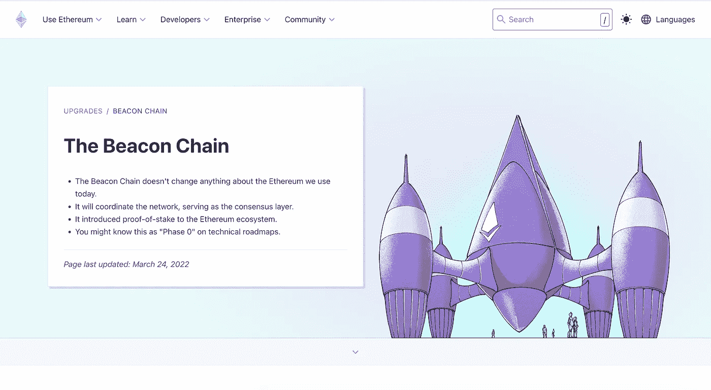
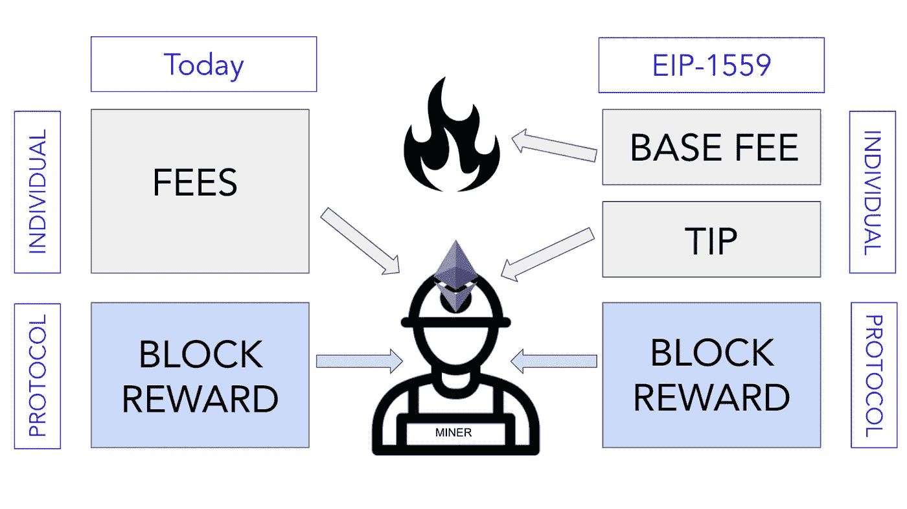
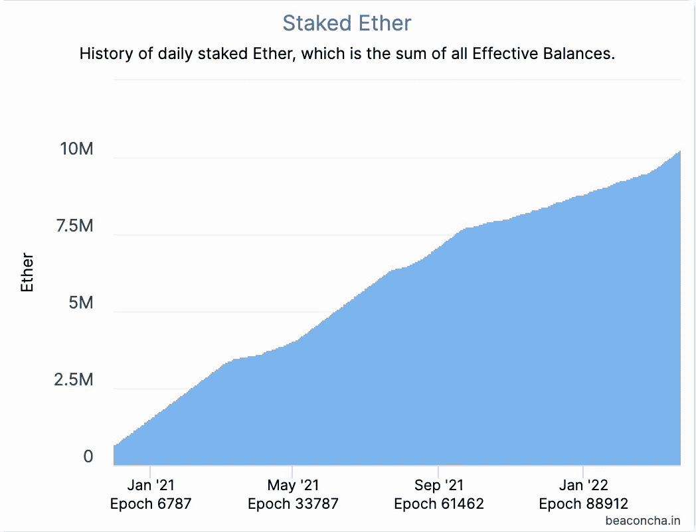
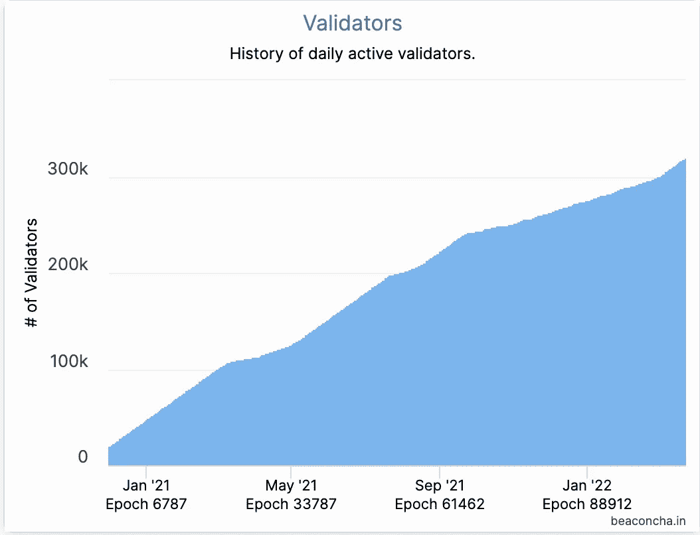
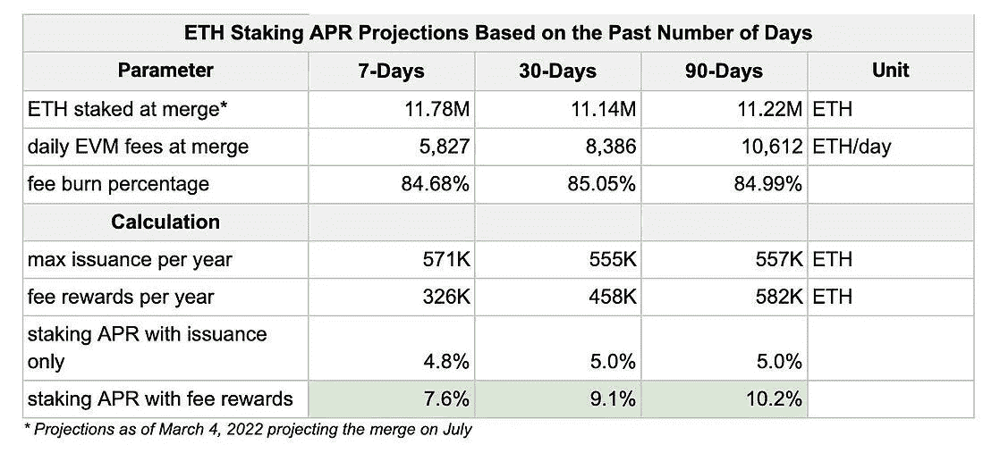

# 通货紧缩以太坊

> 原文：<https://medium.com/coinmonks/deflationary-ethereum-2d372a40ac46?source=collection_archive---------22----------------------->

## 以太坊将在合并信标链和现有以太坊主网的合并完成后切换到利益相关者共识机制。成功地进行了窑试验，但最终合并日期预计在第三季度。

以太坊升级的突出吸引力之一是网络从工作证明过渡到利益证明，通过这一点，信标链将最终连接到以太坊 1.0 的当前主网络。

3 月 15 日，以太坊基金会[宣布](https://blog.ethereum.org/2022/03/14/kiln-merge-testnet/)在窑网上成功执行了一项将当前主网与信标链合并的测试。"像以太坊主网一样，窑的执行层是在工作证明下启动的，与运行利益证明的信标链并行."建国者写道，“合并发生在 2022 年 3 月 15 日的窑上。网络现在完全在风险证明下运行！”

[信标链](https://ethereum.org/en/upgrades/beacon-chain/)将为分片奠定基础。正如以太坊基金会在其网站上所指出的那样，碎片链为应用程序和汇总提供了“[额外、更便宜的存储层来存储数据](https://ethereum.org/en/upgrades/shard-chains/)，并且是升级以太坊可扩展性和能力的第 2 层解决方案的一部分。

有了碎片链，验证者只需要运行他们所验证的碎片的数据，而不是像以太坊 1.0 那样运行整个网络。在以太坊环境中，分片将通过创建新的链(称为“分片”)来减少网络拥塞并增加每秒交易量

目前，我们还不确定以太坊何时将正式在 Proof-of-stage 协议上运行，但关于测试合并的消息无疑是向以太坊 2.0 最终过渡的关键一步——以太坊的升级版本，据称交通拥堵少得多，大幅减少了汽油费，可扩展性更高。

这一合并不仅从技术角度，而且从货币角度来看都特别重要。合并后，市值没有限制的第二大加密货币以太坊将减少 90%的已发行代币，这意味着供应量将大幅下降。正如一位以太专家在推特上声称的那样，这种令牌组学的变化将导致相当于“三个比特币同时减半”的价格影响。

然而，这种发行的削减可以追溯到去年夏天，EIP(以太坊改进提案)1559 在以太坊网络上实施。

## EIP 1559

去年 8 月，[伦敦 hard fork 升级](https://www.cnbctv18.com/cryptocurrency/london-hard-fork-all-you-need-to-know-about-ethereums-latest-update-how-it-may-benefit-india-10278611.htm)包括一套“改进建议”，其主要目的是解决以太坊交易的高额汽油费。在所有提案中，EIP 1559 重组了网络中的费用机制，引起了最多的关注。

那么，EIP 1550 有什么特别之处呢？

以太坊区块链目前仍在工作证明共识机制上运行，这意味着矿工使用计算能力来创建区块并验证以太用户发起的交易。从这个意义上说，采矿被认为是一种通过电力做功的方式。矿工因保护公共账本上的区块链和交易记录而获得以太币和交易费的奖励。

任何在高峰时间在以太坊上处理交易的人一定都经历过等待交易通过的困难。这是因为大量的事务会导致拥挤，使得矿工无法按时将事务包含在块中。由于矿商需要增加工作量来处理交易，天然气费上涨了。

每当分散钱包上显示交易“待定”时，人们就可以通过支付额外的汽油费来优先处理他们的交易。额外的部分是在以太坊交易所需的基本费用之上增加的**小费**。谁给的小费多，谁就比其他用户有优势。

以太坊开发商蒂姆·贝科解释说[矿工们可能会钻这个系统的空子，用欺诈交易填充区块，从而推高其他人的天然气费用。由于他们作为矿工的身份比普通用户更有优势，他们可能会为诈骗交易付费，最终会回到自己的口袋里。](https://fortune.com/2022/03/21/ethereum-destroyed-billions-in-ether-supply/)

如下图所示，该图是在 2021 年 8 月之前创建的，EIP 1559，基本费用被烧掉，以防止面向诈骗的交易大量流入，只有小费加上 ETH 形式的集体奖励才能被矿工收到。

Source: [https://consensys.net/blog/quorum/what-is-eip-1559-how-will-it-change-ethereum/](https://consensys.net/blog/quorum/what-is-eip-1559-how-will-it-change-ethereum/)

以太坊社区对这一改进表示欢迎，因为它使大量 ETH 退出流通，并降低了市场上 ETH 的总体供应量。根据从以太数据仪表板 Watch the Burn 检索到的数据[显示，截至本文撰写之时，超过 200 万枚以太币(价值近 60 亿美元)已被烧毁并清除出市场，导致净供应量减少 65.2%。](https://watchtheburn.com/)

## 共识层

以太坊最早于今年夏天最终过渡到利益证明协议，这有什么大不了的？

第一，以太坊转 POS 会大大降低其能耗。当用于开采比特币的能源达到全球能源消耗的 0.1%时，据报道，在 POS 上运行的以太坊将比当前版本[节能 99.5%。此外，转换到 POS 将免除因环境问题而成为监管机构目标的风险。](https://cryptobriefing.com/opinion-2022-ethereums-biggest-year-yet/)

为了验证交易，像比特币区块链这样的电力网络通过奖励比特币来激励矿工通过巨大的计算能力解决密码难题。以太坊网络目前以类似的方式工作。为了支付矿工的工资，乙醚供应量每年大约上涨 4%。然而，有了利害关系证明，排放量被设定在 1%左右，这意味着利害关系人的整体回报比工作证明协议下的少得多

其次，以太坊的市值超过 3500 亿美元，比所有第 1 层网络加起来还要大。DeFi 活动以及制造和交易 NFT 构成了以太坊网络的主要使用案例，以太坊网络仍然是 DeFi 和 NFT 的主要参与者。

与此同时，由于该网络已经通过 EIP 1559 销毁了 69 亿美元的乙醚，最大的连锁天然气燃烧器是 NFT 市场 Opensea，[Bitcoin.com](https://news.bitcoin.com/ethereum-after-1559-network-nears-2-million-eth-burned-worth-over-6-9-billion/)报道。领先的 NFT 市场已经燃烧了近 23 万吨乙醚，价值近 8 亿美元。因此，如果以太坊能够转向一种对天然气友好的机制，降低交易和铸造 NFT 的成本，NFT 的狂热可能会复活，因为天然气费将不再是人们进入这一蛮荒西部的障碍。

第三，staking 将是以太网的关键支柱，因为它决定了 ETH 令牌的发行率。

## 立桩标界

截至本文发表时，超过 320，000 个验证程序正在信标链上总共下注超过 1，020 万个以太。总锁定价值已经上升到大约 300 亿美元——大约是以太公司总市值的 8%。

今天成为一个验证者的成本是 32 以太或其倍数以太，并且收益因锁定期而异。

从上面和下面的图表中，我们可以看到自信标链在 2020 年 12 月推出以来，赌注值和验证器的数量一直在稳步上升。

根据 IntotheBlock 研究主管 [Lucas Outumuro](/@lucasoutumuro?source=post_page-----71d77dd10388-----------------------------------) 的博客文章，以太坊合并后的赌注回报取决于三个主要因素。**以太坊费用**和**费用被烧掉的百分比**在不同的市场条件下都会有所不同。通常，高费用意味着更多的费用将被烧掉，但也将导致验证交易的更高收入。第三个是**被下注的乙醚**的数量——因为被锁定的代币越多，收益越低。

Source: [https://medium.com/intotheblock/ethereum-progresses-towards-key-catalyst-71d77dd10388](/intotheblock/ethereum-progresses-towards-key-catalyst-71d77dd10388)

“通过与股权证明链的合并，以前由矿商赚取的费用将转移给那些股权投资者。Outumuro 写道:“预计这将带来 7%至 12%的回报。目前，只有大约 8%的乙醚循环供应量用于产量。从赌注中获得的奖励代币以及在 ETH 中支付的交易费是定期产生新 ETH 的仅有的两种发行方式。

以太坊 2.0 研究员贾斯汀·德雷克(Justin Drake)认为，年度[供应变化将为-160 万以太](https://docs.google.com/spreadsheets/d/1XmeYkWEmaaZEUZ078A-lolchzNUrnlUllLkVXSGPzAU/edit#gid=0)，将年度供应率降低 1.4%。过渡到股权证明，以太预计将成为通缩，因为年度供应落后于 EIP 1550 规定的燃烧率。货币紧缩往往会引发 ETH 价格飙升，这是以太坊社区所预期和欢迎的现象。

> 加入 Coinmonks [电报频道](https://t.me/coincodecap)和 [Youtube 频道](https://www.youtube.com/c/coinmonks/videos)了解加密交易和投资

# 另外，阅读

*   [SmithBot 评论](https://coincodecap.com/smithbot-review) | [4 款最佳免费开源交易机器人](https://coincodecap.com/free-open-source-trading-bots)
*   [杠杆代币](/coinmonks/leveraged-token-3f5257808b22) | [最佳密码交易所](/coinmonks/crypto-exchange-dd2f9d6f3769) | [Paxful 点评](/coinmonks/paxful-review-4daf2354ab70)
*   [加密套利](/coinmonks/crypto-arbitrage-guide-how-to-make-money-as-a-beginner-62bfe5c868f6)指南| [如何做空比特币](/coinmonks/how-to-short-bitcoin-568a2d0b4ae5)
*   [币安期货交易](https://coincodecap.com/binance-futures-trading)|[3 comas vs Mudrex vs eToro](https://coincodecap.com/mudrex-3commas-etoro)
*   [如何购买 Monero](https://coincodecap.com/buy-monero) | [IDEX 评论](https://coincodecap.com/idex-review) | [BitKan 交易机器人](https://coincodecap.com/bitkan-trading-bot)
*   [尤霍德勒 vs 考尼洛 vs 霍德诺特](/coinmonks/youhodler-vs-coinloan-vs-hodlnaut-b1050acde55a) | [Cryptohopper vs 哈斯博特](https://coincodecap.com/cryptohopper-vs-haasbot)