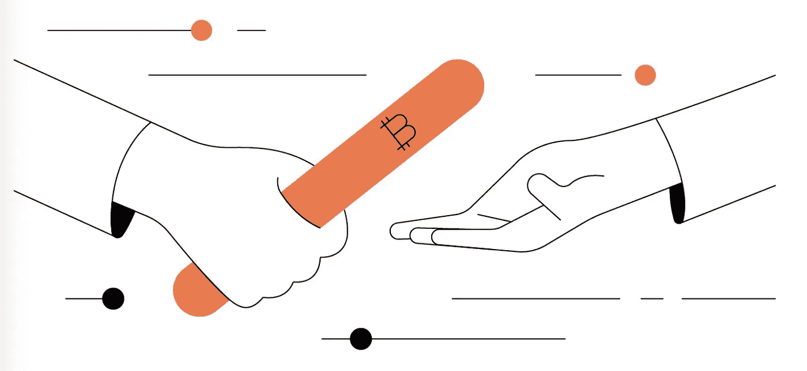

# 比特币中的委托

> 原文：<https://medium.com/coinmonks/delegation-in-bitcoin-ac7afcab991e?source=collection_archive---------12----------------------->

## 爱丽丝允许鲍勃花她的比特币

我们为 Alice 介绍了一种新颖的方法，允许 Bob 花费她的 UTXO/coins，而不用给 Bob 她的私钥。Alice 在 Bob 的公钥上签名，从而将消费的权力委托给 Bob。委托有许多用例。例如，用户可以授权一个应用程序代表她花钱。或者首席财务官希望部门主管向该部门发放资金。

# 委托

之前，我们已经开发了一种方法，让 [Alice 使用她的比特币私钥在交易中签署任意消息](https://xiaohuiliu.medium.com/ecdsa-based-oracles-on-bitcoin-e69d15afe6c5)。对于委派工作，**消息只是鲍勃的公钥**。通过在 Bob 的密钥上签名，Alice 授权 Bob 使用她的硬币。

当 Alice 想要委托时，她首先将资金锁定在以下合同中。

[Contract Delegate](https://github.com/sCrypt-Inc/boilerplate/tree/master/contracts/delegate.scrypt)

她使用她自己的私钥，即第 6 行的 ***ownerSig*** ，对鲍勃的公钥进行签名。她将部分签名的交易交给 Bob。Bob 将他的签名( ***delegateSig*** 在第 6 行)添加到交易中，并广播它以花费锁定的资金。第 10 行验证 Bob 的公钥是经过签名的，因此得到了 Alice 的授权。第 13 行检查 Bob 的签名。

注意，委托并不创建任何 onchain 事务，只有当 Bob 实际使用 UTXO 时才会发生。

如果 Alice 想自己使用 UTXO，她可以简单地通过签署自己的公钥来委托给自己。因此，她可以在 Bob 移动硬币之前撤销委托。

## 委托 vs 多重签名

与 Alice 和 Bob 之间的传统 2-of-2 multisig 相比，上述契约可以委托给任何人(例如，委托给 Charlie 或 Dave)，甚至在创建 UTXO 之后。代表事先未确定，以后可以随意选择，而 multisig 必须事先知道所有代表，这在以后是不能改变的。授权更加灵活。

## 多次委托

在 Alice 委托给 Bob 之后，Bob 委托给 Charlie，Charlie 再次委托给 Dave，依此类推。

以下修改后的合同允许多次委托。

[Contract Delegate](https://github.com/sCrypt-Inc/boilerplate/tree/master/contracts/oracle.scrypt)

基本上，Alice 对 Bob 的公钥进行签名，Bob 对 Charlie 的公钥进行签名，…第 13 行验证了签名，因此和以前一样验证了委托。只有最后一名代表必须在第 18 行签名才能使用硬币。

[1]也可以使用替代签名算法，例如 [Rabin 签名](/coinmonks/access-external-data-from-bitcoin-smart-contracts-2ecdc7448c43)。我们在这里选择 ECDSA 是因为它的简单性，因为它重用了比特币密钥。

[2]注意***Oracle . verify data()***在内部使用 **SIGHASH_NONE** ，因此 Bob 可以根据自己的意愿支出任何产出。

> 加入 Coinmonks [电报频道](https://t.me/coincodecap)和 [Youtube 频道](https://www.youtube.com/c/coinmonks/videos)了解加密交易和投资

# 另外，阅读

*   [投资印度的最佳加密软件](https://coincodecap.com/best-crypto-to-invest-in-india-in-2021) | [WazirX P2P](https://coincodecap.com/wazirx-p2p)
*   [7 个最佳零费用加密交易平台](https://coincodecap.com/zero-fee-crypto-exchanges)
*   [最佳网上赌场](https://coincodecap.com/best-online-casinos) | [期货交易机器人](/coinmonks/futures-trading-bots-5a282ccee3f5)
*   [分散交易所](https://coincodecap.com/what-are-decentralized-exchanges) | [比特 FIP](https://coincodecap.com/bitbns-fip) | [宾邦评论](https://coincodecap.com/bingbon-review)
*   用信用卡购买密码的 10 个最佳地点
*   [加拿大最佳加密交易机器人](https://coincodecap.com/5-best-crypto-trading-bots-in-canada) | [Bybit vs 币安](https://coincodecap.com/bybit-binance-moonxbt)