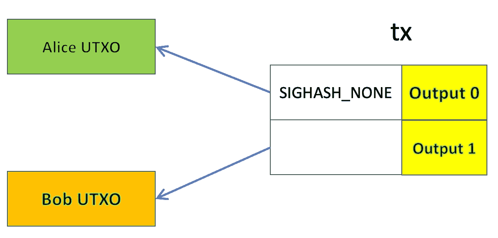

# 比特币中的授权:第二部分

> 原文：<https://medium.com/coinmonks/delegation-in-bitcoin-part-2-4cd8a7c29c99?source=collection_archive---------23----------------------->

## 直接委托 UTXO

我们引入了一个简单而通用的委托机制，这是我们开发的脚本级委托的替代方案。

# 事务级委托

假设 Alice 想将她的 UTXO 委托给 Bob。她创建了一个包含两个输入的事务:一个花费她的 UTXO，另一个花费 Bob 的 UTXO。她使用 sighash 标志 **SIGHASH_NONE** 对输入进行签名，这意味着事务的所有输出都可以被扩展。她将部分签名的交易交给 Bob。Bob 可以签署第二个输入，并将 Alice 的硬币发送到他想要的任何输出。实际上，Alice 已经将她的 UTXO 委托给 Bob。

Delegation

Bob 的 UTXO 可以来自 Bob 控制的现有 UTXO。如果不存在这样的 UTXO，爱丽丝可以简单地创建一个，并在其中存放最小量的灰尘级比特币。

与[脚本级委托](https://xiaohuiliu.medium.com/delegation-in-bitcoin-ac7afcab991e)相比，委托的 UTXO 不需要首先转移到委托智能合约。它可以部署到现有的钱包。

# 承认

最初的想法来自比特币开发者邮件列表中的这篇文章。

> 加入 Coinmonks [电报频道](https://t.me/coincodecap)和 [Youtube 频道](https://www.youtube.com/c/coinmonks/videos)了解加密交易和投资

# 另外，阅读

*   [什么是融资融券交易](https://coincodecap.com/margin-trading) | [成本平均法](https://coincodecap.com/dca)
*   [支持卡审核](https://coincodecap.com/uphold-card-review) | [信任钱包 vs 元掩码](https://coincodecap.com/trust-wallet-vs-metamask)
*   [Exness 点评](https://coincodecap.com/exness-review)|[moon xbt Vs bit get Vs Bingbon](https://coincodecap.com/bingbon-vs-bitget-vs-moonxbt)
*   [如何开始通过加密贷款赚取被动收入](https://coincodecap.com/passive-income-crypto-lending)
*   [BigONE 交易所点评](/coinmonks/bigone-exchange-review-64705d85a1d4) | [电网交易 Bot](https://coincodecap.com/grid-trading)
*   [氹欞侊贸易评论](https://coincodecap.com/anny-trade-review) | [CoinSpot 评论](https://coincodecap.com/coinspot-review)