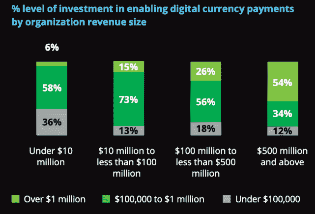
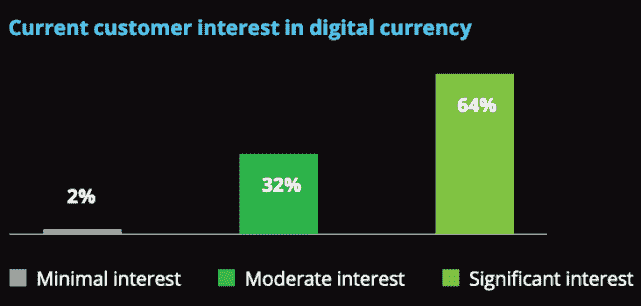
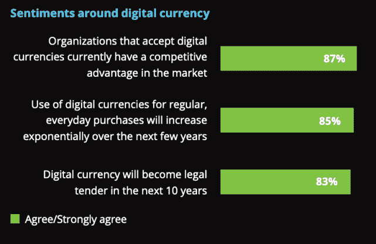
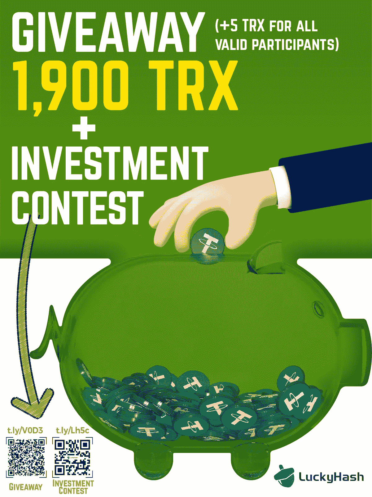

# 德勤:75%的美国零售商计划在 24 个月内支持加密支付

> 原文：<https://medium.com/coinmonks/deloitte-75-of-u-s-retailers-plan-to-support-crypto-payments-in-24-months-41c30aa644ef?source=collection_archive---------30----------------------->

全球会计咨询公司德勤和贝宝 6 月 8 日联合发布的一份报告数据显示，四分之三的美国零售商计划在未来两年内接受加密货币或稳定币支付。

年收入超过 5 亿美元的大型零售商中，超过一半正在实施加密货币支付——他们花费了 100 多万美元来建设必要的基础设施。约 85%的受访者预计加密货币支付将在五年内在他们的行业中变得无处不在。

2021 年 12 月 3 日至 12 月 16 日对美国零售商的 2000 名高管进行了调查，结果刚刚出来。当时的加密货币市值大约是现在的两倍。受访者来自化妆品、数码产品、电子产品、时装、食品和饮料、家居和园艺产品、酒店等行业。他们平均分布在服务和运输部门。

中小型企业(SME)也在考虑加密支付。其中 73%投资 10 万到 100 万美元来建立加密支付基础设施。

该报告预计这一支出将在 2022 年进一步增加，到今年年底，超过 60%的零售商将在加密支付可用性上花费超过 50 万美元。

# **消费者正在倡导加密货币支付。**

消费者的兴趣推动了它的部署。64%的消费者对数字货币非常感兴趣。约 83%的零售商预计，到 2022 年，消费者对加密货币支付的兴趣将显著增长。

近一半的人预计采用加密货币会改善客户体验

# **零售商看好数字货币。**

93%的零售商接受加密货币，他们声称加密货币对客户指标有积极影响。

加密支付实施的挑战

零售商提到的最大挑战是:

*   支付系统的安全性(43%)，
*   监管变化(37%)，
*   波动性(36%)，
*   预算不足(30%)。

45%的受访者正在将加密货币与现有系统集成，

支持多种加密货币的复杂性被认为是最大的挑战。

## **历次熊市周期数据:**

*   【2017 年 12 月—2019 年 1 月(13 个月)
*   【2019 年 7 月—2020 年 9 月(14 个月)
*   **2021 年 11 月—？**

目前的熊市能走多远还有待观察。

— — — — — — — — — — — — — — — — — — — — — — — — — — — —

# 关于 LuckyHash

LuckyHash 是全球领先的一站式加密资产管理平台。它提供免抵押采矿 hashrate 租赁和担保加密货币的利息产生计划。

[网站](https://m.luckyhash.com/?utm_source=english&utm_medium=official) | [推特](https://twitter.com/LuckyHash_) | [脸书](https://www.facebook.com/luckyhashofficial) | [电报](https://t.me/luckyhashgroup)|[LinkedIn](https://www.linkedin.com/company/76618197/)|[YouTube](https://www.youtube.com/channel/UCWSfe0OwBuD4D79sSjUoYBA)

# 机会

1.  [参与我们的免费活动，有机会赢得 300 TRX](http://t.ly/VKEm)
2.  [参与我们的抽奖活动，有机会赢得 500 TRX](http://t.ly/V0D3)

> *加入 Coinmonks* [*电报频道*](https://t.me/coincodecap) *和* [*Youtube 频道*](https://www.youtube.com/c/coinmonks/videos) *了解加密交易和投资*

# 另外，阅读

*   [Bookmap 评论](https://coincodecap.com/bookmap-review-2021-best-trading-software) | [美国 5 大最佳加密交易所](https://coincodecap.com/crypto-exchange-usa)
*   最佳加密[硬件钱包](/coinmonks/hardware-wallets-dfa1211730c6) | [Bitbns 评论](/coinmonks/bitbns-review-38256a07e161)
*   [新加坡十大最佳加密交易所](https://coincodecap.com/crypto-exchange-in-singapore) | [购买 AXS](https://coincodecap.com/buy-axs-token)
*   [红狗赌场评论](https://coincodecap.com/red-dog-casino-review) | [Swyftx 评论](https://coincodecap.com/swyftx-review) | [CoinGate 评论](https://coincodecap.com/coingate-review)
*   [投资印度的最佳密码](https://coincodecap.com/best-crypto-to-invest-in-india-in-2021)|[WazirX P2P](https://coincodecap.com/wazirx-p2p)|[Hi Dollar Review](https://coincodecap.com/hi-dollar-review)