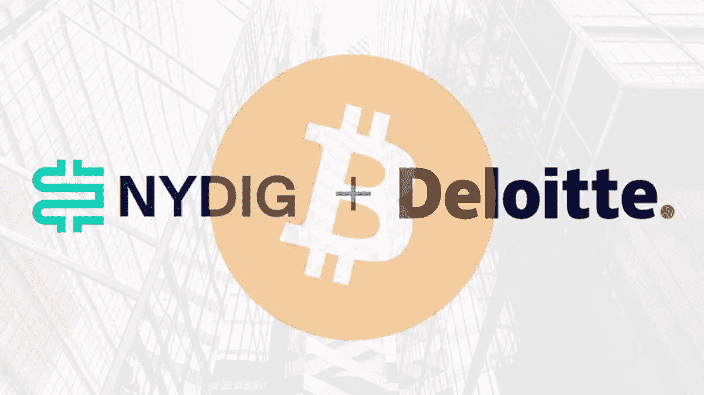

# 德勤:NYDIG 联盟促进比特币的采用

> 原文：<https://medium.com/coinmonks/deloitte-nydig-alliance-to-promote-bitcoin-adoption-74f11850fa84?source=collection_archive---------38----------------------->

专业服务巨头**德勤**，通过在全球经济低迷时期主动促进比特币的大规模采用，引人注目地**展示了其对比特币**的接受和忠诚。

德勤与专注于[比特币](https://bitnewsbot.com/tag/bitcoin)、[纽约数字投资集团(NYDIG)](https://nydig.com/) 的金融服务公司建立了合作伙伴关系，以帮助各种规模的公司实施数字资产并将其集成到他们的服务中。

根据上周一发布的[联合声明](https://www2.deloitte.com/us/en/pages/about-deloitte/articles/press-releases/deloitte-and-nydig-announce-bitcoin-alliance.html)，NYDIG 和德勤将启动一个战略联盟，为那些寻求采用比特币相关产品和服务建议的客户创建一个集中的方法。

两家公司将合作，在涉及比特币相关产品的多个领域实现基于区块链和数字资产的服务，包括银行业务、忠诚度和奖励计划、员工福利等。

# 对比特币敞口的高需求

根据公告，全球金融机构和银行正面临越来越多的需求，以提供可靠的比特币敞口。

德勤与 NYDIG 的联盟旨在帮助加快比特币的采用，同时确保合规性，德勤数字资产银行部门的德勤监管业务负责人理查德·罗森塔尔(Richard Rosenthal)表示，并补充道:

> “金融服务的未来将专注于数字资产的使用，我们专注于为客户提供建议，让他们以受监管和合规的方式参与进来。”

这一合作关系于 6 月 21 日上线，正值加密货币价格大幅下跌之际，到 2022 年初，比特币的价值已缩水约 50%。

几个月前，NYDIG 推出了一项福利计划，允许员工将一部分工资兑换成比特币。该公司此前在 2021 年底筹集了 10 亿美元的股权投资，使 NYDIG 的估值达到约 70 亿美元。

# 德勤的兴趣

作为“四大”会计师事务所之一，德勤对比特币等加密货币越来越感兴趣，积极探索其在全球经济中的作用，就像其他数字资产一样。

6 月，德勤公布了一项调查，发现美国 75%的零售商计划在未来两年内接受加密货币或稳定货币支付。德勤(Deloitte)在 3 月份发表了另一项研究，强调了比特币作为创建更便宜、更快捷的电子货币或数字央行货币生态系统的基础的潜力。

*原载于 2022 年 6 月 23 日*[*【https://bitnewsbot.com】*](https://bitnewsbot.com/deloitte-nydig-alliance-to-promote-bitcoin-adoption/)*。*

> 加入 Coinmonks [电报频道](https://t.me/coincodecap)和 [Youtube 频道](https://www.youtube.com/c/coinmonks/videos)了解加密交易和投资

# 另外，阅读

*   [WazirX vs CoinDCX vs bit bns](/coinmonks/wazirx-vs-coindcx-vs-bitbns-149f4f19a2f1)|[block fi vs coin loan vs Nexo](/coinmonks/blockfi-vs-coinloan-vs-nexo-cb624635230d)
*   [本地比特币审核](/coinmonks/localbitcoins-review-6cc001c6ed56) | [加密货币储蓄账户](https://coincodecap.com/cryptocurrency-savings-accounts)
*   [什么是保证金交易](https://coincodecap.com/margin-trading) | [美元成本平均法](https://coincodecap.com/dca)
*   [支持卡审核](https://coincodecap.com/uphold-card-review) | [信任钱包 vs 元掩码](https://coincodecap.com/trust-wallet-vs-metamask)
*   [Exness 回顾](https://coincodecap.com/exness-review)|[moon xbt Vs bit get Vs Bingbon](https://coincodecap.com/bingbon-vs-bitget-vs-moonxbt)
*   [如何开始通过加密贷款赚取被动收入](https://coincodecap.com/passive-income-crypto-lending)