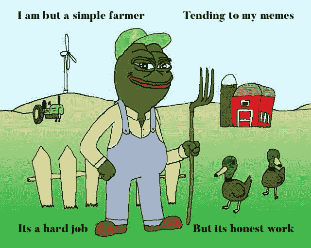
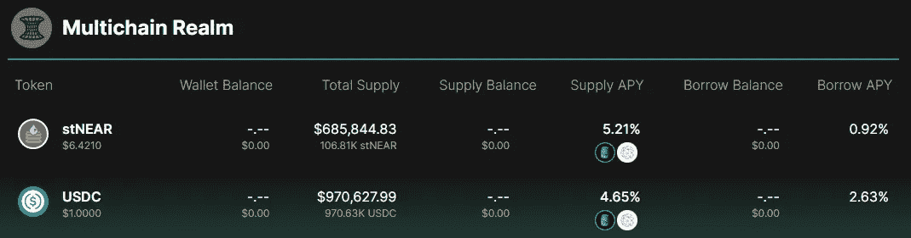
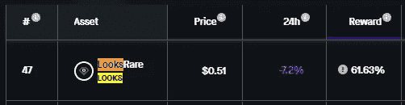
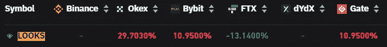
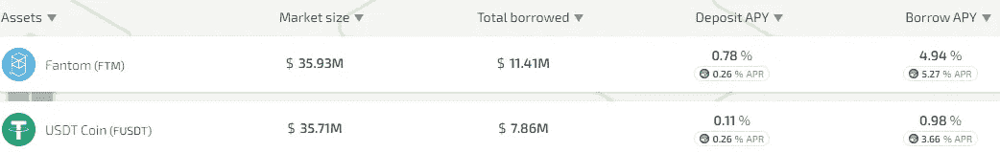
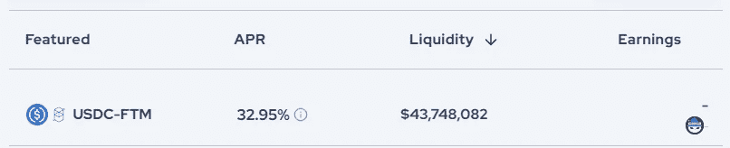
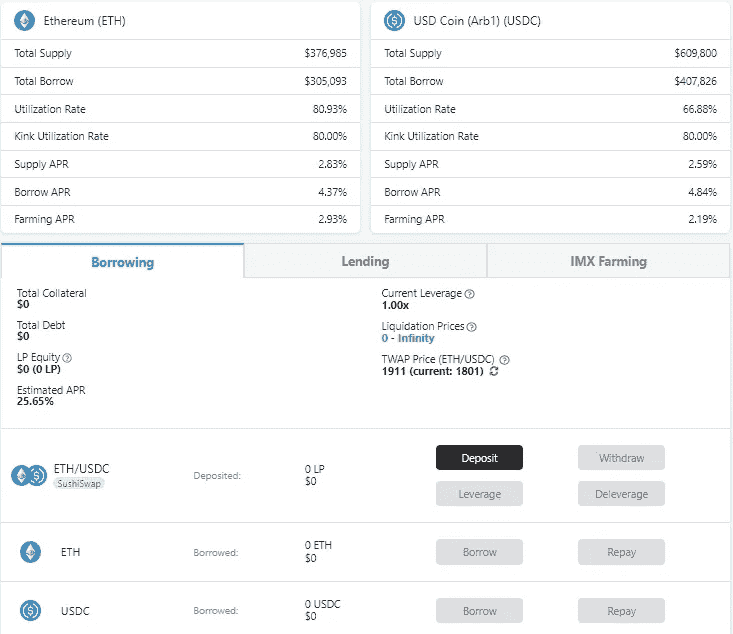
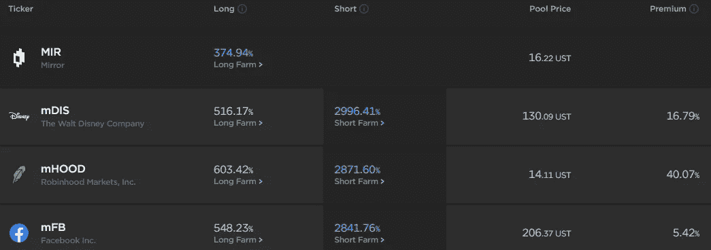

# 三角洲中性农业 I:战略与机遇

> 原文：<https://medium.com/coinmonks/delta-neutral-i-strategies-and-opportunities-9fe35749c0b6?source=collection_archive---------1----------------------->

***懒得看书？*** ****推特:***[https://twitter.com/tradfichad](https://twitter.com/tradfichad)*

*对大多数人来说，BERA 一直很艰难，对卑微的农民来说，可能更糟，他们一次就能收回 70%的资本，但每天收获的却只有区区 0.3%。*

*在我之前的一篇文章中，我提到了德尔塔中性策略，作为熊市的一部分。也许底线在里面，你内心的德根说*“去他妈的发球。全部进去。”。*但也许不是，否则我们会砍得更多。无论如何，市场中性策略在未来可能会发挥越来越重要的作用，因为市场参与者意识到这并不总是唯一的。同样，更规避风险的机构也将对处理密码世界中不必要的易变性的方式感兴趣。*

# *水意味着三角洲中立？*

*Delta neutral 是一种策略，在这种策略中，您采取上下颠倒的头寸，最终平衡到中性/零风险。*

*在 TradFi 市场，一个例子是以 100 美元购买一个商品现货，同时以 104 美元出售一个固定日期的期货合同。假设运输成本是 2 美元，您就可以获得 2 美元的利润。*

*当然，这是对非常复杂的 TradFi 市场中 delta 中性策略的过度简化。*

# *加密农民的三角洲中立*

*增量中立策略不是加密独有的。事实上，考虑到可用产品和工具的成熟性和多样性，人们可能会发现最先进的战略来自 TradFi。*

*因此，我将把这篇文章的重点放在以加密为中心的策略上，这种策略利用了加密比传统加密做得更好的一点——收益。在当前的 DeFi / Crypto 背景下，流动性对于任何项目的成功都是必不可少的，因此倾向于通过收入和象征性排放相结合的方式向参与者行贿以获得高收益。*

# *单侧铆接*

**

*让我们从简单的开始，比如三角形中性单侧桩。简单地说，这指的是创造一个市场中立的地位，同时将单一资产投资于收益率。*

## *1.带链上借款的 Delta 中性*

*许多人认为，达美中性意味着用某种工具进行对冲。但是，如果我告诉您，您可以在同一协议内连续完成所有操作，该怎么办？*

**

*Bastion protocol supply / borrow rates*

*第 1 步:以 4.65% APR
的价格提供 100 美元的 Bastion protocol USDC 债券第 2 步:以 0.92% APR
的价格借入 50%的$ str near 代币的 USDC 抵押品第 3 步:以 5.21% APR
的价格借入$ str near 的股份第 4 步:以 6.8% APR 的净收益率卖出 Slurp*

*这个三角洲怎么中立？因为你借了$stNEAR，而不是$USDC，所以你在你的耕作期结束时归还$stNEAR。近期价格是上涨还是下跌与你无关。*

***风险:**
1)潜在价格波动导致的清算风险。
2)基于年利率净头寸和借贷成本的利率风险。*

***如何识别机会:**
像这样的机会通常很难找到，因为零售市场很快就发现了协议中的套利机会。为了利用较小/较早的协议提供如此有吸引力的费率，需要进行大量积极的研究。*

## *2.带永久符号的 Delta 中性*

*寻找纯粹的链上机会往往是困难的，因为人们可能很难找到一个贷款协议，让你借钱比供应流动性的成本更低。那我们该怎么办？我们利用 CeFi 的机会进行交流。*

**

*$LOOKS APR*

**

*$LOOKS funding rates*

*第一步:Stake $看起来 61.63% APR($看起来 25.00%；$ETH 36.63%)
第二步:做空$ LOOKS(年融资利率 29% =做空获得报酬)
第三步:Slurp 净收益率 90.63% APR*

***风险:**
1)未平仓空头头寸的清算风险
2)基于 APR 净头寸和融资利率的利率风险*

***如何识别机会:**
只需使用下面提供的资源，对照融资利率，找到你的即时套利；)*

***资源:**
资金利率@ [硬币玻璃](https://www.coinglass.com/FundingRate)
赌注收益率@ [赌注奖励](https://stakingrewards.com/) s*

## *但是 ser，净 APR 太低了…*

*这只猫会让你变得贪婪。为了提高你的 APR，找一个允许你用你的资产抵押借款的协议。这适用于 delta neutral 和 perps 以及链上借贷。*

**

*Bastion protocol supply / borrow rates*

*以我们之前讨论过的堡垒协议为例。由于$ stNEAR 的借贷成本低于供应 APR，对于任何愿意手动执行策略的人来说，我们基本上摆脱了对押记资产的自由杠杆。只需用您的抵押品借入$stNEAR，并根据您的需要多次重新部署到下注位置。*

*有利的一面是:你只需要将你的初始仓位调整到中性。*

*不利方面:
你需要手动重复你的借贷策略。回报也在减少，因为你通常只能借到少于 100%的抵押品。*

# *流动性池养殖*

**

*流动性池养殖是“风险更高”的赌注，因为它伴随着被称为非永久性损失的可怕野兽。因此产量通常也更高。前面提供的关于$LOOKS 的例子应该被视为异常值，而不是标准值。*

*APR 越大，复杂性越大。由于非永久性损失，Delta neutral 也变得更加复杂，但为了说明起见，我们稍后再讨论这个问题，并假设世界运行在零 IL 上。*

## *1.伪 delta 中性借贷平台*

*为了执行这一战略，你必须能够借用你打算耕种的资产。为什么？因为当你归还资产时，你归还的是借来的代币数量，而不是资产的美元价值。只要你能够从借贷+耕种中获得超过 0%的净收益，你的 delta 中性头寸就是盈利的。*

**

*Geist protocol supply / borrow rates*

**

*Spookyswap LP rewards*

*第一步:以 0.11%的年利率存入$USDT 的$ 100
第二步:借入高达 80%的农业代币，在这种情况下是以 4.94%的年利率借入$FTM 的$ 80
第三步:以 32.95%的年利率在 Spookyswap 上供应 FTM-USDC LP(在 USDC 额外的$ 80)
第四步:以 27.15%的年利率借入净收益率*

***风险:**1)协议风险。跨协议的交互越多，您遇到黑客和地毯问题的可能性就越大。
2)潜在价格波动导致的清算风险。
3)基于 APR 净头寸和借贷成本的利率风险。
4)x * y = k 的 LP 池模型导致的非永久性损失风险。*

***如何识别机会:** Anon，苜蓿低于 ser。寻找，你就会找到。*

***资源:**
LP 收益率@ [Coindix](https://coindix.com/)*

## *2.伪三角洲中立与农业聚合*

*这种平台的例子有 Tarot 或 improv ax，它们整合各种 AMM 的 LP 池，并允许农民利用超过 100%的 LP 池杠杆，从而实现比典型的抵押不足的贷款平台高得多的收益率。鉴于借贷和 LP 农业都在一个平台上完成，这种方法比使用简单的借贷平台提供了更多的优势。*

*这里的 delta 中性涉及借入等量的不稳定 LP 令牌，然后将其出售给稳定的硬币。例如:以 4000 美元的 LP 头寸为例，该头寸由 1 美元的 ETH(每美元 ETH 约 2000 美元)和 2000 美元的 USDC 组成。通过借入 1 美元的 ETH 并将其出售以获得稳定的收益，农场主获得 2，000 美元，而借入的 1 美元 ETH 在 LP 头寸中使用 1 美元 ETH 平仓时偿还*

**

*ETH-USDC LP on Impermax*

*第一步:以 25.65%的年利率
存入 USDC 联邦储蓄银行有限责任公司；第二步:以 4.41%的年利率
借入相当于有限责任公司存款金额的联邦储蓄银行美元；第三步:将借入的联邦储蓄银行美元卖出。第四步:Slurp 21.21% APR*

*真正的苜蓿正在利用这些协议提供的杠杆作用。为此，我们引入下一步:*

*第五步:增加杠杆。*

*这使得用户可以将产量提高 3-4 倍，甚至更多，这取决于他们获得的杠杆作用，这使得这种 LP 农业的资本效率极高。然而，缺点是增加了清算风险，因为随着杠杆的增加，这些范围变得更窄。*

***风险:**
1)潜在价格波动导致的清算风险。
2)基于年利率净头寸和借贷成本的利率风险。具体到 LP 农业综合企业，当可用资金的利用率超过“拐点”时，借贷成本会成倍增加。
3)x * y = k 的 LP 池模型导致的非永久性损失风险*

## *3.使用镜像协议的伪增量中立*

*这一策略虽然由于 UST·德佩格而有些过时，但考虑到它作为三角洲中立区 OGs 之一的地位，可能还是值得一提的。Mirror 不使用加密本地资产 LP 池，而是使用由 UST 和合成股票组成的 LP 池。*

**

*Mirror protocol yields on long short positions*

*步骤 1:在镜像上为合成资产打开空头头寸
步骤 2:在镜像上为合成资产打开多头 LP 头寸
步骤 3:享受伪 delta 中性收益率*

*这也可以与锚协议一起使用，以提高收益率，即首先将$UST 存入锚，并使用$澳元存款作为抵押品来创建空头头寸。*

# *单边赌注 vs LP 农业*

*这两种策略的比较似乎表明，单边赌注可能是更好的策略，这将是一个显而易见的考虑这比任何其他事情。*

*然而，易于执行也意味着，随着时间的推移，这一战略上的苜蓿可能会减少得更快。如前所述,$LOOKS opportunity 是一个异常值，而不是标准值。大多数单边押注机会不会带来如此高的收益率，即使有，通常也不会在交易所上市进行对冲。*

*另一方面，鉴于杠杆的可用性和管理非永久性损失的挑战，LP 农业产量可能在中期内保持较高水平，这需要动态对冲，以使 LP 头寸真正保持 delta 中性。**我们将在第二部分触及这一点……***

# *最后的想法*

*苜蓿无处不在，只要你足够努力地寻找，并了解随之而来的风险。这只猫已经尽了自己的责任，你愿意尽你的责任吗？*

*接下来，你会选择一条通往成功的道路，还是乘坐市场过山车，希望你能在顶部而不是底部下车？*