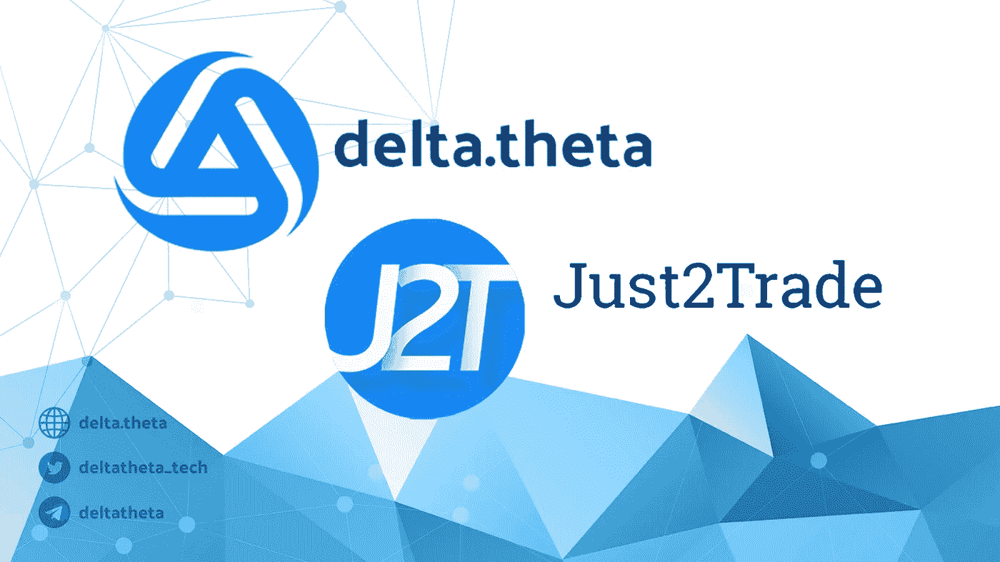

# delta.theta 和 Just2Trade 宣布与监管经纪公司建立战略合作伙伴关系:混合 DEX。

> 原文：<https://medium.com/coinmonks/delta-theta-and-just2trade-announce-the-strategic-partnership-c29ae43df17a?source=collection_archive---------16----------------------->

.

DeltaTheta 和 Just2Trade 宣布建立战略合作伙伴关系，作为他们将向市场推出新的“监管 DEX”服务的一部分。该产品允许 Just2Trade 的所有客户以 P2P 模式交易加密货币(BTC、瑞士联邦理工学院、BNB、AAVE、MATIC、DOT 等)的期权。

该产品在加密行业市场是独一无二的，没有其他公司提供这样的服务。原因是，客户要经过受监管的经纪商的 KYC/反洗钱程序，还可以访问 P2P 基础设施，在那里他们可以通过自己经过验证的钱包直接进行交易。

该产品为市场带来了一种新型的加密货币竞标者，确切地说是一种“混合 DEX”。这些类型的客户对监管者来说是透明的、可以理解的。

从客户的角度来看，他们与受监管的欧洲经纪商合作/合作，这比与不透明的加密交易所合作要好得多。此外，P2P 交易意味着直接从客户的钱包中进行交易，只有客户才能独家访问。

delta theta——美国期权指数，任何交易者都可以买卖最不稳定的加密资产的期权。我们专注于二级令牌，如 BNB、AAVE、MATIC、DOT 等。δθ支持包括以太坊、币安、多边形和 Aurora/NEAR 在内的几种网络。

just 2 trade-just 2 trade Online Ltd(just 2 trade)是一家市场领先的国际经纪公司，为其客户提供直接进入全球主要股票和货币市场的机会。我们公司是由不断提供最高水平服务的人才建立起来的。

Just2Trade 受欧盟监管，受欧洲证券和市场管理局(ESMA)的监管和法律框架约束，并由塞浦路斯证券交易委员会(CySEC)授权和许可，许可证号为 281/15。此外，Just2Trade 是投资者补偿基金的成员。

δθ—[https://deltatheta.tech/](https://deltatheta.tech/)

https://dappradar.com/multichain/defi/delta-theta

just 2 trade—【https://just2trade.online/ 

 [## just 2 全球贸易

### 利马索尔全球贸易公司。238 喜欢 3 谈论这个。Just2Trade 是一家领先的金融投资公司…

www.facebook.com](https://www.facebook.com/J2TGlobal) 

> 加入 Coinmonks [电报频道](https://t.me/coincodecap)和 [Youtube 频道](https://www.youtube.com/c/coinmonks/videos)了解加密交易和投资

# 另外，阅读

*   [加拿大最佳加密交易机器人](https://coincodecap.com/5-best-crypto-trading-bots-in-canada) | [Bybit vs 币安](https://coincodecap.com/bybit-binance-moonxbt)
*   [阿联酋 5 大最佳加密交易所](https://coincodecap.com/best-crypto-exchanges-in-uae) | [SimpleSwap 点评](https://coincodecap.com/simpleswap-review)
*   购买 Dogecoin 的 7 种最佳方式
*   [最佳期货交易信号](https://coincodecap.com/futures-trading-signals) | [流动性交易所评论](https://coincodecap.com/liquid-exchange-review)
*   [火币加密交易信号](https://coincodecap.com/huobi-crypto-trading-signals) | [Swapzone 审查](/coinmonks/swapzone-review-crypto-exchange-data-aggregator-e0ad78e55ed7)